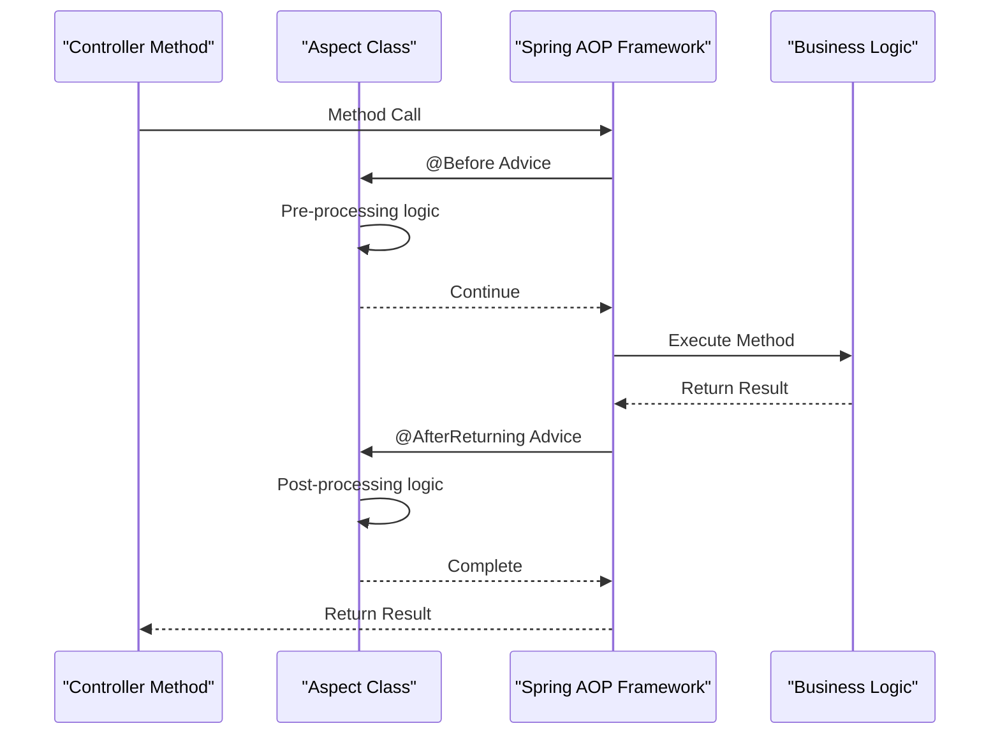
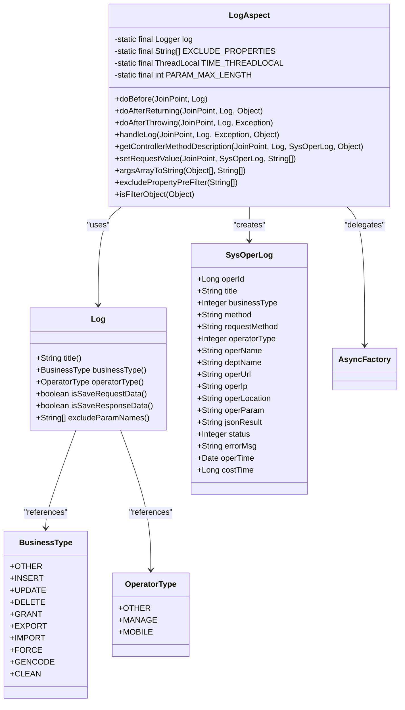
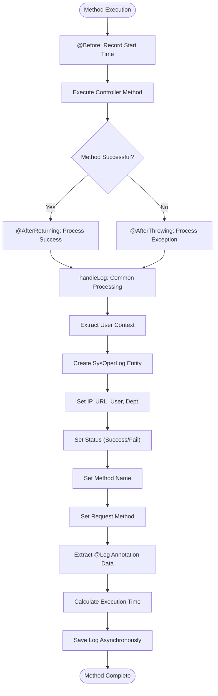
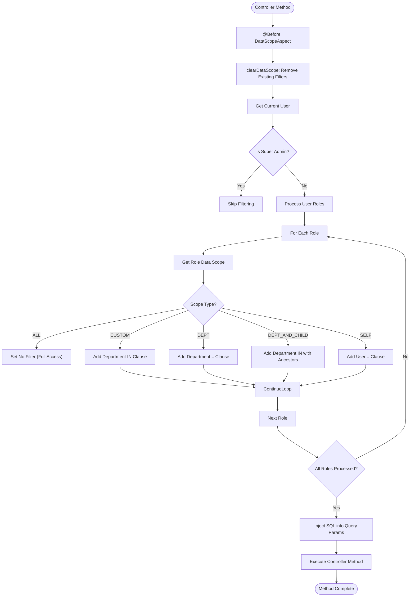
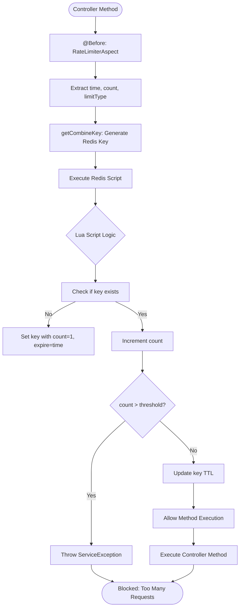

# Creating Custom Aspects

<cite>
**Referenced Files in This Document**   
- [Log.java](file://src/main/java/com/ruoyi/framework/aspectj/lang/annotation/Log.java)
- [LogAspect.java](file://src/main/java/com/ruoyi/framework/aspectj/LogAspect.java)
- [DataScopeAspect.java](file://src/main/java/com/ruoyi/framework/aspectj/DataScopeAspect.java)
- [RateLimiterAspect.java](file://src/main/java/com/ruoyi/framework/aspectj/RateLimiterAspect.java)
- [SysOperLog.java](file://src/main/java/com/ruoyi/project/monitor/domain/SysOperLog.java)
- [BusinessType.java](file://src/main/java/com/ruoyi/framework/aspectj/lang/enums/BusinessType.java)
- [OperatorType.java](file://src/main/java/com/ruoyi/framework/aspectj/lang/enums/OperatorType.java)
- [LimitType.java](file://src/main/java/com/ruoyi/framework/aspectj/lang/enums/LimitType.java)
- [SysUserController.java](file://src/main/java/com/ruoyi/project/system/controller/SysUserController.java)
- [SysRoleController.java](file://src/main/java/com/ruoyi/project/system/controller/SysRoleController.java)
- [AsyncFactory.java](file://src/main/java/com/ruoyi/framework/manager/factory/AsyncFactory.java)
- [application.yml](file://src/main/resources/application.yml)
</cite>

## Table of Contents
1. [Introduction](#introduction)
2. [Aspect-Oriented Programming in RuoYi-Vue](#aspect-oriented-programming-in-ruoyi-vue)
3. [Core Aspect Components](#core-aspect-components)
4. [Logging Aspect Implementation](#logging-aspect-implementation)
5. [Data Scope Aspect Implementation](#data-scope-aspect-implementation)
6. [Rate Limiting Aspect Implementation](#rate-limiting-aspect-implementation)
7. [Aspect Configuration and Integration](#aspect-configuration-and-integration)
8. [Best Practices for Custom Aspects](#best-practices-for-custom-aspects)
9. [Common Issues and Solutions](#common-issues-and-solutions)
10. [Conclusion](#conclusion)

## Introduction

RuoYi-Vue implements Aspect-Oriented Programming (AOP) to handle cross-cutting concerns such as logging, data scope filtering, and rate limiting. The framework uses Spring AOP with custom annotations and aspect classes to provide modular, reusable functionality that can be applied across the application without modifying business logic. This document explains the implementation details of creating custom aspects in RuoYi-Vue, focusing on the interaction between annotations, aspect classes, and the Spring AOP framework.

The core aspects in RuoYi-Vue include:
- **Logging Aspect**: Records operation logs for controller methods
- **Data Scope Aspect**: Implements data-level permissions based on user roles
- **Rate Limiting Aspect**: Prevents abuse by limiting request frequency
- **DataSource Aspect**: Manages multi-data source switching

These aspects are implemented using Spring's AOP framework with AspectJ annotations, allowing developers to declaratively apply cross-cutting concerns to their application components.

**Section sources**
- [LogAspect.java](file://src/main/java/com/ruoyi/framework/aspectj/LogAspect.java#L36-L40)
- [DataScopeAspect.java](file://src/main/java/com/ruoyi/framework/aspectj/DataScopeAspect.java#L20-L24)
- [RateLimiterAspect.java](file://src/main/java/com/ruoyi/framework/aspectj/RateLimiterAspect.java#L22-L26)

## Aspect-Oriented Programming in RuoYi-Vue

RuoYi-Vue leverages Spring AOP to implement cross-cutting concerns through a combination of custom annotations and aspect classes. The framework follows the standard AOP paradigm where aspects encapsulate functionality that cuts across multiple components, such as logging, security, and transaction management.

The AOP implementation in RuoYi-Vue consists of three main components:
1. **Custom Annotations**: Define metadata that marks methods or classes for aspect processing
2. **Aspect Classes**: Contain the actual cross-cutting logic and are configured with pointcut expressions
3. **Spring AOP Framework**: Provides the runtime infrastructure that weaves aspects into the application

The invocation relationship between these components follows a clear pattern:
- Developers annotate controller methods with custom annotations (e.g., @Log)
- Spring AOP detects these annotations at runtime
- The corresponding aspect class intercepts method execution based on pointcut expressions
- Advice methods (@Before, @AfterReturning, @AfterThrowing) execute the cross-cutting logic
- Control returns to the original method or the caller

This approach allows for clean separation of concerns, where business logic remains focused on its primary responsibility while cross-cutting functionality is handled by dedicated aspects.



**Diagram sources**
- [LogAspect.java](file://src/main/java/com/ruoyi/framework/aspectj/LogAspect.java#L59-L63)
- [LogAspect.java](file://src/main/java/com/ruoyi/framework/aspectj/LogAspect.java#L70-L74)
- [LogAspect.java](file://src/main/java/com/ruoyi/framework/aspectj/LogAspect.java#L82-L86)

**Section sources**
- [LogAspect.java](file://src/main/java/com/ruoyi/framework/aspectj/LogAspect.java#L41-L43)
- [DataScopeAspect.java](file://src/main/java/com/ruoyi/framework/aspectj/DataScopeAspect.java#L25-L27)
- [RateLimiterAspect.java](file://src/main/java/com/ruoyi/framework/aspectj/RateLimiterAspect.java#L27-L29)

## Core Aspect Components

The RuoYi-Vue framework implements several core aspect components that handle different cross-cutting concerns. Each aspect follows a consistent pattern of annotation definition, aspect class implementation, and integration with Spring AOP.

### Annotation Design Pattern

Custom annotations in RuoYi-Vue are designed with the following characteristics:
- **Runtime Retention**: Using @Retention(RetentionPolicy.RUNTIME) to make annotations available at runtime
- **Method and Parameter Targeting**: Using @Target to specify where annotations can be applied
- **Documentation**: Using @Documented to include annotations in Javadoc
- **Type Safety**: Using enums for type-safe parameter values

The framework defines annotations in the `com.ruoyi.framework.aspectj.lang.annotation` package, with corresponding enums in the `com.ruoyi.framework.aspectj.lang.enums` package for type-safe configuration.

### Aspect Class Structure

Aspect classes in RuoYi-Vue follow a standard structure:
- **@Aspect Annotation**: Marks the class as an aspect
- **@Component Annotation**: Registers the aspect as a Spring bean
- **ThreadLocal Storage**: Uses ThreadLocal variables to maintain state across advice methods
- **Dependency Injection**: Uses @Autowired for required services
- **Protected/Package-private Methods**: Implements core logic in reusable methods

The aspects are designed to be stateless where possible, with configuration and runtime data passed through method parameters or stored in ThreadLocal variables to maintain thread safety.



**Diagram sources**
- [Log.java](file://src/main/java/com/ruoyi/framework/aspectj/lang/annotation/Log.java#L17-L51)
- [LogAspect.java](file://src/main/java/com/ruoyi/framework/aspectj/LogAspect.java#L41-L265)
- [BusinessType.java](file://src/main/java/com/ruoyi/framework/aspectj/lang/enums/BusinessType.java#L8-L59)
- [OperatorType.java](file://src/main/java/com/ruoyi/framework/aspectj/lang/enums/OperatorType.java#L8-L24)
- [SysOperLog.java](file://src/main/java/com/ruoyi/project/monitor/domain/SysOperLog.java#L14-L270)

**Section sources**
- [Log.java](file://src/main/java/com/ruoyi/framework/aspectj/lang/annotation/Log.java#L1-L52)
- [LogAspect.java](file://src/main/java/com/ruoyi/framework/aspectj/LogAspect.java#L1-L265)
- [BusinessType.java](file://src/main/java/com/ruoyi/framework/aspectj/lang/enums/BusinessType.java#L1-L60)
- [OperatorType.java](file://src/main/java/com/ruoyi/framework/aspectj/lang/enums/OperatorType.java#L1-L25)

## Logging Aspect Implementation

The logging aspect in RuoYi-Vue provides comprehensive operation logging for controller methods, capturing details about user actions, execution times, and request/response data. The implementation follows a three-phase approach using @Before, @AfterReturning, and @AfterThrowing advice to capture the complete execution lifecycle.

### Log Annotation Domain Model

The @Log annotation defines the metadata for operation logging with the following properties:

| Property | Type | Default Value | Description |
|---------|------|-------------|-------------|
| title | String | "" | Module or feature name for the operation |
| businessType | BusinessType | BusinessType.OTHER | Type of business operation (INSERT, UPDATE, DELETE, etc.) |
| operatorType | OperatorType | OperatorType.MANAGE | Type of operator (MANAGE for backend, MOBILE for mobile) |
| isSaveRequestData | boolean | true | Whether to save request parameters in the log |
| isSaveResponseData | boolean | true | Whether to save response data in the log |
| excludeParamNames | String[] | {} | Array of parameter names to exclude from logging |

The BusinessType enum provides type-safe values for different business operations, ensuring consistency across the application. The OperatorType enum distinguishes between backend management operations and mobile user operations.

### LogAspect Execution Flow

The LogAspect class implements the logging functionality with a clear execution flow:

1. **Before Advice**: Captures the start time of method execution using ThreadLocal storage
2. **After Returning Advice**: Processes successful method completion
3. **After Throwing Advice**: Processes method execution with exceptions
4. **Common Handling**: The handleLog method processes both success and failure cases

The handleLog method performs the following steps:
1. Retrieves the current user context from SecurityUtils
2. Creates a new SysOperLog entity to store operation details
3. Sets basic operation information (IP address, URL, user name, department)
4. Updates status based on exception presence (SUCCESS or FAIL)
5. Sets method identification (fully qualified class and method name)
6. Sets HTTP request method
7. Extracts controller method description from the @Log annotation
8. Calculates execution time using the ThreadLocal start time
9. Saves the operation log asynchronously using AsyncManager



**Diagram sources**
- [LogAspect.java](file://src/main/java/com/ruoyi/framework/aspectj/LogAspect.java#L59-L63)
- [LogAspect.java](file://src/main/java/com/ruoyi/framework/aspectj/LogAspect.java#L70-L74)
- [LogAspect.java](file://src/main/java/com/ruoyi/framework/aspectj/LogAspect.java#L82-L86)
- [LogAspect.java](file://src/main/java/com/ruoyi/framework/aspectj/LogAspect.java#L88-L140)

**Section sources**
- [LogAspect.java](file://src/main/java/com/ruoyi/framework/aspectj/LogAspect.java#L44-L265)
- [Log.java](file://src/main/java/com/ruoyi/framework/aspectj/lang/annotation/Log.java#L1-L52)
- [SysOperLog.java](file://src/main/java/com/ruoyi/project/monitor/domain/SysOperLog.java#L14-L270)

## Data Scope Aspect Implementation

The DataScopeAspect in RuoYi-Vue implements data-level security by filtering query results based on user roles and permissions. This aspect ensures that users can only access data they are authorized to see, implementing row-level security in database queries.

### Data Scope Annotation

The @DataScope annotation controls data filtering with the following properties:

| Property | Type | Default Value | Description |
|---------|------|-------------|-------------|
| deptAlias | String | "" | Database table alias for department table |
| userAlias | String | "" | Database table alias for user table |
| permission | String | "" | Permission string to match against role permissions |

The aspect works by modifying SQL queries to include WHERE conditions that restrict data access based on the user's role and data scope settings.

### Data Scope Processing

The DataScopeAspect uses @Before advice to modify query parameters before method execution. The processing flow is:

1. **Clear Existing Scope**: Removes any existing data scope filters to prevent injection
2. **Check User Permissions**: Verifies the current user is not a super administrator
3. **Apply Data Scope Filters**: Generates SQL conditions based on user roles
4. **Inject into Query**: Adds the generated SQL conditions to the query parameters

The aspect supports five data scope types:
- **ALL (1)**: Full data access (no filtering)
- **CUSTOM (2)**: Custom data access based on role-department assignments
- **DEPT (3)**: Department-level data access only
- **DEPT_AND_CHILD (4)**: Department and subordinate departments data access
- **SELF (5)**: Only personal data access



**Diagram sources**
- [DataScopeAspect.java](file://src/main/java/com/ruoyi/framework/aspectj/DataScopeAspect.java#L59-L64)
- [DataScopeAspect.java](file://src/main/java/com/ruoyi/framework/aspectj/DataScopeAspect.java#L66-L80)
- [DataScopeAspect.java](file://src/main/java/com/ruoyi/framework/aspectj/DataScopeAspect.java#L91-L170)

**Section sources**
- [DataScopeAspect.java](file://src/main/java/com/ruoyi/framework/aspectj/DataScopeAspect.java#L1-L185)
- [DataScope.java](file://src/main/java/com/ruoyi/framework/aspectj/lang/annotation/DataScope.java#L1-L33)

## Rate Limiting Aspect Implementation

The RateLimiterAspect in RuoYi-Vue provides protection against abuse by limiting the frequency of requests to specific endpoints. This aspect uses Redis to track request counts and enforce rate limits, preventing denial-of-service attacks and ensuring fair resource usage.

### Rate Limiter Annotation

The @RateLimiter annotation configures rate limiting with the following properties:

| Property | Type | Default Value | Description |
|---------|------|-------------|-------------|
| key | String | CacheConstants.RATE_LIMIT_KEY | Redis key prefix for rate limiting |
| time | int | 60 | Time window in seconds |
| count | int | 100 | Maximum number of requests allowed in the time window |
| limitType | LimitType | LimitType.DEFAULT | Type of rate limiting (DEFAULT or IP-based) |

The LimitType enum provides two rate limiting strategies:
- **DEFAULT**: Application-wide rate limiting
- **IP**: Per-IP address rate limiting

### Rate Limiting Processing

The RateLimiterAspect uses @Before advice to check rate limits before method execution. The processing flow is:

1. **Extract Configuration**: Gets time window and request count from the annotation
2. **Generate Key**: Creates a Redis key based on method and limit type
3. **Execute Lua Script**: Runs a Redis script to increment and check the counter
4. **Enforce Limits**: Throws ServiceException if limits are exceeded
5. **Allow Execution**: Proceeds with method execution if within limits

The aspect uses a Redis Lua script to ensure atomic operations, preventing race conditions in high-concurrency scenarios. The script implements a sliding window counter that tracks requests within the specified time window.



**Diagram sources**
- [RateLimiterAspect.java](file://src/main/java/com/ruoyi/framework/aspectj/RateLimiterAspect.java#L49-L74)
- [RateLimiterAspect.java](file://src/main/java/com/ruoyi/framework/aspectj/RateLimiterAspect.java#L76-L88)
- [RateLimiter.java](file://src/main/java/com/ruoyi/framework/aspectj/lang/annotation/RateLimiter.java#L1-L40)

**Section sources**
- [RateLimiterAspect.java](file://src/main/java/com/ruoyi/framework/aspectj/RateLimiterAspect.java#L1-L90)
- [RateLimiter.java](file://src/main/java/com/ruoyi/framework/aspectj/lang/annotation/RateLimiter.java#L1-L40)
- [LimitType.java](file://src/main/java/com/ruoyi/framework/aspectj/lang/enums/LimitType.java#L1-L21)

## Aspect Configuration and Integration

The aspects in RuoYi-Vue are integrated into the Spring application context through component scanning and proper configuration. The framework ensures that aspects are properly registered as Spring beans and woven into the application at runtime.

### Spring Configuration

Aspects are automatically detected and registered through the @Component annotation and component scanning. The Spring configuration in application.yml includes settings that affect aspect behavior:

```yaml
# Redis configuration for rate limiting
spring:
  redis:
    host: 192.168.40.41
    port: 6378
    password: 8icymZp_WvFkzMt
    database: 0
    timeout: 10s
```

The aspects are configured with appropriate ordering using the @Order annotation, ensuring that they execute in the correct sequence when multiple aspects apply to the same method.

### Aspect Registration

Each aspect class is annotated with both @Aspect and @Component:

```java
@Aspect
@Component
public class LogAspect {
    // Aspect implementation
}
```

This dual annotation ensures that:
1. Spring recognizes the class as an aspect component
2. The class is registered in the application context
3. Spring AOP can weave the aspect into target methods

The framework also uses @Autowired to inject dependencies such as RedisTemplate and AsyncManager, ensuring that aspects have access to the services they need.

### Pointcut Expressions

The aspects use annotation-based pointcut expressions to target methods:

```java
@Before("@annotation(controllerLog)")
public void doBefore(JoinPoint joinPoint, Log controllerLog)
```

This pointcut expression matches any method annotated with @Log, making it easy to apply logging to specific controller methods. The aspect receives the annotation instance as a parameter, allowing it to access the annotation's properties.

**Section sources**
- [LogAspect.java](file://src/main/java/com/ruoyi/framework/aspectj/LogAspect.java#L41-L43)
- [DataScopeAspect.java](file://src/main/java/com/ruoyi/framework/aspectj/DataScopeAspect.java#L25-L27)
- [RateLimiterAspect.java](file://src/main/java/com/ruoyi/framework/aspectj/RateLimiterAspect.java#L27-L29)
- [application.yml](file://src/main/resources/application.yml#L68-L90)

## Best Practices for Custom Aspects

When creating custom aspects in RuoYi-Vue, follow these best practices to ensure robust, maintainable, and performant code.

### Performance Considerations

1. **Minimize Join Point Processing**: Access only the join point data you need
2. **Use ThreadLocal for State**: Store execution state in ThreadLocal variables to avoid synchronization
3. **Asynchronous Processing**: Offload expensive operations (like database writes) to asynchronous tasks
4. **Cache Expensive Operations**: Cache results of expensive computations when possible
5. **Avoid Blocking Operations**: Don't perform blocking I/O in advice methods

The LogAspect demonstrates good performance practices by using AsyncManager to save logs asynchronously, preventing the logging operation from slowing down the main request processing.

### Error Handling

1. **Defensive Programming**: Wrap aspect logic in try-catch blocks to prevent aspect failures from affecting business logic
2. **Comprehensive Logging**: Log aspect errors for debugging and monitoring
3. **Graceful Degradation**: Ensure that aspect failures don't break the main functionality
4. **Resource Cleanup**: Always clean up resources in finally blocks

The LogAspect includes comprehensive error handling with a try-catch-finally block that ensures the ThreadLocal variable is always cleaned up, preventing memory leaks.

### Security Considerations

1. **Input Validation**: Validate all input data, especially when constructing SQL or other executable code
2. **Sensitive Data Filtering**: Exclude sensitive data (passwords, tokens) from logs
3. **Injection Prevention**: Sanitize all data that might be used in queries or commands
4. **Permission Checks**: Verify user permissions before applying security-related aspects

The LogAspect includes built-in filtering for sensitive properties like passwords, and the DataScopeAspect prevents SQL injection by properly escaping and validating all inputs.

### Testing Strategies

1. **Unit Testing**: Test aspect logic in isolation
2. **Integration Testing**: Test aspects with real controllers and services
3. **Mock Dependencies**: Use mocks for external services like Redis
4. **Edge Case Testing**: Test with null values, exceptions, and boundary conditions

**Section sources**
- [LogAspect.java](file://src/main/java/com/ruoyi/framework/aspectj/LogAspect.java#L90-L139)
- [DataScopeAspect.java](file://src/main/java/com/ruoyi/framework/aspectj/DataScopeAspect.java#L175-L183)
- [RateLimiterAspect.java](file://src/main/java/com/ruoyi/framework/aspectj/RateLimiterAspect.java#L57-L73)

## Common Issues and Solutions

When working with custom aspects in RuoYi-Vue, developers may encounter several common issues. This section addresses these problems and provides solutions.

### Pointcut Expression Issues

**Problem**: Aspect not being applied to expected methods
**Solution**: 
- Verify the pointcut expression syntax
- Ensure the annotation is at the method level (not class level unless using @within)
- Check that the annotation has RUNTIME retention
- Verify component scanning includes the aspect package

### Join Point Parameter Access

**Problem**: Unable to access method parameters in advice
**Solution**:
- Use JoinPoint.getArgs() to access method arguments
- Use JoinPoint.getSignature() to get method metadata
- Cast arguments to specific types when needed
- Handle null values appropriately

### Performance Bottlenecks

**Problem**: Aspects causing significant performance degradation
**Solutions**:
- Move expensive operations to asynchronous tasks (like AsyncManager in LogAspect)
- Cache frequently accessed data
- Minimize reflection operations
- Use efficient data structures
- Profile aspect performance with monitoring tools

### Circular Dependencies

**Problem**: Circular dependencies between aspects and services
**Solutions**:
- Use setter injection instead of constructor injection
- Implement lazy loading
- Restructure dependencies to eliminate cycles
- Use @Lazy annotation to defer bean creation

### Transaction Interference

**Problem**: Aspects interfering with transaction management
**Solutions**:
- Carefully order aspects using @Order
- Avoid starting transactions in aspects
- Use REQUIRES_NEW only when absolutely necessary
- Test transaction behavior thoroughly

### Debugging Aspects

**Problem**: Difficulty debugging aspect execution
**Solutions**:
- Add comprehensive logging to aspect methods
- Use breakpoints in advice methods
- Enable Spring AOP debugging
- Create unit tests that isolate aspect behavior
- Use AOP proxy introspection to verify proxy creation

**Section sources**
- [LogAspect.java](file://src/main/java/com/ruoyi/framework/aspectj/LogAspect.java#L50-L54)
- [DataScopeAspect.java](file://src/main/java/com/ruoyi/framework/aspectj/DataScopeAspect.java#L175-L183)
- [RateLimiterAspect.java](file://src/main/java/com/ruoyi/framework/aspectj/RateLimiterAspect.java#L33-L35)

## Conclusion

RuoYi-Vue provides a robust framework for implementing custom aspects to handle cross-cutting concerns like logging, data scope filtering, and rate limiting. The implementation follows Spring AOP best practices with a clean separation between annotations, aspect classes, and the underlying framework.

Key takeaways for creating custom aspects in RuoYi-Vue:
1. Use annotation-based pointcuts for declarative aspect application
2. Implement comprehensive error handling to prevent aspect failures from affecting business logic
3. Use asynchronous processing for expensive operations to maintain performance
4. Follow security best practices to protect sensitive data
5. Leverage the existing framework components like AsyncManager and ThreadLocal storage

The logging aspect serves as an excellent example of a well-designed aspect, demonstrating proper state management, error handling, and asynchronous processing. Developers can use this as a template for creating their own custom aspects that integrate seamlessly with the RuoYi-Vue framework.

By following the patterns and best practices demonstrated in the core aspects, developers can create powerful, reusable functionality that enhances the application without cluttering business logic with cross-cutting concerns.