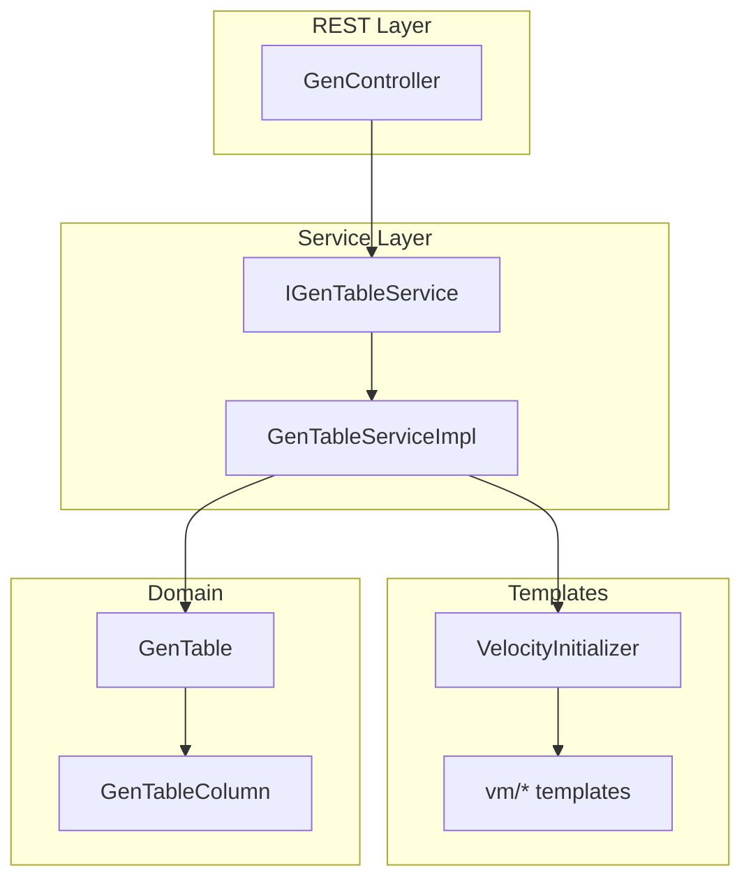
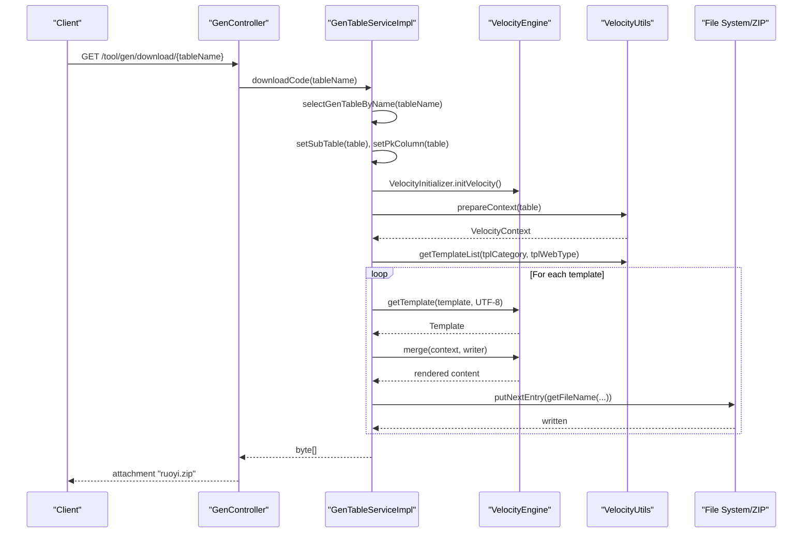
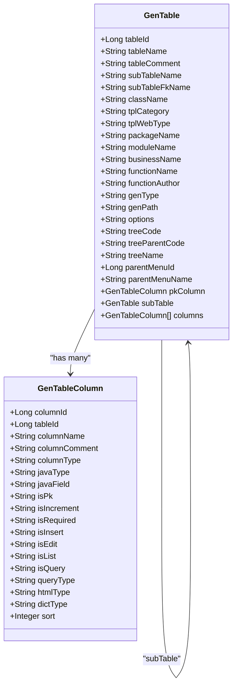
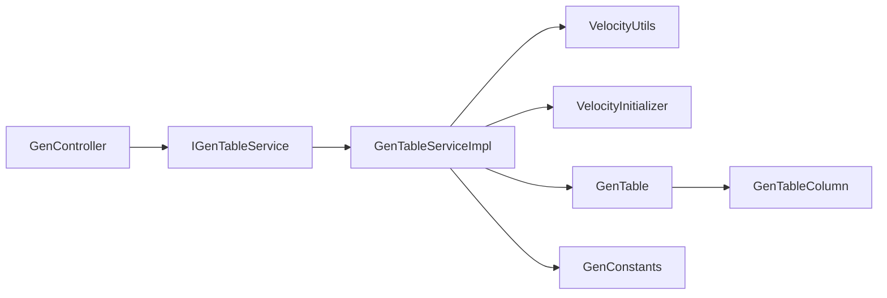

# Customizing Code Generation

<cite>
**Referenced Files in This Document**
- [VelocityUtils.java](file://src/main/java/com/ruoyi/project/tool/gen/util/VelocityUtils.java)
- [VelocityInitializer.java](file://src/main/java/com/ruoyi/project/tool/gen/util/VelocityInitializer.java)
- [GenController.java](file://src/main/java/com/ruoyi/project/tool/gen/controller/GenController.java)
- [IGenTableService.java](file://src/main/java/com/ruoyi/project/tool/gen/service/IGenTableService.java)
- [GenTableServiceImpl.java](file://src/main/java/com/ruoyi/project/tool/gen/service/GenTableServiceImpl.java)
- [GenTable.java](file://src/main/java/com/ruoyi/project/tool/gen/domain/GenTable.java)
- [GenTableColumn.java](file://src/main/java/com/ruoyi/project/tool/gen/domain/GenTableColumn.java)
- [GenConstants.java](file://src/main/java/com/ruoyi/common/constant/GenConstants.java)
- [GenConfig.java](file://src/main/java/com/ruoyi/framework/config/GenConfig.java)
- [application.yml](file://src/main/resources/application.yml)
- [domain.java.vm](file://src/main/resources/vm/java/domain.java.vm)
- [controller.java.vm](file://src/main/resources/vm/java/controller.java.vm)
- [mapper.java.vm](file://src/main/resources/vm/java/mapper.java.vm)
- [mapper.xml.vm](file://src/main/resources/vm/xml/mapper.xml.vm)
- [index.vue.vm](file://src/main/resources/vm/vue/index.vue.vm)
- [index-tree.vue.vm](file://src/main/resources/vm/vue/index-tree.vue.vm)
- [api.js.vm](file://src/main/resources/vm/js/api.js.vm)
- [sql.vm](file://src/main/resources/vm/sql/sql.vm)
</cite>

## Table of Contents
1. [Introduction](#introduction)
2. [Project Structure](#project-structure)
3. [Core Components](#core-components)
4. [Architecture Overview](#architecture-overview)
5. [Detailed Component Analysis](#detailed-component-analysis)
6. [Dependency Analysis](#dependency-analysis)
7. [Performance Considerations](#performance-considerations)
8. [Troubleshooting Guide](#troubleshooting-guide)
9. [Conclusion](#conclusion)
10. [Appendices](#appendices)

## Introduction
This document explains how RuoYi-Vue’s Velocity-based code generation works end-to-end. It covers how database metadata is transformed into generated Java, XML, Vue, and SQL artifacts, how the Velocity engine is initialized and used, and how to customize output paths, template logic, and generation behavior. It targets both beginners who want a practical walkthrough and experienced developers who need to extend or troubleshoot the system.

## Project Structure
The code generation feature lives under the tool module and uses Apache Velocity templates stored in the resources/vm directory. The runtime pipeline is:
- Controllers receive requests and delegate to services
- Services load database metadata, build Velocity contexts, render templates, and either stream a ZIP or write files to disk
- VelocityUtils prepares the context and resolves filenames and template lists
- VelocityInitializer sets up the Velocity engine to load templates from the classpath

**Diagram sources**
- [GenController.java](file://src/main/java/com/ruoyi/project/tool/gen/controller/GenController.java#L1-L263)
- [IGenTableService.java](file://src/main/java/com/ruoyi/project/tool/gen/service/IGenTableService.java#L1-L131)
- [GenTableServiceImpl.java](file://src/main/java/com/ruoyi/project/tool/gen/service/GenTableServiceImpl.java#L1-L531)
- [VelocityInitializer.java](file://src/main/java/com/ruoyi/project/tool/gen/util/VelocityInitializer.java#L1-L35)
- [GenTable.java](file://src/main/java/com/ruoyi/project/tool/gen/domain/GenTable.java#L1-L385)
- [GenTableColumn.java](file://src/main/java/com/ruoyi/project/tool/gen/domain/GenTableColumn.java#L1-L373)

**Section sources**
- [GenController.java](file://src/main/java/com/ruoyi/project/tool/gen/controller/GenController.java#L1-L263)
- [GenTableServiceImpl.java](file://src/main/java/com/ruoyi/project/tool/gen/service/GenTableServiceImpl.java#L1-L531)
- [VelocityInitializer.java](file://src/main/java/com/ruoyi/project/tool/gen/util/VelocityInitializer.java#L1-L35)
- [GenTable.java](file://src/main/java/com/ruoyi/project/tool/gen/domain/GenTable.java#L1-L385)
- [GenTableColumn.java](file://src/main/java/com/ruoyi/project/tool/gen/domain/GenTableColumn.java#L1-L373)

## Core Components
- VelocityUtils: Builds the VelocityContext, computes template lists, resolves file names, and sets specialized context keys for CRUD, tree, and sub-table scenarios.
- GenTable and GenTableColumn: Domain models representing the business table and its columns, including flags for UI generation and tree/sub-table relationships.
- GenTableServiceImpl: Orchestrates preview/download/generate flows, initializes Velocity, renders templates, and writes files or streams ZIP.
- GenController: Exposes endpoints for listing, importing, previewing, downloading, generating, synchronizing, and batch generation.
- VelocityInitializer: Initializes the Velocity engine to load templates from the classpath.
- Templates: Located under src/main/resources/vm, covering Java, XML, Vue, JS, and SQL.

Key template categories:
- Java: domain, mapper, service, serviceImpl, controller, sub-domain
- XML: MyBatis mapper
- Vue: index.vue and index-tree.vue (with v3 variants)
- JS: api.js
- SQL: menu SQL script

**Section sources**
- [VelocityUtils.java](file://src/main/java/com/ruoyi/project/tool/gen/util/VelocityUtils.java#L1-L409)
- [GenTable.java](file://src/main/java/com/ruoyi/project/tool/gen/domain/GenTable.java#L1-L385)
- [GenTableColumn.java](file://src/main/java/com/ruoyi/project/tool/gen/domain/GenTableColumn.java#L1-L373)
- [GenTableServiceImpl.java](file://src/main/java/com/ruoyi/project/tool/gen/service/GenTableServiceImpl.java#L1-L531)
- [GenController.java](file://src/main/java/com/ruoyi/project/tool/gen/controller/GenController.java#L1-L263)
- [VelocityInitializer.java](file://src/main/java/com/ruoyi/project/tool/gen/util/VelocityInitializer.java#L1-L35)
- [domain.java.vm](file://src/main/resources/vm/java/domain.java.vm#L1-L106)
- [controller.java.vm](file://src/main/resources/vm/java/controller.java.vm#L1-L116)
- [mapper.java.vm](file://src/main/resources/vm/java/mapper.java.vm#L1-L92)
- [mapper.xml.vm](file://src/main/resources/vm/xml/mapper.xml.vm#L1-L140)
- [index.vue.vm](file://src/main/resources/vm/vue/index.vue.vm#L1-L603)
- [index-tree.vue.vm](file://src/main/resources/vm/vue/index-tree.vue.vm#L1-L603)
- [api.js.vm](file://src/main/resources/vm/js/api.js.vm#L1-L200)
- [sql.vm](file://src/main/resources/vm/sql/sql.vm#L1-L200)

## Architecture Overview
The generation pipeline is a controlled flow from HTTP to filesystem or ZIP. The following sequence diagram maps the key steps for generating code to a ZIP.

**Diagram sources**
- [GenController.java](file://src/main/java/com/ruoyi/project/tool/gen/controller/GenController.java#L190-L248)
- [GenTableServiceImpl.java](file://src/main/java/com/ruoyi/project/tool/gen/service/GenTableServiceImpl.java#L237-L401)
- [VelocityUtils.java](file://src/main/java/com/ruoyi/project/tool/gen/util/VelocityUtils.java#L130-L160)
- [VelocityInitializer.java](file://src/main/java/com/ruoyi/project/tool/gen/util/VelocityInitializer.java#L17-L33)

## Detailed Component Analysis

### VelocityUtils: Context Preparation and Template Resolution
VelocityUtils centralizes context creation and template selection. It:
- Prepares core variables: table metadata, package, class names, author, datetime, imports, permission prefix, columns, dicts, and table object itself
- Adds menu-related context for parent menu ID
- Specializes context for tree tables (tree code, parent code, name, expand column)
- Specializes context for sub-tables (sub table object, foreign key name/class, import list)
- Computes template list based on category and web type (element-plus vs element-ui)
- Resolves output file names per template type

Concrete examples from the codebase:
- Package and class name generation:
  - See [VelocityUtils.java](file://src/main/java/com/ruoyi/project/tool/gen/util/VelocityUtils.java#L37-L74) for how packageName, className, and permissionPrefix are prepared
- Tree-specific context:
  - See [VelocityUtils.java](file://src/main/java/com/ruoyi/project/tool/gen/util/VelocityUtils.java#L84-L104) for treeCode, treeParentCode, treeName, and expandColumn
- Sub-table context:
  - See [VelocityUtils.java](file://src/main/java/com/ruoyi/project/tool/gen/util/VelocityUtils.java#L106-L122) for subTable, subTableFkName, subClassName, and imports
- Template selection by category and web type:
  - See [VelocityUtils.java](file://src/main/java/com/ruoyi/project/tool/gen/util/VelocityUtils.java#L130-L159) for how templates are selected for CRUD, tree, and sub-table
- Output file name resolution:
  - See [VelocityUtils.java](file://src/main/java/com/ruoyi/project/tool/gen/util/VelocityUtils.java#L165-L227) for mapping template names to file paths

Best practices:
- Keep context keys aligned with template expectations
- Use GenConstants for consistent category and HTML type constants
- Ensure sub-table and tree options are present when applicable

**Section sources**
- [VelocityUtils.java](file://src/main/java/com/ruoyi/project/tool/gen/util/VelocityUtils.java#L37-L227)
- [GenConstants.java](file://src/main/java/com/ruoyi/common/constant/GenConstants.java#L1-L118)

### GenTable and GenTableColumn: Domain Model
GenTable encapsulates:
- Table identity, comments, and generation metadata (module, business, author, author, genType, genPath)
- Template category (crud/tree/sub), web type (element-ui/element-plus)
- Options JSON for tree and menu settings
- Primary key column, sub-table linkage, and list of columns

GenTableColumn captures:
- Column metadata (name, type, Java type/field)
- Flags for insert/edit/list/query, required, primary key, increment
- HTML display type, query type, dict type, and sort order
- Utility helpers for super-column detection and usable column exceptions

Relationships:
- GenTable has a list of GenTableColumn
- GenTable optionally references a sub GenTable for master-detail generation
- GenTable holds a pkColumn reference derived from columns

**Diagram sources**
- [GenTable.java](file://src/main/java/com/ruoyi/project/tool/gen/domain/GenTable.java#L1-L385)
- [GenTableColumn.java](file://src/main/java/com/ruoyi/project/tool/gen/domain/GenTableColumn.java#L1-L373)

**Section sources**
- [GenTable.java](file://src/main/java/com/ruoyi/project/tool/gen/domain/GenTable.java#L1-L385)
- [GenTableColumn.java](file://src/main/java/com/ruoyi/project/tool/gen/domain/GenTableColumn.java#L1-L373)

### GenTableServiceImpl: Rendering and Writing
Responsibilities:
- Preview code: builds context, merges templates, returns a map of template to rendered content
- Download code: renders templates into a ZIP stream
- Generate code (custom path): renders templates and writes files to disk
- Sync DB: reconciles table columns with database schema, preserving selected options
- Validation: enforces required options for tree and sub-table categories

Key flows:
- Preview: [GenTableServiceImpl.java](file://src/main/java/com/ruoyi/project/tool/gen/service/GenTableServiceImpl.java#L204-L229)
- Download: [GenTableServiceImpl.java](file://src/main/java/com/ruoyi/project/tool/gen/service/GenTableServiceImpl.java#L237-L245)
- Generator (ZIP): [GenTableServiceImpl.java](file://src/main/java/com/ruoyi/project/tool/gen/service/GenTableServiceImpl.java#L366-L401)
- Generator (custom path): [GenTableServiceImpl.java](file://src/main/java/com/ruoyi/project/tool/gen/service/GenTableServiceImpl.java#L252-L287)
- Sync DB: [GenTableServiceImpl.java](file://src/main/java/com/ruoyi/project/tool/gen/service/GenTableServiceImpl.java#L294-L342)
- Validation: [GenTableServiceImpl.java](file://src/main/java/com/ruoyi/project/tool/gen/service/GenTableServiceImpl.java#L408-L439)

Output path customization:
- If genPath equals "/", the generator writes under the project root src directory
- Otherwise, it writes under the configured genPath
- See [GenTableServiceImpl.java](file://src/main/java/com/ruoyi/project/tool/gen/service/GenTableServiceImpl.java#L522-L531)

**Section sources**
- [GenTableServiceImpl.java](file://src/main/java/com/ruoyi/project/tool/gen/service/GenTableServiceImpl.java#L204-L401)
- [GenTableServiceImpl.java](file://src/main/java/com/ruoyi/project/tool/gen/service/GenTableServiceImpl.java#L408-L439)
- [GenTableServiceImpl.java](file://src/main/java/com/ruoyi/project/tool/gen/service/GenTableServiceImpl.java#L522-L531)

### GenController: Invocation Relationship
Endpoints:
- List, info, DB list, column list
- Import table save, create table from SQL
- Edit/save, remove, preview, download, generate (custom path), sync DB, batch generate

The controller delegates to IGenTableService for all generation operations. It also enforces permissions and handles ZIP streaming.

Example invocations:
- Preview: [GenController.java](file://src/main/java/com/ruoyi/project/tool/gen/controller/GenController.java#L190-L195)
- Download: [GenController.java](file://src/main/java/com/ruoyi/project/tool/gen/controller/GenController.java#L200-L207)
- Generate (custom path): [GenController.java](file://src/main/java/com/ruoyi/project/tool/gen/controller/GenController.java#L210-L223)
- Batch download: [GenController.java](file://src/main/java/com/ruoyi/project/tool/gen/controller/GenController.java#L238-L248)

**Section sources**
- [GenController.java](file://src/main/java/com/ruoyi/project/tool/gen/controller/GenController.java#L1-L263)
- [IGenTableService.java](file://src/main/java/com/ruoyi/project/tool/gen/service/IGenTableService.java#L1-L131)

### VelocityInitializer: Engine Setup
VelocityInitializer configures the Velocity engine to load templates from the classpath with UTF-8 encoding.

- See [VelocityInitializer.java](file://src/main/java/com/ruoyi/project/tool/gen/util/VelocityInitializer.java#L17-L33)

**Section sources**
- [VelocityInitializer.java](file://src/main/java/com/ruoyi/project/tool/gen/util/VelocityInitializer.java#L17-L33)

### Templates: How Variables Are Used
Below are concrete examples of how VelocityUtils variables are consumed in templates:

- Package and class names:
  - Domain template uses packageName and ClassName for package and class declaration
  - See [domain.java.vm](file://src/main/resources/vm/java/domain.java.vm#L1-L20)
- Imports and entity base:
  - Domain template conditionally imports BaseEntity or TreeEntity based on table category
  - See [domain.java.vm](file://src/main/resources/vm/java/domain.java.vm#L8-L14)
- Controller routing and permissions:
  - Controller template uses moduleName, businessName, permissionPrefix, and pkColumn
  - See [controller.java.vm](file://src/main/resources/vm/java/controller.java.vm#L33-L40) and [controller.java.vm](file://src/main/resources/vm/java/controller.java.vm#L43-L48)
- Mapper namespace and result maps:
  - Mapper XML uses packageName and ClassName for namespace and result maps
  - See [mapper.xml.vm](file://src/main/resources/vm/xml/mapper.xml.vm#L5-L11)
- Vue front-end:
  - Index template uses permissionPrefix, columns, dicts, and pkColumn for actions and rendering
  - See [index.vue.vm](file://src/main/resources/vm/vue/index.vue.vm#L70-L114) and [index.vue.vm](file://src/main/resources/vm/vue/index.vue.vm#L116-L172)
- Vue sub-table rendering:
  - Sub-table columns and foreign key handling are rendered in Vue
  - See [index.vue.vm](file://src/main/resources/vm/vue/index.vue.vm#L287-L345)

Template selection logic:
- CRUD: index.vue
- Tree: index-tree.vue
- Sub-table: index.vue plus sub-domain.java.vm
- See [VelocityUtils.java](file://src/main/java/com/ruoyi/project/tool/gen/util/VelocityUtils.java#L130-L159)

**Section sources**
- [domain.java.vm](file://src/main/resources/vm/java/domain.java.vm#L1-L106)
- [controller.java.vm](file://src/main/resources/vm/java/controller.java.vm#L1-L116)
- [mapper.xml.vm](file://src/main/resources/vm/xml/mapper.xml.vm#L1-L140)
- [index.vue.vm](file://src/main/resources/vm/vue/index.vue.vm#L1-L603)
- [VelocityUtils.java](file://src/main/java/com/ruoyi/project/tool/gen/util/VelocityUtils.java#L130-L159)

## Dependency Analysis
High-level dependencies:
- GenController depends on IGenTableService
- IGenTableService is implemented by GenTableServiceImpl
- GenTableServiceImpl depends on VelocityUtils, VelocityInitializer, GenTable, GenTableColumn, and GenConstants
- Templates depend on VelocityUtils context keys

**Diagram sources**
- [GenController.java](file://src/main/java/com/ruoyi/project/tool/gen/controller/GenController.java#L1-L263)
- [IGenTableService.java](file://src/main/java/com/ruoyi/project/tool/gen/service/IGenTableService.java#L1-L131)
- [GenTableServiceImpl.java](file://src/main/java/com/ruoyi/project/tool/gen/service/GenTableServiceImpl.java#L1-L531)
- [VelocityUtils.java](file://src/main/java/com/ruoyi/project/tool/gen/util/VelocityUtils.java#L1-L409)
- [VelocityInitializer.java](file://src/main/java/com/ruoyi/project/tool/gen/util/VelocityInitializer.java#L1-L35)
- [GenTable.java](file://src/main/java/com/ruoyi/project/tool/gen/domain/GenTable.java#L1-L385)
- [GenTableColumn.java](file://src/main/java/com/ruoyi/project/tool/gen/domain/GenTableColumn.java#L1-L373)
- [GenConstants.java](file://src/main/java/com/ruoyi/common/constant/GenConstants.java#L1-L118)

**Section sources**
- [GenTableServiceImpl.java](file://src/main/java/com/ruoyi/project/tool/gen/service/GenTableServiceImpl.java#L1-L531)
- [VelocityUtils.java](file://src/main/java/com/ruoyi/project/tool/gen/util/VelocityUtils.java#L1-L409)

## Performance Considerations
- Template rendering is lightweight; performance primarily depends on:
  - Number of templates per table (more templates = more merges)
  - Complexity of templates (large loops over columns)
  - File I/O when writing to disk (avoid frequent flushes)
- Recommendations:
  - Keep templates concise and avoid unnecessary nested loops
  - Use VelocityUtils.getTemplateList to include only needed templates
  - Prefer ZIP streaming for bulk generation to reduce disk writes

[No sources needed since this section provides general guidance]

## Troubleshooting Guide
Common issues and resolutions:
- Cannot overwrite files when generating to local path:
  - Controlled by GenConfig.allowOverwrite. If disabled, custom path generation returns an error
  - See [GenController.java](file://src/main/java/com/ruoyi/project/tool/gen/controller/GenController.java#L217-L223) and [GenConfig.java](file://src/main/java/com/ruoyi/framework/config/GenConfig.java#L70-L78)
- Missing tree options:
  - Validation enforces treeCode, treeParentCode, and treeName for tree category
  - See [GenTableServiceImpl.java](file://src/main/java/com/ruoyi/project/tool/gen/service/GenTableServiceImpl.java#L408-L439)
- Missing sub-table linkage:
  - Validation requires subTableName and subTableFkName for sub category
  - See [GenTableServiceImpl.java](file://src/main/java/com/ruoyi/project/tool/gen/service/GenTableServiceImpl.java#L408-L439)
- Incorrect output path:
  - If genPath is "/", files are written under project src; otherwise under genPath
  - See [GenTableServiceImpl.java](file://src/main/java/com/ruoyi/project/tool/gen/service/GenTableServiceImpl.java#L522-L531)
- Template not found:
  - Ensure template paths match VelocityUtils.getTemplateList and vm directory layout
  - See [VelocityUtils.java](file://src/main/java/com/ruoyi/project/tool/gen/util/VelocityUtils.java#L130-L159)
- Menu parent ID not applied:
  - Verify options JSON contains parentMenuId; otherwise a default is used
  - See [VelocityUtils.java](file://src/main/java/com/ruoyi/project/tool/gen/util/VelocityUtils.java#L321-L335)

**Section sources**
- [GenController.java](file://src/main/java/com/ruoyi/project/tool/gen/controller/GenController.java#L217-L223)
- [GenConfig.java](file://src/main/java/com/ruoyi/framework/config/GenConfig.java#L70-L78)
- [GenTableServiceImpl.java](file://src/main/java/com/ruoyi/project/tool/gen/service/GenTableServiceImpl.java#L408-L439)
- [GenTableServiceImpl.java](file://src/main/java/com/ruoyi/project/tool/gen/service/GenTableServiceImpl.java#L522-L531)
- [VelocityUtils.java](file://src/main/java/com/ruoyi/project/tool/gen/util/VelocityUtils.java#L130-L159)
- [VelocityUtils.java](file://src/main/java/com/ruoyi/project/tool/gen/util/VelocityUtils.java#L321-L335)

## Conclusion
RuoYi-Vue’s code generation is a robust, Velocity-driven pipeline that transforms database metadata into cohesive backend and frontend artifacts. By understanding the roles of VelocityUtils, GenTable/GenTableColumn, GenTableServiceImpl, and the templates, you can confidently customize output paths, tailor template logic, and extend the generation process to meet evolving requirements.

[No sources needed since this section summarizes without analyzing specific files]

## Appendices

### Configuration Options
- application.yml gen section controls:
  - author
  - packageName
  - autoRemovePre
  - tablePrefix
  - allowOverwrite
- See [application.yml](file://src/main/resources/application.yml#L138-L149) and [GenConfig.java](file://src/main/java/com/ruoyi/framework/config/GenConfig.java#L1-L80)

### Template Categories and Files
- CRUD: domain.java.vm, mapper.java.vm, service.java.vm, serviceImpl.java.vm, controller.java.vm, mapper.xml.vm, sql.vm, api.js.vm, index.vue.vm
- Tree: index-tree.vue.vm
- Sub-table: sub-domain.java.vm
- See [VelocityUtils.java](file://src/main/java/com/ruoyi/project/tool/gen/util/VelocityUtils.java#L130-L159)

### Example: How VelocityUtils Generates Key Variables
- packageName and className:
  - See [VelocityUtils.java](file://src/main/java/com/ruoyi/project/tool/gen/util/VelocityUtils.java#L37-L74)
- permissionPrefix:
  - See [VelocityUtils.java](file://src/main/java/com/ruoyi/project/tool/gen/util/VelocityUtils.java#L310-L319)
- Tree variables:
  - See [VelocityUtils.java](file://src/main/java/com/ruoyi/project/tool/gen/util/VelocityUtils.java#L84-L104)
- Sub-table variables:
  - See [VelocityUtils.java](file://src/main/java/com/ruoyi/project/tool/gen/util/VelocityUtils.java#L106-L122)