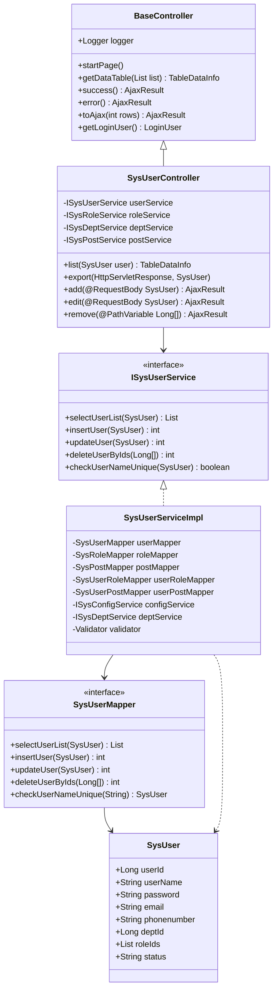
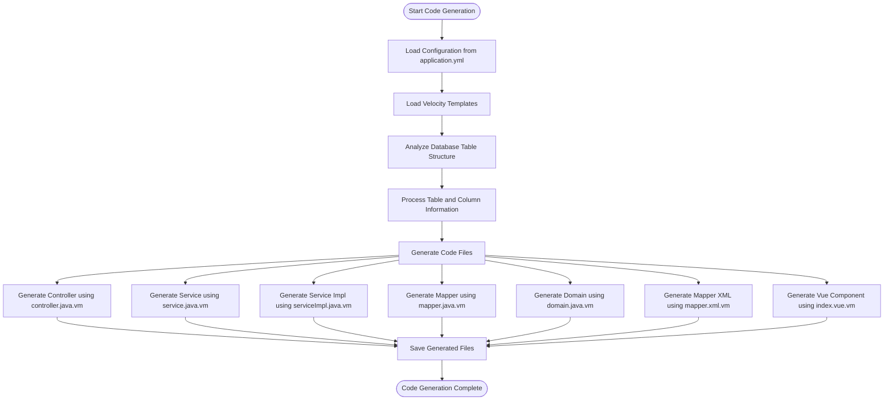
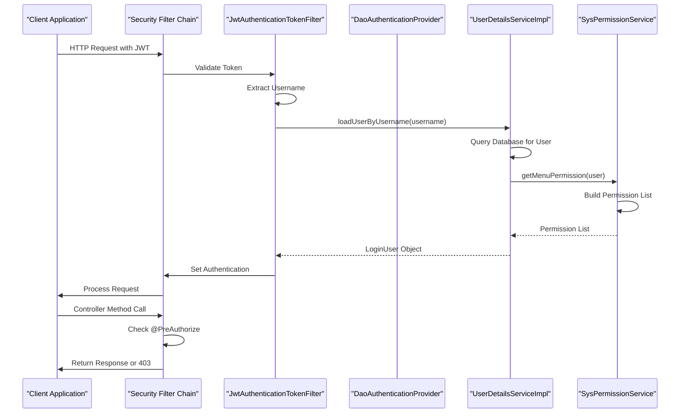
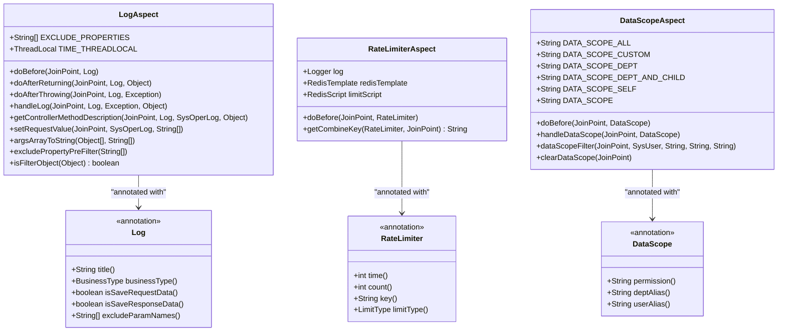

# Development Guide

<cite>
**Referenced Files in This Document**   
- [RuoYiApplication.java](file://src/main/java/com/ruoyi/RuoYiApplication.java)
- [BaseController.java](file://src/main/java/com/ruoyi/framework/web/controller/BaseController.java)
- [application.yml](file://src/main/resources/application.yml)
- [SecurityConfig.java](file://src/main/java/com/ruoyi/framework/config/SecurityConfig.java)
- [DataScopeAspect.java](file://src/main/java/com/ruoyi/framework/aspectj/DataScopeAspect.java)
- [GenUtils.java](file://src/main/java/com/ruoyi/project/tool/gen/util/GenUtils.java)
- [messages.properties](file://src/main/resources/i18n/messages.properties)
- [I18nConfig.java](file://src/main/resources/i18n/messages.properties)
- [I18nConfig.java](file://src/main/java/com/ruoyi/framework/config/I18nConfig.java)
- [LogAspect.java](file://src/main/java/com/ruoyi/framework/aspectj/LogAspect.java)
- [RateLimiterAspect.java](file://src/main/java/com/ruoyi/framework/aspectj/RateLimiterAspect.java)
- [SysUserController.java](file://src/main/java/com/ruoyi/project/system/controller/SysUserController.java)
- [SysUserServiceImpl.java](file://src/main/java/com/ruoyi/project/system/service/impl/SysUserServiceImpl.java)
- [SysUserMapper.java](file://src/main/java/com/ruoyi/project/system/mapper/SysUserMapper.java)
- [UserDetailsServiceImpl.java](file://src/main/java/com/ruoyi/framework/security/service/UserDetailsServiceImpl.java)
- [controller.java.vm](file://src/main/resources/vm/java/controller.java.vm)
- [domain.java.vm](file://src/main/resources/vm/java/domain.java.vm)
- [service.java.vm](file://src/main/resources/vm/java/service.java.vm)
- [serviceImpl.java.vm](file://src/main/resources/vm/java/serviceImpl.java.vm)
- [mapper.xml.vm](file://src/main/resources/vm/xml/mapper.xml.vm)
</cite>

## Table of Contents
1. [Introduction](#introduction)
2. [MVC Architecture and Module Creation](#mvc-architecture-and-module-creation)
3. [Code Generation Customization](#code-generation-customization)
4. [Security Framework Extension](#security-framework-extension)
5. [Aspect-Oriented Programming with AspectJ](#aspect-oriented-programming-with-aspectj)
6. [Internationalization Implementation](#internationalization-implementation)
7. [Best Practices and Framework Utilization](#best-practices-and-framework-utilization)
8. [Conclusion](#conclusion)

## Introduction
RuoYi-Vue is a comprehensive enterprise-level development framework based on Spring Boot and Vue.js, following the Model-View-Controller (MVC) architectural pattern. This guide provides detailed instructions on extending the framework through module creation, code generation customization, security enhancements, aspect-oriented programming, and internationalization. The framework offers a robust foundation for building scalable applications with built-in features for authentication, authorization, logging, rate limiting, and data scope control.

**Section sources**
- [RuoYiApplication.java](file://src/main/java/com/ruoyi/RuoYiApplication.java#L1-L31)
- [application.yml](file://src/main/resources/application.yml#L1-L149)

## MVC Architecture and Module Creation

RuoYi-Vue follows a strict MVC pattern with clearly defined layers for controller, service, and data access components. The framework provides a systematic approach to adding new modules that maintain consistency with existing code structure and design patterns.

The controller layer extends `BaseController` which provides common functionality for pagination, data retrieval, and response handling. Controllers use Spring's `@RestController` annotation and follow RESTful conventions with appropriate HTTP method mappings. The service layer implements business logic and is annotated with Spring's `@Service` annotation, while the data access layer uses MyBatis mappers annotated with `@Mapper` or defined as interfaces.

When creating new modules, developers should follow the established package structure under `com.ruoyi.project.[module]` with subpackages for controller, service, mapper, and domain components. Each layer has specific responsibilities: controllers handle HTTP requests and responses, services encapsulate business logic and transaction management, and mappers interface with the database through MyBatis.



**Diagram sources**
- [BaseController.java](file://src/main/java/com/ruoyi/framework/web/controller/BaseController.java#L29-L195)
- [SysUserController.java](file://src/main/java/com/ruoyi/project/system/controller/SysUserController.java#L42-L257)
- [SysUserServiceImpl.java](file://src/main/java/com/ruoyi/project/system/service/impl/SysUserServiceImpl.java#L41-L566)
- [SysUserMapper.java](file://src/main/java/com/ruoyi/project/system/mapper/SysUserMapper.java#L13-L148)

**Section sources**
- [SysUserController.java](file://src/main/java/com/ruoyi/project/system/controller/SysUserController.java#L42-L257)
- [SysUserServiceImpl.java](file://src/main/java/com/ruoyi/project/system/service/impl/SysUserServiceImpl.java#L41-L566)
- [SysUserMapper.java](file://src/main/java/com/ruoyi/project/system/mapper/SysUserMapper.java#L13-L148)

## Code Generation Customization

RuoYi-Vue includes a powerful code generation system that automates the creation of CRUD modules based on database tables. The generation process can be customized through configuration settings and Velocity template modifications, allowing developers to adapt the generated code to specific project requirements.

The code generation configuration is controlled through the `gen` section in `application.yml`, where developers can set the author name, package name, table prefix handling, and other generation parameters. The framework uses Velocity templates located in the `vm` directory to generate code for controllers, services, mappers, domains, and Vue components. These templates can be modified to change the structure, annotations, and content of generated files.

The `GenUtils` class provides the core logic for code generation, including table name conversion, business name extraction, and column type mapping. Developers can extend this functionality by modifying the `convertClassName`, `getBusinessName`, and `initColumnField` methods to implement custom naming conventions and type mappings. The generation process automatically handles common patterns such as converting table prefixes, mapping database types to Java types, and determining appropriate HTML controls based on column names and types.



**Diagram sources**
- [application.yml](file://src/main/resources/application.yml#L138-L149)
- [GenUtils.java](file://src/main/java/com/ruoyi/project/tool/gen/util/GenUtils.java#L16-L258)
- [controller.java.vm](file://src/main/resources/vm/java/controller.java.vm#L1-L116)
- [service.java.vm](file://src/main/resources/vm/java/service.java.vm)
- [serviceImpl.java.vm](file://src/main/resources/vm/java/serviceImpl.java.vm)
- [mapper.java.vm](file://src/main/resources/vm/java/mapper.java.vm)
- [domain.java.vm](file://src/main/resources/vm/java/domain.java.vm)
- [mapper.xml.vm](file://src/main/resources/vm/xml/mapper.xml.vm)

**Section sources**
- [GenUtils.java](file://src/main/java/com/ruoyi/project/tool/gen/util/GenUtils.java#L16-L258)
- [application.yml](file://src/main/resources/application.yml#L138-L149)

## Security Framework Extension

The RuoYi-Vue security framework is built on Spring Security and can be extended to support custom authentication providers and authorization rules. The framework implements token-based authentication using JWT, with configurable security policies and permission management.

Custom authentication providers can be implemented by extending Spring Security's authentication mechanisms and integrating with the existing `UserDetailsServiceImpl` class. This service loads user details from the database and creates `LoginUser` objects that contain user information and permissions. Developers can modify the `loadUserByUsername` method to integrate with external identity providers or implement additional validation logic.

Authorization rules are managed through a combination of Spring Security annotations and custom aspects. The `@PreAuthorize` annotation is used extensively throughout the codebase to control access to controller methods based on user permissions. The `DataScopeAspect` class implements data scope filtering, restricting users to access only data they are authorized to view based on their role and department. This aspect can be extended to implement custom data access rules or integrate with external authorization systems.



**Diagram sources**
- [SecurityConfig.java](file://src/main/java/com/ruoyi/framework/config/SecurityConfig.java#L31-L140)
- [UserDetailsServiceImpl.java](file://src/main/java/com/ruoyi/framework/security/service/UserDetailsServiceImpl.java#L23-L66)
- [DataScopeAspect.java](file://src/main/java/com/ruoyi/framework/aspectj/DataScopeAspect.java#L27-L185)

**Section sources**
- [SecurityConfig.java](file://src/main/java/com/ruoyi/framework/config/SecurityConfig.java#L31-L140)
- [UserDetailsServiceImpl.java](file://src/main/java/com/ruoyi/framework/security/service/UserDetailsServiceImpl.java#L23-L66)
- [DataScopeAspect.java](file://src/main/java/com/ruoyi/framework/aspectj/DataScopeAspect.java#L27-L185)

## Aspect-Oriented Programming with AspectJ

RuoYi-Vue leverages AspectJ for implementing cross-cutting concerns such as logging, rate limiting, and data scope filtering. These aspects provide reusable functionality that can be applied across multiple components without modifying their core logic.

The framework includes several built-in aspects that demonstrate best practices for aspect-oriented programming. The `LogAspect` class implements operation logging by intercepting methods annotated with `@Log`, capturing execution details, and storing them in the database. This aspect uses `@Before`, `@AfterReturning`, and `@AfterThrowing` annotations to capture the complete lifecycle of method execution, including execution time, parameters, and results.

The `RateLimiterAspect` provides rate limiting functionality using Redis to track request counts and prevent abuse. It supports different limiting strategies based on IP address, user, or method, configurable through the `@RateLimiter` annotation. The aspect executes a Lua script in Redis to atomically check and update request counts, ensuring thread safety in distributed environments.

Developers can create custom aspects by annotating classes with `@Aspect` and `@Component`, then defining pointcuts using annotations like `@Before`, `@After`, or `@Around`. These aspects can be used to implement custom cross-cutting concerns such as performance monitoring, data validation, or integration with external systems.



**Diagram sources**
- [LogAspect.java](file://src/main/java/com/ruoyi/framework/aspectj/LogAspect.java#L43-L265)
- [RateLimiterAspect.java](file://src/main/java/com/ruoyi/framework/aspectj/RateLimiterAspect.java#L29-L90)
- [DataScopeAspect.java](file://src/main/java/com/ruoyi/framework/aspectj/DataScopeAspect.java#L27-L185)

**Section sources**
- [LogAspect.java](file://src/main/java/com/ruoyi/framework/aspectj/LogAspect.java#L43-L265)
- [RateLimiterAspect.java](file://src/main/java/com/ruoyi/framework/aspectj/RateLimiterAspect.java#L29-L90)
- [DataScopeAspect.java](file://src/main/java/com/ruoyi/framework/aspectj/DataScopeAspect.java#L27-L185)

## Internationalization Implementation

RuoYi-Vue supports internationalization through Spring's message resource system, allowing applications to serve content in multiple languages. The framework is configured to use properties files for message storage and provides mechanisms for language switching and message resolution.

The internationalization configuration is defined in `I18nConfig.java`, which sets up a `SessionLocaleResolver` to store the user's preferred language in the session and a `LocaleChangeInterceptor` to handle language changes via the `lang` request parameter. Message resources are stored in properties files under the `i18n` directory, with `messages.properties` serving as the default resource bundle.

Messages are defined as key-value pairs in the properties files, with placeholders for dynamic content using curly brace notation. These messages can be accessed in Java code through the `MessageUtils` class or in Thymeleaf templates using the `#{}` syntax. The framework automatically resolves messages based on the user's current locale, falling back to the default language if a translation is not available.

```mermaid
graph TB
subgraph "Configuration"
A[I18nConfig] --> B[LocaleResolver]
A --> C[LocaleChangeInterceptor]
B --> D[SessionLocaleResolver]
C --> E[Parameter: lang]
end
subgraph "Message Resources"
F[i18n/messages.properties]
G[i18n/messages_zh.properties]
H[i18n/messages_en.properties]
end
subgraph "Message Resolution"
I[MessageUtils.message(key, args)]
J[Thymeleaf #{key}]
K[Spring MessageSource]
end
D --> K
E --> K
F --> K
G --> K
H --> K
K --> I
K --> J
style A fill:#f9f,stroke:#333
style F fill:#bbf,stroke:#333
style I fill:#f96,stroke:#333
```

**Diagram sources**
- [I18nConfig.java](file://src/main/java/com/ruoyi/framework/config/I18nConfig.java#L18-L44)
- [messages.properties](file://src/main/resources/i18n/messages.properties#L1-L39)

**Section sources**
- [I18nConfig.java](file://src/main/java/com/ruoyi/framework/config/I18nConfig.java#L18-L44)
- [messages.properties](file://src/main/resources/i18n/messages.properties#L1-L39)

## Best Practices and Framework Utilization

To maintain consistency and leverage the full capabilities of the RuoYi-Vue framework, developers should follow established best practices for code organization, error handling, and performance optimization. The framework provides numerous utilities and patterns that should be consistently applied across all modules.

When adding new functionality, developers should extend existing patterns rather than introducing new approaches. This includes using the `BaseController` for common response handling, applying appropriate security annotations, and following the established naming conventions for classes and methods. Error handling should use the framework's exception hierarchy and return standardized `AjaxResult` objects for consistent client-side processing.

Performance considerations include proper use of pagination for list operations, careful management of database queries to avoid N+1 problems, and appropriate caching strategies. The framework's built-in aspects for logging and rate limiting should be applied judiciously to monitor system behavior without introducing excessive overhead.

Code generation should be used as the primary method for creating new CRUD modules, with customizations applied through template modifications rather than manual code changes. This ensures consistency and reduces the risk of errors. When extending the security model, developers should leverage the existing permission and data scope mechanisms rather than implementing parallel authorization systems.

**Section sources**
- [BaseController.java](file://src/main/java/com/ruoyi/framework/web/controller/BaseController.java#L29-L195)
- [AjaxResult.java](file://src/main/java/com/ruoyi/framework/web/domain/AjaxResult.java)
- [TableDataInfo.java](file://src/main/java/com/ruoyi/framework/web/page/TableDataInfo.java)

## Conclusion
RuoYi-Vue provides a comprehensive foundation for enterprise application development with well-defined patterns for MVC architecture, security, internationalization, and cross-cutting concerns. By following the practices outlined in this guide, developers can effectively extend the framework to meet specific business requirements while maintaining code quality and consistency. The code generation system, extensible security model, and aspect-oriented programming capabilities enable rapid development of robust applications that adhere to best practices and architectural principles.