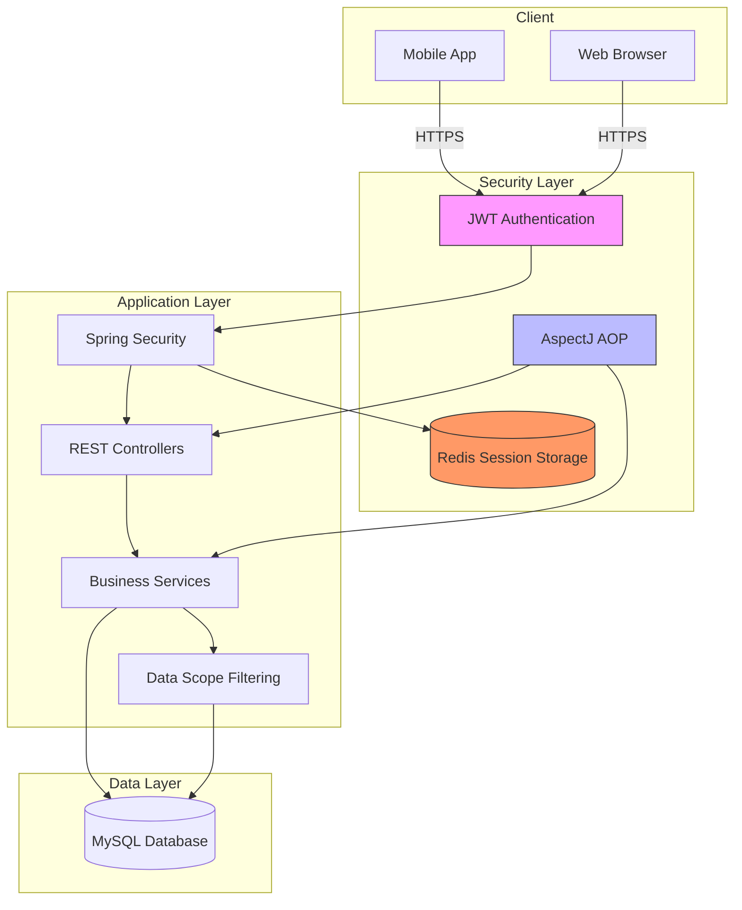
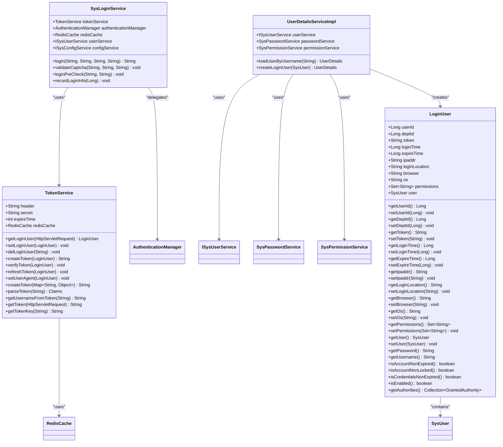
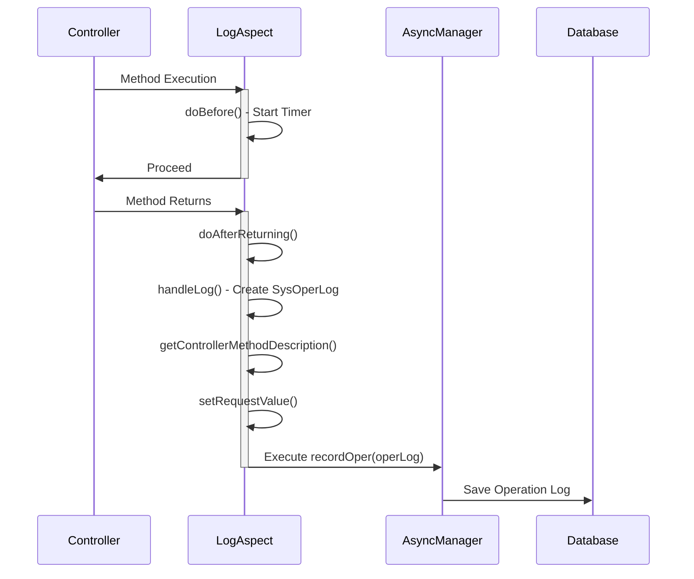
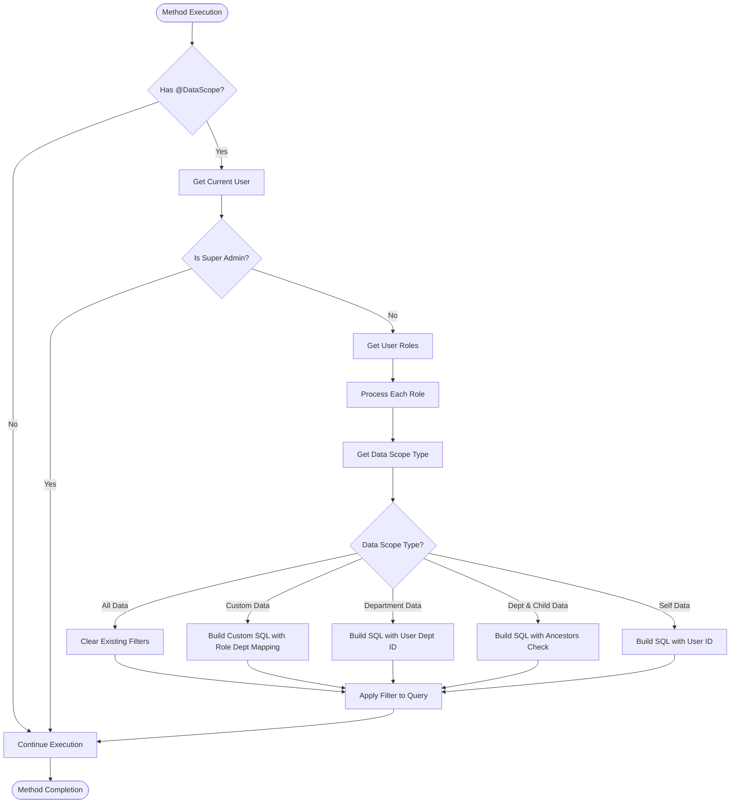
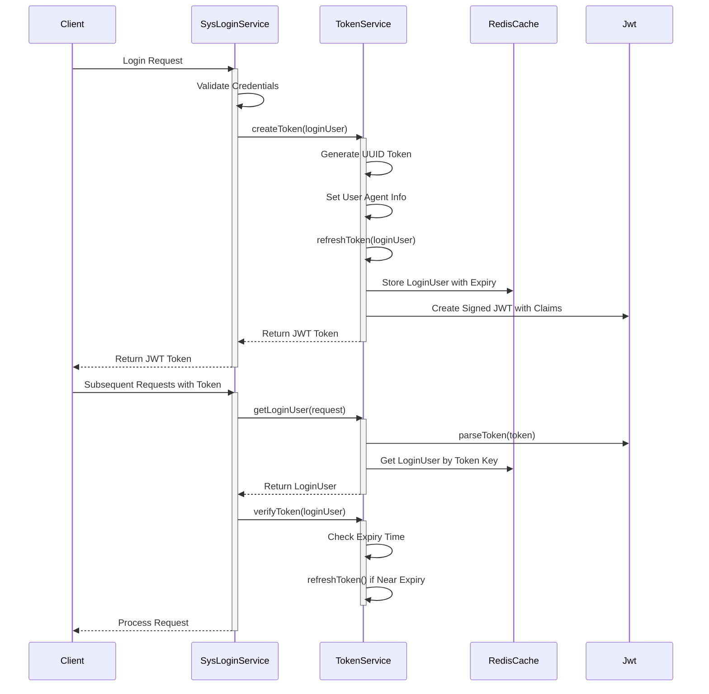

# Extending Security

<cite>
**Referenced Files in This Document**   
- [LoginUser.java](file://src/main/java/com/ruoyi/framework/security/LoginUser.java)
- [SysLoginService.java](file://src/main/java/com/ruoyi/framework/security/service/SysLoginService.java)
- [TokenService.java](file://src/main/java/com/ruoyi/framework/security/service/TokenService.java)
- [Log.java](file://src/main/java/com/ruoyi/framework/aspectj/lang/annotation/Log.java)
- [LogAspect.java](file://src/main/java/com/ruoyi/framework/aspectj/LogAspect.java)
- [DataScope.java](file://src/main/java/com/ruoyi/framework/aspectj/lang/annotation/DataScope.java)
- [DataScopeAspect.java](file://src/main/java/com/ruoyi/framework/aspectj/DataScopeAspect.java)
- [SecurityConfig.java](file://src/main/java/com/ruoyi/framework/config/SecurityConfig.java)
- [RuoYiConfig.java](file://src/main/java/com/ruoyi/framework/config/RuoYiConfig.java)
- [JwtAuthenticationTokenFilter.java](file://src/main/java/com/ruoyi/framework/security/filter/JwtAuthenticationTokenFilter.java)
- [UserDetailsServiceImpl.java](file://src/main/java/com/ruoyi/framework/security/service/UserDetailsServiceImpl.java)
- [PermitAllUrlProperties.java](file://src/main/java/com/ruoyi/framework/config/properties/PermitAllUrlProperties.java)
- [RedisCache.java](file://src/main/java/com/ruoyi/framework/redis/RedisCache.java)
- [application.yml](file://src/main/resources/application.yml)
</cite>

## Table of Contents
1. [Introduction](#introduction)
2. [Security Architecture Overview](#security-architecture-overview)
3. [Core Security Components](#core-security-components)
4. [AspectJ-Based Security Implementation](#aspectj-based-security-implementation)
5. [JWT Token Management](#jwt-token-management)
6. [Security Configuration](#security-configuration)
7. [Common Security Extension Scenarios](#common-security-extension-scenarios)
8. [Troubleshooting Guide](#troubleshooting-guide)
9. [Conclusion](#conclusion)

## Introduction

The RuoYi-Vue security framework provides a comprehensive security solution based on Spring Security, JWT tokens, and AspectJ for cross-cutting concerns. This document details how to extend the security framework by explaining the implementation of custom annotations like @Log and @DataScope, their integration with AspectJ, and the relationships between security aspects, services, and configuration components. The framework implements a token-based authentication system using JWT with Redis storage, providing robust security features including operation logging, data scope filtering, and permission management.

**Section sources**
- [LoginUser.java](file://src/main/java/com/ruoyi/framework/security/LoginUser.java#L1-L267)
- [SecurityConfig.java](file://src/main/java/com/ruoyi/framework/config/SecurityConfig.java#L1-L140)

## Security Architecture Overview

The RuoYi-Vue security architecture follows a layered approach with clear separation of concerns. At the core is Spring Security, which handles authentication and authorization through a stateless JWT-based mechanism. The architecture incorporates AspectJ for implementing cross-cutting security concerns such as operation logging and data scope filtering. JWT tokens are used for stateless authentication, with user session data stored in Redis for scalability and performance.



**Diagram sources **
- [SecurityConfig.java](file://src/main/java/com/ruoyi/framework/config/SecurityConfig.java#L29-L140)
- [TokenService.java](file://src/main/java/com/ruoyi/framework/security/service/TokenService.java#L31-L233)
- [JwtAuthenticationTokenFilter.java](file://src/main/java/com/ruoyi/framework/security/filter/JwtAuthenticationTokenFilter.java#L24-L45)

## Core Security Components

The RuoYi-Vue security framework consists of several key components that work together to provide comprehensive security. The LoginUser class represents the authenticated user's identity and permissions, extending Spring Security's UserDetails interface. The SysLoginService handles the login validation process, including captcha verification and account status checks. The TokenService manages JWT token creation, validation, and storage in Redis. These components are orchestrated through Spring Security configuration and AspectJ aspects for cross-cutting concerns.

The LoginUser class contains essential user information including user ID, department ID, permissions, and session details such as login time, IP address, browser, and operating system. It implements Spring Security's UserDetails interface, providing methods to check account status and retrieve user authorities. The SysLoginService coordinates the authentication process by validating credentials through Spring Security's AuthenticationManager and creating JWT tokens via TokenService upon successful authentication.



**Diagram sources **
- [LoginUser.java](file://src/main/java/com/ruoyi/framework/security/LoginUser.java#L15-L267)
- [SysLoginService.java](file://src/main/java/com/ruoyi/framework/security/service/SysLoginService.java#L37-L177)
- [TokenService.java](file://src/main/java/com/ruoyi/framework/security/service/TokenService.java#L32-L233)
- [UserDetailsServiceImpl.java](file://src/main/java/com/ruoyi/framework/security/service/UserDetailsServiceImpl.java#L23-L66)

**Section sources**
- [LoginUser.java](file://src/main/java/com/ruoyi/framework/security/LoginUser.java#L1-L267)
- [SysLoginService.java](file://src/main/java/com/ruoyi/framework/security/service/SysLoginService.java#L1-L177)
- [TokenService.java](file://src/main/java/com/ruoyi/framework/security/service/TokenService.java#L1-L233)

## AspectJ-Based Security Implementation

The RuoYi-Vue framework leverages AspectJ to implement cross-cutting security concerns through custom annotations. The @Log annotation enables operation logging by capturing method execution details, parameters, and results, while the @DataScope annotation implements data scope filtering to restrict data access based on user roles and permissions. These annotations work with corresponding aspects (LogAspect and DataScopeAspect) that intercept method execution and apply the security logic.

The @Log annotation defines properties for specifying the operation title, business type, operator type, and whether to save request and response data. When applied to controller methods, the LogAspect captures execution details including execution time, request parameters, and operation results, storing them in the database for audit purposes. The aspect uses ThreadLocal to track execution time and handles both successful completions and exceptions through different advice methods.



**Diagram sources **
- [Log.java](file://src/main/java/com/ruoyi/framework/aspectj/lang/annotation/Log.java#L1-L52)
- [LogAspect.java](file://src/main/java/com/ruoyi/framework/aspectj/LogAspect.java#L41-L265)

The DataScopeAspect implements data access control by intercepting methods annotated with @DataScope and dynamically modifying SQL queries to include appropriate WHERE conditions based on the user's role and permissions. The aspect supports multiple data scope types including all data, custom data, department data, department and child data, and self data. It retrieves the current user's information from the security context and applies the appropriate filtering logic based on the user's role data scope configuration.



**Diagram sources **
- [DataScope.java](file://src/main/java/com/ruoyi/framework/aspectj/lang/annotation/DataScope.java#L1-L34)
- [DataScopeAspect.java](file://src/main/java/com/ruoyi/framework/aspectj/DataScopeAspect.java#L27-L185)

**Section sources**
- [Log.java](file://src/main/java/com/ruoyi/framework/aspectj/lang/annotation/Log.java#L1-L52)
- [LogAspect.java](file://src/main/java/com/ruoyi/framework/aspectj/LogAspect.java#L1-L265)
- [DataScope.java](file://src/main/java/com/ruoyi/framework/aspectj/lang/annotation/DataScope.java#L1-L34)
- [DataScopeAspect.java](file://src/main/java/com/ruoyi/framework/aspectj/DataScopeAspect.java#L1-L185)

## JWT Token Management

The RuoYi-Vue framework implements JWT-based token management for stateless authentication. The TokenService class handles all aspects of token creation, validation, and storage. When a user successfully authenticates, the system generates a JWT token containing user information and stores the complete user session data in Redis with a key derived from the token. This approach combines the benefits of stateless JWT authentication with the ability to invalidate tokens by removing them from Redis.

The token creation process begins with generating a unique UUID for the token, which is stored in the LoginUser object. The system then sets user agent information (IP address, location, browser, and operating system) before refreshing the token's cache in Redis with the updated expiration time. The JWT token itself contains claims with the user's token key and username, signed with a secret key configured in the application properties. The token has a default expiration of 30 minutes, with automatic refresh when less than 20 minutes remain.



**Diagram sources **
- [TokenService.java](file://src/main/java/com/ruoyi/framework/security/service/TokenService.java#L32-L233)
- [SysLoginService.java](file://src/main/java/com/ruoyi/framework/security/service/SysLoginService.java#L37-L177)
- [JwtAuthenticationTokenFilter.java](file://src/main/java/com/ruoyi/framework/security/filter/JwtAuthenticationTokenFilter.java#L24-L45)

The token validation process occurs in the JwtAuthenticationTokenFilter, which is integrated into the Spring Security filter chain. For each request, the filter extracts the JWT token from the Authorization header, parses its claims to retrieve the token key, and fetches the complete user session from Redis. If the user session exists and the token is not expired, the filter sets up Spring Security's authentication context with the user's information. The system automatically refreshes the token's expiration time in Redis when it approaches expiry, providing a seamless user experience without requiring re-authentication.

**Section sources**
- [TokenService.java](file://src/main/java/com/ruoyi/framework/security/service/TokenService.java#L1-L233)
- [JwtAuthenticationTokenFilter.java](file://src/main/java/com/ruoyi/framework/security/filter/JwtAuthenticationTokenFilter.java#L1-L45)
- [RedisCache.java](file://src/main/java/com/ruoyi/framework/redis/RedisCache.java#L1-L269)

## Security Configuration

The security configuration in RuoYi-Vue is primarily managed through the SecurityConfig class, which sets up Spring Security with JWT-based authentication. The configuration disables CSRF protection and session creation, implementing a stateless security model. It defines URL access rules, allowing anonymous access to login, registration, and captcha endpoints while requiring authentication for all other endpoints. The configuration also integrates custom filters for JWT authentication and CORS handling.

The SecurityConfig class configures the AuthenticationManager with a DaoAuthenticationProvider that uses the UserDetailsServiceImpl to load user details and validate credentials. Passwords are encrypted using BCryptPasswordEncoder. The configuration also sets up exception handling with a custom AuthenticationEntryPointImpl for unauthorized access and a LogoutSuccessHandlerImpl for logout operations. The permitAllUrl property automatically includes endpoints annotated with @Anonymous, providing a flexible way to specify publicly accessible endpoints.

```mermaid
graph TB
SecurityConfig --> AuthenticationManager
SecurityConfig --> HttpSecurity
SecurityConfig --> BCryptPasswordEncoder
AuthenticationManager --> DaoAuthenticationProvider
DaoAuthenticationProvider --> UserDetailsServiceImpl
DaoAuthenticationProvider --> BCryptPasswordEncoder
HttpSecurity --> CSRF[CSRF Disabled]
HttpSecurity --> Session[Stateless Session]
HttpSecurity --> ExceptionHandling
HttpSecurity --> Authorization
HttpSecurity --> Filters
ExceptionHandling --> AuthenticationEntryPointImpl
ExceptionHandling --> LogoutSuccessHandlerImpl
Authorization --> AnonymousAccess
Authorization --> AuthenticatedAccess
Filters --> JwtAuthenticationTokenFilter
Filters --> CorsFilter
AnonymousAccess --> Login[/login*]
AnonymousAccess --> Register[/register*]
AnonymousAccess --> Captcha[/captchaImage*]
AnonymousAccess --> Static[/static resources*]
AnonymousAccess --> Swagger[/swagger*]
AnonymousAccess --> PermitAllUrl[@Anonymous Endpoints]
AuthenticatedAccess --> AllOther[/all other endpoints]
style AnonymousAccess fill:#cfc,stroke:#333
style AuthenticatedAccess fill:#fcc,stroke:#333
```

**Diagram sources **
- [SecurityConfig.java](file://src/main/java/com/ruoyi/framework/config/SecurityConfig.java#L31-L140)
- [PermitAllUrlProperties.java](file://src/main/java/com/ruoyi/framework/config/properties/PermitAllUrlProperties.java#L27-L74)

The framework also provides configuration properties through RuoYiConfig and application.yml files. The application.yml file contains security-related settings such as the JWT token header name, secret key, and expiration time. It also configures Redis connection details for session storage. The RuoYiConfig class provides application-level settings like the upload path and address lookup enablement, which can impact security aspects such as file upload handling and IP-based location services.

**Section sources**
- [SecurityConfig.java](file://src/main/java/com/ruoyi/framework/config/SecurityConfig.java#L1-L140)
- [PermitAllUrlProperties.java](file://src/main/java/com/ruoyi/framework/config/properties/PermitAllUrlProperties.java#L1-L74)
- [RuoYiConfig.java](file://src/main/java/com/ruoyi/framework/config/RuoYiConfig.java#L1-L111)
- [application.yml](file://src/main/resources/application.yml#L1-L149)

## Common Security Extension Scenarios

Extending the RuoYi-Vue security framework involves several common scenarios that developers may encounter. Implementing custom authentication providers requires creating a class that implements AuthenticationProvider and registering it with the AuthenticationManager. This allows integration with external identity providers or custom authentication logic beyond the standard username/password approach.

Extending permission checks can be achieved by enhancing the PermissionService or creating custom annotations similar to @DataScope. For example, a @TenantScope annotation could be implemented to restrict data access based on tenant identifiers in multi-tenant applications. This would follow the same pattern as the existing DataScopeAspect, using AspectJ to intercept method calls and modify queries accordingly.

Securing new endpoints requires careful consideration of the security configuration. While the default configuration protects all endpoints except explicitly permitted ones, new endpoints may need specific access rules. This can be accomplished by adding URL patterns to the security configuration or using the @Anonymous annotation on controller methods or classes to allow public access. For fine-grained permission control, the @PreAuthorize annotation from Spring Security can be used in conjunction with the framework's permission system.

When implementing these extensions, best practices include:
- Always validating input parameters to prevent injection attacks
- Using parameterized queries to prevent SQL injection
- Implementing proper error handling that doesn't leak sensitive information
- Following the principle of least privilege for permission assignments
- Regularly updating dependencies to address security vulnerabilities
- Implementing comprehensive logging for security-critical operations
- Using HTTPS for all authentication-related endpoints
- Configuring appropriate token expiration times based on application requirements

**Section sources**
- [SecurityConfig.java](file://src/main/java/com/ruoyi/framework/config/SecurityConfig.java#L29-L140)
- [UserDetailsServiceImpl.java](file://src/main/java/com/ruoyi/framework/security/service/UserDetailsServiceImpl.java#L23-L66)
- [PermissionService.java](file://src/main/java/com/ruoyi/framework/security/service/PermissionService.java)
- [DataScopeAspect.java](file://src/main/java/com/ruoyi/framework/aspectj/DataScopeAspect.java#L27-L185)

## Troubleshooting Guide

Common issues when extending the RuoYi-Vue security framework include token validation failures, permission check errors, and aspect weaving problems. For token validation issues, verify that the token secret in application.yml matches between services and that the Redis server is accessible. Check that the token header name (typically "Authorization") is correctly configured and that tokens are properly formatted with the "Bearer " prefix.

For permission check problems, ensure that user roles have the appropriate permissions assigned in the database and that the cache is properly invalidated when permissions change. Verify that the @PreAuthorize or custom security annotations are correctly applied to controller methods and that the spel expressions are valid.

Aspect weaving issues may occur when custom annotations are not being processed. Confirm that the aspect classes are properly annotated with @Aspect and @Component, and that they are within the component scan path. Check that the pointcut expressions correctly match the target methods and that the aspect precedence is appropriate when multiple aspects apply to the same method.

Performance issues can arise from excessive logging or database queries in security aspects. Optimize by limiting the data captured in operation logs and implementing caching for frequently accessed permission data. Monitor Redis memory usage and configure appropriate eviction policies for session data.

**Section sources**
- [TokenService.java](file://src/main/java/com/ruoyi/framework/security/service/TokenService.java#L32-L233)
- [LogAspect.java](file://src/main/java/com/ruoyi/framework/aspectj/LogAspect.java#L41-L265)
- [DataScopeAspect.java](file://src/main/java/com/ruoyi/framework/aspectj/DataScopeAspect.java#L27-L185)
- [application.yml](file://src/main/resources/application.yml#L1-L149)

## Conclusion

The RuoYi-Vue security framework provides a robust foundation for building secure applications with extensible authentication, authorization, and auditing capabilities. By leveraging Spring Security, JWT tokens, and AspectJ, the framework offers a comprehensive security solution that balances security requirements with developer productivity. The modular design allows for easy extension of security features through custom annotations and aspects, while the Redis-backed session storage provides scalability for distributed applications.

Understanding the relationships between the core security components—LoginUser, SysLoginService, TokenService, and the various aspects—is essential for effectively extending the framework. The configuration options in SecurityConfig and application.yml provide flexibility to adapt the security model to specific application requirements. By following the patterns established in the framework, developers can implement custom security features while maintaining consistency and security best practices.

[No sources needed since this section summarizes without analyzing specific files]