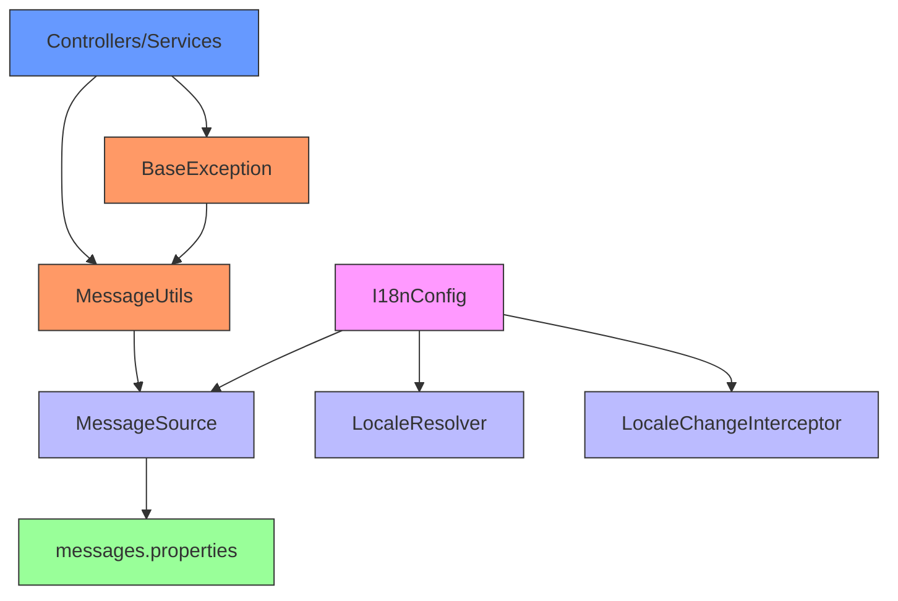
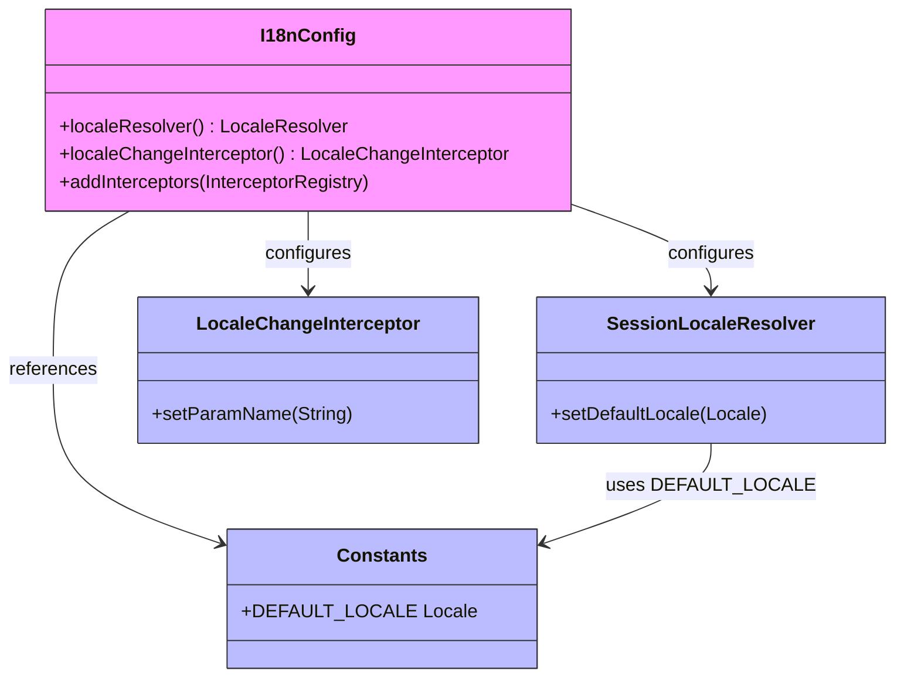

# Internationalization

<cite>
**Referenced Files in This Document**   
- [I18nConfig.java](file://src/main/java/com/ruoyi/framework/config/I18nConfig.java)
- [MessageUtils.java](file://src/main/java/com/ruoyi/common/utils/MessageUtils.java)
- [BaseException.java](file://src/main/java/com/ruoyi/common/exception/base/BaseException.java)
- [Constants.java](file://src/main/java/com/ruoyi/common/constant/Constants.java)
- [messages.properties](file://src/main/resources/i18n/messages.properties)
- [application.yml](file://src/main/resources/application.yml)
</cite>

## Table of Contents
1. [Introduction](#introduction)
2. [Core Components](#core-components)
3. [Architecture Overview](#architecture-overview)
4. [Message Properties Structure](#message-properties-structure)
5. [Message Resolution Process](#message-resolution-process)
6. [Configuration Details](#configuration-details)
7. [Usage Examples](#usage-examples)
8. [Best Practices and Common Issues](#best-practices-and-common-issues)
9. [Conclusion](#conclusion)

## Introduction
The RuoYi-Vue framework implements a comprehensive internationalization (i18n) system that enables multilingual support for both user interface elements and system messages. This documentation provides a detailed analysis of the i18n implementation, focusing on the integration between Spring's message resolution capabilities and the custom utility classes that facilitate localized message retrieval. The system is designed to support dynamic language switching, parameterized messages, and consistent error reporting across the application. By leveraging Spring's MessageSource abstraction and custom configuration, RuoYi-Vue provides a robust foundation for globalized applications.

## Core Components

The internationalization system in RuoYi-Vue consists of several key components that work together to provide localized messages. The primary components include the I18nConfig class for configuration, MessageUtils for message retrieval, BaseException for exception handling with localization, and the messages.properties file for storing localized content. These components form a cohesive system where messages are resolved at runtime based on the current locale, with support for dynamic parameters and fallback mechanisms. The implementation follows Spring's standard i18n patterns while adding custom utilities to simplify message access throughout the codebase.

**Section sources**
- [I18nConfig.java](file://src/main/java/com/ruoyi/framework/config/I18nConfig.java#L1-L43)
- [MessageUtils.java](file://src/main/java/com/ruoyi/common/utils/MessageUtils.java#L1-L26)
- [BaseException.java](file://src/main/java/com/ruoyi/common/exception/base/BaseException.java#L1-L97)
- [messages.properties](file://src/main/resources/i18n/messages.properties#L1-L39)

## Architecture Overview

The internationalization architecture in RuoYi-Vue follows a layered approach where configuration, message resolution, and consumption are separated into distinct components. The system is initialized through Spring configuration that sets up the message source and locale resolution, with message retrieval abstracted through utility classes that can be used throughout the application.



**Diagram sources**
- [I18nConfig.java](file://src/main/java/com/ruoyi/framework/config/I18nConfig.java#L1-L43)
- [MessageUtils.java](file://src/main/java/com/ruoyi/common/utils/MessageUtils.java#L1-L26)
- [BaseException.java](file://src/main/java/com/ruoyi/common/exception/base/BaseException.java#L1-L97)
- [messages.properties](file://src/main/resources/i18n/messages.properties#L1-L39)
- [application.yml](file://src/main/resources/application.yml#L50-L53)

## Message Properties Structure

The message properties in RuoYi-Vue are organized in a hierarchical structure within the messages.properties file, with clear categorization of different message types. The file contains key-value pairs where keys follow a dot-notation convention to represent message categories and specific messages within those categories. The structure includes error messages, validation messages, file upload messages, and permission-related messages, each grouped with appropriate comments for clarity.

The message keys use a consistent naming convention that reflects their purpose and context. For example, user-related messages start with "user." prefix, while validation messages use descriptive keys like "length.not.valid". The system supports parameterized messages using curly brace notation {0}, {1}, etc., which allows dynamic content to be inserted into localized strings at runtime. This enables messages like "password input error {0} times" to display the actual number of failed attempts.

```mermaid
erDiagram
MESSAGES {
string key PK
string value
string category
boolean hasParameters
}
CATEGORY {
string name PK
string description
}
MESSAGES ||--o{ CATEGORY : belongs_to
class MESSAGES <<Entity>>
class CATEGORY <<Entity>>
note right of MESSAGES
Key examples:
- user.jcaptcha.error
- user.password.retry.limit.count
- upload.exceed.maxSize
- no.permission
end note
note left of CATEGORY
Categories:
- Error messages
- Validation
- File upload
- Permissions
- Authentication
end note
```

**Diagram sources**
- [messages.properties](file://src/main/resources/i18n/messages.properties#L1-L39)

## Message Resolution Process

The message resolution process in RuoYi-Vue follows a well-defined sequence of operations that begins with a message request and ends with the return of a localized string. This process involves multiple components working together to retrieve the appropriate message based on the current locale and any provided parameters.

```mermaid
sequenceDiagram
participant Client as "Controller/Service"
participant MessageUtils as "MessageUtils"
participant SpringContext as "Spring Context"
participant MessageSource as "MessageSource"
participant Properties as "messages.properties"
Client->>MessageUtils : message(code, args)
MessageUtils->>SpringContext : getBean(MessageSource.class)
SpringContext-->>MessageUtils : MessageSource instance
MessageUtils->>MessageSource : getMessage(code, args, locale)
MessageSource->>Properties : Load messages.properties
Properties-->>MessageSource : Return message template
MessageSource->>MessageSource : Replace {0},{1} with args
MessageSource-->>MessageUtils : Localized message
MessageUtils-->>Client : Return message string
Note over MessageUtils,MessageSource : Message resolution with<br/>parameter substitution
```

**Diagram sources**
- [MessageUtils.java](file://src/main/java/com/ruoyi/common/utils/MessageUtils.java#L21-L25)
- [I18nConfig.java](file://src/main/java/com/ruoyi/framework/config/I18nConfig.java#L20-L27)

## Configuration Details

The internationalization configuration in RuoYi-Vue is implemented through the I18nConfig class, which sets up the necessary Spring components for message resolution and locale management. The configuration includes three main elements: the locale resolver, the locale change interceptor, and the message source configuration (defined in application.yml).

The SessionLocaleResolver is configured as the default locale resolver, which stores the user's locale in the HTTP session. The default locale is set to Simplified Chinese (zh_CN) through the Constants.DEFAULT_LOCALE constant. A LocaleChangeInterceptor is registered to allow dynamic language switching via a "lang" request parameter. The message source is configured in application.yml to load properties from the i18n/messages base name, which automatically supports language-specific variants (e.g., messages_en.properties for English).



**Diagram sources**
- [I18nConfig.java](file://src/main/java/com/ruoyi/framework/config/I18nConfig.java#L1-L43)
- [Constants.java](file://src/main/java/com/ruoyi/common/constant/Constants.java#L26)
- [application.yml](file://src/main/resources/application.yml#L50-L53)

## Usage Examples

The internationalization system in RuoYi-Vue is used extensively throughout the codebase for both user-facing messages and system exceptions. The primary usage patterns include exception handling with localized messages and direct message retrieval for UI elements.

In exception handling, the BaseException class uses MessageUtils to resolve messages based on message codes. When an exception is thrown, it references a message key (e.g., "user.jcaptcha.error") which is then resolved to the appropriate localized string. This pattern ensures consistent error messaging across the application.

```mermaid
flowchart TD
A[Exception Thrown] --> B{Has Message Code?}
B --> |Yes| C[Call MessageUtils.message(code, args)]
B --> |No| D[Use Default Message]
C --> E[MessageSource Retrieves Template]
E --> F[Substitute Parameters]
F --> G[Return Localized String]
D --> G
G --> H[Display to User]
style A fill:#f96,stroke:#333
style B fill:#ff9,stroke:#333
style C fill:#69f,stroke:#333
style E fill:#69f,stroke:#333
style F fill:#69f,stroke:#333
style G fill:#69f,stroke:#333
style H fill:#9f9,stroke:#333
```

Concrete examples from the codebase include:
- UserNotExistsException using "user.not.exists" message key
- CaptchaException using "user.jcaptcha.error" message key
- Password retry limit messages with dynamic parameters for count and lock time

These examples demonstrate how message keys are used consistently across different exception types, with parameterized messages allowing for dynamic content insertion.

**Diagram sources**
- [BaseException.java](file://src/main/java/com/ruoyi/common/exception/base/BaseException.java#L64-L75)
- [UserNotExistsException.java](file://src/main/java/com/ruoyi/common/exception/user/UserNotExistsException.java#L14)
- [CaptchaException.java](file://src/main/java/com/ruoyi/common/exception/user/CaptchaException.java#L14)
- [messages.properties](file://src/main/resources/i18n/messages.properties#L3-L8)

**Section sources**
- [BaseException.java](file://src/main/java/com/ruoyi/common/exception/base/BaseException.java#L64-L75)
- [MessageUtils.java](file://src/main/java/com/ruoyi/common/utils/MessageUtils.java#L21-L25)
- [messages.properties](file://src/main/resources/i18n/messages.properties#L1-L39)

## Best Practices and Common Issues

Implementing internationalization in RuoYi-Vue requires adherence to several best practices to ensure consistency and maintainability. Key practices include using consistent message key naming conventions, properly handling special characters in properties files, and organizing messages by functional area.

Common issues and their solutions include:
- **Adding new languages**: Create language-specific properties files (e.g., messages_en.properties) with the same keys as the base file
- **Special characters**: Ensure UTF-8 encoding is used and escape special characters properly
- **Message key consistency**: Use a hierarchical naming convention (e.g., module.feature.message) to avoid conflicts
- **Parameter management**: Document the number and meaning of parameters for each parameterized message

The system handles missing message keys by falling back to the defaultMessage parameter in exceptions, providing a safety net for incomplete translations. For optimal maintainability, it's recommended to group related messages together in the properties file and use comments to document the purpose and parameters of each message.

**Section sources**
- [messages.properties](file://src/main/resources/i18n/messages.properties#L1-L39)
- [BaseException.java](file://src/main/java/com/ruoyi/common/exception/base/BaseException.java#L70-L74)

## Conclusion

The internationalization system in RuoYi-Vue provides a robust and flexible foundation for multilingual applications. By leveraging Spring's built-in i18n capabilities and extending them with custom utilities, the framework enables consistent message handling across the entire application. The system's architecture separates configuration, resolution, and consumption concerns, making it easy to maintain and extend. Key strengths include support for dynamic language switching, parameterized messages, and seamless integration with exception handling. For developers, following the established patterns for message key naming and proper use of the MessageUtils class ensures consistency and maintainability of localized content.