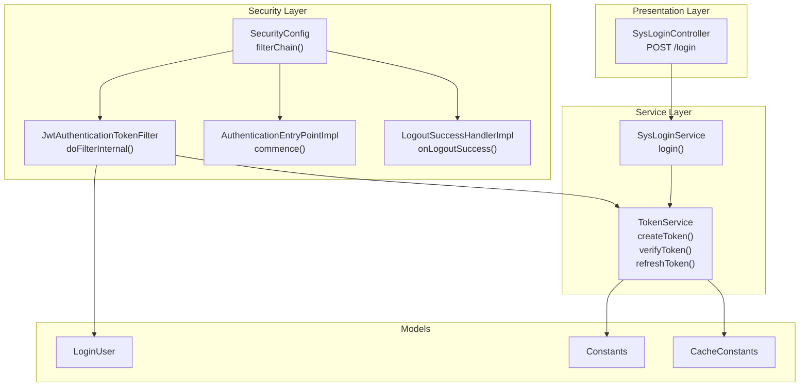
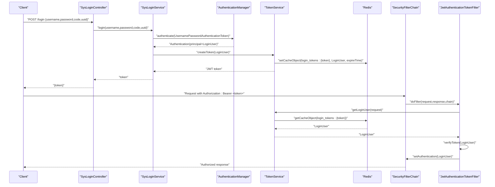
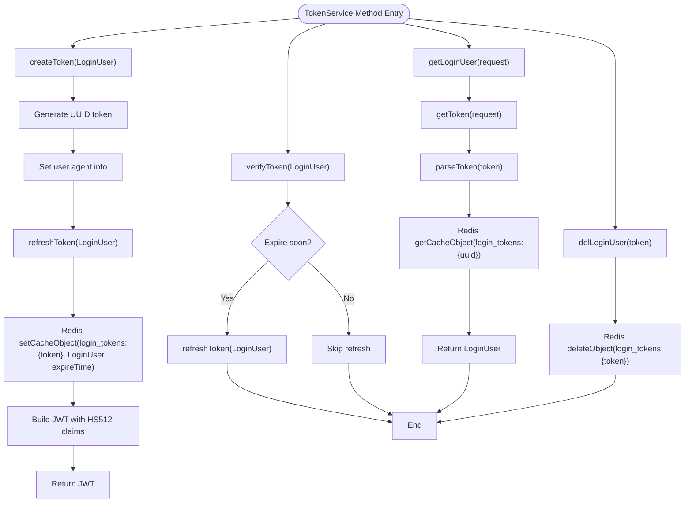
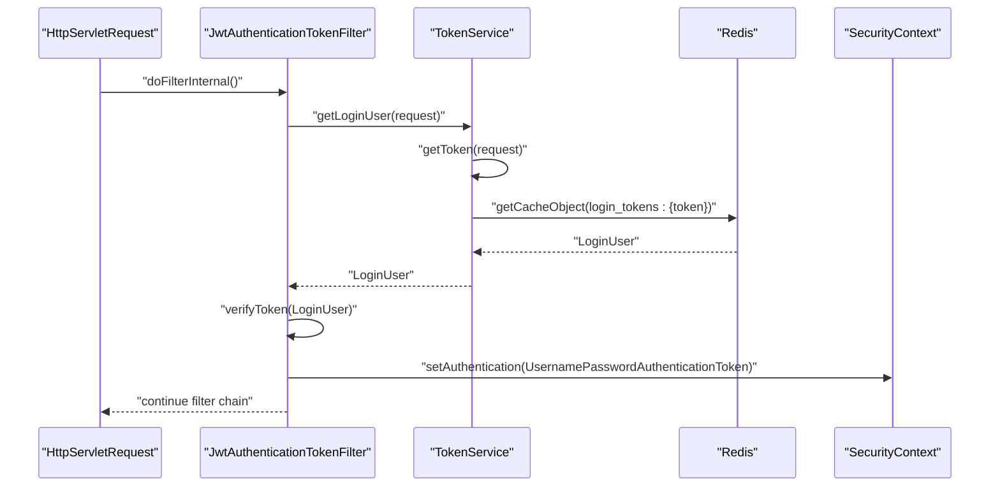
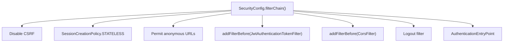
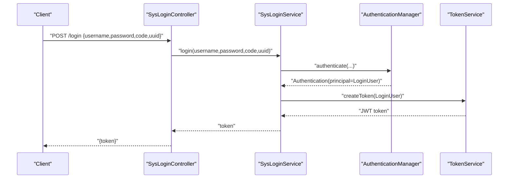
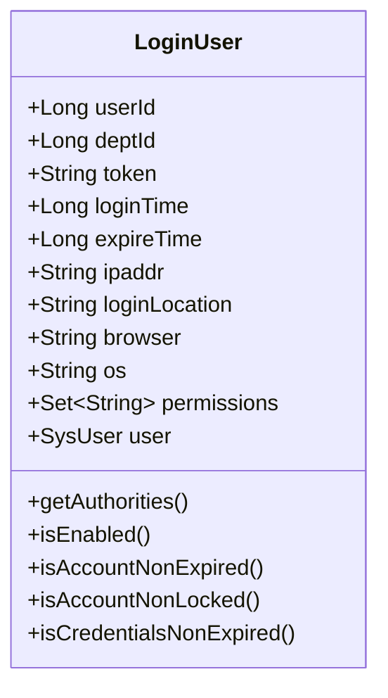
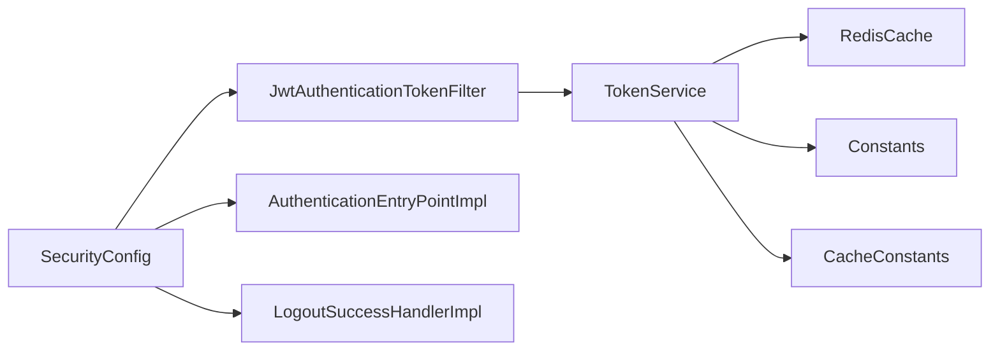

# Authentication (JWT)

<cite>
**Referenced Files in This Document**
- [application.yml](file://src/main/resources/application.yml)
- [SecurityConfig.java](file://src/main/java/com/ruoyi/framework/config/SecurityConfig.java)
- [JwtAuthenticationTokenFilter.java](file://src/main/java/com/ruoyi/framework/security/filter/JwtAuthenticationTokenFilter.java)
- [TokenService.java](file://src/main/java/com/ruoyi/framework/security/service/TokenService.java)
- [SysLoginService.java](file://src/main/java/com/ruoyi/framework/security/service/SysLoginService.java)
- [SysLoginController.java](file://src/main/java/com/ruoyi/project/system/controller/SysLoginController.java)
- [LoginUser.java](file://src/main/java/com/ruoyi/framework/security/LoginUser.java)
- [Constants.java](file://src/main/java/com/ruoyi/common/constant/Constants.java)
- [CacheConstants.java](file://src/main/java/com/ruoyi/common/constant/CacheConstants.java)
- [LogoutSuccessHandlerImpl.java](file://src/main/java/com/ruoyi/framework/security/handle/LogoutSuccessHandlerImpl.java)
- [AuthenticationEntryPointImpl.java](file://src/main/java/com/ruoyi/framework/security/handle/AuthenticationEntryPointImpl.java)
- [SwaggerConfig.java](file://src/main/java/com/ruoyi/framework/config/SwaggerConfig.java)
</cite>

## Table of Contents
1. [Introduction](#introduction)
2. [Project Structure](#project-structure)
3. [Core Components](#core-components)
4. [Architecture Overview](#architecture-overview)
5. [Detailed Component Analysis](#detailed-component-analysis)
6. [Dependency Analysis](#dependency-analysis)
7. [Performance Considerations](#performance-considerations)
8. [Troubleshooting Guide](#troubleshooting-guide)
9. [Conclusion](#conclusion)
10. [Appendices](#appendices)

## Introduction
This document explains the JWT authentication implementation in RuoYi-Vue. It covers the complete authentication flow from login to token validation, detailing how tokens are generated, stored, and verified. It also documents the TokenService class methods for creating, verifying, and refreshing tokens, the JwtAuthenticationTokenFilter role in intercepting requests and setting Spring Security context, and the configuration options from application.yml. Finally, it provides integration insights between SecurityConfig’s filter chain and the JWT filter, along with common issues and best practices.

## Project Structure
The JWT authentication spans several packages:
- Configuration: SecurityConfig defines the filter chain and security policies.
- Filters: JwtAuthenticationTokenFilter extracts tokens from headers and sets authentication.
- Services: TokenService handles token creation, parsing, verification, and Redis caching.
- Controllers: SysLoginController exposes the login endpoint and returns tokens.
- Models: LoginUser encapsulates user identity and authorities.
- Constants: Constants and CacheConstants define token-related keys and prefixes.

**Diagram sources**
- [SecurityConfig.java](file://src/main/java/com/ruoyi/framework/config/SecurityConfig.java#L97-L129)
- [JwtAuthenticationTokenFilter.java](file://src/main/java/com/ruoyi/framework/security/filter/JwtAuthenticationTokenFilter.java#L30-L43)
- [TokenService.java](file://src/main/java/com/ruoyi/framework/security/service/TokenService.java#L114-L155)
- [SysLoginService.java](file://src/main/java/com/ruoyi/framework/security/service/SysLoginService.java#L63-L100)
- [SysLoginController.java](file://src/main/java/com/ruoyi/project/system/controller/SysLoginController.java#L56-L65)
- [LoginUser.java](file://src/main/java/com/ruoyi/framework/security/LoginUser.java#L15-L266)
- [Constants.java](file://src/main/java/com/ruoyi/common/constant/Constants.java#L103-L122)
- [CacheConstants.java](file://src/main/java/com/ruoyi/common/constant/CacheConstants.java#L11-L14)
- [AuthenticationEntryPointImpl.java](file://src/main/java/com/ruoyi/framework/security/handle/AuthenticationEntryPointImpl.java#L26-L33)
- [LogoutSuccessHandlerImpl.java](file://src/main/java/com/ruoyi/framework/security/handle/LogoutSuccessHandlerImpl.java#L37-L51)

**Section sources**
- [SecurityConfig.java](file://src/main/java/com/ruoyi/framework/config/SecurityConfig.java#L97-L129)
- [JwtAuthenticationTokenFilter.java](file://src/main/java/com/ruoyi/framework/security/filter/JwtAuthenticationTokenFilter.java#L30-L43)
- [TokenService.java](file://src/main/java/com/ruoyi/framework/security/service/TokenService.java#L114-L155)
- [SysLoginService.java](file://src/main/java/com/ruoyi/framework/security/service/SysLoginService.java#L63-L100)
- [SysLoginController.java](file://src/main/java/com/ruoyi/project/system/controller/SysLoginController.java#L56-L65)
- [LoginUser.java](file://src/main/java/com/ruoyi/framework/security/LoginUser.java#L15-L266)
- [Constants.java](file://src/main/java/com/ruoyi/common/constant/Constants.java#L103-L122)
- [CacheConstants.java](file://src/main/java/com/ruoyi/common/constant/CacheConstants.java#L11-L14)
- [AuthenticationEntryPointImpl.java](file://src/main/java/com/ruoyi/framework/security/handle/AuthenticationEntryPointImpl.java#L26-L33)
- [LogoutSuccessHandlerImpl.java](file://src/main/java/com/ruoyi/framework/security/handle/LogoutSuccessHandlerImpl.java#L37-L51)

## Core Components
- TokenService: Central JWT and Redis token management utility. Methods include createToken, verifyToken, refreshToken, getLoginUser, delLoginUser, and internal helpers for token parsing and extraction.
- JwtAuthenticationTokenFilter: Intercepts HTTP requests, extracts tokens from headers, validates them, and sets Spring Security context with the authenticated user.
- SecurityConfig: Defines the filter chain, disables CSRF, sets stateless sessions, permits anonymous access to specific endpoints, adds JWT filter before UsernamePasswordAuthenticationFilter, and registers CORS and logout handlers.
- SysLoginService: Orchestrates login by authenticating credentials, preparing LoginUser, and delegating token creation to TokenService.
- SysLoginController: Exposes POST /login to authenticate and return a JWT token.
- LoginUser: Implements UserDetails and carries user identity, permissions, and token metadata.
- Constants and CacheConstants: Define token header, prefix, claim keys, and Redis cache keys.

**Section sources**
- [TokenService.java](file://src/main/java/com/ruoyi/framework/security/service/TokenService.java#L114-L155)
- [JwtAuthenticationTokenFilter.java](file://src/main/java/com/ruoyi/framework/security/filter/JwtAuthenticationTokenFilter.java#L30-L43)
- [SecurityConfig.java](file://src/main/java/com/ruoyi/framework/config/SecurityConfig.java#L97-L129)
- [SysLoginService.java](file://src/main/java/com/ruoyi/framework/security/service/SysLoginService.java#L63-L100)
- [SysLoginController.java](file://src/main/java/com/ruoyi/project/system/controller/SysLoginController.java#L56-L65)
- [LoginUser.java](file://src/main/java/com/ruoyi/framework/security/LoginUser.java#L15-L266)
- [Constants.java](file://src/main/java/com/ruoyi/common/constant/Constants.java#L103-L122)
- [CacheConstants.java](file://src/main/java/com/ruoyi/common/constant/CacheConstants.java#L11-L14)

## Architecture Overview
The authentication flow integrates Spring Security filters with JWT and Redis:
- Client sends credentials to POST /login.
- SysLoginController delegates to SysLoginService.
- SysLoginService authenticates via AuthenticationManager and obtains LoginUser.
- SysLoginService asks TokenService to create a JWT token and persist user data in Redis.
- Client stores the returned token and sends it in the Authorization header for subsequent requests.
- JwtAuthenticationTokenFilter intercepts requests, extracts the token, validates it, loads LoginUser from Redis, and sets authentication in SecurityContext.
- SecurityConfig enforces stateless sessions and permits-lists endpoints.

**Diagram sources**
- [SysLoginController.java](file://src/main/java/com/ruoyi/project/system/controller/SysLoginController.java#L56-L65)
- [SysLoginService.java](file://src/main/java/com/ruoyi/framework/security/service/SysLoginService.java#L63-L100)
- [TokenService.java](file://src/main/java/com/ruoyi/framework/security/service/TokenService.java#L114-L155)
- [JwtAuthenticationTokenFilter.java](file://src/main/java/com/ruoyi/framework/security/filter/JwtAuthenticationTokenFilter.java#L30-L43)
- [SecurityConfig.java](file://src/main/java/com/ruoyi/framework/config/SecurityConfig.java#L97-L129)

## Detailed Component Analysis

### TokenService: Token Lifecycle and Storage
TokenService manages JWT creation, parsing, and Redis-backed user storage:
- createToken(LoginUser): Generates a random token, sets it on LoginUser, collects user agent info, persists LoginUser in Redis under a cache key, and builds a signed JWT with HS512 containing user claims.
- verifyToken(LoginUser): Checks remaining validity and refreshes Redis TTL if within a threshold window.
- refreshToken(LoginUser): Updates login/expiry timestamps and renews Redis cache entry with configured expiry minutes.
- getLoginUser(HttpServletRequest): Extracts token from header, parses JWT claims, retrieves LoginUser from Redis by token key, and returns it.
- delLoginUser(String): Removes Redis cache entry for a token.
- Internal helpers: createToken(Map), parseToken(String), getUsernameFromToken(String), getToken(HttpServletRequest), getTokenKey(String).

**Diagram sources**
- [TokenService.java](file://src/main/java/com/ruoyi/framework/security/service/TokenService.java#L114-L155)
- [TokenService.java](file://src/main/java/com/ruoyi/framework/security/service/TokenService.java#L62-L106)
- [TokenService.java](file://src/main/java/com/ruoyi/framework/security/service/TokenService.java#L172-L209)
- [TokenService.java](file://src/main/java/com/ruoyi/framework/security/service/TokenService.java#L212-L232)
- [CacheConstants.java](file://src/main/java/com/ruoyi/common/constant/CacheConstants.java#L11-L14)
- [Constants.java](file://src/main/java/com/ruoyi/common/constant/Constants.java#L103-L122)

**Section sources**
- [TokenService.java](file://src/main/java/com/ruoyi/framework/security/service/TokenService.java#L114-L155)
- [TokenService.java](file://src/main/java/com/ruoyi/framework/security/service/TokenService.java#L62-L106)
- [TokenService.java](file://src/main/java/com/ruoyi/framework/security/service/TokenService.java#L172-L209)
- [TokenService.java](file://src/main/java/com/ruoyi/framework/security/service/TokenService.java#L212-L232)
- [CacheConstants.java](file://src/main/java/com/ruoyi/common/constant/CacheConstants.java#L11-L14)
- [Constants.java](file://src/main/java/com/ruoyi/common/constant/Constants.java#L103-L122)

### JwtAuthenticationTokenFilter: Request Interception and Authentication Setting
JwtAuthenticationTokenFilter runs before UsernamePasswordAuthenticationFilter in the filter chain:
- doFilterInternal: Extracts token from Authorization header, loads LoginUser from Redis via TokenService, verifies token expiry, constructs UsernamePasswordAuthenticationToken with authorities, and sets it in SecurityContext if absent.

**Diagram sources**
- [JwtAuthenticationTokenFilter.java](file://src/main/java/com/ruoyi/framework/security/filter/JwtAuthenticationTokenFilter.java#L30-L43)
- [TokenService.java](file://src/main/java/com/ruoyi/framework/security/service/TokenService.java#L62-L106)
- [TokenService.java](file://src/main/java/com/ruoyi/framework/security/service/TokenService.java#L133-L141)

**Section sources**
- [JwtAuthenticationTokenFilter.java](file://src/main/java/com/ruoyi/framework/security/filter/JwtAuthenticationTokenFilter.java#L30-L43)
- [TokenService.java](file://src/main/java/com/ruoyi/framework/security/service/TokenService.java#L62-L106)
- [TokenService.java](file://src/main/java/com/ruoyi/framework/security/service/TokenService.java#L133-L141)

### SecurityConfig: Filter Chain and Policies
SecurityConfig configures:
- Stateless session policy.
- Permit-all for specific URLs and anonymous endpoints.
- Adds JwtAuthenticationTokenFilter before UsernamePasswordAuthenticationFilter.
- Registers CORS filter and logout handler.
- Sets AuthenticationEntryPoint for unauthenticated requests.

**Diagram sources**
- [SecurityConfig.java](file://src/main/java/com/ruoyi/framework/config/SecurityConfig.java#L97-L129)

**Section sources**
- [SecurityConfig.java](file://src/main/java/com/ruoyi/framework/config/SecurityConfig.java#L97-L129)

### SysLoginController and SysLoginService: Login Flow
- SysLoginController exposes POST /login that accepts LoginBody and returns a token.
- SysLoginService authenticates credentials, records login info, and delegates token creation to TokenService.

**Diagram sources**
- [SysLoginController.java](file://src/main/java/com/ruoyi/project/system/controller/SysLoginController.java#L56-L65)
- [SysLoginService.java](file://src/main/java/com/ruoyi/framework/security/service/SysLoginService.java#L63-L100)
- [TokenService.java](file://src/main/java/com/ruoyi/framework/security/service/TokenService.java#L114-L155)

**Section sources**
- [SysLoginController.java](file://src/main/java/com/ruoyi/project/system/controller/SysLoginController.java#L56-L65)
- [SysLoginService.java](file://src/main/java/com/ruoyi/framework/security/service/SysLoginService.java#L63-L100)
- [TokenService.java](file://src/main/java/com/ruoyi/framework/security/service/TokenService.java#L114-L155)

### LoginUser: User Identity Model
LoginUser implements UserDetails and holds:
- Token, login time, expiry time, IP, location, browser, OS.
- Permissions and underlying SysUser.
- Authorities method returning null (permissions managed elsewhere).

**Diagram sources**
- [LoginUser.java](file://src/main/java/com/ruoyi/framework/security/LoginUser.java#L15-L266)

**Section sources**
- [LoginUser.java](file://src/main/java/com/ruoyi/framework/security/LoginUser.java#L15-L266)

### Configuration: application.yml
Key JWT-related settings:
- token.header: Header name for the token (default "Authorization").
- token.secret: Secret key used to sign JWTs.
- token.expireTime: Token expiry in minutes (default 30).

These values are injected into TokenService and used to build and validate JWTs and manage Redis TTL.

**Section sources**
- [application.yml](file://src/main/resources/application.yml#L91-L99)
- [TokenService.java](file://src/main/java/com/ruoyi/framework/security/service/TokenService.java#L36-L46)
- [Constants.java](file://src/main/java/com/ruoyi/common/constant/Constants.java#L103-L122)
- [CacheConstants.java](file://src/main/java/com/ruoyi/common/constant/CacheConstants.java#L11-L14)

### Swagger Integration
SwaggerConfig configures API key security scheme to pass token via the Authorization header, aligning with the JWT filter’s expectations.

**Section sources**
- [SwaggerConfig.java](file://src/main/java/com/ruoyi/framework/config/SwaggerConfig.java#L70-L80)

## Dependency Analysis
TokenService depends on:
- RedisCache for storing LoginUser keyed by login_tokens:{token}.
- Constants for claim keys and token prefix.
- CacheConstants for the Redis key prefix.
- TokenService uses HS512 signing and parses tokens with the configured secret.

JwtAuthenticationTokenFilter depends on:
- TokenService for extracting and validating tokens.
- SecurityUtils and StringUtils for context checks.

SecurityConfig depends on:
- JwtAuthenticationTokenFilter, CORS filter, logout handler, and authentication entry point.

**Diagram sources**
- [TokenService.java](file://src/main/java/com/ruoyi/framework/security/service/TokenService.java#L114-L155)
- [JwtAuthenticationTokenFilter.java](file://src/main/java/com/ruoyi/framework/security/filter/JwtAuthenticationTokenFilter.java#L30-L43)
- [SecurityConfig.java](file://src/main/java/com/ruoyi/framework/config/SecurityConfig.java#L97-L129)
- [Constants.java](file://src/main/java/com/ruoyi/common/constant/Constants.java#L103-L122)
- [CacheConstants.java](file://src/main/java/com/ruoyi/common/constant/CacheConstants.java#L11-L14)

**Section sources**
- [TokenService.java](file://src/main/java/com/ruoyi/framework/security/service/TokenService.java#L114-L155)
- [JwtAuthenticationTokenFilter.java](file://src/main/java/com/ruoyi/framework/security/filter/JwtAuthenticationTokenFilter.java#L30-L43)
- [SecurityConfig.java](file://src/main/java/com/ruoyi/framework/config/SecurityConfig.java#L97-L129)
- [Constants.java](file://src/main/java/com/ruoyi/common/constant/Constants.java#L103-L122)
- [CacheConstants.java](file://src/main/java/com/ruoyi/common/constant/CacheConstants.java#L11-L14)

## Performance Considerations
- Token verification threshold: verifyToken refreshes Redis only when expiry is within a short window, reducing unnecessary writes.
- Redis TTL alignment: Redis entries expire with the token duration, minimizing stale data.
- Stateless design: No session overhead; authentication relies on JWT and Redis cache lookups.
- Token signing algorithm: HS512 is used; ensure secret rotation and secure storage in production.

[No sources needed since this section provides general guidance]

## Troubleshooting Guide
Common issues and resolutions:
- Token not found or invalid:
  - Ensure Authorization header uses the configured header name and includes the configured prefix.
  - Confirm token.secret matches the signing secret used during creation.
- Token expired:
  - The system refreshes Redis TTL near expiry; if the token is truly expired, re-authenticate to obtain a new token.
- Authentication failure:
  - AuthenticationEntryPointImpl returns a standardized unauthorized response; verify credentials and that the user is enabled.
- Logout not clearing token:
  - LogoutSuccessHandlerImpl deletes the Redis cache entry for the token; confirm the token was present and the request included the Authorization header.

**Section sources**
- [JwtAuthenticationTokenFilter.java](file://src/main/java/com/ruoyi/framework/security/filter/JwtAuthenticationTokenFilter.java#L30-L43)
- [TokenService.java](file://src/main/java/com/ruoyi/framework/security/service/TokenService.java#L62-L106)
- [AuthenticationEntryPointImpl.java](file://src/main/java/com/ruoyi/framework/security/handle/AuthenticationEntryPointImpl.java#L26-L33)
- [LogoutSuccessHandlerImpl.java](file://src/main/java/com/ruoyi/framework/security/handle/LogoutSuccessHandlerImpl.java#L37-L51)

## Conclusion
RuoYi-Vue’s JWT authentication combines Spring Security filters with JWT and Redis for stateless, scalable authentication. TokenService centralizes token creation, validation, and Redis persistence. JwtAuthenticationTokenFilter integrates seamlessly into the SecurityConfig filter chain to extract tokens from headers and set authentication context. Configuration in application.yml controls header names, secrets, and expiry windows. Following the outlined best practices ensures robust token lifecycle management and secure operation.

[No sources needed since this section summarizes without analyzing specific files]

## Appendices

### Configuration Options Reference
- token.header: Name of the HTTP header carrying the token (default "Authorization").
- token.secret: Secret used to sign JWTs.
- token.expireTime: Token lifetime in minutes.

**Section sources**
- [application.yml](file://src/main/resources/application.yml#L91-L99)

### Integration Notes: SecurityConfig and JWT Filter
- The JWT filter is inserted before UsernamePasswordAuthenticationFilter so it can set authentication prior to form-based processing.
- CORS filter is added before JWT and Logout filters to ensure cross-origin requests are handled consistently.

**Section sources**
- [SecurityConfig.java](file://src/main/java/com/ruoyi/framework/config/SecurityConfig.java#L121-L129)