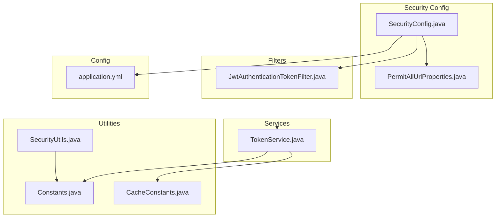
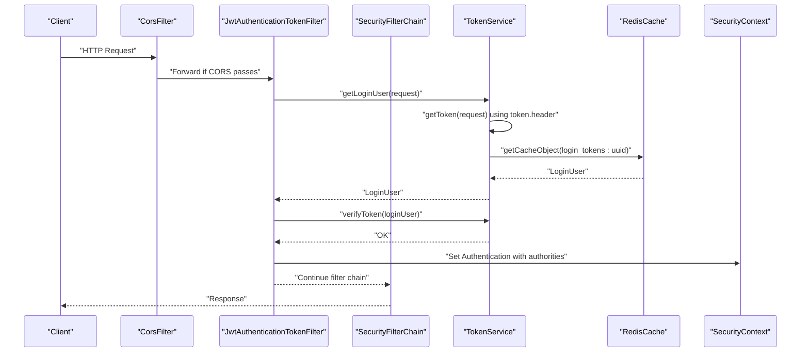
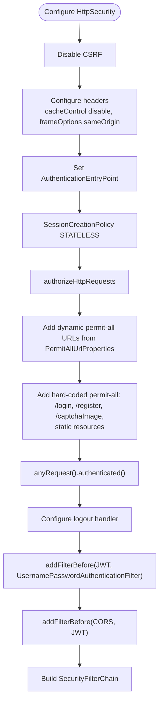
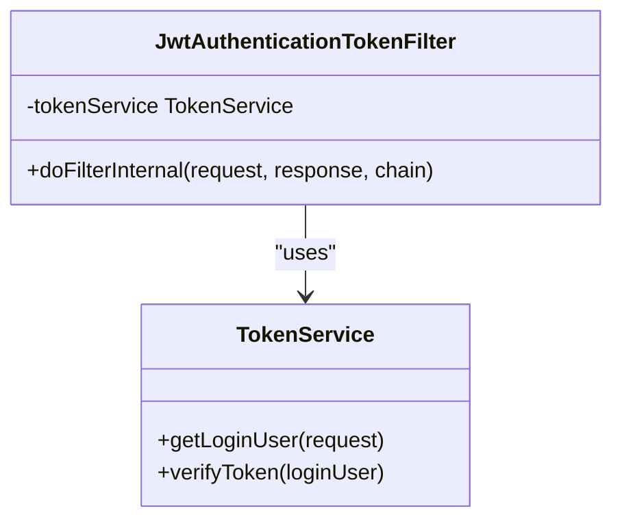
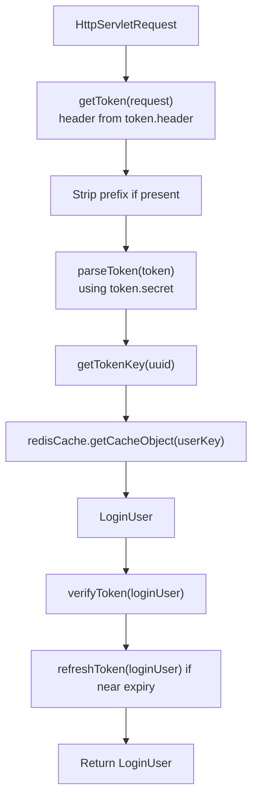
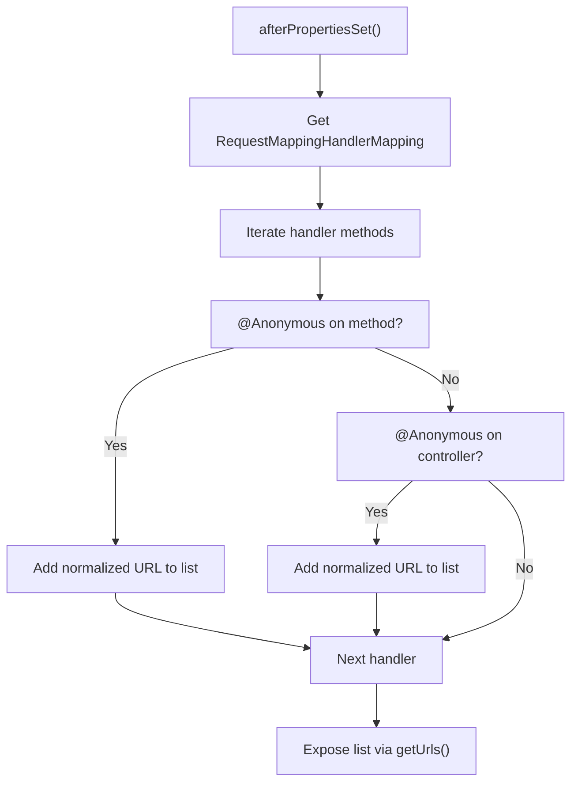
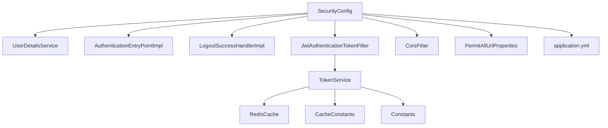

# Security Configuration

<cite>
**Referenced Files in This Document**
- [SecurityConfig.java](file://src/main/java/com/ruoyi/framework/config/SecurityConfig.java)
- [JwtAuthenticationTokenFilter.java](file://src/main/java/com/ruoyi/framework/security/filter/JwtAuthenticationTokenFilter.java)
- [PermitAllUrlProperties.java](file://src/main/java/com/ruoyi/framework/config/properties/PermitAllUrlProperties.java)
- [TokenService.java](file://src/main/java/com/ruoyi/framework/security/service/TokenService.java)
- [application.yml](file://src/main/resources/application.yml)
- [Constants.java](file://src/main/java/com/ruoyi/common/constant/Constants.java)
- [CacheConstants.java](file://src/main/java/com/ruoyi/common/constant/CacheConstants.java)
- [SecurityUtils.java](file://src/main/java/com/ruoyi/common/utils/SecurityUtils.java)
</cite>

## Table of Contents
1. [Introduction](#introduction)
2. [Project Structure](#project-structure)
3. [Core Components](#core-components)
4. [Architecture Overview](#architecture-overview)
5. [Detailed Component Analysis](#detailed-component-analysis)
6. [Dependency Analysis](#dependency-analysis)
7. [Performance Considerations](#performance-considerations)
8. [Troubleshooting Guide](#troubleshooting-guide)
9. [Conclusion](#conclusion)

## Introduction
This document explains the Spring Security configuration that enables JWT-based authentication in RuoYi-Vue. It covers how the configuration establishes a stateless security context, disables CSRF protection, configures the filter chain order, defines permit-all rules (both hard-coded and dynamically discovered), and integrates method-level security annotations. It also details how configuration values from application.yml (such as token.header) are injected into the security components and how the authentication manager is built using DaoAuthenticationProvider with BCryptPasswordEncoder.

## Project Structure
Security-related components are organized under framework packages:
- Configuration: SecurityConfig, PermitAllUrlProperties
- Filters: JwtAuthenticationTokenFilter
- Services: TokenService
- Utilities: SecurityUtils
- Constants: Constants, CacheConstants
- Application configuration: application.yml

**Diagram sources**
- [SecurityConfig.java](file://src/main/java/com/ruoyi/framework/config/SecurityConfig.java#L96-L129)
- [PermitAllUrlProperties.java](file://src/main/java/com/ruoyi/framework/config/properties/PermitAllUrlProperties.java#L1-L74)
- [JwtAuthenticationTokenFilter.java](file://src/main/java/com/ruoyi/framework/security/filter/JwtAuthenticationTokenFilter.java#L1-L45)
- [TokenService.java](file://src/main/java/com/ruoyi/framework/security/service/TokenService.java#L1-L233)
- [Constants.java](file://src/main/java/com/ruoyi/common/constant/Constants.java#L1-L174)
- [CacheConstants.java](file://src/main/java/com/ruoyi/common/constant/CacheConstants.java#L1-L45)
- [application.yml](file://src/main/resources/application.yml#L91-L100)

**Section sources**
- [SecurityConfig.java](file://src/main/java/com/ruoyi/framework/config/SecurityConfig.java#L96-L129)
- [PermitAllUrlProperties.java](file://src/main/java/com/ruoyi/framework/config/properties/PermitAllUrlProperties.java#L1-L74)
- [JwtAuthenticationTokenFilter.java](file://src/main/java/com/ruoyi/framework/security/filter/JwtAuthenticationTokenFilter.java#L1-L45)
- [TokenService.java](file://src/main/java/com/ruoyi/framework/security/service/TokenService.java#L1-L233)
- [application.yml](file://src/main/resources/application.yml#L91-L100)
- [Constants.java](file://src/main/java/com/ruoyi/common/constant/Constants.java#L1-L174)
- [CacheConstants.java](file://src/main/java/com/ruoyi/common/constant/CacheConstants.java#L1-L45)
- [SecurityUtils.java](file://src/main/java/com/ruoyi/common/utils/SecurityUtils.java#L1-L177)

## Core Components
- SecurityConfig: Defines stateless session policy, disables CSRF, configures authorizeHttpRequests with permit-all rules, and orders filters (CORS before JWT, JWT before UsernamePasswordAuthenticationFilter).
- JwtAuthenticationTokenFilter: Extracts token from request, validates it, and populates SecurityContext with authorities.
- TokenService: Reads token.header from application.yml, parses tokens, retrieves user from Redis cache, and verifies expiration.
- PermitAllUrlProperties: Scans @Anonymous-annotated controllers/methods to build a dynamic list of permit-all URLs.
- Constants and CacheConstants: Provide token prefix and Redis keys used by TokenService.
- SecurityUtils: Utility for accessing current Authentication and user details.
- application.yml: Provides token.header, token.secret, and token.expireTime.

**Section sources**
- [SecurityConfig.java](file://src/main/java/com/ruoyi/framework/config/SecurityConfig.java#L96-L129)
- [JwtAuthenticationTokenFilter.java](file://src/main/java/com/ruoyi/framework/security/filter/JwtAuthenticationTokenFilter.java#L1-L45)
- [TokenService.java](file://src/main/java/com/ruoyi/framework/security/service/TokenService.java#L36-L47)
- [PermitAllUrlProperties.java](file://src/main/java/com/ruoyi/framework/config/properties/PermitAllUrlProperties.java#L38-L56)
- [Constants.java](file://src/main/java/com/ruoyi/common/constant/Constants.java#L103-L112)
- [CacheConstants.java](file://src/main/java/com/ruoyi/common/constant/CacheConstants.java#L10-L14)
- [SecurityUtils.java](file://src/main/java/com/ruoyi/common/utils/SecurityUtils.java#L83-L90)
- [application.yml](file://src/main/resources/application.yml#L91-L100)

## Architecture Overview
The security architecture enforces stateless JWT authentication:
- Stateless session policy prevents server-side session storage.
- CSRF is disabled because tokens are used instead of cookies.
- CORS filter runs before JWT filter to ensure cross-origin requests are handled prior to token validation.
- JwtAuthenticationTokenFilter reads Authorization header, extracts token, validates it, and sets Authentication in SecurityContext.
- Permit-all rules include dynamic URLs annotated with @Anonymous and hard-coded paths for login/register/captcha and static resources.

**Diagram sources**
- [SecurityConfig.java](file://src/main/java/com/ruoyi/framework/config/SecurityConfig.java#L96-L129)
- [JwtAuthenticationTokenFilter.java](file://src/main/java/com/ruoyi/framework/security/filter/JwtAuthenticationTokenFilter.java#L30-L43)
- [TokenService.java](file://src/main/java/com/ruoyi/framework/security/service/TokenService.java#L62-L83)
- [CacheConstants.java](file://src/main/java/com/ruoyi/common/constant/CacheConstants.java#L10-L14)
- [Constants.java](file://src/main/java/com/ruoyi/common/constant/Constants.java#L103-L112)

## Detailed Component Analysis

### SecurityConfig: Statelessness, CSRF, Session Management, and Filter Chain
- Statelessness: sessionManagement().sessionCreationPolicy(STATELESS) ensures no session is created or used.
- CSRF disabled: csrf().disable() aligns with stateless JWT usage.
- Permit-all rules:
  - Dynamic: permitAllUrl.getUrls() iterates URLs discovered via @Anonymous annotations.
  - Hard-coded: explicit antMatchers for /login, /register, /captchaImage, and static resources.
- Method-level security: @EnableMethodSecurity(prePostEnabled = true, securedEnabled = true) enables @PreAuthorize/@PostAuthorize and @Secured.
- Filter chain ordering:
  - addFilterBefore(corsFilter, JwtAuthenticationTokenFilter.class)
  - addFilterBefore(authenticationTokenFilter, UsernamePasswordAuthenticationFilter.class)
  - addFilterBefore(corsFilter, LogoutFilter.class)
- AuthenticationManager: Built with DaoAuthenticationProvider using userDetailsService and BCryptPasswordEncoder bean.

**Diagram sources**
- [SecurityConfig.java](file://src/main/java/com/ruoyi/framework/config/SecurityConfig.java#L96-L129)
- [PermitAllUrlProperties.java](file://src/main/java/com/ruoyi/framework/config/properties/PermitAllUrlProperties.java#L38-L56)

**Section sources**
- [SecurityConfig.java](file://src/main/java/com/ruoyi/framework/config/SecurityConfig.java#L96-L129)
- [SecurityConfig.java](file://src/main/java/com/ruoyi/framework/config/SecurityConfig.java#L72-L79)
- [SecurityConfig.java](file://src/main/java/com/ruoyi/framework/config/SecurityConfig.java#L29-L30)

### JwtAuthenticationTokenFilter: Token Extraction and SecurityContext Population
- Extracts token from Authorization header using token.header value.
- Validates token via TokenService and sets Authentication in SecurityContext if absent.
- Uses LoginUser’s authorities to populate the Authentication object.

**Diagram sources**
- [JwtAuthenticationTokenFilter.java](file://src/main/java/com/ruoyi/framework/security/filter/JwtAuthenticationTokenFilter.java#L1-L45)
- [TokenService.java](file://src/main/java/com/ruoyi/framework/security/service/TokenService.java#L62-L83)

**Section sources**
- [JwtAuthenticationTokenFilter.java](file://src/main/java/com/ruoyi/framework/security/filter/JwtAuthenticationTokenFilter.java#L30-L43)
- [TokenService.java](file://src/main/java/com/ruoyi/framework/security/service/TokenService.java#L62-L83)

### TokenService: Header, Secret, and Expiration Injection
- Injects token.header, token.secret, and token.expireTime from application.yml.
- Extracts token from request header, strips prefix, and parses JWT claims.
- Retrieves LoginUser from Redis using CacheConstants.LOGIN_TOKEN_KEY + uuid.
- Verifies token expiration and refreshes Redis TTL when nearing expiry.

**Diagram sources**
- [TokenService.java](file://src/main/java/com/ruoyi/framework/security/service/TokenService.java#L36-L47)
- [TokenService.java](file://src/main/java/com/ruoyi/framework/security/service/TokenService.java#L212-L226)
- [TokenService.java](file://src/main/java/com/ruoyi/framework/security/service/TokenService.java#L133-L141)
- [TokenService.java](file://src/main/java/com/ruoyi/framework/security/service/TokenService.java#L148-L155)
- [CacheConstants.java](file://src/main/java/com/ruoyi/common/constant/CacheConstants.java#L10-L14)
- [Constants.java](file://src/main/java/com/ruoyi/common/constant/Constants.java#L103-L112)

**Section sources**
- [TokenService.java](file://src/main/java/com/ruoyi/framework/security/service/TokenService.java#L36-L47)
- [TokenService.java](file://src/main/java/com/ruoyi/framework/security/service/TokenService.java#L212-L226)
- [TokenService.java](file://src/main/java/com/ruoyi/framework/security/service/TokenService.java#L133-L141)
- [TokenService.java](file://src/main/java/com/ruoyi/framework/security/service/TokenService.java#L148-L155)
- [application.yml](file://src/main/resources/application.yml#L91-L100)

### PermitAllUrlProperties: Dynamic Permit-All Discovery
- Scans RequestMappingHandlerMapping for @Anonymous annotations on methods and controllers.
- Normalizes path variables to asterisks and collects URL patterns.
- SecurityConfig consumes this list via permitAllUrl.getUrls().

**Diagram sources**
- [PermitAllUrlProperties.java](file://src/main/java/com/ruoyi/framework/config/properties/PermitAllUrlProperties.java#L38-L56)
- [SecurityConfig.java](file://src/main/java/com/ruoyi/framework/config/SecurityConfig.java#L111-L113)

**Section sources**
- [PermitAllUrlProperties.java](file://src/main/java/com/ruoyi/framework/config/properties/PermitAllUrlProperties.java#L38-L56)
- [SecurityConfig.java](file://src/main/java/com/ruoyi/framework/config/SecurityConfig.java#L111-L113)

### Method-Level Security Annotations
- @EnableMethodSecurity(prePostEnabled = true, securedEnabled = true) enables:
  - @PreAuthorize, @PostAuthorize for method-level access control.
  - @Secured for role-based method-level restrictions.

**Section sources**
- [SecurityConfig.java](file://src/main/java/com/ruoyi/framework/config/SecurityConfig.java#L29-L30)

### Authentication Manager and Password Encoding
- AuthenticationManager bean created with ProviderManager and a single DaoAuthenticationProvider.
- DaoAuthenticationProvider configured with:
  - userDetailsService
  - bCryptPasswordEncoder() bean for password encoding/verification

**Section sources**
- [SecurityConfig.java](file://src/main/java/com/ruoyi/framework/config/SecurityConfig.java#L72-L79)
- [SecurityConfig.java](file://src/main/java/com/ruoyi/framework/config/SecurityConfig.java#L131-L139)

## Dependency Analysis
- SecurityConfig depends on:
  - UserDetailsService for authentication provider
  - AuthenticationEntryPointImpl for unauthorized handling
  - LogoutSuccessHandlerImpl for logout handling
  - JwtAuthenticationTokenFilter for JWT validation
  - CorsFilter for cross-origin support
  - PermitAllUrlProperties for dynamic permit-all URLs
- JwtAuthenticationTokenFilter depends on TokenService.
- TokenService depends on:
  - @Value for token.header, token.secret, token.expireTime
  - RedisCache for storing LoginUser
  - CacheConstants for Redis key prefix
  - Constants for token prefix and claim keys

**Diagram sources**
- [SecurityConfig.java](file://src/main/java/com/ruoyi/framework/config/SecurityConfig.java#L33-L68)
- [JwtAuthenticationTokenFilter.java](file://src/main/java/com/ruoyi/framework/security/filter/JwtAuthenticationTokenFilter.java#L1-L45)
- [TokenService.java](file://src/main/java/com/ruoyi/framework/security/service/TokenService.java#L36-L47)
- [application.yml](file://src/main/resources/application.yml#L91-L100)

**Section sources**
- [SecurityConfig.java](file://src/main/java/com/ruoyi/framework/config/SecurityConfig.java#L33-L68)
- [TokenService.java](file://src/main/java/com/ruoyi/framework/security/service/TokenService.java#L36-L47)

## Performance Considerations
- Stateless design eliminates server-side session overhead.
- Token parsing and Redis lookups occur per request; caching LoginUser in Redis reduces database load.
- Token verification triggers automatic refresh of TTL when nearing expiry, preventing frequent re-authentication.
- Using BCryptPasswordEncoder ensures secure password hashing without excessive CPU cost during runtime checks due to lazy evaluation in DaoAuthenticationProvider.

[No sources needed since this section provides general guidance]

## Troubleshooting Guide
Common issues and diagnostics:
- Missing or incorrect Authorization header:
  - Ensure client sends Authorization header matching token.header (default "Authorization") and includes the token prefix defined in Constants (default "Bearer ").
- Token parsing failures:
  - Verify token.secret matches the signing secret used when creating tokens.
  - Confirm token.expireTime is set appropriately; expired tokens will fail verification.
- Redis connectivity:
  - RedisCache must be reachable; absence of cached LoginUser will cause token validation to fail.
- Dynamic permit-all not taking effect:
  - Ensure controllers/methods are annotated with @Anonymous so PermitAllUrlProperties can discover them.
- Static resource access blocked:
  - Confirm hard-coded permit-all patterns for static resources match actual paths.

**Section sources**
- [TokenService.java](file://src/main/java/com/ruoyi/framework/security/service/TokenService.java#L212-L226)
- [Constants.java](file://src/main/java/com/ruoyi/common/constant/Constants.java#L103-L112)
- [application.yml](file://src/main/resources/application.yml#L91-L100)
- [PermitAllUrlProperties.java](file://src/main/java/com/ruoyi/framework/config/properties/PermitAllUrlProperties.java#L38-L56)

## Conclusion
RuoYi-Vue’s Spring Security configuration enforces a robust, stateless JWT authentication model. It disables CSRF, sets a stateless session policy, and orders filters to ensure CORS precedes JWT validation. Permit-all rules are defined both statically and dynamically via @Anonymous annotations. Method-level security is enabled for fine-grained authorization. Configuration values from application.yml (token.header, token.secret, token.expireTime) are injected into TokenService, while the authentication manager is constructed with DaoAuthenticationProvider and BCryptPasswordEncoder for secure credential handling.