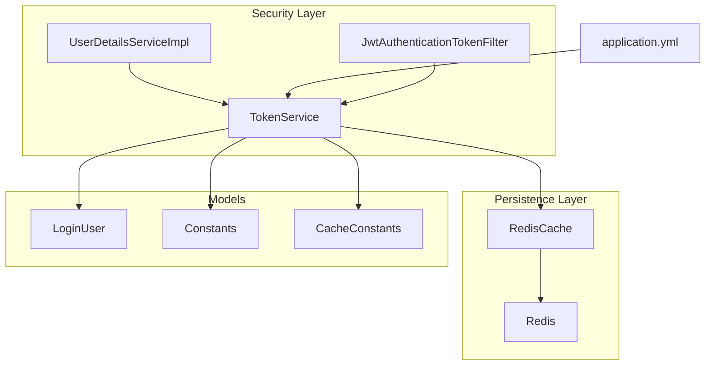
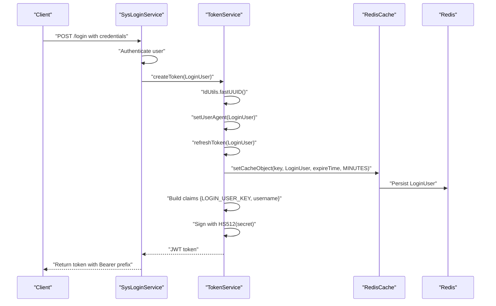
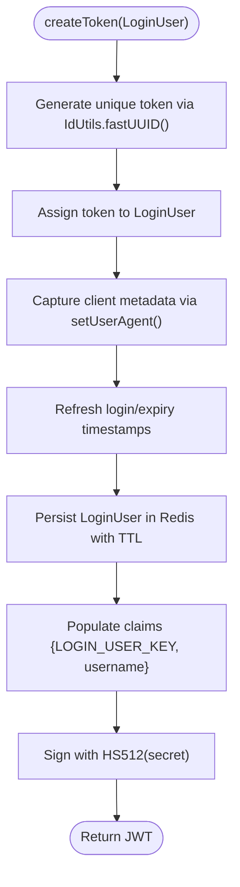
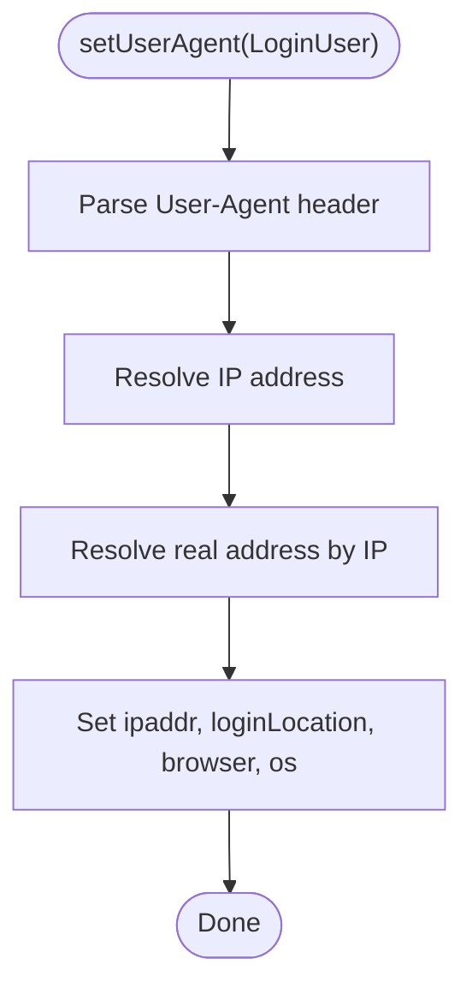
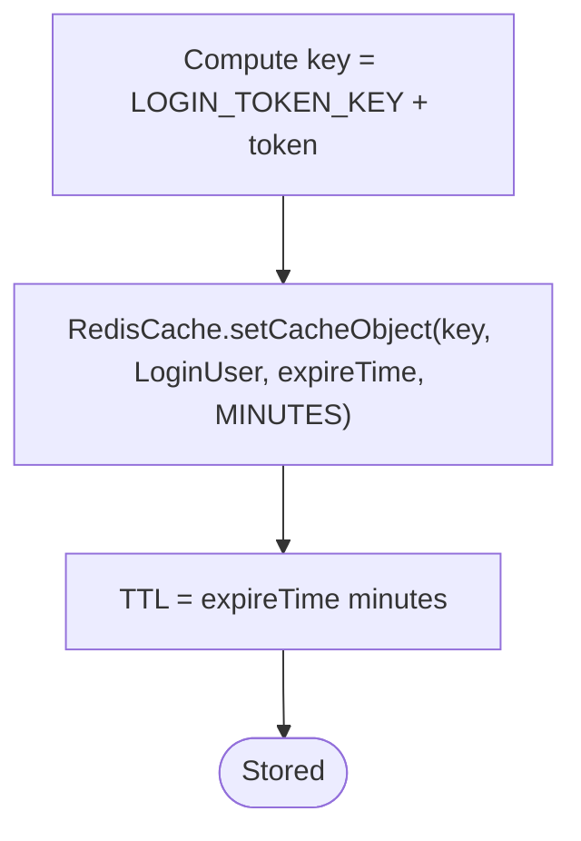
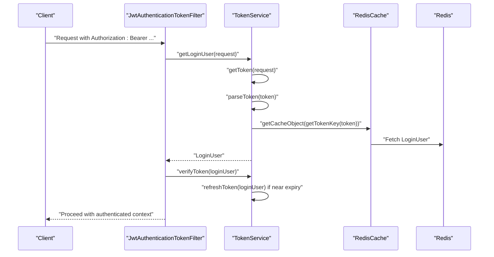
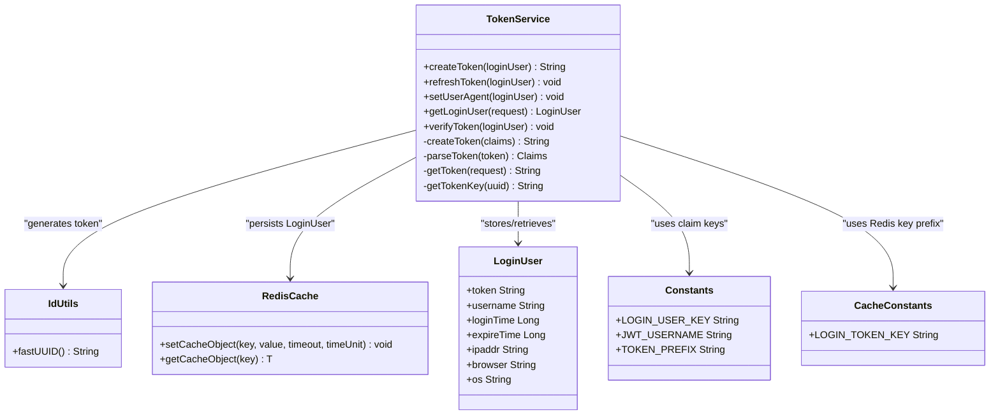

# Token Generation

<cite>
**Referenced Files in This Document**
- [TokenService.java](file://src/main/java/com/ruoyi/framework/security/service/TokenService.java)
- [IdUtils.java](file://src/main/java/com/ruoyi/common/utils/uuid/IdUtils.java)
- [RedisCache.java](file://src/main/java/com/ruoyi/framework/redis/RedisCache.java)
- [LoginUser.java](file://src/main/java/com/ruoyi/framework/security/LoginUser.java)
- [Constants.java](file://src/main/java/com/ruoyi/common/constant/Constants.java)
- [CacheConstants.java](file://src/main/java/com/ruoyi/common/constant/CacheConstants.java)
- [application.yml](file://src/main/resources/application.yml)
- [SysLoginService.java](file://src/main/java/com/ruoyi/framework/security/service/SysLoginService.java)
- [JwtAuthenticationTokenFilter.java](file://src/main/java/com/ruoyi/framework/security/filter/JwtAuthenticationTokenFilter.java)
- [UserDetailsServiceImpl.java](file://src/main/java/com/ruoyi/framework/security/service/UserDetailsServiceImpl.java)
</cite>

## Table of Contents
1. [Introduction](#introduction)
2. [Project Structure](#project-structure)
3. [Core Components](#core-components)
4. [Architecture Overview](#architecture-overview)
5. [Detailed Component Analysis](#detailed-component-analysis)
6. [Dependency Analysis](#dependency-analysis)
7. [Performance Considerations](#performance-considerations)
8. [Troubleshooting Guide](#troubleshooting-guide)
9. [Conclusion](#conclusion)

## Introduction
This document explains the JWT token generation process in RuoYi-Vue. It focuses on how TokenService.createToken produces a unique token using IdUtils.fastUUID(), populates claims with LOGIN_USER_KEY and username, integrates with Redis via RedisCache to persist the LoginUser object with expiration derived from token.expireTime, captures client metadata through setUserAgent, and ensures the token is returned with the Bearer prefix. It also covers security considerations around the HS512 signature algorithm and the token.secret configuration.

## Project Structure
The token generation pipeline spans several key components:
- TokenService orchestrates token creation, Redis caching, and metadata capture.
- IdUtils provides the unique token identifier.
- RedisCache persists LoginUser objects under a Redis key with TTL.
- LoginUser holds user identity, session metadata, and permissions.
- Constants defines claim keys and the Bearer prefix.
- CacheConstants defines the Redis key prefix for login tokens.
- application.yml configures token.header, token.secret, and token.expireTime.
- SysLoginService performs authentication and invokes TokenService.createToken.
- JwtAuthenticationTokenFilter validates incoming requests and refreshes sessions.
- UserDetailsServiceImpl constructs LoginUser instances from user records.

**Diagram sources**
- [TokenService.java](file://src/main/java/com/ruoyi/framework/security/service/TokenService.java#L114-L170)
- [RedisCache.java](file://src/main/java/com/ruoyi/framework/redis/RedisCache.java#L47-L50)
- [LoginUser.java](file://src/main/java/com/ruoyi/framework/security/LoginUser.java#L30-L63)
- [Constants.java](file://src/main/java/com/ruoyi/common/constant/Constants.java#L104-L122)
- [CacheConstants.java](file://src/main/java/com/ruoyi/common/constant/CacheConstants.java#L11-L14)
- [application.yml](file://src/main/resources/application.yml#L91-L99)
- [JwtAuthenticationTokenFilter.java](file://src/main/java/com/ruoyi/framework/security/filter/JwtAuthenticationTokenFilter.java#L30-L43)
- [UserDetailsServiceImpl.java](file://src/main/java/com/ruoyi/framework/security/service/UserDetailsServiceImpl.java#L36-L65)

**Section sources**
- [TokenService.java](file://src/main/java/com/ruoyi/framework/security/service/TokenService.java#L114-L170)
- [application.yml](file://src/main/resources/application.yml#L91-L99)

## Core Components
- TokenService: Generates tokens, sets claims, stores LoginUser in Redis, refreshes expirations, parses tokens, and extracts metadata from requests.
- IdUtils: Provides fastUUID() used to generate the unique token string.
- RedisCache: Encapsulates Redis operations for storing LoginUser with TTL.
- LoginUser: Holds user identity, session metadata (IP, browser, OS), login timestamps, and permissions.
- Constants: Defines claim keys (LOGIN_USER_KEY, JWT_USERNAME) and the Bearer prefix.
- CacheConstants: Defines the Redis key prefix for login tokens.
- application.yml: Supplies token.header, token.secret, and token.expireTime.
- SysLoginService: Authenticates users and delegates token creation to TokenService.
- JwtAuthenticationTokenFilter: Extracts tokens from Authorization headers, loads LoginUser, and refreshes sessions.
- UserDetailsServiceImpl: Builds LoginUser from persisted user records and permissions.

**Section sources**
- [TokenService.java](file://src/main/java/com/ruoyi/framework/security/service/TokenService.java#L36-L47)
- [IdUtils.java](file://src/main/java/com/ruoyi/common/utils/uuid/IdUtils.java#L35-L48)
- [RedisCache.java](file://src/main/java/com/ruoyi/framework/redis/RedisCache.java#L47-L50)
- [LoginUser.java](file://src/main/java/com/ruoyi/framework/security/LoginUser.java#L30-L63)
- [Constants.java](file://src/main/java/com/ruoyi/common/constant/Constants.java#L104-L122)
- [CacheConstants.java](file://src/main/java/com/ruoyi/common/constant/CacheConstants.java#L11-L14)
- [application.yml](file://src/main/resources/application.yml#L91-L99)
- [SysLoginService.java](file://src/main/java/com/ruoyi/framework/security/service/SysLoginService.java#L63-L100)
- [JwtAuthenticationTokenFilter.java](file://src/main/java/com/ruoyi/framework/security/filter/JwtAuthenticationTokenFilter.java#L30-L43)
- [UserDetailsServiceImpl.java](file://src/main/java/com/ruoyi/framework/security/service/UserDetailsServiceImpl.java#L36-L65)

## Architecture Overview
The token generation flow begins after successful authentication. SysLoginService authenticates the user and obtains a LoginUser principal. It then calls TokenService.createToken, which:
1. Generates a unique token via IdUtils.fastUUID().
2. Sets the token on LoginUser.
3. Captures client metadata via setUserAgent (IP, browser, OS).
4. Refreshes the LoginUser’s login/expiry timestamps.
5. Stores the LoginUser in Redis using RedisCache with TTL from token.expireTime.
6. Builds JWT claims containing LOGIN_USER_KEY and username.
7. Signs the JWT with HS512 using token.secret.
8. Returns the token prefixed with Bearer.

Incoming requests are validated by JwtAuthenticationTokenFilter, which:
- Extracts the token from the Authorization header.
- Parses the JWT to recover claims.
- Loads the LoginUser from Redis using the token as the key.
- Refreshes the session if close to expiry.

**Diagram sources**
- [SysLoginService.java](file://src/main/java/com/ruoyi/framework/security/service/SysLoginService.java#L63-L100)
- [TokenService.java](file://src/main/java/com/ruoyi/framework/security/service/TokenService.java#L114-L170)
- [RedisCache.java](file://src/main/java/com/ruoyi/framework/redis/RedisCache.java#L47-L50)
- [application.yml](file://src/main/resources/application.yml#L91-L99)

## Detailed Component Analysis

### TokenService.createToken
- Unique token generation: Uses IdUtils.fastUUID() to produce a unique token string and assigns it to LoginUser.
- Metadata capture: setUserAgent reads the User-Agent header and IP address, then sets ipaddr, loginLocation, browser, and os on LoginUser.
- Session refresh: Calls refreshToken to update loginTime and compute expireTime based on token.expireTime.
- Redis persistence: Stores LoginUser under CacheConstants.LOGIN_TOKEN_KEY + token with TTL in minutes.
- Claims population: Creates a claims map with Constants.LOGIN_USER_KEY set to the token and Constants.JWT_USERNAME set to the username.
- Signing: Uses HS512 with token.secret to sign the JWT.
- Return: Returns the signed JWT.

**Diagram sources**
- [TokenService.java](file://src/main/java/com/ruoyi/framework/security/service/TokenService.java#L114-L170)
- [IdUtils.java](file://src/main/java/com/ruoyi/common/utils/uuid/IdUtils.java#L35-L48)
- [RedisCache.java](file://src/main/java/com/ruoyi/framework/redis/RedisCache.java#L47-L50)
- [CacheConstants.java](file://src/main/java/com/ruoyi/common/constant/CacheConstants.java#L11-L14)
- [Constants.java](file://src/main/java/com/ruoyi/common/constant/Constants.java#L104-L122)
- [application.yml](file://src/main/resources/application.yml#L91-L99)

**Section sources**
- [TokenService.java](file://src/main/java/com/ruoyi/framework/security/service/TokenService.java#L114-L170)
- [IdUtils.java](file://src/main/java/com/ruoyi/common/utils/uuid/IdUtils.java#L35-L48)
- [RedisCache.java](file://src/main/java/com/ruoyi/framework/redis/RedisCache.java#L47-L50)
- [CacheConstants.java](file://src/main/java/com/ruoyi/common/constant/CacheConstants.java#L11-L14)
- [Constants.java](file://src/main/java/com/ruoyi/common/constant/Constants.java#L104-L122)
- [application.yml](file://src/main/resources/application.yml#L91-L99)

### setUserAgent and Client Metadata Capture
- Reads the User-Agent header and IP address from the request.
- Resolves real address by IP and sets ipaddr, loginLocation, browser, and os on LoginUser.
- Ensures metadata is captured during token creation for auditability and device context.

**Diagram sources**
- [TokenService.java](file://src/main/java/com/ruoyi/framework/security/service/TokenService.java#L162-L170)

**Section sources**
- [TokenService.java](file://src/main/java/com/ruoyi/framework/security/service/TokenService.java#L162-L170)

### Redis Storage and Expiration
- Keys: Redis keys are constructed using CacheConstants.LOGIN_TOKEN_KEY + token.
- Values: LoginUser objects are stored with TTL equal to token.expireTime minutes.
- Retrieval: During login extraction, TokenService retrieves LoginUser by the token-derived key.

**Diagram sources**
- [TokenService.java](file://src/main/java/com/ruoyi/framework/security/service/TokenService.java#L148-L155)
- [RedisCache.java](file://src/main/java/com/ruoyi/framework/redis/RedisCache.java#L47-L50)
- [CacheConstants.java](file://src/main/java/com/ruoyi/common/constant/CacheConstants.java#L11-L14)
- [application.yml](file://src/main/resources/application.yml#L91-L99)

**Section sources**
- [TokenService.java](file://src/main/java/com/ruoyi/framework/security/service/TokenService.java#L148-L155)
- [RedisCache.java](file://src/main/java/com/ruoyi/framework/redis/RedisCache.java#L47-L50)
- [CacheConstants.java](file://src/main/java/com/ruoyi/common/constant/CacheConstants.java#L11-L14)
- [application.yml](file://src/main/resources/application.yml#L91-L99)

### Token Retrieval and Validation Flow
- Request parsing: TokenService.getToken extracts the token from the configured header and strips the Bearer prefix if present.
- LoginUser retrieval: Claims are parsed to extract the login user key, then LoginUser is fetched from Redis.
- Session refresh: If the remaining validity is less than a threshold, the session is refreshed.

**Diagram sources**
- [JwtAuthenticationTokenFilter.java](file://src/main/java/com/ruoyi/framework/security/filter/JwtAuthenticationTokenFilter.java#L30-L43)
- [TokenService.java](file://src/main/java/com/ruoyi/framework/security/service/TokenService.java#L62-L83)
- [TokenService.java](file://src/main/java/com/ruoyi/framework/security/service/TokenService.java#L133-L141)
- [TokenService.java](file://src/main/java/com/ruoyi/framework/security/service/TokenService.java#L148-L155)

**Section sources**
- [JwtAuthenticationTokenFilter.java](file://src/main/java/com/ruoyi/framework/security/filter/JwtAuthenticationTokenFilter.java#L30-L43)
- [TokenService.java](file://src/main/java/com/ruoyi/framework/security/service/TokenService.java#L62-L83)
- [TokenService.java](file://src/main/java/com/ruoyi/framework/security/service/TokenService.java#L133-L141)
- [TokenService.java](file://src/main/java/com/ruoyi/framework/security/service/TokenService.java#L148-L155)

### Security Considerations
- Signature algorithm: HS512 is used to sign the JWT. Ensure token.secret remains confidential and is rotated periodically.
- Secret configuration: The secret is loaded from application.yml under token.secret. Do not hardcode secrets in production; use secure configuration management.
- Token prefix: The Bearer prefix is defined in Constants.TOKEN_PREFIX and stripped during parsing to prevent accidental misuse.
- Expiration: token.expireTime controls both JWT lifetime and Redis TTL. Align these values to enforce consistent session lifetimes.

**Section sources**
- [TokenService.java](file://src/main/java/com/ruoyi/framework/security/service/TokenService.java#L178-L184)
- [application.yml](file://src/main/resources/application.yml#L91-L99)
- [Constants.java](file://src/main/java/com/ruoyi/common/constant/Constants.java#L104-L106)

## Dependency Analysis
TokenService depends on:
- IdUtils for unique token generation.
- RedisCache for Redis operations.
- Constants and CacheConstants for claim keys and Redis key prefixes.
- application.yml for token configuration.
- LoginUser for session metadata and permissions.

**Diagram sources**
- [TokenService.java](file://src/main/java/com/ruoyi/framework/security/service/TokenService.java#L114-L170)
- [IdUtils.java](file://src/main/java/com/ruoyi/common/utils/uuid/IdUtils.java#L35-L48)
- [RedisCache.java](file://src/main/java/com/ruoyi/framework/redis/RedisCache.java#L47-L50)
- [LoginUser.java](file://src/main/java/com/ruoyi/framework/security/LoginUser.java#L30-L63)
- [Constants.java](file://src/main/java/com/ruoyi/common/constant/Constants.java#L104-L122)
- [CacheConstants.java](file://src/main/java/com/ruoyi/common/constant/CacheConstants.java#L11-L14)

**Section sources**
- [TokenService.java](file://src/main/java/com/ruoyi/framework/security/service/TokenService.java#L114-L170)
- [IdUtils.java](file://src/main/java/com/ruoyi/common/utils/uuid/IdUtils.java#L35-L48)
- [RedisCache.java](file://src/main/java/com/ruoyi/framework/redis/RedisCache.java#L47-L50)
- [LoginUser.java](file://src/main/java/com/ruoyi/framework/security/LoginUser.java#L30-L63)
- [Constants.java](file://src/main/java/com/ruoyi/common/constant/Constants.java#L104-L122)
- [CacheConstants.java](file://src/main/java/com/ruoyi/common/constant/CacheConstants.java#L11-L14)

## Performance Considerations
- Token generation is lightweight, dominated by UUID generation and Redis set operations.
- setUserAgent performs network calls to resolve IP address; consider caching or limiting resolution frequency if needed.
- Expiration thresholds and TTL alignment reduce redundant refresh operations.
- Ensure Redis connectivity and latency are acceptable for high-throughput scenarios.

[No sources needed since this section provides general guidance]

## Troubleshooting Guide
Common issues and resolutions:
- Invalid token header: Ensure Authorization header uses the configured token.header and includes the Bearer prefix. TokenService strips the prefix during parsing.
- Missing token.secret: Verify application.yml contains a strong secret for HS512 signing.
- Expired token: Confirm token.expireTime aligns with Redis TTL and that verifyToken is invoked before expiry.
- Redis connectivity: Check Redis host/port/password/timeouts in application.yml and confirm the Redis instance is reachable.
- Incorrect claim keys: Ensure Constants.LOGIN_USER_KEY and Constants.JWT_USERNAME match the expected claim names.

**Section sources**
- [TokenService.java](file://src/main/java/com/ruoyi/framework/security/service/TokenService.java#L218-L226)
- [application.yml](file://src/main/resources/application.yml#L91-L99)

## Conclusion
RuoYi-Vue’s token generation pipeline securely creates JWTs using HS512 with a configurable secret, persists LoginUser objects in Redis with TTL aligned to token.expireTime, and enriches sessions with client metadata. The JwtAuthenticationTokenFilter ensures seamless validation and automatic session refresh. Proper configuration of token.header, token.secret, and token.expireTime is essential for robust and secure authentication.