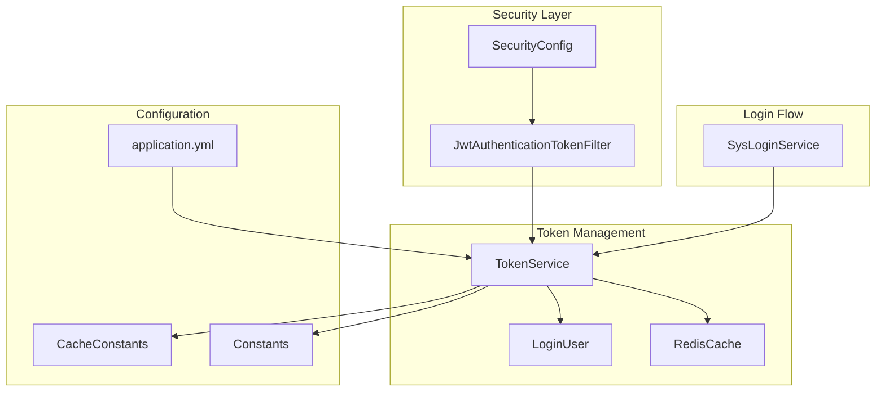
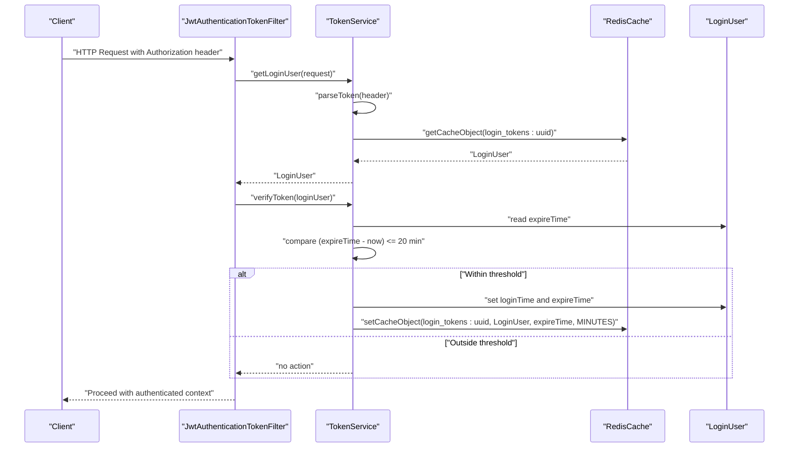
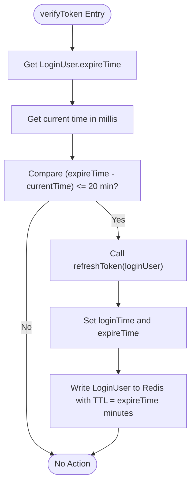
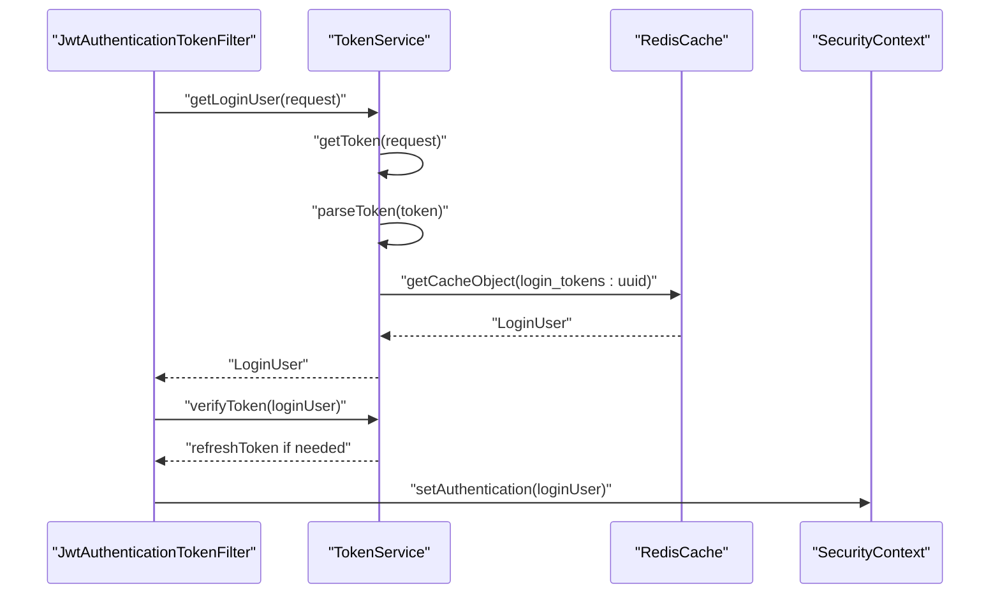
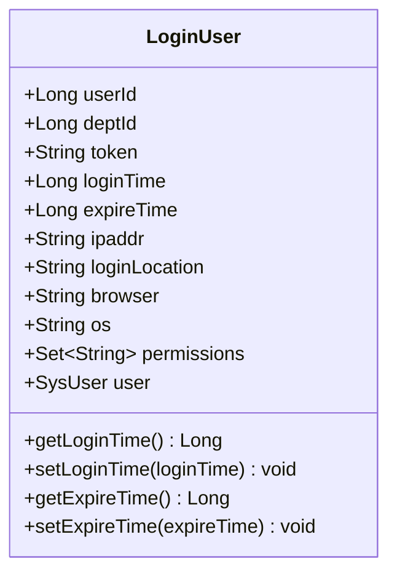
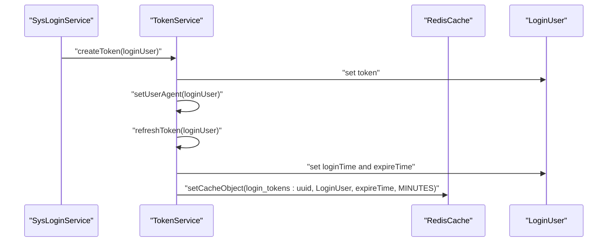
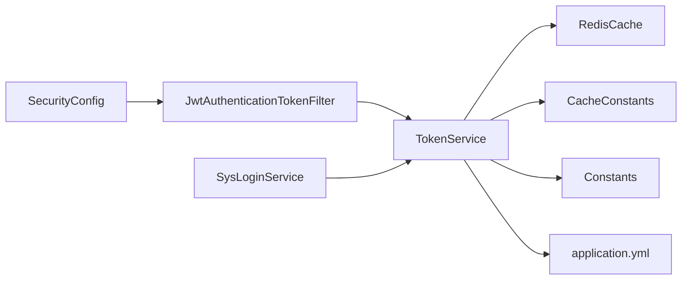

# Token Refresh Mechanism

<cite>
**Referenced Files in This Document**
- [TokenService.java](file://src/main/java/com/ruoyi/framework/security/service/TokenService.java)
- [LoginUser.java](file://src/main/java/com/ruoyi/framework/security/LoginUser.java)
- [JwtAuthenticationTokenFilter.java](file://src/main/java/com/ruoyi/framework/security/filter/JwtAuthenticationTokenFilter.java)
- [application.yml](file://src/main/resources/application.yml)
- [CacheConstants.java](file://src/main/java/com/ruoyi/common/constant/CacheConstants.java)
- [Constants.java](file://src/main/java/com/ruoyi/common/constant/Constants.java)
- [RedisCache.java](file://src/main/java/com/ruoyi/framework/redis/RedisCache.java)
- [SysLoginService.java](file://src/main/java/com/ruoyi/framework/security/service/SysLoginService.java)
- [SecurityConfig.java](file://src/main/java/com/ruoyi/framework/config/SecurityConfig.java)
</cite>

## Table of Contents
1. [Introduction](#introduction)
2. [Project Structure](#project-structure)
3. [Core Components](#core-components)
4. [Architecture Overview](#architecture-overview)
5. [Detailed Component Analysis](#detailed-component-analysis)
6. [Dependency Analysis](#dependency-analysis)
7. [Performance Considerations](#performance-considerations)
8. [Troubleshooting Guide](#troubleshooting-guide)
9. [Conclusion](#conclusion)
10. [Appendices](#appendices)

## Introduction
This document explains the automatic token refresh mechanism in RuoYi-Vue. It focuses on how the verifyToken method determines whether a token’s remaining validity is less than a configured threshold and triggers a refresh via refreshToken. It also documents how refreshToken updates the LoginUser’s timestamps and refreshes the Redis cache entry with the same expiration duration defined in application.yml. Finally, it covers the sliding session behavior that extends user sessions seamlessly without requiring re-authentication, along with security implications and configuration guidance.

## Project Structure
The token refresh logic spans several key classes:
- TokenService: central service for JWT parsing, token creation, verification, and refresh
- LoginUser: user principal model storing token, login/expiry timestamps, and device info
- JwtAuthenticationTokenFilter: filter that authenticates requests and triggers verifyToken
- application.yml: configuration for token header, secret, and expireTime
- CacheConstants and Constants: shared constants for Redis keys and JWT claims
- RedisCache: Redis operations wrapper used by TokenService
- SysLoginService: login flow that creates tokens and invokes refresh
- SecurityConfig: Spring Security configuration enabling stateless JWT authentication

**Diagram sources**
- [JwtAuthenticationTokenFilter.java](file://src/main/java/com/ruoyi/framework/security/filter/JwtAuthenticationTokenFilter.java#L1-L45)
- [TokenService.java](file://src/main/java/com/ruoyi/framework/security/service/TokenService.java#L1-L233)
- [LoginUser.java](file://src/main/java/com/ruoyi/framework/security/LoginUser.java#L1-L267)
- [RedisCache.java](file://src/main/java/com/ruoyi/framework/redis/RedisCache.java#L1-L269)
- [application.yml](file://src/main/resources/application.yml#L91-L100)
- [CacheConstants.java](file://src/main/java/com/ruoyi/common/constant/CacheConstants.java#L1-L45)
- [Constants.java](file://src/main/java/com/ruoyi/common/constant/Constants.java#L1-L174)
- [SysLoginService.java](file://src/main/java/com/ruoyi/framework/security/service/SysLoginService.java#L1-L177)
- [SecurityConfig.java](file://src/main/java/com/ruoyi/framework/config/SecurityConfig.java#L1-L140)

**Section sources**
- [TokenService.java](file://src/main/java/com/ruoyi/framework/security/service/TokenService.java#L1-L233)
- [JwtAuthenticationTokenFilter.java](file://src/main/java/com/ruoyi/framework/security/filter/JwtAuthenticationTokenFilter.java#L1-L45)
- [application.yml](file://src/main/resources/application.yml#L91-L100)
- [CacheConstants.java](file://src/main/java/com/ruoyi/common/constant/CacheConstants.java#L1-L45)
- [Constants.java](file://src/main/java/com/ruoyi/common/constant/Constants.java#L1-L174)
- [RedisCache.java](file://src/main/java/com/ruoyi/framework/redis/RedisCache.java#L1-L269)
- [SysLoginService.java](file://src/main/java/com/ruoyi/framework/security/service/SysLoginService.java#L1-L177)
- [SecurityConfig.java](file://src/main/java/com/ruoyi/framework/config/SecurityConfig.java#L1-L140)

## Core Components
- TokenService: Provides token parsing, creation, and refresh logic; exposes verifyToken and refreshToken methods; reads token.expireTime from application.yml; manages Redis cache entries keyed by login_tokens:uuid.
- LoginUser: Holds user identity and session metadata including token, loginTime, expireTime, IP, location, browser, OS, and permissions.
- JwtAuthenticationTokenFilter: Extracts token from Authorization header, loads LoginUser from Redis, and calls verifyToken to refresh if needed.
- application.yml: Defines token.header, token.secret, and token.expireTime (default 30 minutes).
- CacheConstants: Defines Redis key prefix for login tokens.
- Constants: Defines JWT claim keys and token prefix used during parsing and creation.
- RedisCache: Thin wrapper around RedisTemplate for value operations and TTL management.
- SysLoginService: Orchestrates login, authenticates credentials, and delegates token creation and refresh to TokenService.
- SecurityConfig: Configures stateless JWT authentication and adds JwtAuthenticationTokenFilter.

**Section sources**
- [TokenService.java](file://src/main/java/com/ruoyi/framework/security/service/TokenService.java#L1-L233)
- [LoginUser.java](file://src/main/java/com/ruoyi/framework/security/LoginUser.java#L1-L267)
- [JwtAuthenticationTokenFilter.java](file://src/main/java/com/ruoyi/framework/security/filter/JwtAuthenticationTokenFilter.java#L1-L45)
- [application.yml](file://src/main/resources/application.yml#L91-L100)
- [CacheConstants.java](file://src/main/java/com/ruoyi/common/constant/CacheConstants.java#L1-L45)
- [Constants.java](file://src/main/java/com/ruoyi/common/constant/Constants.java#L1-L174)
- [RedisCache.java](file://src/main/java/com/ruoyi/framework/redis/RedisCache.java#L1-L269)
- [SysLoginService.java](file://src/main/java/com/ruoyi/framework/security/service/SysLoginService.java#L1-L177)
- [SecurityConfig.java](file://src/main/java/com/ruoyi/framework/config/SecurityConfig.java#L1-L140)

## Architecture Overview
The token refresh mechanism operates as follows:
- On each request, JwtAuthenticationTokenFilter extracts the token from the Authorization header, parses JWT claims, retrieves LoginUser from Redis, and calls verifyToken.
- verifyToken compares the remaining validity against a 20-minute threshold. If the remaining time is less than or equal to 20 minutes, it triggers refreshToken.
- refreshToken updates LoginUser’s loginTime and expireTime, then writes the updated LoginUser back to Redis with TTL equal to token.expireTime (from application.yml).
- This creates a sliding session: as long as the user remains active, their session is continuously extended without forcing re-authentication.

**Diagram sources**
- [JwtAuthenticationTokenFilter.java](file://src/main/java/com/ruoyi/framework/security/filter/JwtAuthenticationTokenFilter.java#L1-L45)
- [TokenService.java](file://src/main/java/com/ruoyi/framework/security/service/TokenService.java#L62-L155)
- [RedisCache.java](file://src/main/java/com/ruoyi/framework/redis/RedisCache.java#L39-L50)
- [application.yml](file://src/main/resources/application.yml#L91-L100)

## Detailed Component Analysis

### TokenService: verifyToken and refreshToken
- verifyToken:
  - Reads the LoginUser’s expireTime and current time in milliseconds.
  - Compares expireTime - currentTime with a 20-minute threshold (MILLIS_MINUTE_TWENTY).
  - If remaining validity is less than or equal to 20 minutes, calls refreshToken.
  - Code snippet path: [verifyToken](file://src/main/java/com/ruoyi/framework/security/service/TokenService.java#L133-L141)

- refreshToken:
  - Updates LoginUser.loginTime to current time.
  - Sets LoginUser.expireTime to loginTime plus expireTime minutes converted to milliseconds.
  - Writes LoginUser back to Redis under the key login_tokens:uuid with TTL set to expireTime minutes.
  - Code snippet path: [refreshToken](file://src/main/java/com/ruoyi/framework/security/service/TokenService.java#L148-L155)

- Related constants and keys:
  - TokenService reads token.expireTime from application.yml.
  - Uses CacheConstants.LOGIN_TOKEN_KEY for Redis key prefix.
  - Uses Constants.LOGIN_USER_KEY for JWT claim key.
  - Code snippet paths:
    - [expireTime binding](file://src/main/java/com/ruoyi/framework/security/service/TokenService.java#L44-L46)
    - [LOGIN_TOKEN_KEY](file://src/main/java/com/ruoyi/common/constant/CacheConstants.java#L10-L14)
    - [LOGIN_USER_KEY](file://src/main/java/com/ruoyi/common/constant/Constants.java#L108-L112)

**Diagram sources**
- [TokenService.java](file://src/main/java/com/ruoyi/framework/security/service/TokenService.java#L133-L155)
- [RedisCache.java](file://src/main/java/com/ruoyi/framework/redis/RedisCache.java#L39-L50)
- [application.yml](file://src/main/resources/application.yml#L91-L100)

**Section sources**
- [TokenService.java](file://src/main/java/com/ruoyi/framework/security/service/TokenService.java#L127-L155)
- [CacheConstants.java](file://src/main/java/com/ruoyi/common/constant/CacheConstants.java#L10-L14)
- [Constants.java](file://src/main/java/com/ruoyi/common/constant/Constants.java#L108-L112)
- [RedisCache.java](file://src/main/java/com/ruoyi/framework/redis/RedisCache.java#L39-L50)
- [application.yml](file://src/main/resources/application.yml#L91-L100)

### JwtAuthenticationTokenFilter: Integration Point
- Extracts token from Authorization header using token.header from application.yml.
- Parses JWT to obtain the uuid claim and loads LoginUser from Redis.
- Calls verifyToken to refresh if needed.
- Sets authentication in SecurityContext for downstream controllers.
- Code snippet path: [doFilterInternal](file://src/main/java/com/ruoyi/framework/security/filter/JwtAuthenticationTokenFilter.java#L30-L43)

**Diagram sources**
- [JwtAuthenticationTokenFilter.java](file://src/main/java/com/ruoyi/framework/security/filter/JwtAuthenticationTokenFilter.java#L30-L43)
- [TokenService.java](file://src/main/java/com/ruoyi/framework/security/service/TokenService.java#L62-L155)
- [RedisCache.java](file://src/main/java/com/ruoyi/framework/redis/RedisCache.java#L105-L109)
- [application.yml](file://src/main/resources/application.yml#L91-L100)

**Section sources**
- [JwtAuthenticationTokenFilter.java](file://src/main/java/com/ruoyi/framework/security/filter/JwtAuthenticationTokenFilter.java#L1-L45)
- [TokenService.java](file://src/main/java/com/ruoyi/framework/security/service/TokenService.java#L62-L155)

### LoginUser: Session Metadata
- Stores token, loginTime, expireTime, IP, loginLocation, browser, OS, permissions, and user details.
- Exposes getters/setters for loginTime and expireTime used by TokenService.refreshToken.
- Code snippet paths:
  - [loginTime/expireTime setters](file://src/main/java/com/ruoyi/framework/security/LoginUser.java#L181-L239)

**Diagram sources**
- [LoginUser.java](file://src/main/java/com/ruoyi/framework/security/LoginUser.java#L1-L267)

**Section sources**
- [LoginUser.java](file://src/main/java/com/ruoyi/framework/security/LoginUser.java#L181-L239)

### Token Creation and Initial Refresh
- SysLoginService performs authentication and delegates token creation to TokenService.createToken.
- createToken generates a token, sets LoginUser.token, populates user agent info, and calls refreshToken to initialize Redis entry with TTL = token.expireTime.
- Code snippet path: [createToken](file://src/main/java/com/ruoyi/framework/security/service/TokenService.java#L114-L125)

**Diagram sources**
- [SysLoginService.java](file://src/main/java/com/ruoyi/framework/security/service/SysLoginService.java#L96-L100)
- [TokenService.java](file://src/main/java/com/ruoyi/framework/security/service/TokenService.java#L114-L155)
- [RedisCache.java](file://src/main/java/com/ruoyi/framework/redis/RedisCache.java#L39-L50)
- [application.yml](file://src/main/resources/application.yml#L91-L100)

**Section sources**
- [SysLoginService.java](file://src/main/java/com/ruoyi/framework/security/service/SysLoginService.java#L96-L100)
- [TokenService.java](file://src/main/java/com/ruoyi/framework/security/service/TokenService.java#L114-L155)

## Dependency Analysis
- TokenService depends on:
  - RedisCache for value operations and TTL management
  - CacheConstants for Redis key prefix
  - Constants for JWT claim keys
  - application.yml for token.header, token.secret, and token.expireTime
- JwtAuthenticationTokenFilter depends on TokenService and SecurityUtils
- SysLoginService depends on TokenService for token creation and refresh
- SecurityConfig enables stateless authentication and registers JwtAuthenticationTokenFilter

**Diagram sources**
- [TokenService.java](file://src/main/java/com/ruoyi/framework/security/service/TokenService.java#L1-L233)
- [JwtAuthenticationTokenFilter.java](file://src/main/java/com/ruoyi/framework/security/filter/JwtAuthenticationTokenFilter.java#L1-L45)
- [SysLoginService.java](file://src/main/java/com/ruoyi/framework/security/service/SysLoginService.java#L1-L177)
- [SecurityConfig.java](file://src/main/java/com/ruoyi/framework/config/SecurityConfig.java#L1-L140)
- [application.yml](file://src/main/resources/application.yml#L91-L100)

**Section sources**
- [TokenService.java](file://src/main/java/com/ruoyi/framework/security/service/TokenService.java#L1-L233)
- [JwtAuthenticationTokenFilter.java](file://src/main/java/com/ruoyi/framework/security/filter/JwtAuthenticationTokenFilter.java#L1-L45)
- [SysLoginService.java](file://src/main/java/com/ruoyi/framework/security/service/SysLoginService.java#L1-L177)
- [SecurityConfig.java](file://src/main/java/com/ruoyi/framework/config/SecurityConfig.java#L1-L140)

## Performance Considerations
- verifyToken is invoked on every request; it performs a simple arithmetic comparison and a single Redis read. Its overhead is minimal.
- refreshToken performs a write with TTL; the cost scales with Redis latency and network round-trips.
- The 20-minute threshold ensures refresh occurs before expiry, minimizing the chance of mid-request token expiration.
- Using stateless JWT avoids server-side session storage, reducing memory footprint and simplifying horizontal scaling.

[No sources needed since this section provides general guidance]

## Troubleshooting Guide
Common issues and diagnostics:
- Token not refreshed:
  - Verify token.expireTime is set in application.yml and Redis TTL aligns with this value.
  - Confirm Redis connectivity and that login_tokens:uuid keys are being written.
  - Check that Authorization header uses the configured token.header and includes the token prefix.
- Expired tokens despite refresh:
  - Ensure verifyToken is executed by JwtAuthenticationTokenFilter on each request.
  - Validate that LoginUser.expireTime is updated and stored in Redis.
- Unexpected early expiration:
  - Review the 20-minute threshold logic and confirm remaining validity is computed correctly.
  - Check for concurrent requests that might overwrite LoginUser in Redis.

**Section sources**
- [application.yml](file://src/main/resources/application.yml#L91-L100)
- [JwtAuthenticationTokenFilter.java](file://src/main/java/com/ruoyi/framework/security/filter/JwtAuthenticationTokenFilter.java#L30-L43)
- [TokenService.java](file://src/main/java/com/ruoyi/framework/security/service/TokenService.java#L133-L155)
- [RedisCache.java](file://src/main/java/com/ruoyi/framework/redis/RedisCache.java#L39-L50)

## Conclusion
RuoYi-Vue implements a robust automatic token refresh mechanism centered on TokenService. The verifyToken method proactively refreshes sessions when remaining validity falls below 20 minutes, and refreshToken updates LoginUser timestamps and Redis TTL to token.expireTime. This sliding session behavior enhances usability by avoiding frequent re-authentication while maintaining security through short-lived tokens and strict header parsing. Administrators can tune security posture by adjusting token.expireTime and the 20-minute threshold to balance convenience and risk.

[No sources needed since this section summarizes without analyzing specific files]

## Appendices

### Configuration Guidance
- Configure token.expireTime in application.yml to define session lifetime in minutes. Lower values increase security but reduce usability; higher values improve usability at the cost of security.
- Adjust the 20-minute threshold by modifying the constant used in verifyToken if needed, though the default provides a safe buffer.
- Ensure token.header and token.secret are set appropriately and kept confidential.

**Section sources**
- [application.yml](file://src/main/resources/application.yml#L91-L100)
- [TokenService.java](file://src/main/java/com/ruoyi/framework/security/service/TokenService.java#L44-L46)
- [TokenService.java](file://src/main/java/com/ruoyi/framework/security/service/TokenService.java#L133-L141)