# Token Validation

<cite>
**Referenced Files in This Document**
- [JwtAuthenticationTokenFilter.java](file://src/main/java/com/ruoyi/framework/security/filter/JwtAuthenticationTokenFilter.java)
- [TokenService.java](file://src/main/java/com/ruoyi/framework/security/service/TokenService.java)
- [CacheConstants.java](file://src/main/java/com/ruoyi/common/constant/CacheConstants.java)
- [Constants.java](file://src/main/java/com/ruoyi/common/constant/Constants.java)
- [SecurityConfig.java](file://src/main/java/com/ruoyi/framework/config/SecurityConfig.java)
- [SecurityUtils.java](file://src/main/java/com/ruoyi/common/utils/SecurityUtils.java)
- [RedisCache.java](file://src/main/java/com/ruoyi/framework/redis/RedisCache.java)
- [application.yml](file://src/main/resources/application.yml)
- [AuthenticationEntryPointImpl.java](file://src/main/java/com/ruoyi/framework/security/handle/AuthenticationEntryPointImpl.java)
</cite>

## Table of Contents
1. [Introduction](#introduction)
2. [Project Structure](#project-structure)
3. [Core Components](#core-components)
4. [Architecture Overview](#architecture-overview)
5. [Detailed Component Analysis](#detailed-component-analysis)
6. [Dependency Analysis](#dependency-analysis)
7. [Performance Considerations](#performance-considerations)
8. [Troubleshooting Guide](#troubleshooting-guide)
9. [Conclusion](#conclusion)

## Introduction
This document explains the JWT token validation mechanism in RuoYi-Vue. It focuses on how JwtAuthenticationTokenFilter intercepts incoming requests, extracts the token from the Authorization header, validates the token signature using TokenService, retrieves the LoginUser from Redis using the token’s UUID as the cache key, and sets the SecurityContext so downstream filters and controllers can access the authenticated user. It also covers the flow from request interception to setting UsernamePasswordAuthenticationToken in the SecurityContext, and how invalid/expired tokens are handled without breaking the filter chain.

## Project Structure
The JWT token validation spans several key components:
- Filter chain registration and stateless policy in SecurityConfig
- JwtAuthenticationTokenFilter that runs before UsernamePasswordAuthenticationFilter
- TokenService that parses tokens, retrieves claims, and manages Redis cache
- CacheConstants and Constants that define Redis keys and token prefixes
- SecurityUtils that reads the current Authentication from SecurityContextHolder
- RedisCache for Redis operations
- application.yml that defines token.header, token.secret, and token.expireTime
- AuthenticationEntryPointImpl for unauthenticated requests

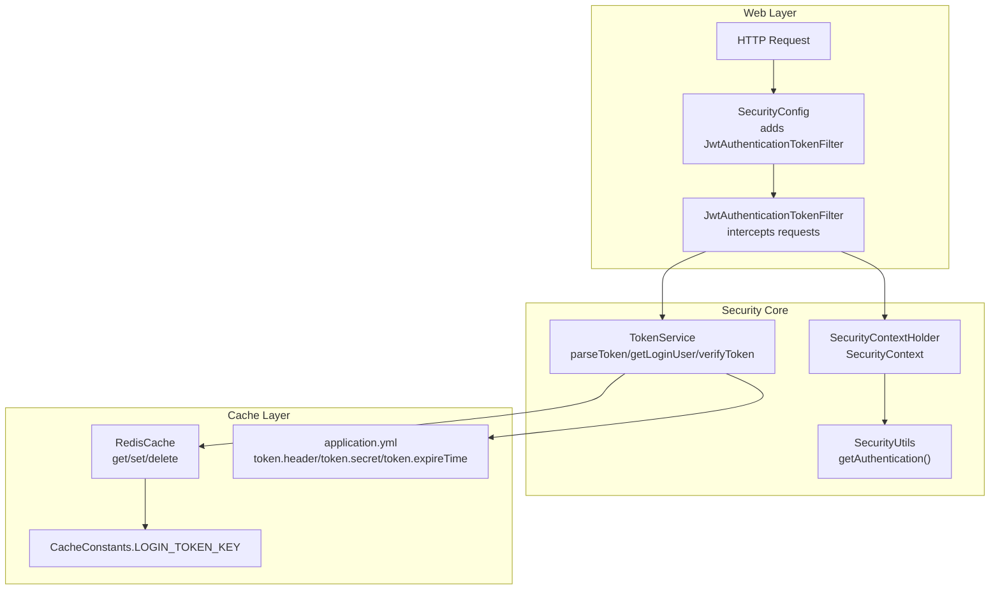

**Diagram sources**
- [SecurityConfig.java](file://src/main/java/com/ruoyi/framework/config/SecurityConfig.java#L96-L129)
- [JwtAuthenticationTokenFilter.java](file://src/main/java/com/ruoyi/framework/security/filter/JwtAuthenticationTokenFilter.java#L30-L43)
- [TokenService.java](file://src/main/java/com/ruoyi/framework/security/service/TokenService.java#L62-L83)
- [RedisCache.java](file://src/main/java/com/ruoyi/framework/redis/RedisCache.java#L105-L109)
- [CacheConstants.java](file://src/main/java/com/ruoyi/common/constant/CacheConstants.java#L10-L14)
- [application.yml](file://src/main/resources/application.yml#L91-L99)

**Section sources**
- [SecurityConfig.java](file://src/main/java/com/ruoyi/framework/config/SecurityConfig.java#L96-L129)
- [JwtAuthenticationTokenFilter.java](file://src/main/java/com/ruoyi/framework/security/filter/JwtAuthenticationTokenFilter.java#L30-L43)
- [TokenService.java](file://src/main/java/com/ruoyi/framework/security/service/TokenService.java#L62-L83)
- [RedisCache.java](file://src/main/java/com/ruoyi/framework/redis/RedisCache.java#L105-L109)
- [CacheConstants.java](file://src/main/java/com/ruoyi/common/constant/CacheConstants.java#L10-L14)
- [application.yml](file://src/main/resources/application.yml#L91-L99)

## Core Components
- JwtAuthenticationTokenFilter: Intercepts each request, delegates to TokenService to extract and validate the token, and sets Authentication in SecurityContext when appropriate.
- TokenService: Parses the JWT using the configured secret, extracts claims, resolves the LoginUser from Redis using CacheConstants.LOGIN_TOKEN_KEY + uuid, and refreshes token TTL when nearing expiry.
- SecurityConfig: Registers JwtAuthenticationTokenFilter before UsernamePasswordAuthenticationFilter and configures stateless sessions.
- SecurityUtils: Provides access to the current Authentication from SecurityContextHolder.
- RedisCache: Provides get/set/delete operations for Redis-backed cache.
- CacheConstants: Defines the Redis key prefix for login tokens.
- Constants: Defines token-related constants such as header prefix and claim keys.
- application.yml: Configures token.header, token.secret, and token.expireTime.
- AuthenticationEntryPointImpl: Handles unauthenticated requests by returning a standardized error response.

**Section sources**
- [JwtAuthenticationTokenFilter.java](file://src/main/java/com/ruoyi/framework/security/filter/JwtAuthenticationTokenFilter.java#L30-L43)
- [TokenService.java](file://src/main/java/com/ruoyi/framework/security/service/TokenService.java#L62-L83)
- [SecurityConfig.java](file://src/main/java/com/ruoyi/framework/config/SecurityConfig.java#L96-L129)
- [SecurityUtils.java](file://src/main/java/com/ruoyi/common/utils/SecurityUtils.java#L83-L90)
- [RedisCache.java](file://src/main/java/com/ruoyi/framework/redis/RedisCache.java#L105-L109)
- [CacheConstants.java](file://src/main/java/com/ruoyi/common/constant/CacheConstants.java#L10-L14)
- [Constants.java](file://src/main/java/com/ruoyi/common/constant/Constants.java#L104-L112)
- [application.yml](file://src/main/resources/application.yml#L91-L99)
- [AuthenticationEntryPointImpl.java](file://src/main/java/com/ruoyi/framework/security/handle/AuthenticationEntryPointImpl.java#L26-L33)

## Architecture Overview
The filter chain is configured to be stateless and to run JwtAuthenticationTokenFilter before UsernamePasswordAuthenticationFilter. On each request, JwtAuthenticationTokenFilter extracts the token from the Authorization header, validates it via TokenService, loads the LoginUser from Redis, and sets the Authentication in SecurityContext. Unauthenticated requests trigger AuthenticationEntryPointImpl.

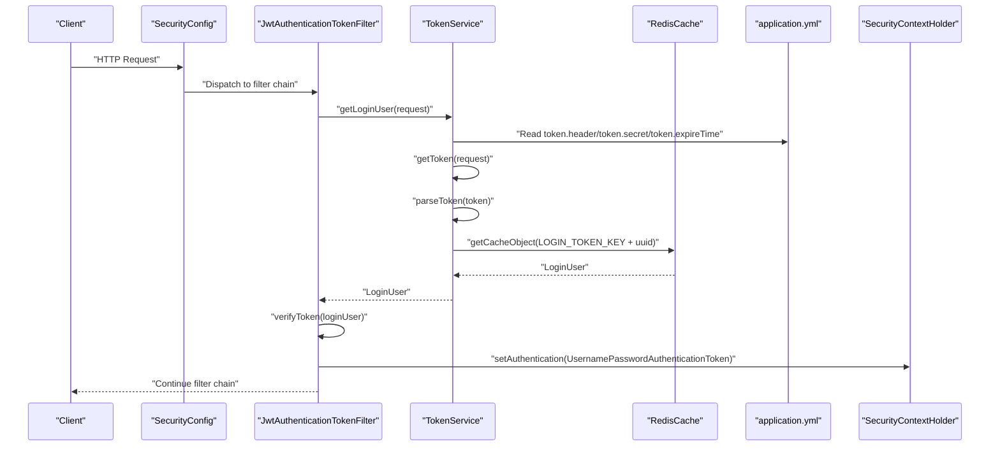

**Diagram sources**
- [SecurityConfig.java](file://src/main/java/com/ruoyi/framework/config/SecurityConfig.java#L118-L129)
- [JwtAuthenticationTokenFilter.java](file://src/main/java/com/ruoyi/framework/security/filter/JwtAuthenticationTokenFilter.java#L30-L43)
- [TokenService.java](file://src/main/java/com/ruoyi/framework/security/service/TokenService.java#L62-L83)
- [RedisCache.java](file://src/main/java/com/ruoyi/framework/redis/RedisCache.java#L105-L109)
- [application.yml](file://src/main/resources/application.yml#L91-L99)

## Detailed Component Analysis

### JwtAuthenticationTokenFilter
Responsibilities:
- Extract LoginUser via TokenService.getLoginUser(request)
- Skip processing if Authentication is already present in SecurityContext
- Validate token TTL via TokenService.verifyToken(loginUser)
- Build UsernamePasswordAuthenticationToken with LoginUser and authorities
- Set Authentication in SecurityContext

Key logic:
- Uses SecurityUtils.getAuthentication() to detect if authentication is already established
- Calls TokenService.verifyToken(loginUser) to refresh Redis TTL if near expiry
- Creates UsernamePasswordAuthenticationToken with LoginUser and authorities
- Sets SecurityContext and continues the filter chain

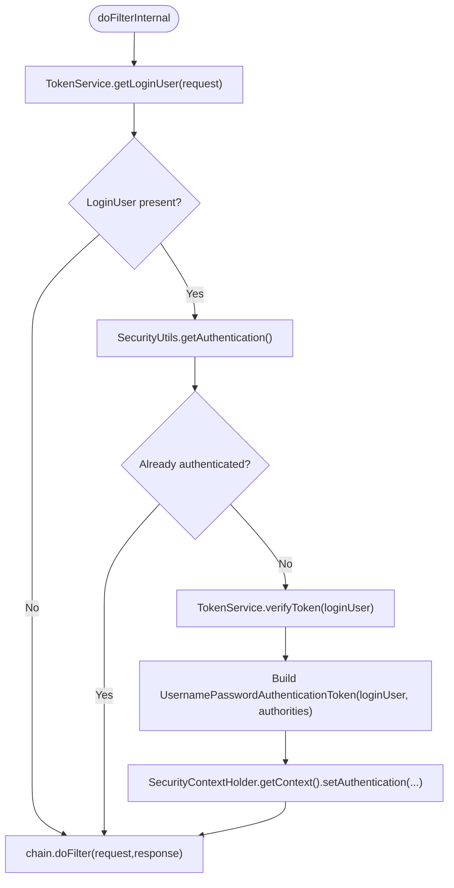

**Diagram sources**
- [JwtAuthenticationTokenFilter.java](file://src/main/java/com/ruoyi/framework/security/filter/JwtAuthenticationTokenFilter.java#L30-L43)
- [SecurityUtils.java](file://src/main/java/com/ruoyi/common/utils/SecurityUtils.java#L83-L90)

**Section sources**
- [JwtAuthenticationTokenFilter.java](file://src/main/java/com/ruoyi/framework/security/filter/JwtAuthenticationTokenFilter.java#L30-L43)
- [SecurityUtils.java](file://src/main/java/com/ruoyi/common/utils/SecurityUtils.java#L83-L90)

### TokenService
Responsibilities:
- Parse JWT using Jwts.parser() with configured secret
- Extract claims and resolve LoginUser from Redis using CacheConstants.LOGIN_TOKEN_KEY + uuid
- Manage token TTL and refresh Redis entries
- Provide getUsernameFromToken for convenience

Key methods and flows:
- getLoginUser(request): Reads Authorization header, strips prefix, parses token, extracts uuid, builds Redis key, and retrieves LoginUser
- parseToken(token): Validates signature and returns Claims
- verifyToken(loginUser): Checks remaining TTL and refreshes if within threshold
- refreshToken(loginUser): Updates login/expiry timestamps and writes to Redis with expireTime minutes
- getToken(request): Extracts token from header and removes prefix
- getTokenKey(uuid): Builds Redis key using CacheConstants.LOGIN_TOKEN_KEY

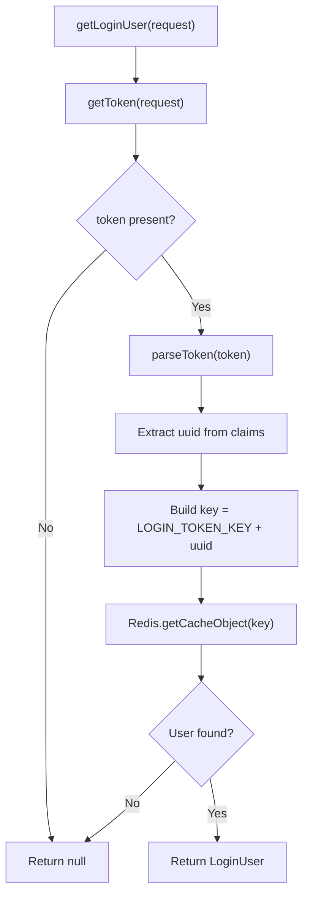

**Diagram sources**
- [TokenService.java](file://src/main/java/com/ruoyi/framework/security/service/TokenService.java#L62-L83)
- [CacheConstants.java](file://src/main/java/com/ruoyi/common/constant/CacheConstants.java#L10-L14)
- [Constants.java](file://src/main/java/com/ruoyi/common/constant/Constants.java#L104-L112)
- [RedisCache.java](file://src/main/java/com/ruoyi/framework/redis/RedisCache.java#L105-L109)

**Section sources**
- [TokenService.java](file://src/main/java/com/ruoyi/framework/security/service/TokenService.java#L62-L83)
- [TokenService.java](file://src/main/java/com/ruoyi/framework/security/service/TokenService.java#L192-L198)
- [TokenService.java](file://src/main/java/com/ruoyi/framework/security/service/TokenService.java#L133-L141)
- [TokenService.java](file://src/main/java/com/ruoyi/framework/security/service/TokenService.java#L148-L155)
- [TokenService.java](file://src/main/java/com/ruoyi/framework/security/service/TokenService.java#L218-L226)
- [TokenService.java](file://src/main/java/com/ruoyi/framework/security/service/TokenService.java#L228-L231)
- [CacheConstants.java](file://src/main/java/com/ruoyi/common/constant/CacheConstants.java#L10-L14)
- [Constants.java](file://src/main/java/com/ruoyi/common/constant/Constants.java#L104-L112)
- [RedisCache.java](file://src/main/java/com/ruoyi/framework/redis/RedisCache.java#L105-L109)

### SecurityConfig
Responsibilities:
- Configure stateless session management
- Register JwtAuthenticationTokenFilter before UsernamePasswordAuthenticationFilter
- Define permitted URLs and require authentication for other requests
- Wire AuthenticationEntryPointImpl for unauthenticated access

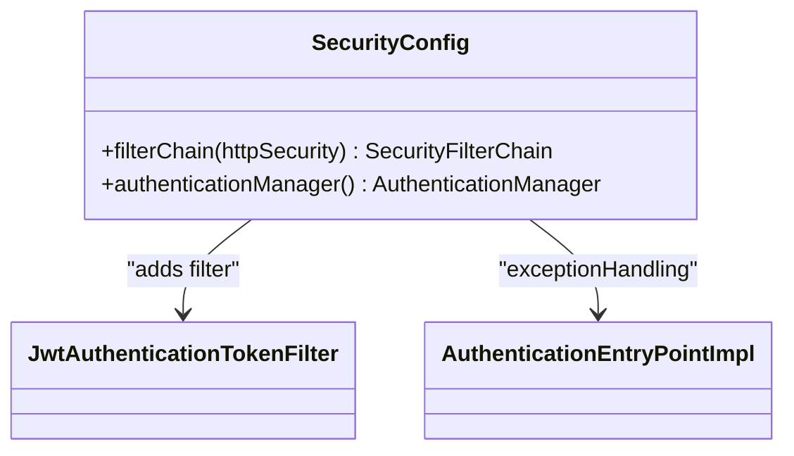

**Diagram sources**
- [SecurityConfig.java](file://src/main/java/com/ruoyi/framework/config/SecurityConfig.java#L96-L129)

**Section sources**
- [SecurityConfig.java](file://src/main/java/com/ruoyi/framework/config/SecurityConfig.java#L96-L129)

### SecurityUtils
Responsibilities:
- Provide access to current Authentication from SecurityContextHolder
- Used by JwtAuthenticationTokenFilter to avoid redundant processing

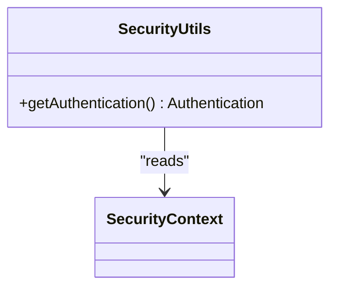

**Diagram sources**
- [SecurityUtils.java](file://src/main/java/com/ruoyi/common/utils/SecurityUtils.java#L83-L90)

**Section sources**
- [SecurityUtils.java](file://src/main/java/com/ruoyi/common/utils/SecurityUtils.java#L83-L90)

### RedisCache
Responsibilities:
- Provide typed get/set/delete operations for Redis
- Used by TokenService to retrieve and update LoginUser entries

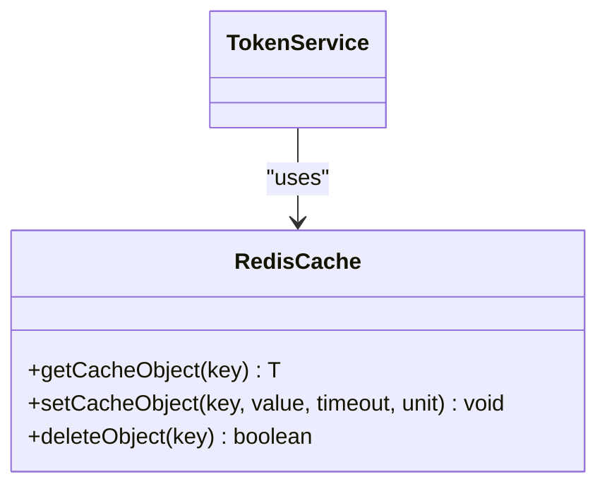

**Diagram sources**
- [RedisCache.java](file://src/main/java/com/ruoyi/framework/redis/RedisCache.java#L105-L109)
- [TokenService.java](file://src/main/java/com/ruoyi/framework/security/service/TokenService.java#L148-L155)

**Section sources**
- [RedisCache.java](file://src/main/java/com/ruoyi/framework/redis/RedisCache.java#L105-L109)
- [TokenService.java](file://src/main/java/com/ruoyi/framework/security/service/TokenService.java#L148-L155)

### CacheConstants and Constants
Responsibilities:
- Define Redis key prefix for login tokens
- Define token header prefix and claim keys used during parsing

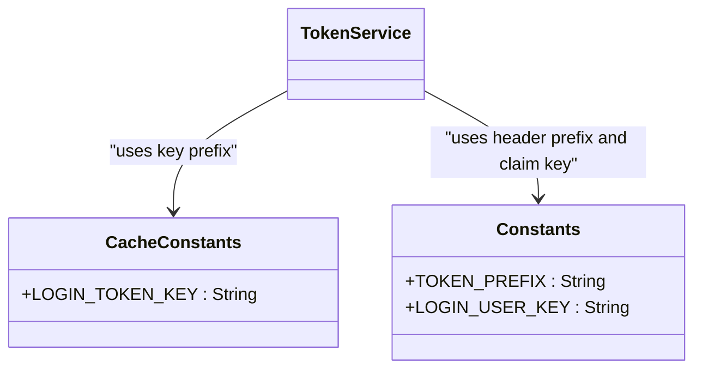

**Diagram sources**
- [CacheConstants.java](file://src/main/java/com/ruoyi/common/constant/CacheConstants.java#L10-L14)
- [Constants.java](file://src/main/java/com/ruoyi/common/constant/Constants.java#L104-L112)
- [TokenService.java](file://src/main/java/com/ruoyi/framework/security/service/TokenService.java#L218-L226)
- [TokenService.java](file://src/main/java/com/ruoyi/framework/security/service/TokenService.java#L228-L231)

**Section sources**
- [CacheConstants.java](file://src/main/java/com/ruoyi/common/constant/CacheConstants.java#L10-L14)
- [Constants.java](file://src/main/java/com/ruoyi/common/constant/Constants.java#L104-L112)
- [TokenService.java](file://src/main/java/com/ruoyi/framework/security/service/TokenService.java#L218-L226)
- [TokenService.java](file://src/main/java/com/ruoyi/framework/security/service/TokenService.java#L228-L231)

### application.yml
Responsibilities:
- Provide token.header, token.secret, and token.expireTime configuration values consumed by TokenService

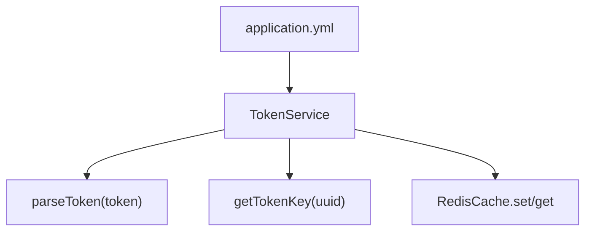

**Diagram sources**
- [application.yml](file://src/main/resources/application.yml#L91-L99)
- [TokenService.java](file://src/main/java/com/ruoyi/framework/security/service/TokenService.java#L192-L198)
- [TokenService.java](file://src/main/java/com/ruoyi/framework/security/service/TokenService.java#L228-L231)

**Section sources**
- [application.yml](file://src/main/resources/application.yml#L91-L99)
- [TokenService.java](file://src/main/java/com/ruoyi/framework/security/service/TokenService.java#L192-L198)
- [TokenService.java](file://src/main/java/com/ruoyi/framework/security/service/TokenService.java#L228-L231)

### AuthenticationEntryPointImpl
Responsibilities:
- Handle unauthenticated requests by writing a standardized JSON error response

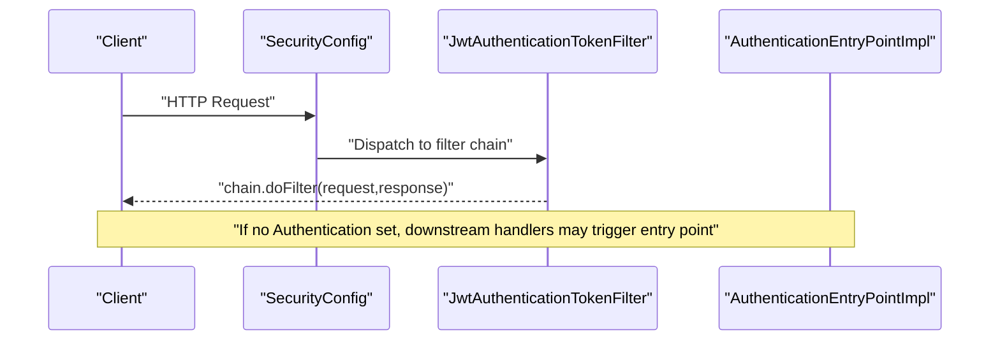

**Diagram sources**
- [AuthenticationEntryPointImpl.java](file://src/main/java/com/ruoyi/framework/security/handle/AuthenticationEntryPointImpl.java#L26-L33)

**Section sources**
- [AuthenticationEntryPointImpl.java](file://src/main/java/com/ruoyi/framework/security/handle/AuthenticationEntryPointImpl.java#L26-L33)

## Dependency Analysis
- JwtAuthenticationTokenFilter depends on TokenService and SecurityUtils
- TokenService depends on application.yml for configuration, CacheConstants for Redis keys, Constants for header prefix and claim keys, and RedisCache for persistence
- SecurityConfig wires JwtAuthenticationTokenFilter into the filter chain and sets stateless session policy
- AuthenticationEntryPointImpl is invoked by Spring Security when no Authentication is present

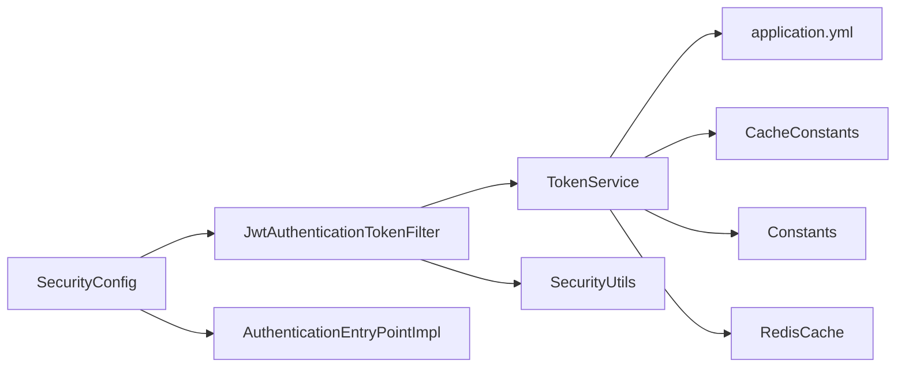

**Diagram sources**
- [JwtAuthenticationTokenFilter.java](file://src/main/java/com/ruoyi/framework/security/filter/JwtAuthenticationTokenFilter.java#L30-L43)
- [TokenService.java](file://src/main/java/com/ruoyi/framework/security/service/TokenService.java#L62-L83)
- [SecurityConfig.java](file://src/main/java/com/ruoyi/framework/config/SecurityConfig.java#L96-L129)
- [AuthenticationEntryPointImpl.java](file://src/main/java/com/ruoyi/framework/security/handle/AuthenticationEntryPointImpl.java#L26-L33)

**Section sources**
- [JwtAuthenticationTokenFilter.java](file://src/main/java/com/ruoyi/framework/security/filter/JwtAuthenticationTokenFilter.java#L30-L43)
- [TokenService.java](file://src/main/java/com/ruoyi/framework/security/service/TokenService.java#L62-L83)
- [SecurityConfig.java](file://src/main/java/com/ruoyi/framework/config/SecurityConfig.java#L96-L129)
- [AuthenticationEntryPointImpl.java](file://src/main/java/com/ruoyi/framework/security/handle/AuthenticationEntryPointImpl.java#L26-L33)

## Performance Considerations
- Stateless session policy reduces server memory footprint and simplifies scaling.
- Redis operations are lightweight and occur only when a token is present and not yet authenticated.
- TokenService.refreshToken avoids frequent Redis writes by checking TTL thresholds before updating.
- Using a single filter to set Authentication prevents repeated parsing and Redis lookups.

[No sources needed since this section provides general guidance]

## Troubleshooting Guide
Common scenarios and handling:
- Invalid or expired token:
  - TokenService.parseToken throws an exception caught and logged by TokenService.getLoginUser
  - The filter chain continues without setting Authentication, allowing downstream handlers to trigger AuthenticationEntryPointImpl
- Missing Authorization header or wrong prefix:
  - TokenService.getToken returns empty, leading to null LoginUser and no Authentication being set
- Redis connectivity issues:
  - RedisCache operations may fail; ensure Redis is reachable and credentials are correct
- Misconfigured token.secret:
  - Signature verification fails; ensure token.secret matches the value used to sign tokens

**Section sources**
- [TokenService.java](file://src/main/java/com/ruoyi/framework/security/service/TokenService.java#L62-L83)
- [TokenService.java](file://src/main/java/com/ruoyi/framework/security/service/TokenService.java#L192-L198)
- [AuthenticationEntryPointImpl.java](file://src/main/java/com/ruoyi/framework/security/handle/AuthenticationEntryPointImpl.java#L26-L33)

## Conclusion
RuoYi-Vue’s JWT token validation is implemented through a dedicated filter that integrates tightly with TokenService and Redis. The filter extracts the token from the Authorization header, validates its signature using the configured secret, retrieves the LoginUser from Redis using the token’s UUID as the cache key, and sets Authentication in SecurityContext when appropriate. The system remains stateless, leverages Redis for fast lookups, and handles invalid/expired tokens gracefully by logging errors and continuing the filter chain, allowing centralized unauthenticated handling.