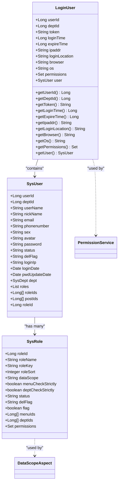
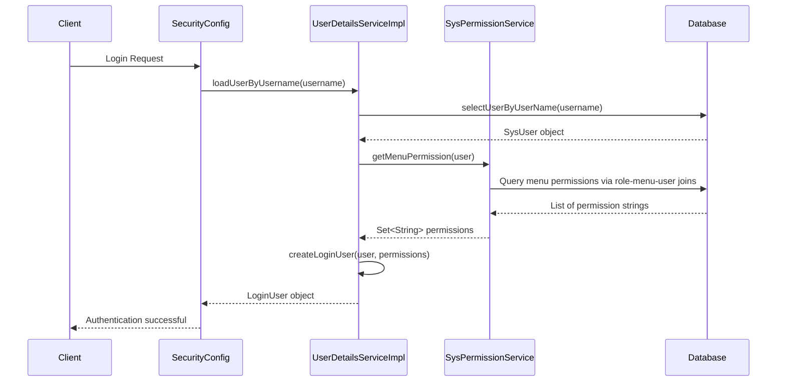
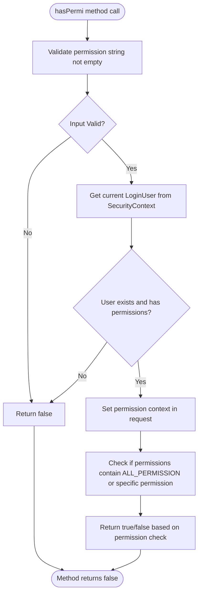
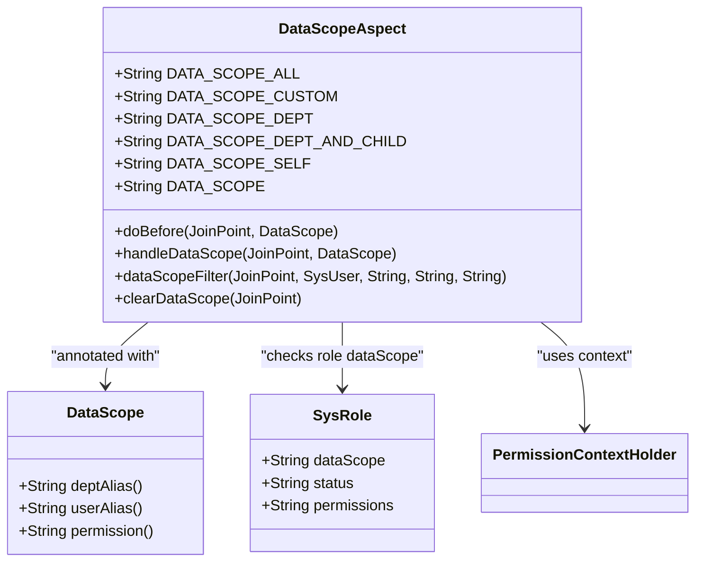
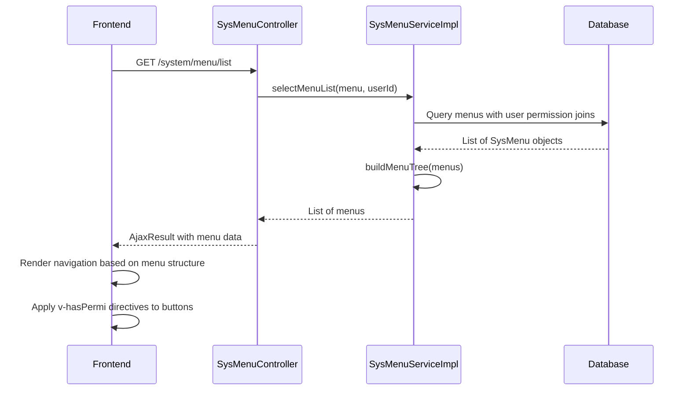
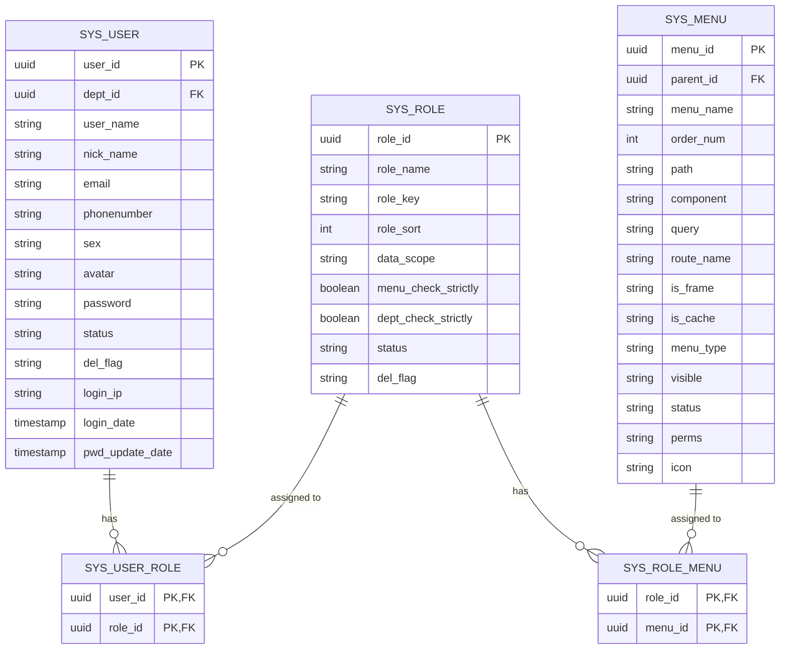

# Authorization

<cite>
**Referenced Files in This Document**   
- [LoginUser.java](file://src/main/java/com/ruoyi/framework/security/LoginUser.java)
- [PermissionService.java](file://src/main/java/com/ruoyi/framework/security/service/PermissionService.java)
- [DataScope.java](file://src/main/java/com/ruoyi/framework/aspectj/lang/annotation/DataScope.java)
- [DataScopeAspect.java](file://src/main/java/com/ruoyi/framework/aspectj/DataScopeAspect.java)
- [SysPermissionService.java](file://src/main/java/com/ruoyi/framework/security/service/SysPermissionService.java)
- [SecurityConfig.java](file://src/main/java/com/ruoyi/framework/config/SecurityConfig.java)
- [PermissionContextHolder.java](file://src/main/java/com/ruoyi/framework/security/context/PermissionContextHolder.java)
- [SecurityUtils.java](file://src/main/java/com/ruoyi/common/utils/SecurityUtils.java)
- [SysRole.java](file://src/main/java/com/ruoyi/project/system/domain/SysRole.java)
- [SysUser.java](file://src/main/java/com/ruoyi/project/system/domain/SysUser.java)
- [UserDetailsServiceImpl.java](file://src/main/java/com/ruoyi/framework/security/service/UserDetailsServiceImpl.java)
- [SysMenuController.java](file://src/main/java/com/ruoyi/project/system/controller/SysMenuController.java)
- [SysMenuServiceImpl.java](file://src/main/java/com/ruoyi/project/system/service/impl/SysMenuServiceImpl.java)
- [Constants.java](file://src/main/java/com/ruoyi/common/constant/Constants.java)
- [SysMenuMapper.xml](file://src/main/resources/mybatis/system/SysMenuMapper.xml)
</cite>

## Table of Contents
1. [Introduction](#introduction)
2. [Role-Based Access Control (RBAC) Implementation](#role-based-access-control-rbac-implementation)
3. [Permission Storage and Loading](#permission-storage-and-loading)
4. [PermissionService and hasPermi Method](#permissionservice-and-haspermi-method)
5. [Data Scope Permissions](#data-scope-permissions)
6. [Menu Permission Loading and Frontend Integration](#menu-permission-loading-and-frontend-integration)
7. [Role, Menu, and Permission Integration](#role-menu-and-permission-integration)
8. [Conclusion](#conclusion)

## Introduction
The RuoYi-Vue authorization system implements a comprehensive security model based on Spring Security, featuring role-based access control (RBAC), method-level security, data scope filtering, and dynamic menu permissions. This document details how the system manages user permissions, enforces access control, and integrates backend security with frontend UI rendering. The authorization framework combines Spring Security's annotation-based security with custom implementations to provide fine-grained control over both functionality access and data visibility.

## Role-Based Access Control (RBAC) Implementation

The RuoYi-Vue system implements a robust Role-Based Access Control (RBAC) model using Spring Security's method-level security annotations. The core of this implementation is the `@PreAuthorize` annotation, which is used throughout the controller layer to enforce permission checks on specific endpoints. The system leverages Spring Security's expression-based access control, allowing for flexible and powerful authorization rules.

The security configuration is defined in `SecurityConfig.java`, which enables method-level security through the `@EnableMethodSecurity` annotation with both `prePostEnabled = true` and `securedEnabled = true`. This configuration allows the use of `@PreAuthorize`, `@PostAuthorize`, `@Secured`, and other Spring Security annotations across the application.

**Diagram sources**
- [LoginUser.java](file://src/main/java/com/ruoyi/framework/security/LoginUser.java#L1-L267)
- [SysUser.java](file://src/main/java/com/ruoyi/project/system/domain/SysUser.java#L1-L341)
- [SysRole.java](file://src/main/java/com/ruoyi/project/system/domain/SysRole.java#L1-L242)

**Section sources**
- [SecurityConfig.java](file://src/main/java/com/ruoyi/framework/config/SecurityConfig.java#L1-L140)
- [LoginUser.java](file://src/main/java/com/ruoyi/framework/security/LoginUser.java#L1-L267)

## Permission Storage and Loading

Permissions in the RuoYi-Vue system are stored in the database and loaded into the `LoginUser` object during the authentication process. The permission data is primarily stored in the `sys_menu` table, where each menu item has a `perms` field that contains the permission string (e.g., "system:user:list"). These permission strings follow a standardized format of "module:action:type" to provide clear and consistent access control.

During user authentication, the `UserDetailsServiceImpl` class is responsible for loading the user's permissions. When a user logs in, the `loadUserByUsername` method retrieves the user information from the database and then calls `createLoginUser` to construct the `LoginUser` object. This process involves calling `SysPermissionService.getMenuPermission(user)` to retrieve all permissions associated with the user's roles.

The `SysPermissionService` class implements the logic for retrieving menu permissions. For administrator users (those with userId = 1), the system grants the `ALL_PERMISSION` constant ("*:*:*"), which provides access to all endpoints. For regular users, the service retrieves permissions by joining the user, role, and menu tables through the role-menu relationship. The permissions are stored as a `Set<String>` in the `LoginUser` object, ensuring uniqueness and efficient lookup.

**Diagram sources**
- [UserDetailsServiceImpl.java](file://src/main/java/com/ruoyi/framework/security/service/UserDetailsServiceImpl.java#L1-L66)
- [SysPermissionService.java](file://src/main/java/com/ruoyi/framework/security/service/SysPermissionService.java#L1-L90)
- [SysMenuMapper.xml](file://src/main/resources/mybatis/system/SysMenuMapper.xml#L1-L206)

**Section sources**
- [UserDetailsServiceImpl.java](file://src/main/java/com/ruoyi/framework/security/service/UserDetailsServiceImpl.java#L1-L66)
- [SysPermissionService.java](file://src/main/java/com/ruoyi/framework/security/service/SysPermissionService.java#L1-L90)
- [SysMenuMapper.xml](file://src/main/resources/mybatis/system/SysMenuMapper.xml#L1-L206)

## PermissionService and hasPermi Method

The `PermissionService` class is the central component for permission checking in the RuoYi-Vue system. Registered as a Spring bean with the name "ss" (an abbreviation for Spring Security), this service provides methods that can be called from within `@PreAuthorize` expressions using the syntax `@ss.hasPermi('permission:string')`.

The core method is `hasPermi(String permission)`, which checks whether the currently authenticated user possesses the specified permission. The method first validates that the permission string is not empty, then retrieves the current `LoginUser` from the security context using `SecurityUtils.getLoginUser()`. It then calls the private `hasPermissions` method to determine if the user's permission set contains either the `ALL_PERMISSION` wildcard ("*:*:*") or the specific permission being checked.

The service also provides complementary methods such as `hasAnyPermi(String permissions)` for checking if the user has any of a comma-separated list of permissions, and role-based methods like `hasRole(String role)` and `hasAnyRoles(String roles)`. These methods follow a similar pattern of retrieving the current user and checking against their role assignments, with special handling for the super-admin role (roleKey = "admin").

**Diagram sources**
- [PermissionService.java](file://src/main/java/com/ruoyi/framework/security/service/PermissionService.java#L1-L160)
- [SecurityUtils.java](file://src/main/java/com/ruoyi/common/utils/SecurityUtils.java#L1-L177)

**Section sources**
- [PermissionService.java](file://src/main/java/com/ruoyi/framework/security/service/PermissionService.java#L1-L160)

## Data Scope Permissions

The RuoYi-Vue system implements data scope permissions through the `@DataScope` annotation and the `DataScopeAspect` aspect-oriented programming component. This feature allows for row-level data filtering based on user roles and department hierarchies, ensuring that users can only access data they are authorized to see.

The `@DataScope` annotation is applied to service methods that retrieve data from the database. It has three key attributes: `deptAlias` (the SQL alias for the department table), `userAlias` (the SQL alias for the user table), and `permission` (optional permission string for role filtering). When a method with this annotation is invoked, the `DataScopeAspect` intercepts the call and dynamically appends a WHERE clause to the SQL query to filter results based on the user's data scope.

The data scope functionality supports five different scope types defined as constants in `DataScopeAspect`:
- ALL ("1"): All data - no filtering applied
- CUSTOM ("2"): Custom data - access to departments assigned to the user's roles
- DEPT ("3"): Department data - access only to the user's own department
- DEPT_AND_CHILD ("4"): Department and child data - access to the user's department and all sub-departments
- SELF ("5"): Self data - access only to the user's own records

**Diagram sources**
- [DataScope.java](file://src/main/java/com/ruoyi/framework/aspectj/lang/annotation/DataScope.java#L1-L34)
- [DataScopeAspect.java](file://src/main/java/com/ruoyi/framework/aspectj/DataScopeAspect.java#L1-L185)

**Section sources**
- [DataScope.java](file://src/main/java/com/ruoyi/framework/aspectj/lang/annotation/DataScope.java#L1-L34)
- [DataScopeAspect.java](file://src/main/java/com/ruoyi/framework/aspectj/DataScopeAspect.java#L1-L185)

## Menu Permission Loading and Frontend Integration

The RuoYi-Vue system dynamically loads menu permissions and integrates them with the frontend Vue application to control UI element visibility. The backend provides endpoints that return menu structures with permission information, which the frontend uses to render the navigation menu and show/hide buttons and actions.

The `SysMenuController` exposes several endpoints for menu retrieval, all protected by `@PreAuthorize` annotations that check specific permissions (e.g., `@ss.hasPermi('system:menu:list')`). The `list` method returns a filtered list of menus based on the authenticated user's permissions, while the `treeselect` and `roleMenuTreeselect` methods provide tree-structured menu data for selection components.

On the frontend, the system uses the retrieved menu data to build the navigation structure. The `buildMenus` method in `SysMenuServiceImpl` transforms the menu entities into `RouterVo` objects that define the Vue Router configuration, including route paths, components, and meta information. The `visible` field from the menu determines whether a menu item appears in the navigation, while the `perms` field is used to control button-level permissions.

The frontend stores the user's permissions in Vuex store after login and uses custom directives like `v-hasPermi` to conditionally render UI elements. This creates a seamless experience where users only see functionality they are authorized to access, with both navigation items and action buttons being hidden when permissions are lacking.

**Diagram sources**
- [SysMenuController.java](file://src/main/java/com/ruoyi/project/system/controller/SysMenuController.java#L1-L142)
- [SysMenuServiceImpl.java](file://src/main/java/com/ruoyi/project/system/service/impl/SysMenuServiceImpl.java#L1-L544)

**Section sources**
- [SysMenuController.java](file://src/main/java/com/ruoyi/project/system/controller/SysMenuController.java#L1-L142)
- [SysMenuServiceImpl.java](file://src/main/java/com/ruoyi/project/system/service/impl/SysMenuServiceImpl.java#L1-L544)

## Role, Menu, and Permission Integration

The RuoYi-Vue authorization system integrates role management, menu configuration, and permission checking through a well-defined relationship between database entities and service components. The core integration points are the `sys_role`, `sys_menu`, and `sys_role_menu` tables, which establish the many-to-many relationship between roles and menus.

When a user logs in, the system loads their roles and associated menu permissions through a series of database joins. The `SysPermissionService` coordinates this process by first checking if the user is an administrator (which grants all permissions), then retrieving the user's roles and their associated menu permissions. The `selectMenuPermsByUserId` method in `SysMenuMapper` performs the necessary SQL joins between `sys_user`, `sys_user_role`, `sys_role_menu`, and `sys_menu` to collect all permission strings for the user.

The integration extends to the data scope functionality, where the `dataScope` field in the `SysRole` entity determines the level of data access for users with that role. The `DataScopeAspect` uses this information to dynamically filter data queries based on the user's role assignments. This creates a comprehensive security model where both functionality access (via menu permissions) and data visibility (via data scope) are controlled through role assignments.

The system also provides administrative interfaces for managing this integration. The role management page allows administrators to assign menus to roles, with options to control whether parent and child menu selections are strictly enforced. This configuration directly affects the permissions granted to users with those roles, creating a flexible and maintainable authorization system.

**Diagram sources**
- [SysUser.java](file://src/main/java/com/ruoyi/project/system/domain/SysUser.java#L1-L341)
- [SysRole.java](file://src/main/java/com/ruoyi/project/system/domain/SysRole.java#L1-L242)
- [SysMenu.java](file://src/main/java/com/ruoyi/project/system/domain/SysMenu.java#L1-L300)
- [SysMenuMapper.xml](file://src/main/resources/mybatis/system/SysMenuMapper.xml#L1-L206)

**Section sources**
- [SysUser.java](file://src/main/java/com/ruoyi/project/system/domain/SysUser.java#L1-L341)
- [SysRole.java](file://src/main/java/com/ruoyi/project/system/domain/SysRole.java#L1-L242)
- [SysMenu.java](file://src/main/java/com/ruoyi/project/system/domain/SysMenu.java#L1-L300)

## Conclusion
The RuoYi-Vue authorization system provides a comprehensive and flexible security framework based on Spring Security's RBAC model. The system effectively combines method-level security annotations with custom service implementations to control access to endpoints, while also implementing sophisticated data scope filtering through aspect-oriented programming. The integration between role management, menu configuration, and permission checking creates a cohesive authorization model where administrators can control both functionality access and data visibility through role assignments. The dynamic loading of menu permissions enables seamless frontend integration, ensuring that users only see UI elements they are authorized to interact with. This multi-layered approach to security provides both strong protection and a good user experience.