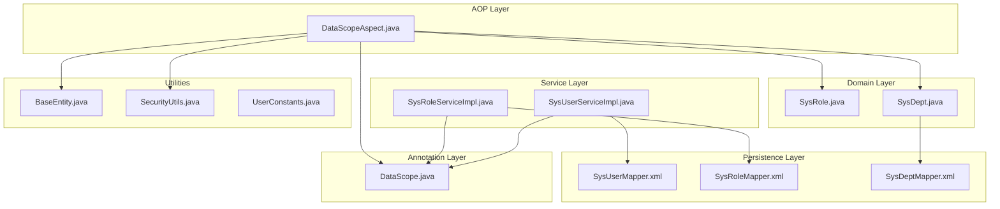
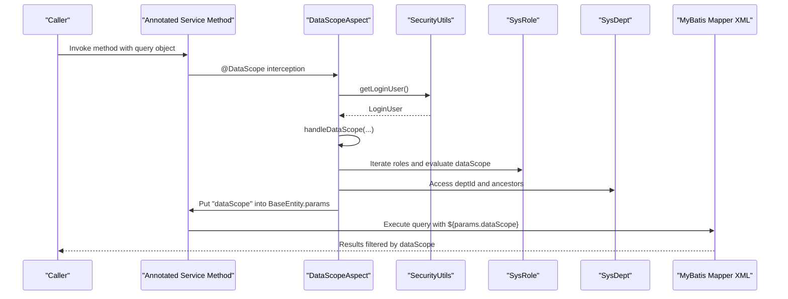
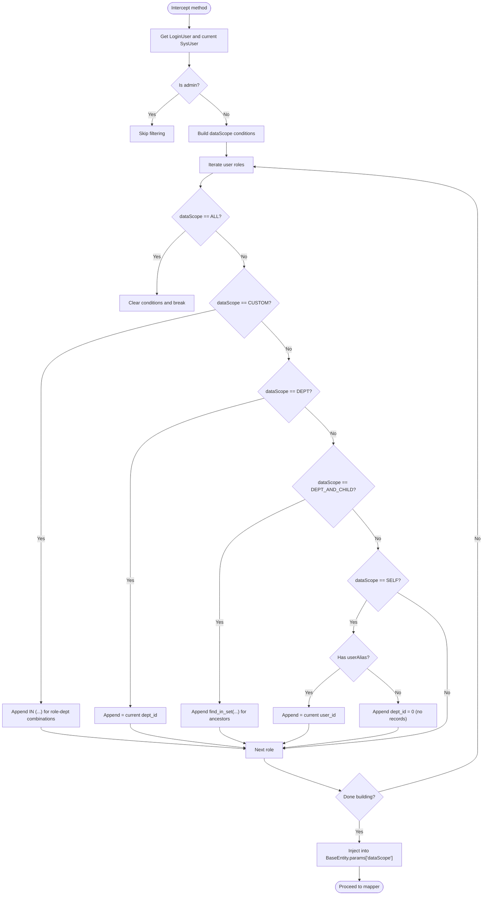
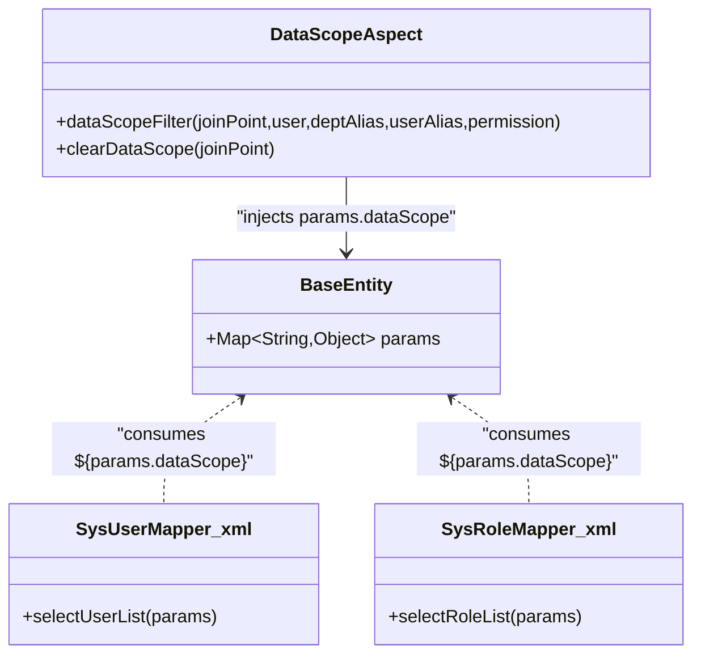
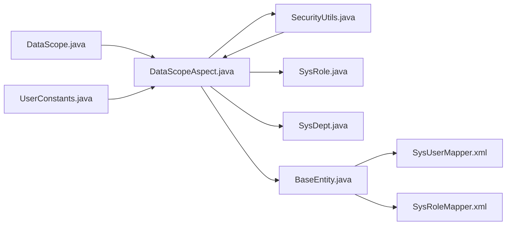

# Data Scope Permissions

<cite>
**Referenced Files in This Document**
- [DataScope.java](file://src/main/java/com/ruoyi/framework/aspectj/lang/annotation/DataScope.java)
- [DataScopeAspect.java](file://src/main/java/com/ruoyi/framework/aspectj/DataScopeAspect.java)
- [BaseEntity.java](file://src/main/java/com/ruoyi/framework/web/domain/BaseEntity.java)
- [SysUserServiceImpl.java](file://src/main/java/com/ruoyi/project/system/service/impl/SysUserServiceImpl.java)
- [SysRoleServiceImpl.java](file://src/main/java/com/ruoyi/project/system/service/impl/SysRoleServiceImpl.java)
- [SysUserMapper.xml](file://src/main/resources/mybatis/system/SysUserMapper.xml)
- [SysRoleMapper.xml](file://src/main/resources/mybatis/system/SysRoleMapper.xml)
- [SysDeptMapper.xml](file://src/main/resources/mybatis/system/SysDeptMapper.xml)
- [SysDept.java](file://src/main/java/com/ruoyi/project/system/domain/SysDept.java)
- [SysRole.java](file://src/main/java/com/ruoyi/project/system/domain/SysRole.java)
- [SecurityUtils.java](file://src/main/java/com/ruoyi/common/utils/SecurityUtils.java)
- [UserConstants.java](file://src/main/java/com/ruoyi/common/constant/UserConstants.java)
</cite>

## Table of Contents
1. [Introduction](#introduction)
2. [Project Structure](#project-structure)
3. [Core Components](#core-components)
4. [Architecture Overview](#architecture-overview)
5. [Detailed Component Analysis](#detailed-component-analysis)
6. [Dependency Analysis](#dependency-analysis)
7. [Performance Considerations](#performance-considerations)
8. [Troubleshooting Guide](#troubleshooting-guide)
9. [Conclusion](#conclusion)

## Introduction
This document explains the data scope permission system in RuoYi-Vue. It focuses on the @DataScope annotation and its parameters (deptAlias, userAlias, permission), the DataScopeAspect AOP implementation that dynamically injects SQL WHERE clauses based on user roles and department hierarchies, and the five data scope types (ALL, CUSTOM, DEPT, DEPT_AND_CHILD, SELF). It also covers how department ancestry tracking (find_in_set) enables hierarchical data access, how role-based data scope settings in SysRole determine filtering logic, and how the aspect integrates with BaseEntity’s params map to modify query conditions. Practical examples of service methods annotated with @DataScope are included, along with guidance on common issues and performance considerations.

## Project Structure
The data scope permission system spans annotations, AOP, domain models, services, and MyBatis mapper XML files. The key files are organized as follows:
- Annotation: @DataScope defines filtering behavior for annotated methods.
- Aspect: DataScopeAspect intercepts method calls, evaluates user roles, and injects SQL filters into the query parameter map.
- Domain models: SysRole and SysDept carry data scope configuration and ancestor relationships.
- Services: Annotated service methods trigger the AOP filtering pipeline.
- MyBatis XML: Mapper statements consume the injected params.dataScope to apply dynamic WHERE clauses.

**Diagram sources**
- [DataScope.java](file://src/main/java/com/ruoyi/framework/aspectj/lang/annotation/DataScope.java#L1-L34)
- [DataScopeAspect.java](file://src/main/java/com/ruoyi/framework/aspectj/DataScopeAspect.java#L1-L185)
- [SysUserServiceImpl.java](file://src/main/java/com/ruoyi/project/system/service/impl/SysUserServiceImpl.java#L70-L106)
- [SysRoleServiceImpl.java](file://src/main/java/com/ruoyi/project/system/service/impl/SysRoleServiceImpl.java#L54-L60)
- [SysUserMapper.xml](file://src/main/resources/mybatis/system/SysUserMapper.xml#L60-L122)
- [SysRoleMapper.xml](file://src/main/resources/mybatis/system/SysRoleMapper.xml#L33-L57)
- [SysDeptMapper.xml](file://src/main/resources/mybatis/system/SysDeptMapper.xml#L77-L83)
- [SysRole.java](file://src/main/java/com/ruoyi/project/system/domain/SysRole.java#L38-L40)
- [SysDept.java](file://src/main/java/com/ruoyi/project/system/domain/SysDept.java#L28-L30)
- [BaseEntity.java](file://src/main/java/com/ruoyi/framework/web/domain/BaseEntity.java#L41-L44)
- [SecurityUtils.java](file://src/main/java/com/ruoyi/common/utils/SecurityUtils.java#L71-L81)
- [UserConstants.java](file://src/main/java/com/ruoyi/common/constant/UserConstants.java#L24-L28)

**Section sources**
- [DataScope.java](file://src/main/java/com/ruoyi/framework/aspectj/lang/annotation/DataScope.java#L1-L34)
- [DataScopeAspect.java](file://src/main/java/com/ruoyi/framework/aspectj/DataScopeAspect.java#L1-L185)
- [SysUserServiceImpl.java](file://src/main/java/com/ruoyi/project/system/service/impl/SysUserServiceImpl.java#L70-L106)
- [SysRoleServiceImpl.java](file://src/main/java/com/ruoyi/project/system/service/impl/SysRoleServiceImpl.java#L54-L60)
- [SysUserMapper.xml](file://src/main/resources/mybatis/system/SysUserMapper.xml#L60-L122)
- [SysRoleMapper.xml](file://src/main/resources/mybatis/system/SysRoleMapper.xml#L33-L57)
- [SysDeptMapper.xml](file://src/main/resources/mybatis/system/SysDeptMapper.xml#L77-L83)
- [SysRole.java](file://src/main/java/com/ruoyi/project/system/domain/SysRole.java#L38-L40)
- [SysDept.java](file://src/main/java/com/ruoyi/project/system/domain/SysDept.java#L28-L30)
- [BaseEntity.java](file://src/main/java/com/ruoyi/framework/web/domain/BaseEntity.java#L41-L44)
- [SecurityUtils.java](file://src/main/java/com/ruoyi/common/utils/SecurityUtils.java#L71-L81)
- [UserConstants.java](file://src/main/java/com/ruoyi/common/constant/UserConstants.java#L24-L28)

## Core Components
- @DataScope annotation
  - Controls SQL filtering behavior for annotated methods.
  - Parameters:
    - deptAlias: Department table alias used in generated WHERE clause fragments.
    - userAlias: User table alias used for SELF scope and validation.
    - permission: Optional permission string(s) used to match against role permissions.
- DataScopeAspect AOP
  - Intercepts methods annotated with @DataScope.
  - Builds SQL WHERE conditions based on user roles and department hierarchy.
  - Injects the condition into BaseEntity.params under the key "dataScope".
- BaseEntity
  - Provides a params map used to pass dynamic query parameters to MyBatis.
- Role and Dept models
  - SysRole carries dataScope and permissions.
  - SysDept carries ancestors for hierarchical filtering.

**Section sources**
- [DataScope.java](file://src/main/java/com/ruoyi/framework/aspectj/lang/annotation/DataScope.java#L1-L34)
- [DataScopeAspect.java](file://src/main/java/com/ruoyi/framework/aspectj/DataScopeAspect.java#L66-L170)
- [BaseEntity.java](file://src/main/java/com/ruoyi/framework/web/domain/BaseEntity.java#L41-L44)
- [SysRole.java](file://src/main/java/com/ruoyi/project/system/domain/SysRole.java#L38-L40)
- [SysDept.java](file://src/main/java/com/ruoyi/project/system/domain/SysDept.java#L28-L30)

## Architecture Overview
The data scope filtering pipeline operates as follows:
- A service method annotated with @DataScope is invoked.
- DataScopeAspect intercepts the call, retrieves the current user, and computes applicable data scope conditions.
- Conditions are combined into a single SQL fragment and stored in BaseEntity.params["dataScope"].
- MyBatis mapper XML consumes ${params.dataScope} to append the dynamic WHERE clause.

**Diagram sources**
- [DataScopeAspect.java](file://src/main/java/com/ruoyi/framework/aspectj/DataScopeAspect.java#L66-L170)
- [SysUserMapper.xml](file://src/main/resources/mybatis/system/SysUserMapper.xml#L82-L87)
- [SysRoleMapper.xml](file://src/main/resources/mybatis/system/SysRoleMapper.xml#L54-L56)
- [SecurityUtils.java](file://src/main/java/com/ruoyi/common/utils/SecurityUtils.java#L71-L81)
- [SysRole.java](file://src/main/java/com/ruoyi/project/system/domain/SysRole.java#L38-L40)
- [SysDept.java](file://src/main/java/com/ruoyi/project/system/domain/SysDept.java#L28-L30)

## Detailed Component Analysis

### @DataScope Annotation
- Purpose: Declares that a method’s query should be filtered by data scope rules.
- Parameters:
  - deptAlias: Used to qualify department-related columns in generated WHERE fragments.
  - userAlias: Used to qualify user-related columns for SELF scope and validation.
  - permission: Optional; restricts filtering to roles whose permissions contain the given string(s).

Practical usage examples:
- User list queries with department and user aliases:
  - [SysUserServiceImpl.selectUserList](file://src/main/java/com/ruoyi/project/system/service/impl/SysUserServiceImpl.java#L75-L80)
  - [SysUserServiceImpl.selectAllocatedList](file://src/main/java/com/ruoyi/project/system/service/impl/SysUserServiceImpl.java#L88-L93)
  - [SysUserServiceImpl.selectUnallocatedList](file://src/main/java/com/ruoyi/project/system/service/impl/SysUserServiceImpl.java#L101-L106)
- Role list query with department alias:
  - [SysRoleServiceImpl.selectRoleList](file://src/main/java/com/ruoyi/project/system/service/impl/SysRoleServiceImpl.java#L54-L60)

**Section sources**
- [DataScope.java](file://src/main/java/com/ruoyi/framework/aspectj/lang/annotation/DataScope.java#L1-L34)
- [SysUserServiceImpl.java](file://src/main/java/com/ruoyi/project/system/service/impl/SysUserServiceImpl.java#L70-L106)
- [SysRoleServiceImpl.java](file://src/main/java/com/ruoyi/project/system/service/impl/SysRoleServiceImpl.java#L54-L60)

### DataScopeAspect AOP Implementation
Key responsibilities:
- Intercept annotated methods and clear previous dataScope values.
- Build SQL WHERE conditions based on user roles and permissions.
- Inject the condition into BaseEntity.params["dataScope"].

Behavior highlights:
- Super admin bypass: If the current user is admin, no filtering is applied.
- Permission filtering: If permission is provided, only roles whose permissions contain the given string(s) contribute to the WHERE clause.
- Condition precedence: If ANY role has dataScope ALL, the WHERE clause is cleared (no filtering).
- Custom scope optimization: Multiple CUSTOM scopes are combined using IN (...) to reduce SQL complexity.
- SELF scope fallback: If userAlias is not provided for SELF, the clause ensures no records are returned.

SQL generation patterns by data scope type:
- ALL: Clears conditions so no filtering is applied.
- CUSTOM: Uses sys_role_dept to collect departments for roles with CUSTOM scope and builds IN (...) conditions.
- DEPT: Matches the user’s department ID.
- DEPT_AND_CHILD: Uses find_in_set to match the user’s department and all descendants.
- SELF: Matches the user’s user_id if userAlias is provided; otherwise ensures no records are returned.

Integration with BaseEntity:
- The aspect appends the computed WHERE fragment to BaseEntity.params["dataScope"].
- MyBatis mapper XML consumes ${params.dataScope} to apply the dynamic filter.

**Diagram sources**
- [DataScopeAspect.java](file://src/main/java/com/ruoyi/framework/aspectj/DataScopeAspect.java#L66-L170)

**Section sources**
- [DataScopeAspect.java](file://src/main/java/com/ruoyi/framework/aspectj/DataScopeAspect.java#L66-L170)
- [BaseEntity.java](file://src/main/java/com/ruoyi/framework/web/domain/BaseEntity.java#L41-L44)

### Five Data Scope Types and SQL Generation Patterns
- ALL
  - Behavior: No filtering; clears conditions.
  - SQL pattern: None appended.
- CUSTOM
  - Behavior: Filters by departments explicitly assigned to roles with CUSTOM scope.
  - SQL pattern: OR dept_id IN (SELECT dept_id FROM sys_role_dept WHERE role_id IN (...))
- DEPT
  - Behavior: Filters by the user’s current department only.
  - SQL pattern: OR dept_id = {current dept_id}
- DEPT_AND_CHILD
  - Behavior: Filters by the user’s department and all descendants using ancestors.
  - SQL pattern: OR dept_id IN (SELECT dept_id FROM sys_dept WHERE dept_id = {current dept_id} OR find_in_set({current dept_id}, ancestors))
- SELF
  - Behavior: Filters by the current user’s ID if userAlias is provided; otherwise returns no records.
  - SQL pattern: OR user_id = {current user_id} or OR dept_id = 0

These patterns are generated in the dataScopeFilter method and appended to params.dataScope.

**Section sources**
- [DataScopeAspect.java](file://src/main/java/com/ruoyi/framework/aspectj/DataScopeAspect.java#L114-L151)
- [SysDeptMapper.xml](file://src/main/resources/mybatis/system/SysDeptMapper.xml#L77-L83)

### Department Ancestry Tracking with find_in_set
- SysDept stores ancestors as a comma-separated list of ancestor IDs.
- find_in_set is used to match descendant departments efficiently.
- Example usage appears in:
  - User list query: [SysUserMapper.xml](file://src/main/resources/mybatis/system/SysUserMapper.xml#L82-L84)
  - Children retrieval: [SysDeptMapper.xml](file://src/main/resources/mybatis/system/SysDeptMapper.xml#L77-L83)
- DataScopeAspect leverages this mechanism for DEPT_AND_CHILD scope.

**Section sources**
- [SysDept.java](file://src/main/java/com/ruoyi/project/system/domain/SysDept.java#L28-L30)
- [SysUserMapper.xml](file://src/main/resources/mybatis/system/SysUserMapper.xml#L82-L84)
- [SysDeptMapper.xml](file://src/main/resources/mybatis/system/SysDeptMapper.xml#L77-L83)
- [DataScopeAspect.java](file://src/main/java/com/ruoyi/framework/aspectj/DataScopeAspect.java#L136-L140)

### Role-Based Data Scope Settings in SysRole
- SysRole.dataScope determines the filtering behavior for queries executed by users with that role.
- SysRole.permissions are used to match against the annotation’s permission parameter.
- The aspect iterates roles and applies conditions accordingly, honoring role status and permissions.

**Section sources**
- [SysRole.java](file://src/main/java/com/ruoyi/project/system/domain/SysRole.java#L38-L40)
- [DataScopeAspect.java](file://src/main/java/com/ruoyi/framework/aspectj/DataScopeAspect.java#L96-L113)

### Integration with BaseEntity’s Parameter Map
- The aspect modifies BaseEntity.params["dataScope"] to include the generated WHERE fragment.
- MyBatis mapper XML consumes ${params.dataScope} to inject the dynamic filter into the SQL.

**Diagram sources**
- [BaseEntity.java](file://src/main/java/com/ruoyi/framework/web/domain/BaseEntity.java#L41-L44)
- [DataScopeAspect.java](file://src/main/java/com/ruoyi/framework/aspectj/DataScopeAspect.java#L161-L170)
- [SysUserMapper.xml](file://src/main/resources/mybatis/system/SysUserMapper.xml#L82-L87)
- [SysRoleMapper.xml](file://src/main/resources/mybatis/system/SysRoleMapper.xml#L54-L56)

**Section sources**
- [BaseEntity.java](file://src/main/java/com/ruoyi/framework/web/domain/BaseEntity.java#L41-L44)
- [DataScopeAspect.java](file://src/main/java/com/ruoyi/framework/aspectj/DataScopeAspect.java#L161-L170)
- [SysUserMapper.xml](file://src/main/resources/mybatis/system/SysUserMapper.xml#L82-L87)
- [SysRoleMapper.xml](file://src/main/resources/mybatis/system/SysRoleMapper.xml#L54-L56)

## Dependency Analysis
- Annotation-to-Aspect coupling: DataScopeAspect reads @DataScope metadata from intercepted methods.
- Aspect-to-Domain coupling: The aspect depends on SysUser, SysRole, and SysDept for building conditions.
- Aspect-to-Utility coupling: SecurityUtils provides the current LoginUser; UserConstants defines role status constants.
- Aspect-to-Persistence coupling: The aspect writes into BaseEntity.params; MyBatis consumes it.

**Diagram sources**
- [DataScope.java](file://src/main/java/com/ruoyi/framework/aspectj/lang/annotation/DataScope.java#L1-L34)
- [DataScopeAspect.java](file://src/main/java/com/ruoyi/framework/aspectj/DataScopeAspect.java#L66-L170)
- [SecurityUtils.java](file://src/main/java/com/ruoyi/common/utils/SecurityUtils.java#L71-L81)
- [SysRole.java](file://src/main/java/com/ruoyi/project/system/domain/SysRole.java#L38-L40)
- [SysDept.java](file://src/main/java/com/ruoyi/project/system/domain/SysDept.java#L28-L30)
- [BaseEntity.java](file://src/main/java/com/ruoyi/framework/web/domain/BaseEntity.java#L41-L44)
- [SysUserMapper.xml](file://src/main/resources/mybatis/system/SysUserMapper.xml#L82-L87)
- [SysRoleMapper.xml](file://src/main/resources/mybatis/system/SysRoleMapper.xml#L54-L56)
- [UserConstants.java](file://src/main/java/com/ruoyi/common/constant/UserConstants.java#L24-L28)

**Section sources**
- [DataScopeAspect.java](file://src/main/java/com/ruoyi/framework/aspectj/DataScopeAspect.java#L66-L170)
- [SecurityUtils.java](file://src/main/java/com/ruoyi/common/utils/SecurityUtils.java#L71-L81)
- [UserConstants.java](file://src/main/java/com/ruoyi/common/constant/UserConstants.java#L24-L28)

## Performance Considerations
- find_in_set usage: While convenient for hierarchical matching, find_in_set can be slower on large datasets. Consider indexing ancestors appropriately and evaluating tree traversal strategies if performance becomes a concern.
- CUSTOM scope optimization: The aspect aggregates multiple CUSTOM role IDs into a single IN (...) clause to minimize SQL complexity.
- Role iteration: The aspect iterates roles and conditions; keep role counts reasonable to avoid excessive concatenation overhead.
- Injection safety: The aspect clears params.dataScope before injection to prevent SQL injection and stale filters.

[No sources needed since this section provides general guidance]

## Troubleshooting Guide
Common issues and resolutions:
- Alias conflicts
  - Symptom: Generated WHERE clause references ambiguous column names.
  - Resolution: Ensure deptAlias and userAlias match the actual table aliases used in the mapper XML and query joins.
  - Reference: [DataScopeAspect.java](file://src/main/java/com/ruoyi/framework/aspectj/DataScopeAspect.java#L120-L151)
- Improper scope configuration
  - Symptom: SELF scope returns no results.
  - Cause: userAlias not provided for SELF scope.
  - Resolution: Provide userAlias when using SELF scope; otherwise use DEPT or DEPT_AND_CHILD.
  - Reference: [DataScopeAspect.java](file://src/main/java/com/ruoyi/framework/aspectj/DataScopeAspect.java#L142-L150)
- Permission mismatch
  - Symptom: No records returned despite valid roles.
  - Cause: permission parameter does not match any role permissions.
  - Resolution: Verify the permission string(s) passed via @DataScope.permission().
  - Reference: [DataScopeAspect.java](file://src/main/java/com/ruoyi/framework/aspectj/DataScopeAspect.java#L96-L113)
- SUPER ADMIN bypass
  - Symptom: Filtering unexpectedly disabled.
  - Cause: Current user is admin.
  - Resolution: Admin users intentionally bypass filtering; ensure this is intended.
  - Reference: [DataScopeAspect.java](file://src/main/java/com/ruoyi/framework/aspectj/DataScopeAspect.java#L72-L79)
- Ancestor indexing
  - Symptom: DEPT_AND_CHILD scope slow on large trees.
  - Resolution: Ensure ancestors are properly maintained and indexed; consider optimizing tree updates.
  - References: [SysDept.java](file://src/main/java/com/ruoyi/project/system/domain/SysDept.java#L28-L30), [SysDeptMapper.xml](file://src/main/resources/mybatis/system/SysDeptMapper.xml#L77-L83)

**Section sources**
- [DataScopeAspect.java](file://src/main/java/com/ruoyi/framework/aspectj/DataScopeAspect.java#L72-L151)
- [SysDept.java](file://src/main/java/com/ruoyi/project/system/domain/SysDept.java#L28-L30)
- [SysDeptMapper.xml](file://src/main/resources/mybatis/system/SysDeptMapper.xml#L77-L83)

## Conclusion
RuoYi-Vue’s data scope permission system provides robust, role-driven filtering through a clean annotation-driven AOP approach. By leveraging @DataScope, DataScopeAspect, and MyBatis parameter injection, the system dynamically constructs WHERE clauses tailored to user roles and department hierarchies. Proper configuration of aliases, permissions, and role data scopes ensures accurate and secure data access. Performance can be optimized by careful use of find_in_set and maintaining efficient ancestor structures.