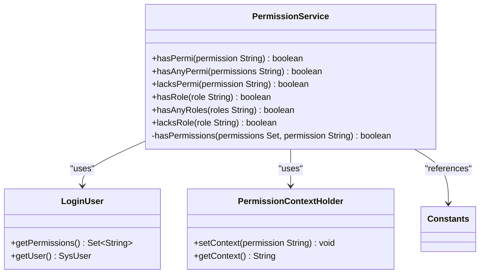
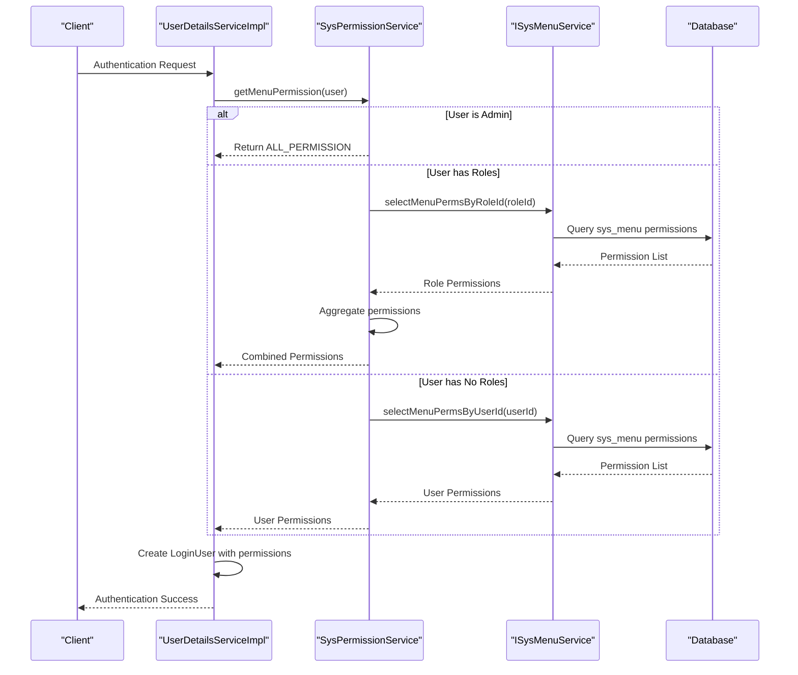
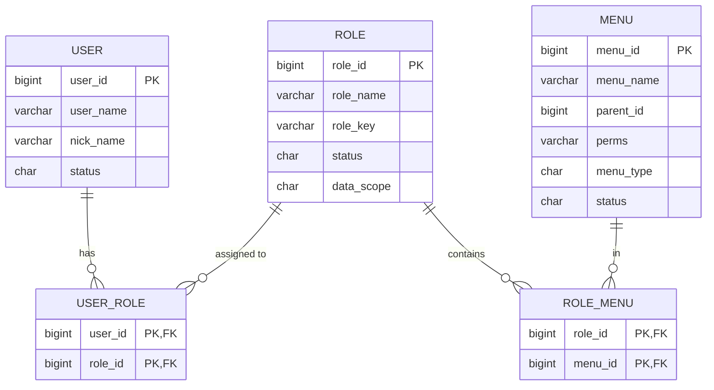
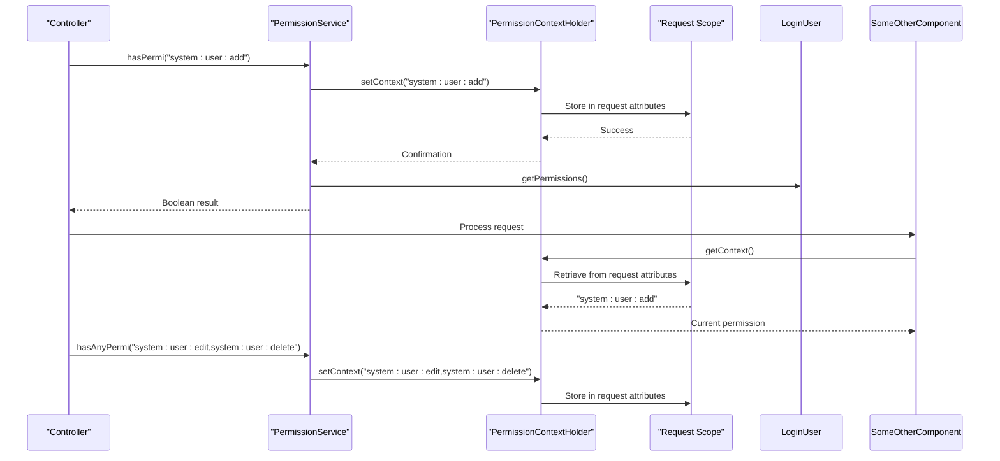

# Permission Checking Mechanisms

<cite>
**Referenced Files in This Document**   
- [PermissionService.java](file://src/main/java/com/ruoyi/framework/security/service/PermissionService.java)
- [SysPermissionService.java](file://src/main/java/com/ruoyi/framework/security/service/SysPermissionService.java)
- [LoginUser.java](file://src/main/java/com/ruoyi/framework/security/LoginUser.java)
- [PermissionContextHolder.java](file://src/main/java/com/ruoyi/framework/security/context/PermissionContextHolder.java)
- [SysMenu.java](file://src/main/java/com/ruoyi/project/system/domain/SysMenu.java)
- [SysRole.java](file://src/main/java/com/ruoyi/project/system/domain/SysRole.java)
- [UserDetailsServiceImpl.java](file://src/main/java/com/ruoyi/framework/security/service/UserDetailsServiceImpl.java)
- [Constants.java](file://src/main/java/com/ruoyi/common/constant/Constants.java)
- [UserConstants.java](file://src/main/java/com/ruoyi/common/constant/UserConstants.java)
- [SysMenuMapper.xml](file://src/main/resources/mybatis/system/SysMenuMapper.xml)
- [messages.properties](file://src/main/resources/i18n/messages.properties)
</cite>

## Table of Contents
1. [Introduction](#introduction)
2. [Core Permission Service](#core-permission-service)
3. [Permission Loading and Caching](#permission-loading-and-caching)
4. [Permission String Format and Usage](#permission-string-format-and-usage)
5. [Role-Based Permission Mapping](#role-based-permission-mapping)
6. [Permission Context Management](#permission-context-management)
7. [Implementation Flow Diagrams](#implementation-flow-diagrams)
8. [Conclusion](#conclusion)

## Introduction
The RuoYi-Vue framework implements a comprehensive permission checking mechanism that enables fine-grained access control for both frontend UI elements and backend API endpoints. At the core of this system is the `PermissionService` class, registered as the 'ss' bean, which provides methods for evaluating user permissions at runtime. This document details the architecture and implementation of the permission system, including how permissions are loaded from menu configurations, stored in the user context, and evaluated during request processing. The system supports role-based access control with special handling for administrator accounts and provides utilities for checking single permissions, any of multiple permissions, and role membership.

**Section sources**
- [PermissionService.java](file://src/main/java/com/ruoyi/framework/security/service/PermissionService.java#L13-L18)
- [SysPermissionService.java](file://src/main/java/com/ruoyi/framework/security/service/SysPermissionService.java#L17-L22)

## Core Permission Service
The `PermissionService` class serves as the primary interface for permission evaluation in RuoYi-Vue. Registered with the Spring container under the bean name 'ss', this service provides three core methods for fine-grained permission checking: `hasPermi`, `hasAnyPermi`, and `lacksPermi`. The `hasPermi` method evaluates whether the currently authenticated user possesses a specific permission by checking against the set of permissions stored in the `LoginUser` context. It first validates the input permission string and ensures a valid user session exists before performing the check. The method leverages the `PermissionContextHolder` to store the evaluated permission for potential auditing or logging purposes during the request lifecycle.

The `hasAnyPermi` method extends this functionality by allowing the evaluation of multiple permissions separated by the `PERMISSION_DELIMITER` (comma). This enables scenarios where a user needs to have at least one of several possible permissions to access a resource. The method iterates through each permission in the delimited string, returning true upon the first successful match. Complementing these positive checks, the `lacksPermi` method provides a convenient way to determine if a user does not have a specific permission by simply negating the result of `hasPermi`. All permission evaluations ultimately delegate to the private `hasPermissions` method, which implements the core logic of checking for either the `ALL_PERMISSION` wildcard or an exact match with the requested permission (after trimming whitespace).



**Diagram sources **
- [PermissionService.java](file://src/main/java/com/ruoyi/framework/security/service/PermissionService.java#L19-L159)
- [LoginUser.java](file://src/main/java/com/ruoyi/framework/security/LoginUser.java#L67-L249)
- [PermissionContextHolder.java](file://src/main/java/com/ruoyi/framework/security/context/PermissionContextHolder.java#L16-L27)

**Section sources**
- [PermissionService.java](file://src/main/java/com/ruoyi/framework/security/service/PermissionService.java#L27-L159)

## Permission Loading and Caching
Permissions are loaded during the user authentication process and cached within the `LoginUser` object for efficient runtime access. The loading process begins in the `UserDetailsServiceImpl` class, where the `createLoginUser` method is responsible for constructing the `LoginUser` object. This method calls `SysPermissionService.getMenuPermission(user)` to retrieve the complete set of permissions for the authenticated user. The `getMenuPermission` method in `SysPermissionService` implements the core permission loading logic, which varies based on the user's administrative status.

For administrator users (identified by `user.isAdmin()`), the system grants the `ALL_PERMISSION` wildcard ("*:*:*") which provides access to all system resources. For non-administrative users, the method retrieves permissions through role-based inheritance. It first obtains the user's roles and then iterates through each active role to collect its associated menu permissions via `ISysMenuService.selectMenuPermsByRoleId`. These permissions are aggregated into a single set and stored in the `LoginUser` context. The permissions are also set on the individual `SysRole` objects to support data scope filtering. For users without roles, permissions are loaded directly by user ID through `selectMenuPermsByUserId`. This loading mechanism ensures that all required permissions are available in memory during the user's session, eliminating the need for repeated database queries during permission checks.



**Diagram sources **
- [UserDetailsServiceImpl.java](file://src/main/java/com/ruoyi/framework/security/service/UserDetailsServiceImpl.java#L61-L64)
- [SysPermissionService.java](file://src/main/java/com/ruoyi/framework/security/service/SysPermissionService.java#L58-L88)
- [SysMenuMapper.xml](file://src/main/resources/mybatis/system/SysMenuMapper.xml#L106-L111)

**Section sources**
- [UserDetailsServiceImpl.java](file://src/main/java/com/ruoyi/framework/security/service/UserDetailsServiceImpl.java#L61-L64)
- [SysPermissionService.java](file://src/main/java/com/ruoyi/framework/security/service/SysPermissionService.java#L58-L88)

## Permission String Format and Usage
The permission system in RuoYi-Vue uses a standardized string format to identify specific operations on system resources. Permissions follow the pattern `module:entity:operation`, such as `system:user:add`, where the three segments represent the functional module, the target entity, and the specific operation being performed. This hierarchical structure enables both precise access control and flexible pattern matching. These permission strings are defined in the `perms` field of the `SysMenu` entity and stored in the `sys_menu` database table, directly linking UI elements and API endpoints to their corresponding permission requirements.

In practice, these permission strings are used in two primary contexts: frontend UI rendering and backend API authorization. On the frontend, Vue components can use the `@ss.hasPermi('permission:string')` syntax to conditionally display buttons or menu items based on the user's permissions. On the backend, Spring Security's `@PreAuthorize` annotation is used to protect controller methods, as demonstrated in the `SysMenuController` where endpoints are secured with expressions like `@PreAuthorize("@ss.hasPermi('system:menu:list')")`. When a permission check fails, the system returns appropriate error messages from the `messages.properties` file, such as "您没有数据的权限，请联系管理员添加权限 [{0}]" which includes the missing permission string for administrative reference.

```mermaid
flowchart TD
A[Permission String Format] --> B[module:entity:operation]
B --> C[Example: system:user:add]
C --> D{Usage Context}
D --> E[Frontend UI]
D --> F[Backend API]
E --> G[Vue v-if=\"@ss.hasPermi('system:user:add')\"]
F --> H[@PreAuthorize(\"@ss.hasPermi('system:user:list')\")]
H --> I[Controller Method]
G --> J[Button Visibility]
I --> K[Access Decision]
K --> L{Permission Check}
L --> |Success| M[Execute Method]
L --> |Fail| N[Return 403 Forbidden]
N --> O[Error Message from messages.properties]
```

**Diagram sources **
- [SysMenu.java](file://src/main/java/com/ruoyi/project/system/domain/SysMenu.java#L64-L227)
- [SysMenuController.java](file://src/main/java/com/ruoyi/project/system/controller/SysMenuController.java#L39-L40)
- [messages.properties](file://src/main/resources/i18n/messages.properties#L33-L38)

**Section sources**
- [SysMenu.java](file://src/main/java/com/ruoyi/project/system/domain/SysMenu.java#L64-L227)
- [SysMenuController.java](file://src/main/java/com/ruoyi/project/system/controller/SysMenuController.java#L39-L40)

## Role-Based Permission Mapping
The permission system implements a hierarchical role-based access control (RBAC) model where permissions are primarily assigned to roles rather than individual users. The `SysRole` entity represents these roles and contains a `roleKey` field that serves as the unique identifier for the role (e.g., "admin" or "common"). While the `roleKey` is used for role-based checks, the actual permissions are stored as a set of strings in the `permissions` field, which is populated from the associated menu items. This design separates role identification from permission assignment, allowing for flexible security configurations.

Role-to-permission mapping is established through the many-to-many relationship between `SysRole` and `SysMenu`, implemented via the `sys_role_menu` junction table in the database. When a user is assigned to a role, they inherit all permissions associated with that role's menu items. The system handles administrator privileges through special logic: users with the role ID of 1 (or those whose `isAdmin()` method returns true) are automatically granted the `ALL_PERMISSION` wildcard ("*:*:*"), bypassing individual permission checks. This is implemented in both `SysPermissionService.getMenuPermission` and `SysPermissionService.getRolePermission` methods. The role system also includes status management, where only roles with `ROLE_NORMAL` status (defined in `UserConstants`) are considered active for permission evaluation.



**Diagram sources **
- [SysRole.java](file://src/main/java/com/ruoyi/project/system/domain/SysRole.java#L32-L218)
- [SysMenu.java](file://src/main/java/com/ruoyi/project/system/domain/SysMenu.java#L64-L227)
- [UserConstants.java](file://src/main/java/com/ruoyi/common/constant/UserConstants.java#L24-L28)

**Section sources**
- [SysRole.java](file://src/main/java/com/ruoyi/project/system/domain/SysRole.java#L32-L218)
- [SysPermissionService.java](file://src/main/java/com/ruoyi/framework/security/service/SysPermissionService.java#L37-L48)

## Permission Context Management
The RuoYi-Vue framework employs a request-scoped context mechanism to track permission evaluations throughout the processing lifecycle. The `PermissionContextHolder` class provides static methods to set and retrieve the current permission being evaluated within the scope of an HTTP request. This context is implemented using Spring's `RequestContextHolder` with `SCOPE_REQUEST`, ensuring that permission information is isolated to the current thread and request. When a permission check is performed in `PermissionService.hasPermi` or `hasAnyPermi`, the requested permission string is stored in this context using `setContext`.

This contextual information serves multiple purposes: it enables auditing of which permissions were checked during a request, supports debugging by providing visibility into access control decisions, and facilitates integration with other aspects of the security framework. For example, the `DataScopeAspect` can access the current permission context to apply data scope filters based on the operation being performed. The context is automatically cleared at the end of each request by Spring's request scope management. This design pattern follows the ThreadLocal-based context holder pattern commonly used in Spring applications, providing a lightweight mechanism for propagating security-related information across method calls without requiring parameter passing.



**Diagram sources **
- [PermissionService.java](file://src/main/java/com/ruoyi/framework/security/service/PermissionService.java#L38-L39)
- [PermissionContextHolder.java](file://src/main/java/com/ruoyi/framework/security/context/PermissionContextHolder.java#L16-L27)
- [SysMenuController.java](file://src/main/java/com/ruoyi/project/system/controller/SysMenuController.java#L39-L40)

**Section sources**
- [PermissionService.java](file://src/main/java/com/ruoyi/framework/security/service/PermissionService.java#L38-L39)
- [PermissionContextHolder.java](file://src/main/java/com/ruoyi/framework/security/context/PermissionContextHolder.java#L14-L27)

## Implementation Flow Diagrams
The following diagrams illustrate the complete flow of permission checking in RuoYi-Vue, from menu configuration in the database to runtime evaluation in controllers. The process begins with menu configuration in the database where each menu item has a `perms` field defining its required permission string. During user authentication, these permissions are loaded and cached in the `LoginUser` context. When a protected endpoint is accessed, the `@PreAuthorize` annotation triggers the `PermissionService` to evaluate the required permission against the user's cached permissions.

The flow demonstrates how the system handles both standard permission checks and administrator access. For regular users, the system performs an exact match (or wildcard match) against the user's permission set. For administrators, the presence of the `ALL_PERMISSION` wildcard immediately grants access without further evaluation. The diagrams also show how the `PermissionContextHolder` maintains context throughout the request, enabling other components to access information about the current permission evaluation for auditing or data scope filtering purposes.

```mermaid
flowchart TD
A[Database: sys_menu.perms] --> B[Menu Configuration]
B --> C[User Authentication]
C --> D{User is Admin?}
D --> |Yes| E[Add ALL_PERMISSION *:*:*]
D --> |No| F[Load Role Permissions]
F --> G[Query sys_role_menu]
G --> H[Aggregate Permissions]
H --> I[Store in LoginUser]
I --> J[Controller Request]
J --> K[@PreAuthorize(\"@ss.hasPermi('perm')\")]
K --> L[PermissionService.hasPermi]
L --> M{Has ALL_PERMISSION?}
M --> |Yes| N[Grant Access]
M --> |No| O[Check Specific Permission]
O --> P{Permission Match?}
P --> |Yes| N
P --> |No| Q[Deny Access]
N --> R[Execute Controller Method]
Q --> S[Return 403 Forbidden]
L --> T[PermissionContextHolder.setContext]
T --> U[Store Current Permission]
U --> V[Available for Auditing]
```

**Diagram sources **
- [SysMenuMapper.xml](file://src/main/resources/mybatis/system/SysMenuMapper.xml#L106-L111)
- [UserDetailsServiceImpl.java](file://src/main/java/com/ruoyi/framework/security/service/UserDetailsServiceImpl.java#L61-L64)
- [PermissionService.java](file://src/main/java/com/ruoyi/framework/security/service/PermissionService.java#L27-L159)
- [Constants.java](file://src/main/java/com/ruoyi/common/constant/Constants.java#L76-L81)

## Conclusion
The permission checking mechanism in RuoYi-Vue provides a robust and flexible system for managing access control across both frontend and backend components. By leveraging Spring Security's annotation-based authorization with a custom `PermissionService` implementation, the framework achieves fine-grained control over user access to system resources. The design effectively separates permission definition (in menu configurations) from evaluation (in the `ss` bean), while maintaining performance through permission caching in the `LoginUser` context. Key features such as the administrator wildcard access, support for multiple permission checks, and request-scoped context management make this system suitable for complex enterprise applications. The integration with role-based access control and data scope filtering further enhances its capabilities, providing a comprehensive security solution that can be easily configured and extended.