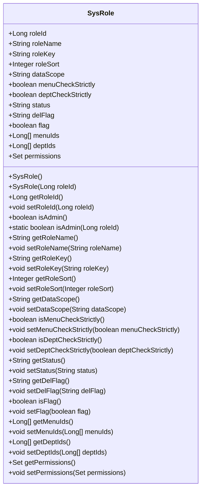
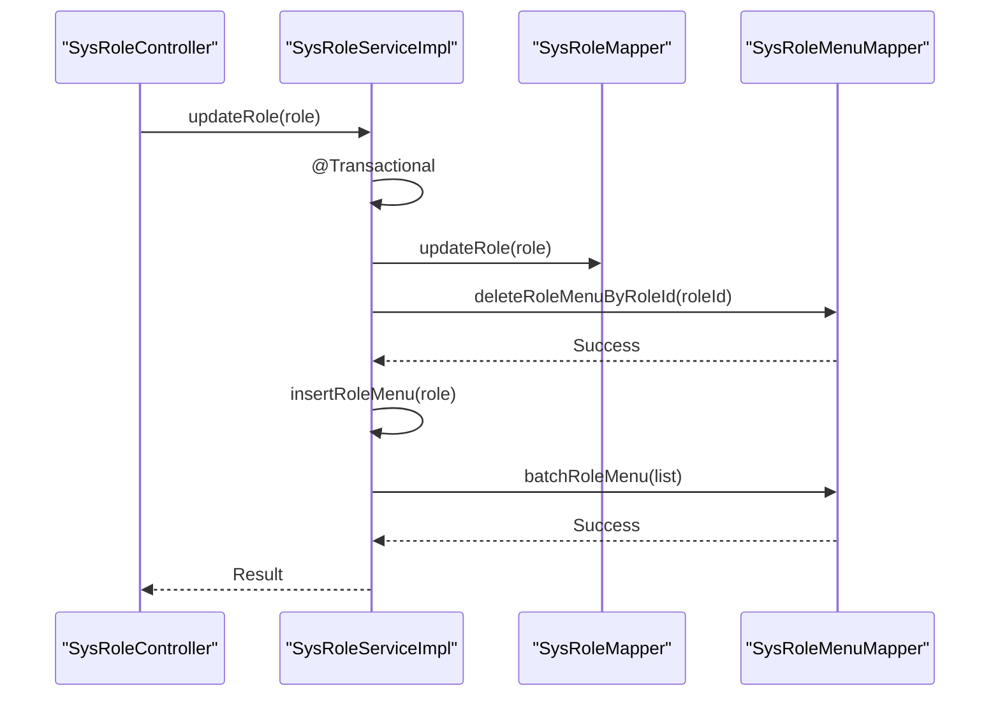
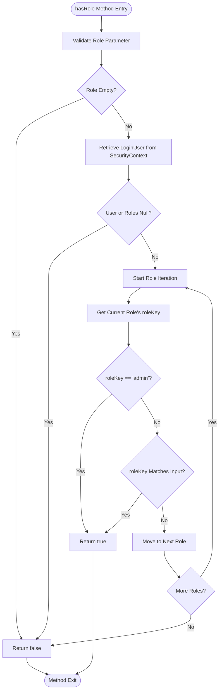
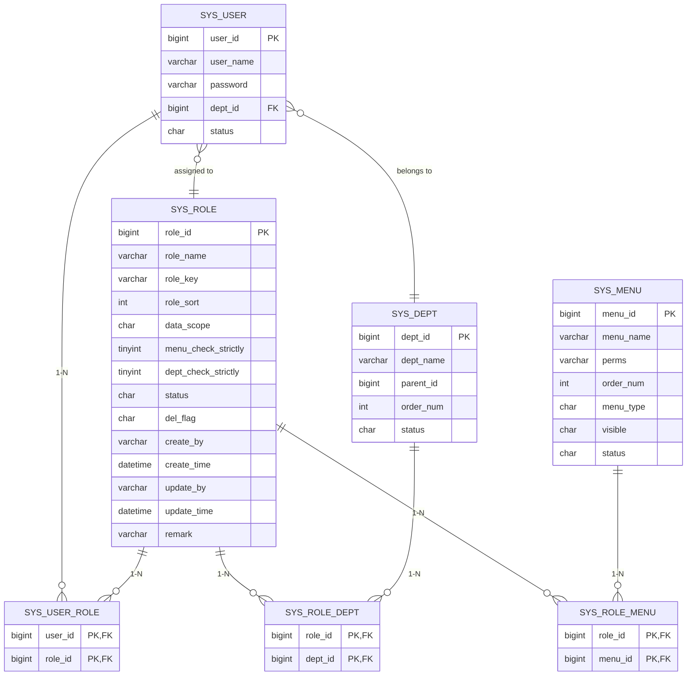
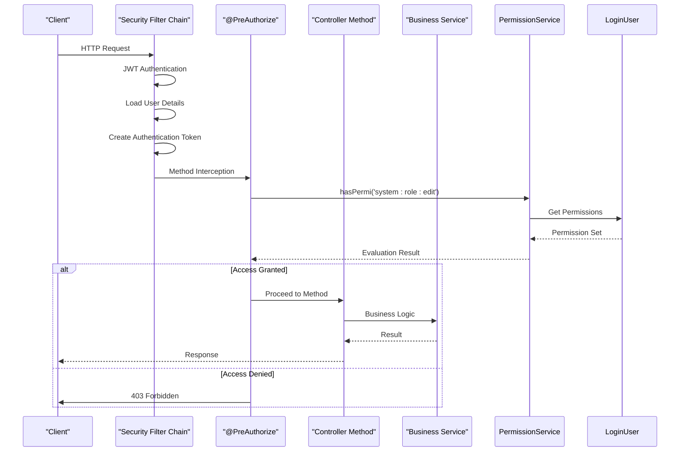

# Role-Based Access Control

<cite>
**Referenced Files in This Document**   
- [SysRole.java](file://src/main/java/com/ruoyi/project/system/domain/SysRole.java)
- [SysRoleService.java](file://src/main/java/com/ruoyi/project/system/service/ISysRoleService.java)
- [SysRoleServiceImpl.java](file://src/main/java/com/ruoyi/project/system/service/impl/SysRoleServiceImpl.java)
- [PermissionService.java](file://src/main/java/com/ruoyi/framework/security/service/PermissionService.java)
- [SecurityConfig.java](file://src/main/java/com/ruoyi/framework/config/SecurityConfig.java)
- [LoginUser.java](file://src/main/java/com/ruoyi/framework/security/LoginUser.java)
- [UserDetailsServiceImpl.java](file://src/main/java/com/ruoyi/framework/security/service/UserDetailsServiceImpl.java)
- [SysPermissionService.java](file://src/main/java/com/ruoyi/framework/security/service/SysPermissionService.java)
- [SysRoleMapper.java](file://src/main/java/com/ruoyi/project/system/mapper/SysRoleMapper.java)
- [SysRoleMapper.xml](file://src/main/resources/mybatis/system/SysRoleMapper.xml)
- [Constants.java](file://src/main/java/com/ruoyi/common/constant/Constants.java)
- [ry_20250522.sql](file://sql/ry_20250522.sql)
</cite>

## Table of Contents
1. [Introduction](#introduction)
2. [Role Entity Definition](#role-entity-definition)
3. [Role Management Service](#role-management-service)
4. [Role-Permission Integration with Spring Security](#role-permission-integration-with-spring-security)
5. [Database Schema and Data Loading](#database-schema-and-data-loading)
6. [Security Configuration and Method-Level Access Control](#security-configuration-and-method-level-access-control)
7. [Implementation Patterns and Best Practices](#implementation-patterns-and-best-practices)
8. [Troubleshooting Guide](#troubleshooting-guide)
9. [Conclusion](#conclusion)

## Introduction
The RuoYi-Vue framework implements a comprehensive Role-Based Access Control (RBAC) system that manages user permissions through role assignments. This system enables fine-grained access control by defining roles with specific permissions and associating them with users. The RBAC implementation integrates with Spring Security to provide method-level security using expression-based access control. Roles are defined as entities with attributes such as role name, permission keys, status, and data scope, and are managed through dedicated service components that handle creation, modification, and deletion operations. During authentication, role information is loaded into the LoginUser object, enabling real-time permission evaluation throughout the application lifecycle.

**Section sources**
- [SysRole.java](file://src/main/java/com/ruoyi/project/system/domain/SysRole.java#L1-L242)

## Role Entity Definition
The SysRole entity serves as the foundation of the RBAC system, representing a role within the application with various attributes that define its behavior and permissions. Key attributes include roleId (unique identifier), roleName (display name), roleKey (permission identifier string), roleSort (display order), dataScope (data access scope), and status (active/inactive). The entity implements role hierarchy through the isAdmin() method, which identifies the super-admin role by checking if the roleId equals 1L. Role status is managed through the status field, where "0" represents an active role and "1" represents a deactivated role. The entity also includes fields for menu and department selection strictness (menuCheckStrictly and deptCheckStrictly), which control how menu and department trees are displayed in the UI. Validation constraints ensure data integrity, with @NotBlank and @Size annotations enforcing non-empty values and length limits on roleName and roleKey fields.

**Diagram sources**
- [SysRole.java](file://src/main/java/com/ruoyi/project/system/domain/SysRole.java#L18-L242)

**Section sources**
- [SysRole.java](file://src/main/java/com/ruoyi/project/system/domain/SysRole.java#L18-L242)

## Role Management Service
The SysRoleService interface and its implementation provide comprehensive operations for managing roles within the system. The service offers methods for CRUD operations, including selectRoleList() for querying roles with filtering, insertRole() for creating new roles, updateRole() for modifying existing roles, and deleteRoleById() for removing roles. Specialized methods handle role-specific operations such as updateRoleStatus() for changing role activation status and authDataScope() for configuring data scope permissions. The service enforces business rules through validation methods like checkRoleNameUnique() and checkRoleKeyUnique(), which prevent duplicate role names and permission keys. A critical security feature is the checkRoleAllowed() method, which prevents modification of the super-admin role (roleId = 1) to maintain system integrity. When modifying role permissions, the service follows a transactional pattern: for role-menu assignments, it first deletes existing role-menu associations before inserting new ones to ensure data consistency.

**Diagram sources**
- [SysRoleServiceImpl.java](file://src/main/java/com/ruoyi/project/system/service/impl/SysRoleServiceImpl.java#L248-L257)
- [SysRoleMapper.java](file://src/main/java/com/ruoyi/project/system/mapper/SysRoleMapper.java#L82-L83)
- [SysRoleMenuMapper.java](file://src/main/java/com/ruoyi/project/system/mapper/SysRoleMenuMapper.java#L25-L26)

**Section sources**
- [ISysRoleService.java](file://src/main/java/com/ruoyi/project/system/service/ISysRoleService.java#L14-L173)
- [SysRoleServiceImpl.java](file://src/main/java/com/ruoyi/project/system/service/impl/SysRoleServiceImpl.java#L34-L428)

## Role-Permission Integration with Spring Security
The RBAC system integrates with Spring Security through the PermissionService component, which provides expression-based access control methods accessible via the @ss bean reference. The hasRole() method evaluates whether the authenticated user possesses a specific role by checking the roleKey against the user's assigned roles in the LoginUser object. This method automatically grants all roles to the super-admin (identified by Constants.SUPER_ADMIN = "admin"), regardless of explicit assignment. The hasAnyRoles() method extends this functionality by accepting a comma-separated list of roles and returning true if the user has any of the specified roles. These methods are designed to work with Spring Security's @PreAuthorize annotation, allowing method-level security configuration. The implementation retrieves the current LoginUser from SecurityUtils, accesses the user's roles, and performs case-sensitive comparison of role keys. The service also provides complementary methods like lacksRole() that return the logical negation of the corresponding check, enabling more complex authorization logic.

**Diagram sources**
- [PermissionService.java](file://src/main/java/com/ruoyi/framework/security/service/PermissionService.java#L88-L108)
- [LoginUser.java](file://src/main/java/com/ruoyi/framework/security/LoginUser.java#L72-L73)
- [Constants.java](file://src/main/java/com/ruoyi/common/constant/Constants.java#L81-L82)

**Section sources**
- [PermissionService.java](file://src/main/java/com/ruoyi/framework/security/service/PermissionService.java#L19-L160)

## Database Schema and Data Loading
The RBAC system utilizes a relational database schema with multiple tables to store role-related information. The core sys_role table contains role definitions with columns for role_id, role_name, role_key, status, and data_scope. Role-menu associations are stored in the sys_role_menu table, which uses a composite primary key of role_id and menu_id to establish a many-to-many relationship between roles and menus. Similarly, the sys_role_dept table manages data scope permissions by linking roles to departments. During user authentication, the UserDetailsServiceImpl loads role information by calling SysPermissionService.getMenuPermission(), which retrieves the user's roles and their associated menu permissions. For regular users, permissions are collected from all active roles, while administrators receive the ALL_PERMISSION wildcard. The role loading process includes validation of role status, ensuring only roles with status '0' (normal) are included in the permission set. This data is then stored in the LoginUser object's permissions field, making it available for real-time access control decisions throughout the user's session.

**Diagram sources**
- [ry_20250522.sql](file://sql/ry_20250522.sql#L104-L121)
- [SysRoleMapper.xml](file://src/main/resources/mybatis/system/SysRoleMapper.xml#L7-L22)
- [SysRoleMenuMapper.xml](file://src/main/resources/mybatis/system/SysRoleMenuMapper.xml#L7-L15)
- [SysRoleDeptMapper.xml](file://src/main/resources/mybatis/system/SysRoleDeptMapper.xml#L7-L12)

**Section sources**
- [ry_20250522.sql](file://sql/ry_20250522.sql#L104-L121)
- [SysRoleMapper.xml](file://src/main/resources/mybatis/system/SysRoleMapper.xml#L1-L152)
- [UserDetailsServiceImpl.java](file://src/main/java/com/ruoyi/framework/security/service/UserDetailsServiceImpl.java#L37-L65)
- [SysPermissionService.java](file://src/main/java/com/ruoyi/framework/security/service/SysPermissionService.java#L58-L88)

## Security Configuration and Method-Level Access Control
The SecurityConfig class enables method-level security through Spring Security's @EnableMethodSecurity annotation with prePostEnabled = true, allowing the use of @PreAuthorize expressions throughout the application. Controllers leverage the PermissionService via the @ss bean reference to implement fine-grained access control. For example, the SysRoleController uses @PreAuthorize("@ss.hasPermi('system:role:edit')") to restrict role modification endpoints to users with the appropriate permission. The framework distinguishes between role-based and permission-based checks: hasRole() verifies role membership, while hasPermi() checks for specific permission strings. This dual approach enables both broad role-based access control and granular permission-based restrictions. The security configuration also implements data scope filtering through the DataScopeAspect, which automatically appends data access restrictions to database queries based on the user's role dataScope setting. This ensures that users can only access data they are authorized to view, even if they have permission to execute a particular operation.

**Diagram sources**
- [SecurityConfig.java](file://src/main/java/com/ruoyi/framework/config/SecurityConfig.java#L29-L140)
- [SysRoleController.java](file://src/main/java/com/ruoyi/project/system/controller/SysRoleController.java#L147-L155)
- [PermissionService.java](file://src/main/java/com/ruoyi/framework/security/service/PermissionService.java#L27-L40)

**Section sources**
- [SecurityConfig.java](file://src/main/java/com/ruoyi/framework/config/SecurityConfig.java#L29-L140)

## Implementation Patterns and Best Practices
The RBAC implementation follows several key patterns to ensure security and maintainability. The super-admin privilege escalation pattern grants the admin role (roleKey = "admin") unrestricted access by automatically returning true for all role and permission checks, simplifying administrative access while maintaining a clear security boundary. The role status validation pattern ensures that only active roles (status = "0") contribute to a user's permission set, allowing administrators to deactivate roles without removing user assignments. The transactional role update pattern guarantees data consistency by wrapping role-menu association updates in database transactions, preventing partial updates that could lead to security vulnerabilities. The data scope validation pattern, implemented through checkRoleDataScope() methods, prevents unauthorized access to role management functions by verifying that the current user has permission to view the target roles. Additionally, the system employs a proxy pattern with SpringUtils.getAopProxy() to ensure that security checks within service methods properly enforce transactional boundaries and aspect-oriented programming features.

**Section sources**
- [SysRole.java](file://src/main/java/com/ruoyi/project/system/domain/SysRole.java#L87-L95)
- [SysRoleServiceImpl.java](file://src/main/java/com/ruoyi/project/system/service/impl/SysRoleServiceImpl.java#L184-L189)
- [SysRoleServiceImpl.java](file://src/main/java/com/ruoyi/project/system/service/impl/SysRoleServiceImpl.java#L198-L213)
- [SysPermissionService.java](file://src/main/java/com/ruoyi/framework/security/service/SysPermissionService.java#L62-L64)
- [SysRoleServiceImpl.java](file://src/main/java/com/ruoyi/project/system/service/impl/SysRoleServiceImpl.java#L115-L116)

## Troubleshooting Guide
Common issues in the RBAC system typically involve role assignment failures, permission inheritance problems, or unexpected access denials. When users cannot access expected functionality despite role assignment, verify that the role status is active ("0") and that the roleKey matches the permission string used in @PreAuthorize annotations. Permission inheritance issues may occur when the LoginUser object is not properly refreshed after role modifications; in such cases, users may need to re-authenticate to receive updated permissions. Role deletion failures with "已分配,不能删除" (already assigned, cannot delete) messages indicate that the role is still assigned to one or more users; these assignments must be removed before the role can be deleted. Access denied errors despite correct role assignment may stem from caching issues or incorrect permission string formatting; ensure that permission strings match exactly, including case and special characters. When debugging role-based access issues, examine the LoginUser object's permissions set to verify that expected roles and permissions have been loaded correctly during authentication.

**Section sources**
- [SysRoleServiceImpl.java](file://src/main/java/com/ruoyi/project/system/service/impl/SysRoleServiceImpl.java#L369-L372)
- [SysRole.java](file://src/main/java/com/ruoyi/project/system/domain/SysRole.java#L48-L50)
- [PermissionService.java](file://src/main/java/com/ruoyi/framework/security/service/PermissionService.java#L94-L108)
- [SysRoleMapper.xml](file://src/main/resources/mybatis/system/SysRoleMapper.xml#L141-L143)

## Conclusion
The RuoYi-Vue RBAC system provides a robust and flexible framework for managing user access control through role-based permissions. By combining well-defined entity models, comprehensive service layers, and tight integration with Spring Security, the system enables both broad role-based access control and granular permission management. The implementation effectively separates concerns between role definition, permission evaluation, and security enforcement, while maintaining performance through efficient data loading and caching mechanisms. Key strengths include the super-admin privilege model, transactional role updates, and comprehensive data scope controls. The system's design allows for easy extension and customization, making it suitable for applications with complex permission requirements. Proper understanding of the role lifecycle, permission inheritance, and security configuration patterns is essential for effective system administration and troubleshooting.