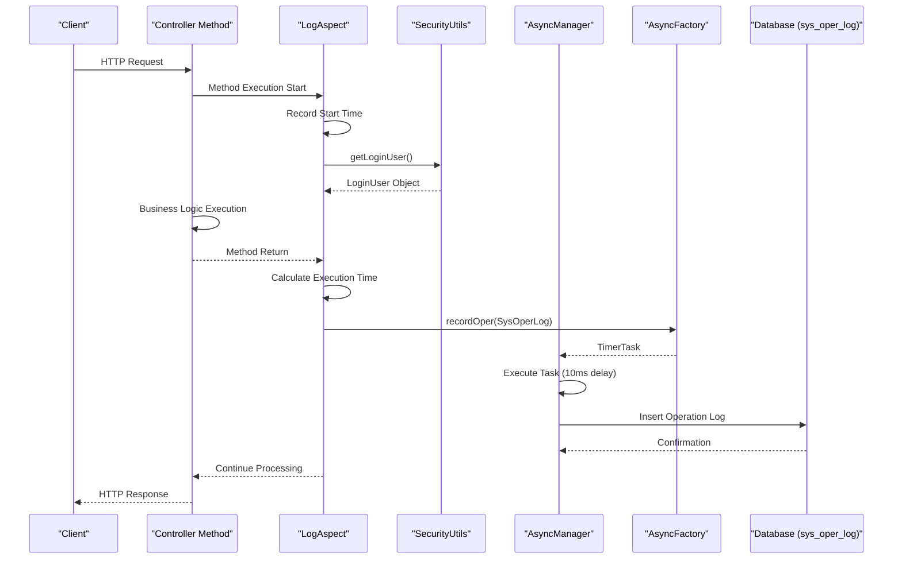
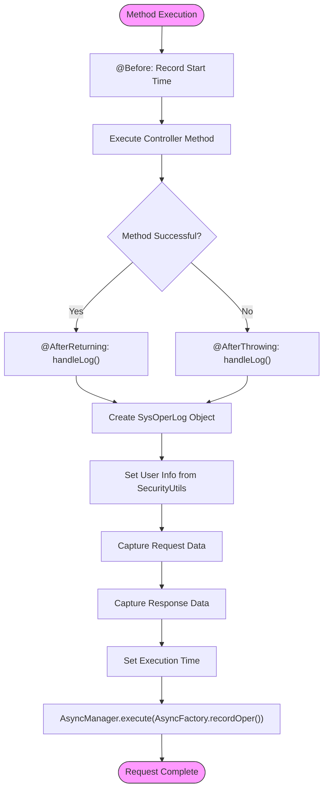
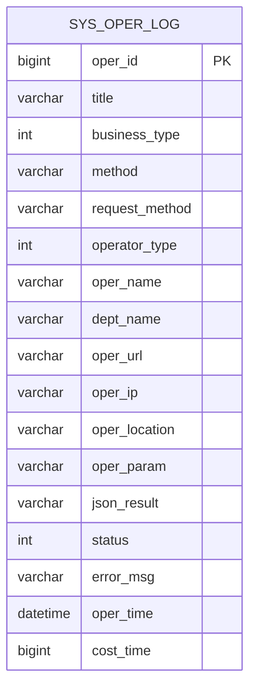

# Operation Logging

<cite>
**Referenced Files in This Document**   
- [Log.java](file://src/main/java/com/ruoyi/framework/aspectj/lang/annotation/Log.java)
- [LogAspect.java](file://src/main/java/com/ruoyi/framework/aspectj/LogAspect.java)
- [SecurityUtils.java](file://src/main/java/com/ruoyi/common/utils/SecurityUtils.java)
- [PropertyPreExcludeFilter.java](file://src/main/java/com/ruoyi/common/filter/PropertyPreExcludeFilter.java)
- [AsyncFactory.java](file://src/main/java/com/ruoyi/framework/manager/factory/AsyncFactory.java)
- [AsyncManager.java](file://src/main/java/com/ruoyi/framework/manager/AsyncManager.java)
- [BusinessType.java](file://src/main/java/com/ruoyi/framework/aspectj/lang/enums/BusinessType.java)
- [OperatorType.java](file://src/main/java/com/ruoyi/framework/aspectj/lang/enums/OperatorType.java)
- [SysOperLog.java](file://src/main/java/com/ruoyi/project/monitor/domain/SysOperLog.java)
- [ISysOperLogService.java](file://src/main/java/com/ruoyi/project/monitor/service/ISysOperLogService.java)
- [SysOperLogMapper.java](file://src/main/java/com/ruoyi/project/monitor/mapper/SysOperLogMapper.java)
- [SysOperLogMapper.xml](file://src/main/resources/mybatis/monitor/SysOperLogMapper.xml)
</cite>

## Table of Contents
1. [Introduction](#introduction)
2. [Core Components](#core-components)
3. [Architecture Overview](#architecture-overview)
4. [Detailed Component Analysis](#detailed-component-analysis)
5. [Dependency Analysis](#dependency-analysis)
6. [Performance Considerations](#performance-considerations)
7. [Troubleshooting Guide](#troubleshooting-guide)
8. [Conclusion](#conclusion)

## Introduction
The RuoYi-Vue operation logging system provides a comprehensive mechanism for tracking and recording business operations performed within the application. This system enables declarative logging through the use of the `@Log` annotation, which can be applied to controller methods to automatically capture operational details. The logging framework captures essential information including operation title, business type, execution time, request/response data, and user context, while ensuring sensitive data is properly excluded. All log entries are processed asynchronously to prevent performance impact on main request threads, and are stored in the `sys_oper_log` database table for auditing and monitoring purposes.

## Core Components

The operation logging system in RuoYi-Vue consists of several key components that work together to provide comprehensive audit capabilities. The system is built around Aspect-Oriented Programming (AOP) principles, using the `@Log` annotation to declaratively mark methods for logging. The `LogAspect` class serves as the central AOP aspect that intercepts annotated methods, capturing execution details before and after method invocation. User information is retrieved through the `SecurityUtils` class, which accesses the current authentication context. Sensitive data such as passwords are automatically excluded from logs using the `PropertyPreExcludeFilter`. All logging operations are performed asynchronously through the `AsyncManager` and `AsyncFactory` components, ensuring that log recording does not block the primary request processing flow.

**Section sources**
- [Log.java](file://src/main/java/com/ruoyi/framework/aspectj/lang/annotation/Log.java)
- [LogAspect.java](file://src/main/java/com/ruoyi/framework/aspectj/LogAspect.java)
- [SecurityUtils.java](file://src/main/java/com/ruoyi/common/utils/SecurityUtils.java)
- [PropertyPreExcludeFilter.java](file://src/main/java/com/ruoyi/common/filter/PropertyPreExcludeFilter.java)
- [AsyncFactory.java](file://src/main/java/com/ruoyi/framework/manager/factory/AsyncFactory.java)
- [AsyncManager.java](file://src/main/java/com/ruoyi/framework/manager/AsyncManager.java)

## Architecture Overview

The operation logging architecture in RuoYi-Vue follows a layered approach that integrates seamlessly with the application's controller layer. When a controller method marked with the `@Log` annotation is invoked, the `LogAspect` AOP interceptor captures the method execution. The aspect measures execution time using a `ThreadLocal` variable, captures request parameters and response data (when configured), and retrieves the current user context via `SecurityUtils`. This information is assembled into a `SysOperLog` object, which is then passed to `AsyncFactory` to create a logging task. The `AsyncManager` executes this task on a separate thread, ensuring that database operations for log persistence do not affect the response time of the original request.



**Diagram sources**
- [LogAspect.java](file://src/main/java/com/ruoyi/framework/aspectj/LogAspect.java#L59-L86)
- [SecurityUtils.java](file://src/main/java/com/ruoyi/common/utils/SecurityUtils.java#L71-L81)
- [AsyncFactory.java](file://src/main/java/com/ruoyi/framework/manager/factory/AsyncFactory.java#L89-L102)
- [AsyncManager.java](file://src/main/java/com/ruoyi/framework/manager/AsyncManager.java#L43-L45)
- [SysOperLog.java](file://src/main/java/com/ruoyi/project/monitor/domain/SysOperLog.java)

## Detailed Component Analysis

### @Log Annotation Analysis
The `@Log` annotation is a custom annotation used to declaratively enable operation logging on controller methods. It provides metadata that describes the nature of the operation being performed, allowing for consistent categorization and filtering of log entries.

```mermaid
classDiagram
class Log {
+String title() default ""
+BusinessType businessType() default BusinessType.OTHER
+OperatorType operatorType() default OperatorType.MANAGE
+boolean isSaveRequestData() default true
+boolean isSaveResponseData() default true
+String[] excludeParamNames() default {}
}
class BusinessType {
+OTHER
+INSERT
+UPDATE
+DELETE
+GRANT
+EXPORT
+IMPORT
+FORCE
+GENCODE
+CLEAN
}
class OperatorType {
+OTHER
+MANAGE
+MOBILE
}
Log --> BusinessType : references
Log --> OperatorType : references
```

**Diagram sources**
- [Log.java](file://src/main/java/com/ruoyi/framework/aspectj/lang/annotation/Log.java)
- [BusinessType.java](file://src/main/java/com/ruoyi/framework/aspectj/lang/enums/BusinessType.java)
- [OperatorType.java](file://src/main/java/com/ruoyi/framework/aspectj/lang/enums/OperatorType.java)

**Section sources**
- [Log.java](file://src/main/java/com/ruoyi/framework/aspectj/lang/annotation/Log.java)

### LogAspect AOP Component Analysis
The `LogAspect` class is the core implementation of the operation logging system, using Aspect-Oriented Programming to intercept method executions. It captures execution timing, handles both successful completions and exceptions, and assembles the complete operation log record.



**Diagram sources**
- [LogAspect.java](file://src/main/java/com/ruoyi/framework/aspectj/LogAspect.java)
- [SecurityUtils.java](file://src/main/java/com/ruoyi/common/utils/SecurityUtils.java)
- [AsyncFactory.java](file://src/main/java/com/ruoyi/framework/manager/factory/AsyncFactory.java)
- [AsyncManager.java](file://src/main/java/com/ruoyi/framework/manager/AsyncManager.java)

**Section sources**
- [LogAspect.java](file://src/main/java/com/ruoyi/framework/aspectj/LogAspect.java)

### Data Model and Persistence Analysis
The operation log data model is represented by the `SysOperLog` class, which maps to the `sys_oper_log` database table. This model captures comprehensive information about each operation, including contextual details, execution metrics, and payload data.



**Diagram sources**
- [SysOperLog.java](file://src/main/java/com/ruoyi/project/monitor/domain/SysOperLog.java)
- [SysOperLogMapper.xml](file://src/main/resources/mybatis/monitor/SysOperLogMapper.xml)

**Section sources**
- [SysOperLog.java](file://src/main/java/com/ruoyi/project/monitor/domain/SysOperLog.java)
- [ISysOperLogService.java](file://src/main/java/com/ruoyi/project/monitor/service/ISysOperLogService.java)
- [SysOperLogMapper.java](file://src/main/java/com/ruoyi/project/monitor/mapper/SysOperLogMapper.java)

## Dependency Analysis

The operation logging system has a well-defined dependency structure that ensures separation of concerns while maintaining integration with the broader application framework. The `LogAspect` depends on several key components to fulfill its responsibilities: `SecurityUtils` for user context retrieval, `PropertyPreExcludeFilter` for sensitive data filtering, `AsyncManager` for asynchronous execution, and the `SysOperLog` domain model for data representation. The asynchronous nature of the logging process creates a loose coupling between the main application flow and the logging infrastructure, with `AsyncFactory` serving as the bridge between these concerns. The persistence layer dependencies are managed through standard MyBatis mappings, with the `SysOperLogMapper` interface providing the contract for database operations.

```mermaid
graph TD
Controller --> LogAspect : @Log annotation
LogAspect --> SecurityUtils : getLoginUser()
LogAspect --> PropertyPreExcludeFilter : exclude sensitive data
LogAspect --> AsyncManager : execute task
AsyncManager --> AsyncFactory : create recordOper task
AsyncFactory --> ISysOperLogService : insertOperlog
ISysOperLogService --> SysOperLogMapper : persistence
SysOperLogMapper --> Database : sys_oper_log table
LogAspect --> SysOperLog : create log object
style LogAspect fill:#ccf,stroke:#333
style AsyncManager fill:#cfc,stroke:#333
style AsyncFactory fill:#cfc,stroke:#333
```

**Diagram sources**
- [LogAspect.java](file://src/main/java/com/ruoyi/framework/aspectj/LogAspect.java)
- [SecurityUtils.java](file://src/main/java/com/ruoyi/common/utils/SecurityUtils.java)
- [PropertyPreExcludeFilter.java](file://src/main/java/com/ruoyi/common/filter/PropertyPreExcludeFilter.java)
- [AsyncManager.java](file://src/main/java/com/ruoyi/framework/manager/AsyncManager.java)
- [AsyncFactory.java](file://src/main/java/com/ruoyi/framework/manager/factory/AsyncFactory.java)
- [ISysOperLogService.java](file://src/main/java/com/ruoyi/project/monitor/service/ISysOperLogService.java)
- [SysOperLogMapper.java](file://src/main/java/com/ruoyi/project/monitor/mapper/SysOperLogMapper.java)

**Section sources**
- [LogAspect.java](file://src/main/java/com/ruoyi/framework/aspectj/LogAspect.java)
- [SecurityUtils.java](file://src/main/java/com/ruoyi/common/utils/SecurityUtils.java)
- [PropertyPreExcludeFilter.java](file://src/main/java/com/ruoyi/common/filter/PropertyPreExcludeFilter.java)
- [AsyncManager.java](file://src/main/java/com/ruoyi/framework/manager/AsyncManager.java)
- [AsyncFactory.java](file://src/main/java/com/ruoyi/framework/manager/factory/AsyncFactory.java)

## Performance Considerations

The operation logging system in RuoYi-Vue is designed with performance as a primary consideration. By implementing asynchronous logging through the `AsyncManager` and `AsyncFactory` components, the system ensures that log persistence operations do not block or delay the primary request-response cycle. The `AsyncManager` uses a scheduled executor service with a 10-millisecond delay, allowing the main thread to continue processing while log entries are queued for background processing. This approach minimizes the performance impact of comprehensive audit logging, making it suitable for production environments with high transaction volumes. Additionally, the system implements parameter length limits (2000 characters) and excludes large objects like file uploads from logging to prevent excessive memory usage and database storage consumption.

**Section sources**
- [AsyncManager.java](file://src/main/java/com/ruoyi/framework/manager/AsyncManager.java#L19)
- [LogAspect.java](file://src/main/java/com/ruoyi/framework/aspectj/LogAspect.java#L54)

## Troubleshooting Guide

When troubleshooting issues with the operation logging system, consider the following common scenarios and their solutions:

1. **Missing Log Entries**: Verify that the controller method is properly annotated with `@Log` and that the `LogAspect` component is enabled in the Spring context. Check that the `AsyncManager`'s scheduled executor service is properly configured and running.

2. **Incomplete User Information**: Ensure that user authentication is properly established before the logged operation occurs. Verify that the `SecurityUtils.getLoginUser()` method returns a valid `LoginUser` object with complete user details.

3. **Sensitive Data Exposure**: Confirm that sensitive fields are properly excluded by checking the `EXCLUDE_PROPERTIES` array in `LogAspect` and any additional fields specified in the `excludeParamNames` annotation parameter.

4. **Performance Degradation**: Monitor the asynchronous task queue to ensure that log processing is keeping pace with request volume. Consider adjusting the executor service configuration in high-throughput environments.

5. **Database Persistence Issues**: Verify that the `sys_oper_log` table schema matches the `SysOperLog` entity and that the MyBatis mapper configuration is correct. Check database connectivity and permissions for the logging operations.

**Section sources**
- [LogAspect.java](file://src/main/java/com/ruoyi/framework/aspectj/LogAspect.java)
- [SecurityUtils.java](file://src/main/java/com/ruoyi/common/utils/SecurityUtils.java)
- [AsyncManager.java](file://src/main/java/com/ruoyi/framework/manager/AsyncManager.java)
- [SysOperLogMapper.xml](file://src/main/resources/mybatis/monitor/SysOperLogMapper.xml)

## Conclusion

The operation logging system in RuoYi-Vue provides a robust, flexible, and non-intrusive mechanism for auditing business operations. Through the use of the `@Log` annotation, developers can declaratively specify which operations should be logged and provide metadata about the nature of those operations. The AOP-based implementation ensures that logging concerns are separated from business logic, while the asynchronous processing model guarantees that audit capabilities do not compromise application performance. The system comprehensively captures operation context including user information, execution timing, request/response data, and location details, while protecting sensitive information through automatic exclusion filters. This logging framework serves as a critical component for security auditing, operational monitoring, and compliance requirements in enterprise applications.