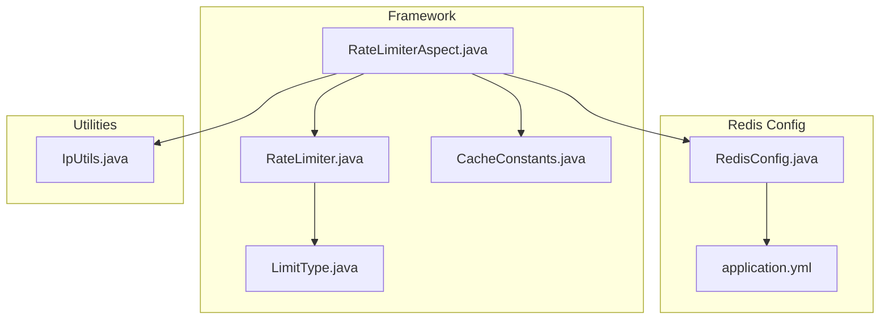
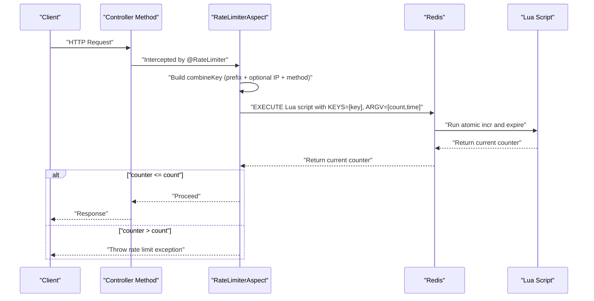
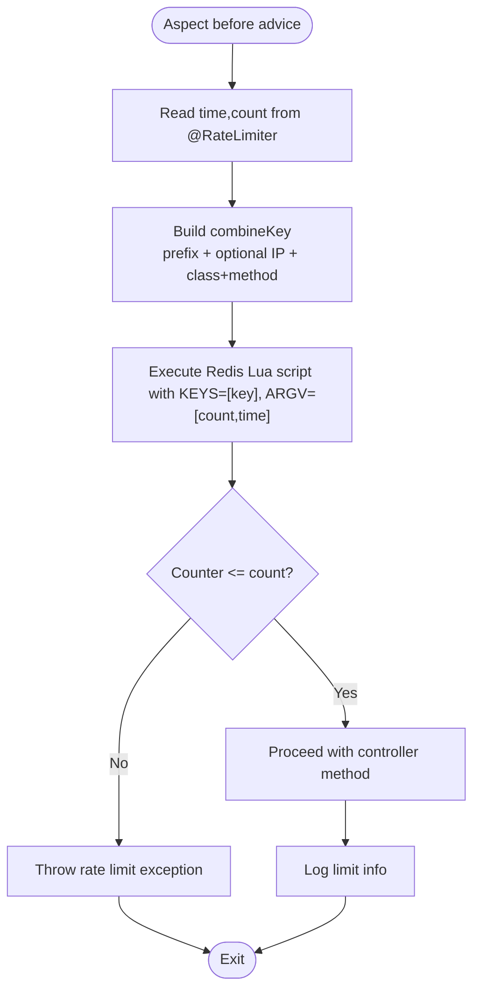
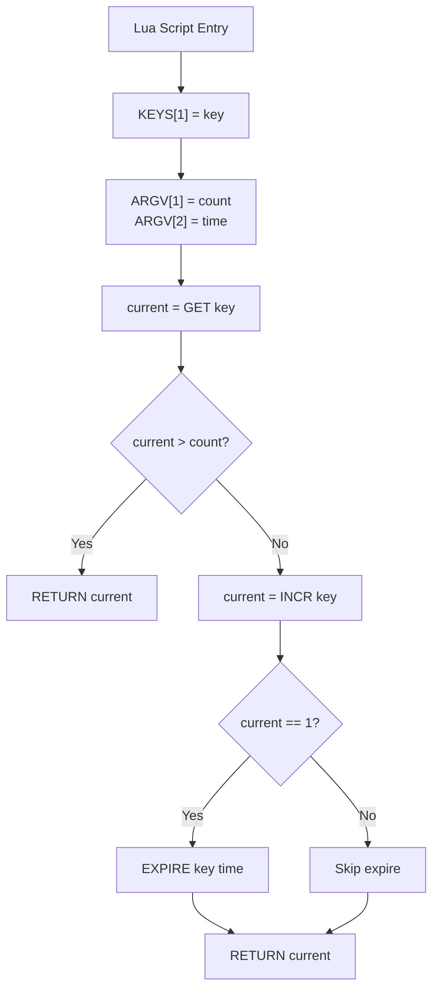
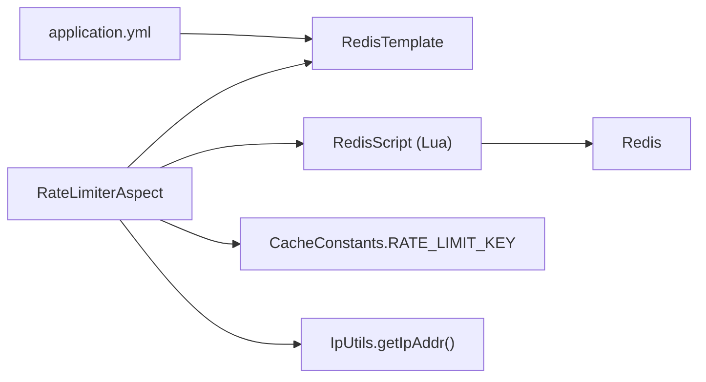

# Rate Limiting

<cite>
**Referenced Files in This Document**
- [RateLimiter.java](file://src/main/java/com/ruoyi/framework/aspectj/lang/annotation/RateLimiter.java)
- [LimitType.java](file://src/main/java/com/ruoyi/framework/aspectj/lang/enums/LimitType.java)
- [RateLimiterAspect.java](file://src/main/java/com/ruoyi/framework/aspectj/RateLimiterAspect.java)
- [RedisConfig.java](file://src/main/java/com/ruoyi/framework/config/RedisConfig.java)
- [CacheConstants.java](file://src/main/java/com/ruoyi/common/constant/CacheConstants.java)
- [IpUtils.java](file://src/main/java/com/ruoyi/common/utils/ip/IpUtils.java)
- [application.yml](file://src/main/resources/application.yml)
</cite>

## Table of Contents
1. [Introduction](#introduction)
2. [Project Structure](#project-structure)
3. [Core Components](#core-components)
4. [Architecture Overview](#architecture-overview)
5. [Detailed Component Analysis](#detailed-component-analysis)
6. [Dependency Analysis](#dependency-analysis)
7. [Performance Considerations](#performance-considerations)
8. [Troubleshooting Guide](#troubleshooting-guide)
9. [Conclusion](#conclusion)

## Introduction
This document explains the rate limiting functionality in RuoYi-Vue. It covers how the @RateLimiter annotation is used to declaratively apply rate limits on controller methods, how the RateLimiterAspect AOP aspect enforces limits using Redis, and how the Lua script atomically increments counters and sets expiration. It also describes how the combineKey is constructed for precise throttling, configuration guidance for Redis, and strategies for handling common issues and optimizing performance in large-scale deployments.

## Project Structure
The rate limiting feature spans three primary areas:
- Annotation and enumeration definitions for rate limiting policy
- An AspectJ aspect that intercepts annotated methods and enforces limits
- Redis configuration and Lua script that provide distributed, atomic counters

**Diagram sources**
- [RateLimiter.java](file://src/main/java/com/ruoyi/framework/aspectj/lang/annotation/RateLimiter.java#L1-L40)
- [LimitType.java](file://src/main/java/com/ruoyi/framework/aspectj/lang/enums/LimitType.java#L1-L21)
- [RateLimiterAspect.java](file://src/main/java/com/ruoyi/framework/aspectj/RateLimiterAspect.java#L1-L90)
- [RedisConfig.java](file://src/main/java/com/ruoyi/framework/config/RedisConfig.java#L1-L70)
- [CacheConstants.java](file://src/main/java/com/ruoyi/common/constant/CacheConstants.java#L1-L45)
- [IpUtils.java](file://src/main/java/com/ruoyi/common/utils/ip/IpUtils.java#L1-L200)
- [application.yml](file://src/main/resources/application.yml#L68-L90)

**Section sources**
- [RateLimiter.java](file://src/main/java/com/ruoyi/framework/aspectj/lang/annotation/RateLimiter.java#L1-L40)
- [LimitType.java](file://src/main/java/com/ruoyi/framework/aspectj/lang/enums/LimitType.java#L1-L21)
- [RateLimiterAspect.java](file://src/main/java/com/ruoyi/framework/aspectj/RateLimiterAspect.java#L1-L90)
- [RedisConfig.java](file://src/main/java/com/ruoyi/framework/config/RedisConfig.java#L1-L70)
- [CacheConstants.java](file://src/main/java/com/ruoyi/common/constant/CacheConstants.java#L1-L45)
- [IpUtils.java](file://src/main/java/com/ruoyi/common/utils/ip/IpUtils.java#L1-L200)
- [application.yml](file://src/main/resources/application.yml#L68-L90)

## Core Components
- RateLimiter annotation: Declares rate-limiting policy on methods with parameters for key, time window, count threshold, and limit type.
- LimitType enum: Defines whether limiting is applied globally or per IP.
- RateLimiterAspect: Intercepts annotated methods, constructs a combineKey, executes a Redis Lua script atomically, and throws exceptions when limits are exceeded.
- RedisConfig: Provides RedisTemplate and registers a RedisScript (Lua) used for atomic increment and expiry.
- CacheConstants: Supplies the default Redis key prefix for rate limiting.
- IpUtils: Extracts client IP address used when limitType is IP.

**Section sources**
- [RateLimiter.java](file://src/main/java/com/ruoyi/framework/aspectj/lang/annotation/RateLimiter.java#L1-L40)
- [LimitType.java](file://src/main/java/com/ruoyi/framework/aspectj/lang/enums/LimitType.java#L1-L21)
- [RateLimiterAspect.java](file://src/main/java/com/ruoyi/framework/aspectj/RateLimiterAspect.java#L1-L90)
- [RedisConfig.java](file://src/main/java/com/ruoyi/framework/config/RedisConfig.java#L1-L70)
- [CacheConstants.java](file://src/main/java/com/ruoyi/common/constant/CacheConstants.java#L1-L45)
- [IpUtils.java](file://src/main/java/com/ruoyi/common/utils/ip/IpUtils.java#L1-L200)

## Architecture Overview
The rate limiting pipeline is a declarative, distributed mechanism:
- Developers annotate controller methods with @RateLimiter.
- At runtime, the RateLimiterAspect intercepts the method invocation.
- The aspect builds a combineKey from the configured key prefix, optional IP, and method signature.
- The aspect executes a Redis Lua script that atomically increments a counter and sets expiry.
- If the counter exceeds the configured threshold, a service exception is thrown; otherwise, the request proceeds.

**Diagram sources**
- [RateLimiterAspect.java](file://src/main/java/com/ruoyi/framework/aspectj/RateLimiterAspect.java#L49-L74)
- [RedisConfig.java](file://src/main/java/com/ruoyi/framework/config/RedisConfig.java#L42-L69)
- [CacheConstants.java](file://src/main/java/com/ruoyi/common/constant/CacheConstants.java#L35-L40)
- [IpUtils.java](file://src/main/java/com/ruoyi/common/utils/ip/IpUtils.java#L1-L200)

## Detailed Component Analysis

### RateLimiter Annotation
- Purpose: Declaratively configure rate limiting on methods.
- Parameters:
  - key: Redis key prefix (default from CacheConstants.RATE_LIMIT_KEY).
  - time: Time window in seconds.
  - count: Allowed requests per window.
  - limitType: Limit scope (DEFAULT or IP).

Usage pattern:
- Apply @RateLimiter on controller methods to enforce distributed rate limits.

**Section sources**
- [RateLimiter.java](file://src/main/java/com/ruoyi/framework/aspectj/lang/annotation/RateLimiter.java#L1-L40)
- [CacheConstants.java](file://src/main/java/com/ruoyi/common/constant/CacheConstants.java#L35-L40)

### LimitType Enum
- DEFAULT: Global limit across all clients for the method.
- IP: Per-client limit keyed by IP address.

**Section sources**
- [LimitType.java](file://src/main/java/com/ruoyi/framework/aspectj/lang/enums/LimitType.java#L1-L21)

### RateLimiterAspect
Responsibilities:
- Intercept methods annotated with @RateLimiter.
- Build a combineKey using:
  - Base key prefix from CacheConstants.RATE_LIMIT_KEY
  - Optional IP segment when limitType is IP
  - Fully qualified method signature (class + method)
- Execute Redis Lua script with arguments count and time.
- Enforce limits and log outcomes.

Key behaviors:
- Uses RedisTemplate.execute with a RedisScript<Long>.
- Throws a service exception when the current counter exceeds the configured count.
- Logs the enforced limit and the current request count.

**Diagram sources**
- [RateLimiterAspect.java](file://src/main/java/com/ruoyi/framework/aspectj/RateLimiterAspect.java#L49-L74)

**Section sources**
- [RateLimiterAspect.java](file://src/main/java/com/ruoyi/framework/aspectj/RateLimiterAspect.java#L1-L90)
- [IpUtils.java](file://src/main/java/com/ruoyi/common/utils/ip/IpUtils.java#L1-L200)

### RedisConfig and Lua Script
- RedisConfig defines:
  - RedisTemplate with appropriate serializers.
  - A DefaultRedisScript<Long> named limitScript.
  - The Lua script text embedded in limitScriptText().
- The Lua script performs:
  - Retrieve current counter.
  - If current > threshold, return current.
  - Otherwise, increment the counter.
  - If this is the first increment, set expiry to time seconds.
  - Return the new counter.

**Diagram sources**
- [RedisConfig.java](file://src/main/java/com/ruoyi/framework/config/RedisConfig.java#L42-L69)

**Section sources**
- [RedisConfig.java](file://src/main/java/com/ruoyi/framework/config/RedisConfig.java#L1-L70)

### combineKey Construction
The combineKey ensures precise throttling by combining:
- Base prefix from CacheConstants.RATE_LIMIT_KEY
- Optional IP segment when limitType is IP
- Fully qualified class name and method name from the intercepted method signature

This guarantees:
- Different methods have distinct keys.
- Different classes/methods share the same key only when intended.
- Per-IP limits are isolated when limitType is IP.

**Section sources**
- [RateLimiterAspect.java](file://src/main/java/com/ruoyi/framework/aspectj/RateLimiterAspect.java#L76-L88)
- [CacheConstants.java](file://src/main/java/com/ruoyi/common/constant/CacheConstants.java#L35-L40)
- [IpUtils.java](file://src/main/java/com/ruoyi/common/utils/ip/IpUtils.java#L1-L200)

### Example Usage Scenarios
- Global rate limit per method:
  - Annotate a controller method with @RateLimiter(time = windowSeconds, count = maxRequests).
  - All clients share the same counter for that method.
- Per-IP rate limit:
  - Annotate with limitType = IP to isolate counters by client IP.
  - Each IP gets its own counter under the same method key.

Note: The repository does not include explicit controller examples applying @RateLimiter. The above describes how to apply it conceptually.

**Section sources**
- [RateLimiter.java](file://src/main/java/com/ruoyi/framework/aspectj/lang/annotation/RateLimiter.java#L1-L40)
- [LimitType.java](file://src/main/java/com/ruoyi/framework/aspectj/lang/enums/LimitType.java#L1-L21)
- [RateLimiterAspect.java](file://src/main/java/com/ruoyi/framework/aspectj/RateLimiterAspect.java#L76-L88)

## Dependency Analysis
The rate limiting subsystem depends on:
- AspectJ interception of annotated methods
- RedisTemplate and RedisScript for atomic operations
- CacheConstants for key prefixes
- IpUtils for IP-based keys when limitType is IP
- application.yml for Redis connection settings

**Diagram sources**
- [RateLimiterAspect.java](file://src/main/java/com/ruoyi/framework/aspectj/RateLimiterAspect.java#L1-L90)
- [RedisConfig.java](file://src/main/java/com/ruoyi/framework/config/RedisConfig.java#L1-L70)
- [CacheConstants.java](file://src/main/java/com/ruoyi/common/constant/CacheConstants.java#L1-L45)
- [IpUtils.java](file://src/main/java/com/ruoyi/common/utils/ip/IpUtils.java#L1-L200)
- [application.yml](file://src/main/resources/application.yml#L68-L90)

**Section sources**
- [RateLimiterAspect.java](file://src/main/java/com/ruoyi/framework/aspectj/RateLimiterAspect.java#L1-L90)
- [RedisConfig.java](file://src/main/java/com/ruoyi/framework/config/RedisConfig.java#L1-L70)
- [application.yml](file://src/main/resources/application.yml#L68-L90)

## Performance Considerations
- Atomicity: The Lua script ensures atomic increment and expiry, preventing race conditions in concurrent environments.
- Network latency: Redis operations are O(1) with negligible overhead; keep Redis close to application nodes for low latency.
- Key cardinality: combineKey includes method signature; ensure method names remain stable to avoid excessive key proliferation.
- Memory footprint: Counters are lightweight; set reasonable time windows and counts to balance protection and memory usage.
- Scaling: Use Redis cluster or sentinel for high availability; ensure consistent hashing for keys across nodes.
- Warm-up: Pre-warm hotspots by issuing a small burst to initialize counters if needed.

[No sources needed since this section provides general guidance]

## Troubleshooting Guide
Common issues and resolutions:
- Clock drift:
  - Symptom: Unexpected expiry or counters not resetting as expected.
  - Resolution: Use a single NTP source for all nodes; ensure Redis server time is synchronized.
- Redis connectivity problems:
  - Symptom: Exceptions during Redis operations or timeouts.
  - Resolution: Verify application.yml Redis settings (host, port, password, timeout, pool sizes). Check network connectivity and firewall rules.
- Excessive blocking:
  - Symptom: Latency spikes due to Redis contention.
  - Resolution: Tune pool sizes and timeouts; reduce time window or increase count for bursty endpoints; shard hotspots by adding method-specific prefixes.
- Incorrect IP detection:
  - Symptom: Limits not applied per client or misapplied.
  - Resolution: Ensure reverse proxies forward real client IPs; adjust IpUtils behavior if behind load balancers/proxies.
- Edge cases in high concurrency:
  - Symptom: Rapid bursts causing temporary overlimits.
  - Resolution: Increase count slightly for short windows; consider leaky bucket or token bucket alternatives if needed; monitor Redis metrics.

**Section sources**
- [application.yml](file://src/main/resources/application.yml#L68-L90)
- [RedisConfig.java](file://src/main/java/com/ruoyi/framework/config/RedisConfig.java#L1-L70)
- [RateLimiterAspect.java](file://src/main/java/com/ruoyi/framework/aspectj/RateLimiterAspect.java#L49-L74)

## Conclusion
RuoYi-Vue’s rate limiting is a robust, distributed mechanism built on AspectJ and Redis. The @RateLimiter annotation enables declarative policy, while RateLimiterAspect and the Redis Lua script provide atomic, thread-safe enforcement. By carefully configuring Redis and tuning thresholds, teams can protect APIs effectively under high concurrency and varied traffic patterns.