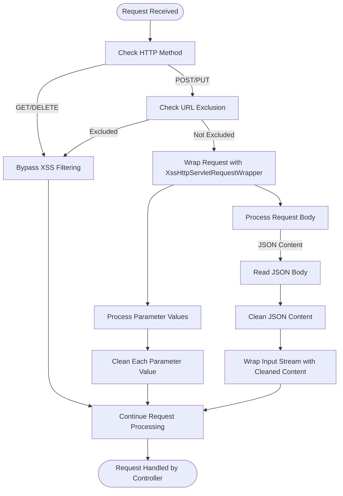
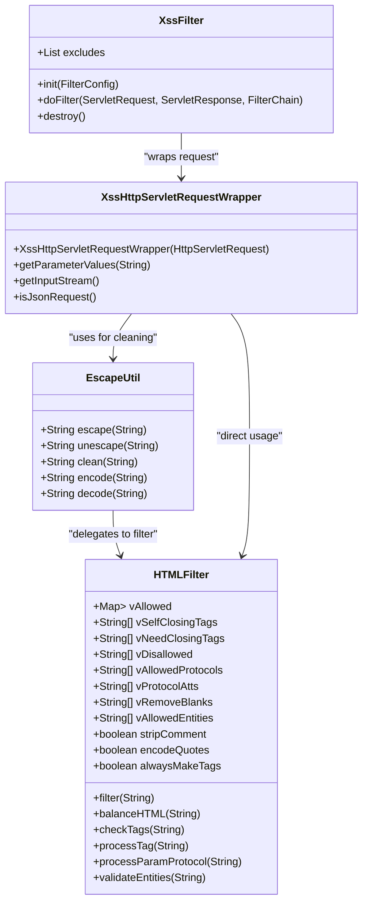
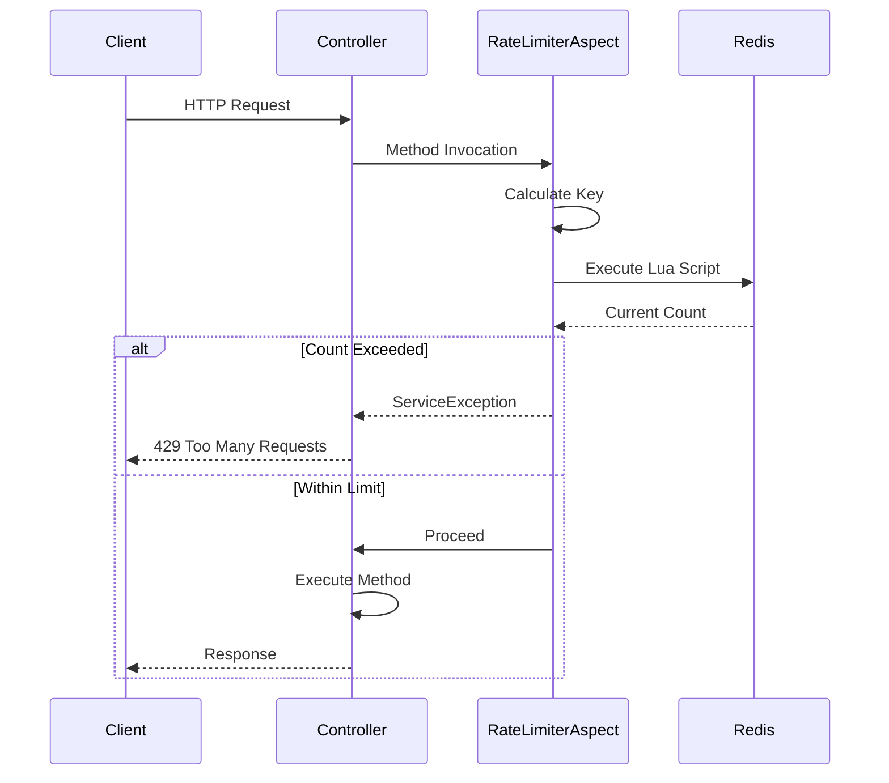
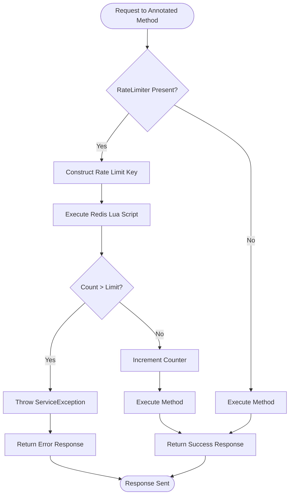
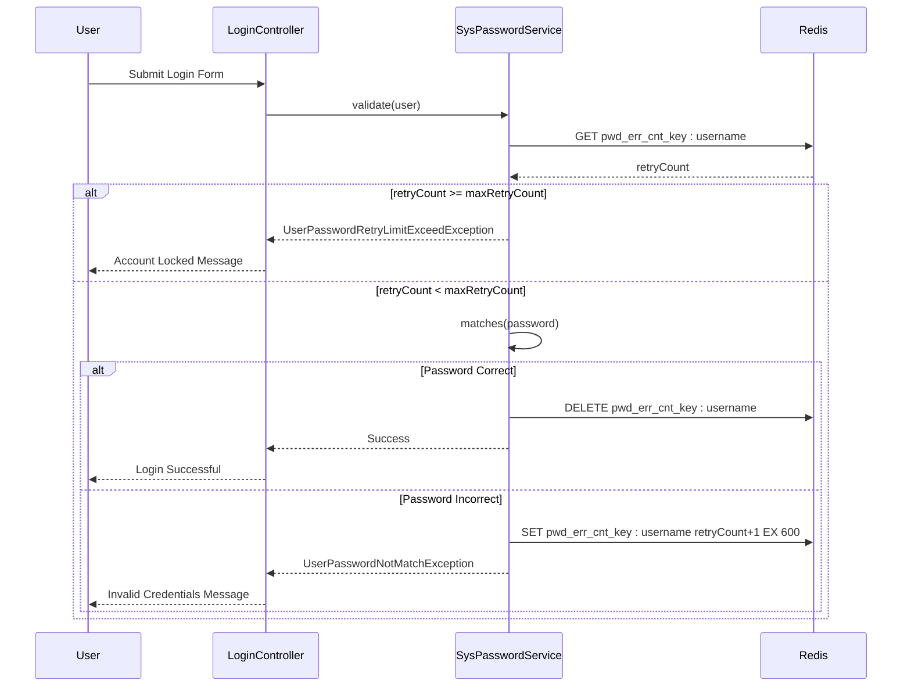
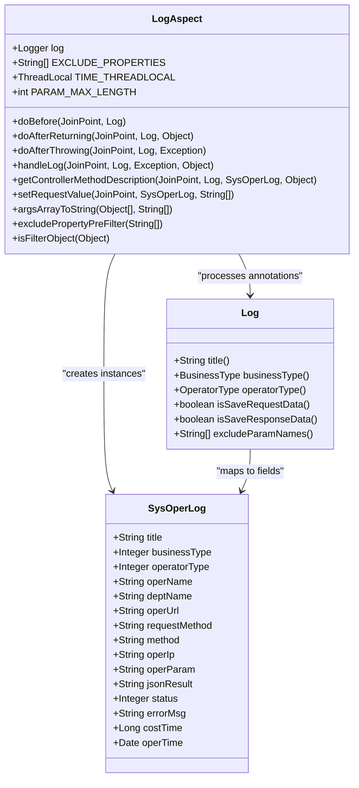
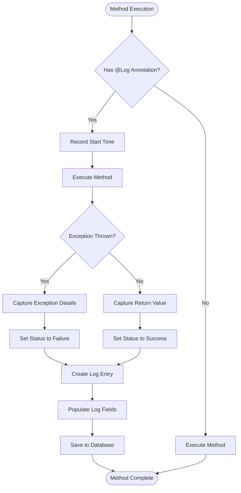
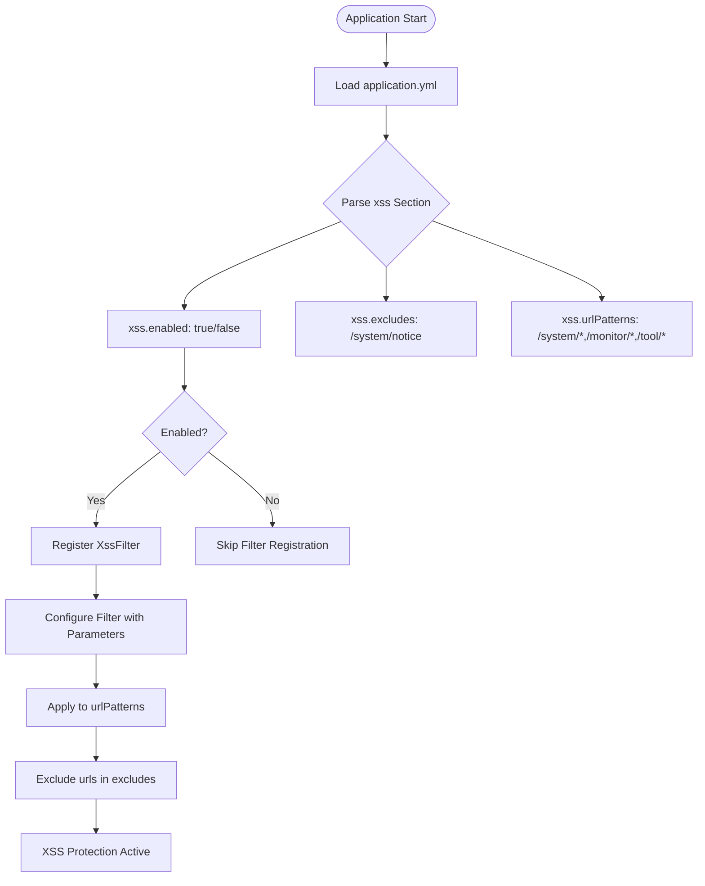

# Security Features

<cite>
**Referenced Files in This Document**   
- [XssFilter.java](file://src/main/java/com/ruoyi/common/filter/XssFilter.java)
- [XssHttpServletRequestWrapper.java](file://src/main/java/com/ruoyi/common/filter/XssHttpServletRequestWrapper.java)
- [EscapeUtil.java](file://src/main/java/com/ruoyi/common/utils/html/EscapeUtil.java)
- [HTMLFilter.java](file://src/main/java/com/ruoyi/common/utils/html/HTMLFilter.java)
- [RateLimiter.java](file://src/main/java/com/ruoyi/framework/aspectj/lang/annotation/RateLimiter.java)
- [RateLimiterAspect.java](file://src/main/java/com/ruoyi/framework/aspectj/RateLimiterAspect.java)
- [UserConstants.java](file://src/main/java/com/ruoyi/common/constant/UserConstants.java)
- [SysPasswordService.java](file://src/main/java/com/ruoyi/framework/security/service/SysPasswordService.java)
- [Log.java](file://src/main/java/com/ruoyi/framework/aspectj/lang/annotation/Log.java)
- [LogAspect.java](file://src/main/java/com/ruoyi/framework/aspectj/LogAspect.java)
- [application.yml](file://src/main/resources/application.yml)
- [FilterConfig.java](file://src/main/java/com/ruoyi/framework/config/FilterConfig.java)
</cite>

## Table of Contents
1. [Introduction](#introduction)
2. [XSS Protection](#xss-protection)
3. [Rate Limiting](#rate-limiting)
4. [Login Attempt Limiting](#login-attempt-limiting)
5. [Operation Logging](#operation-logging)
6. [Configuration Options](#configuration-options)
7. [Best Practices](#best-practices)

## Introduction
RuoYi-Vue implements a comprehensive security framework to protect against common web vulnerabilities such as cross-site scripting (XSS), brute force attacks, denial of service, and unauthorized access. The system employs multiple security mechanisms including input sanitization, request rate limiting, login attempt restrictions, and comprehensive operation logging. These features work together to create a robust defense-in-depth strategy that protects both the application and its users. This document details the implementation and configuration of these security features, providing guidance on how to effectively use them to secure the application in production environments.

## XSS Protection
RuoYi-Vue implements a multi-layered approach to prevent cross-site scripting (XSS) attacks through the XssFilter and XssHttpServletRequestWrapper components. The XSS protection mechanism automatically sanitizes user input to remove potentially malicious scripts and HTML content that could be used in XSS attacks. This protection is applied to all incoming HTTP requests, ensuring that user-supplied data is cleaned before it reaches the application's business logic.

The XSS filtering process begins with the XssFilter, which is configured as a servlet filter in the application. This filter intercepts incoming requests and determines whether they should be processed for XSS protection based on the request method and URL patterns. By default, GET and DELETE requests are excluded from filtering, as they typically don't contain request bodies that could carry XSS payloads. The filter also supports exclusion patterns, allowing specific URLs to bypass XSS filtering when necessary.

When a request requires XSS filtering, the XssFilter wraps the original HttpServletRequest with an XssHttpServletRequestWrapper instance. This wrapper overrides key methods to sanitize input data before it's accessed by the application. For form data (parameters), the wrapper processes all parameter values through the sanitization pipeline. For JSON request bodies, it intercepts the input stream and cleans the JSON content before it's parsed by the application.

**Section sources**
- [XssFilter.java](file://src/main/java/com/ruoyi/common/filter/XssFilter.java#L22-L75)
- [XssHttpServletRequestWrapper.java](file://src/main/java/com/ruoyi/common/filter/XssHttpServletRequestWrapper.java#L20-L111)

### Input Sanitization Process
The XSS protection mechanism employs a two-stage sanitization process that handles both parameter-based input and request body content. For parameter-based input (such as form data in POST requests or query parameters in GET requests), the system overrides the getParameterValues method in the XssHttpServletRequestWrapper class. This method intercepts all parameter access and applies sanitization to each value before returning it to the application.

**Diagram sources**
- [XssFilter.java](file://src/main/java/com/ruoyi/common/filter/XssFilter.java#L44-L56)
- [XssHttpServletRequestWrapper.java](file://src/main/java/com/ruoyi/common/filter/XssHttpServletRequestWrapper.java#L30-L45)

### HTML Content Filtering
For request bodies containing HTML or JSON content, the XSS protection system uses the HTMLFilter class to sanitize the content. When a request with a JSON content type is received, the system reads the entire request body, applies HTML entity encoding to potentially dangerous characters, and then wraps the cleaned content in a new input stream that is returned to the application.

The HTMLFilter implements a whitelist-based approach to HTML content, allowing only specific HTML elements and attributes while removing or encoding potentially dangerous ones. By default, the filter permits basic formatting elements like `<b>`, `<strong>`, `<i>`, and `<em>`, as well as anchor tags (`<a>`) and images (``). For each allowed element, only specific attributes are permitted: anchor tags can have href and target attributes, while image tags can have src, width, height, and alt attributes.

**Diagram sources**
- [XssHttpServletRequestWrapper.java](file://src/main/java/com/ruoyi/common/filter/XssHttpServletRequestWrapper.java#L48-L69)
- [EscapeUtil.java](file://src/main/java/com/ruoyi/common/utils/html/EscapeUtil.java#L59-L62)
- [HTMLFilter.java](file://src/main/java/com/ruoyi/common/utils/html/HTMLFilter.java#L103-L135)

## Rate Limiting
RuoYi-Vue implements rate limiting functionality through the @RateLimiter annotation and RateLimiterAspect to prevent abuse and denial-of-service attacks. This feature allows developers to control the number of requests that can be made to specific endpoints within a defined time window, helping to protect the system from brute force attacks and excessive resource consumption.

The rate limiting mechanism is implemented using Aspect-Oriented Programming (AOP), where the RateLimiterAspect class intercepts method calls annotated with @RateLimiter. Before the target method is executed, the aspect checks the current request count against the configured limits using Redis as a distributed counter. This approach ensures consistent rate limiting across multiple application instances in a clustered environment.

**Section sources**
- [RateLimiter.java](file://src/main/java/com/ruoyi/framework/aspectj/lang/annotation/RateLimiter.java#L16-L40)
- [RateLimiterAspect.java](file://src/main/java/com/ruoyi/framework/aspectj/RateLimiterAspect.java#L27-L89)

### Rate Limiting Configuration
The @RateLimiter annotation provides several configuration options that allow fine-grained control over rate limiting behavior. The key parameter defines the Redis key prefix used to store the rate limit counter, with a default value provided by CacheConstants.RATE_LIMIT_KEY. The time parameter specifies the time window in seconds for which the rate limit is enforced, defaulting to 60 seconds. The count parameter defines the maximum number of allowed requests within the time window, with a default of 100 requests.

The limitType parameter determines how the rate limiting key is constructed, supporting different scoping strategies. The default type applies the limit globally to the annotated method. The IP type scopes the limit to individual client IP addresses, preventing a single client from overwhelming the system while allowing other clients to continue accessing the endpoint. This is particularly useful for login endpoints where you want to prevent brute force attacks from specific IP addresses.

**Diagram sources**
- [RateLimiterAspect.java](file://src/main/java/com/ruoyi/framework/aspectj/RateLimiterAspect.java#L49-L74)
- [RateLimiter.java](file://src/main/java/com/ruoyi/framework/aspectj/lang/annotation/RateLimiter.java#L24-L39)

### Rate Limiting Implementation
The rate limiting implementation uses a Redis-backed Lua script to ensure atomic operations when checking and incrementing the request counter. This approach prevents race conditions in high-concurrency scenarios where multiple requests might simultaneously check the counter value before it's incremented. The Lua script executes atomically on the Redis server, retrieving the current count and incrementing it in a single operation.

When a request arrives at a rate-limited endpoint, the RateLimiterAspect constructs a unique key based on the configured parameters and the client context. For IP-based limiting, the client's IP address is included in the key. The aspect then executes the Lua script with this key, the maximum allowed count, and the time window. If the returned count exceeds the limit, a ServiceException is thrown with a user-friendly message indicating that the request limit has been exceeded.

**Diagram sources**
- [RateLimiterAspect.java](file://src/main/java/com/ruoyi/framework/aspectj/RateLimiterAspect.java#L50-L64)
- [RateLimiterAspect.java](file://src/main/java/com/ruoyi/framework/aspectj/RateLimiterAspect.java#L76-L88)

## Login Attempt Limiting
RuoYi-Vue implements a login attempt limiting mechanism to prevent brute force attacks on user accounts. This security feature tracks failed login attempts and temporarily locks accounts after a configurable number of consecutive failures. The implementation is located in the SysPasswordService class, which manages password validation and tracks login attempt statistics using Redis as a distributed cache.

The login attempt limiting system uses a sliding window approach to track failed attempts, with each failed login incrementing a counter stored in Redis. The counter is associated with the username and automatically expires after a configurable time period, ensuring that old failed attempts don't permanently affect the account. When the number of failed attempts reaches the configured maximum, the system throws a UserPasswordRetryLimitExceedException, preventing further login attempts until the lockout period expires.

**Section sources**
- [SysPasswordService.java](file://src/main/java/com/ruoyi/framework/security/service/SysPasswordService.java#L22-L86)
- [UserConstants.java](file://src/main/java/com/ruoyi/common/constant/UserConstants.java#L73-L81)

### Account Lockout Mechanism
The account lockout mechanism is implemented in the validate method of the SysPasswordService class. When a login attempt is made, the system first retrieves the current retry count for the username from Redis. If no count exists, it initializes the count to zero. The system then compares the current retry count to the maximum allowed retry count configured in the application properties.

If the retry count has not exceeded the maximum, the system proceeds to validate the provided password against the stored hash. If the password is incorrect, the retry count is incremented and stored back in Redis with an expiration time corresponding to the lockout duration. This ensures that the counter automatically resets after the specified time period without requiring manual intervention.

**Diagram sources**
- [SysPasswordService.java](file://src/main/java/com/ruoyi/framework/security/service/SysPasswordService.java#L44-L71)
- [UserPasswordRetryLimitExceedException.java](file://src/main/java/com/ruoyi/common/exception/user/UserPasswordRetryLimitExceedException.java#L8-L15)

### Configuration and Exception Handling
The login attempt limiting configuration is controlled through properties in the application.yml file, specifically user.password.maxRetryCount and user.password.lockTime. These values are injected into the SysPasswordService via Spring's @Value annotation, allowing administrators to adjust the security settings without modifying code. The maxRetryCount property defines the number of consecutive failed attempts allowed before account lockout, while lockTime specifies the duration (in minutes) that the account remains locked.

When the maximum retry count is exceeded, the system throws a UserPasswordRetryLimitExceedException that includes both the maximum retry count and lock time in its message parameters. This information can be used by the frontend to display a more informative error message to the user, indicating how many attempts were allowed and how long they need to wait before trying again.

**Section sources**
- [application.yml](file://src/main/resources/application.yml#L40-L47)
- [SysPasswordService.java](file://src/main/java/com/ruoyi/framework/security/service/SysPasswordService.java#L27-L31)

## Operation Logging
RuoYi-Vue implements comprehensive operation logging through the @Log annotation and LogAspect to record user activities and system operations. This feature provides an audit trail of all significant actions performed within the system, enabling administrators to monitor user behavior, investigate security incidents, and maintain compliance with regulatory requirements.

The operation logging system uses Aspect-Oriented Programming to automatically capture method execution details without requiring invasive code changes. By annotating controller methods with @Log, developers can specify what type of operation is being performed, the module it belongs to, and whether request and response data should be recorded. The LogAspect intercepts these annotated methods and creates detailed log entries that are stored in the database.

**Section sources**
- [Log.java](file://src/main/java/com/ruoyi/framework/aspectj/lang/annotation/Log.java#L17-L51)
- [LogAspect.java](file://src/main/java/com/ruoyi/framework/aspectj/LogAspect.java#L41-L265)

### Logging Annotation Configuration
The @Log annotation provides several configuration options that control how operations are logged. The title parameter specifies the module or feature name associated with the operation, helping to categorize log entries. The businessType parameter defines the type of business operation being performed, with options including INSERT, UPDATE, DELETE, GRANT, EXPORT, IMPORT, FORCE, and OTHER. This classification helps in filtering and analyzing log data based on the nature of the operation.

Additional configuration options include isSaveRequestData and isSaveResponseData, which control whether the method parameters and return values are included in the log entry. This is particularly useful for tracking data modifications while respecting privacy concerns. The excludeParamNames parameter allows specific parameter names to be excluded from logging, which is essential for protecting sensitive information like passwords.

**Diagram sources**
- [Log.java](file://src/main/java/com/ruoyi/framework/aspectj/lang/annotation/Log.java#L25-L50)
- [LogAspect.java](file://src/main/java/com/ruoyi/framework/aspectj/LogAspect.java#L44-L265)
- [SysOperLog.java](file://src/main/java/com/ruoyi/project/monitor/domain/SysOperLog.java)

### Log Processing Workflow
The operation logging workflow begins when a method annotated with @Log is invoked. The LogAspect's doBefore advice captures the start time of the method execution, which is used later to calculate the operation duration. After the method completes successfully, the doAfterReturning advice is triggered, which calls the handleLog method to create and persist the log entry.

The handleLog method gathers various pieces of information to include in the log entry, including the current user's username and department, the request IP address, the requested URL, the HTTP method, and the fully qualified method name. If configured to do so, it also captures the method parameters and return value, applying filters to exclude sensitive properties like passwords. For failed operations, the doAfterThrowing advice captures the exception details and records the operation as having failed.

**Diagram sources**
- [LogAspect.java](file://src/main/java/com/ruoyi/framework/aspectj/LogAspect.java#L59-L86)
- [LogAspect.java](file://src/main/java/com/ruoyi/framework/aspectj/LogAspect.java#L88-L140)

## Configuration Options
RuoYi-Vue provides extensive configuration options for its security features through the application.yml file and related configuration classes. These settings allow administrators to customize the security behavior to meet specific organizational requirements and compliance standards without modifying the application code.

The security configuration is organized into logical sections that correspond to different security features. The xss section controls cross-site scripting protection, the user.password section manages login attempt limiting, and various other sections configure additional security aspects. This modular approach makes it easy to locate and modify specific security settings while maintaining a clean and organized configuration structure.

**Section sources**
- [application.yml](file://src/main/resources/application.yml#L129-L137)
- [FilterConfig.java](file://src/main/java/com/ruoyi/framework/config/FilterConfig.java#L22-L80)

### XSS Configuration
The XSS protection system can be configured through several properties in the application.yml file. The xss.enabled property controls whether XSS filtering is active, allowing administrators to disable the feature if needed for troubleshooting or compatibility reasons. The xss.excludes property specifies a comma-separated list of URL patterns that should bypass XSS filtering, which is useful for endpoints that legitimately need to accept HTML content.

The xss.urlPatterns property defines the URL patterns to which XSS filtering should be applied, typically covering all system, monitor, and tool endpoints. This selective application ensures that XSS protection is focused on areas where user input is processed while minimizing performance overhead on endpoints that don't handle user-supplied content.

**Diagram sources**
- [application.yml](file://src/main/resources/application.yml#L129-L137)
- [FilterConfig.java](file://src/main/java/com/ruoyi/framework/config/FilterConfig.java#L36-L49)

### Rate Limiting Configuration
While the rate limiting behavior is primarily controlled through the @RateLimiter annotation on individual methods, the underlying infrastructure requires proper configuration of Redis connectivity. The spring.redis section in application.yml specifies the Redis server host, port, password, and connection settings that the RateLimiterAspect uses to store and retrieve rate limit counters.

The Redis configuration includes connection pooling settings that affect the performance and reliability of the rate limiting system. The lettuce.pool.max-active property controls the maximum number of connections in the pool, while lettuce.pool.max-idle and lettuce.pool.min-idle manage the idle connection count. Proper tuning of these values is essential for maintaining rate limiting performance under high load conditions.

**Section sources**
- [application.yml](file://src/main/resources/application.yml#L68-L90)
- [RateLimiterAspect.java](file://src/main/java/com/ruoyi/framework/aspectj/RateLimiterAspect.java#L33-L47)

## Best Practices
Implementing security features effectively requires following best practices that balance protection with usability and performance. For XSS protection, it's recommended to maintain the default configuration in production environments, as it provides comprehensive protection against common XSS attack vectors. The exclusion list should be kept minimal and regularly reviewed to ensure that only legitimate endpoints are excluded from filtering.

For rate limiting, endpoints that are particularly vulnerable to abuse, such as login, password reset, and form submission endpoints, should be protected with appropriate limits. The limits should be set based on expected usage patterns, with more restrictive limits for sensitive endpoints. IP-based limiting is particularly effective for login endpoints, as it prevents a single attacker from targeting multiple accounts simultaneously.

**Section sources**
- [application.yml](file://src/main/resources/application.yml#L129-L137)
- [RateLimiter.java](file://src/main/java/com/ruoyi/framework/aspectj/lang/annotation/RateLimiter.java#L24-L39)

### Production Security Configuration
In production environments, all security features should be enabled and properly configured. The XSS filter should be active with a carefully curated exclusion list that only includes endpoints that legitimately require HTML content. Rate limiting should be applied to all public endpoints, with more restrictive limits on authentication-related endpoints to prevent brute force attacks.

Login attempt limiting should be configured with a reasonable balance between security and usability. A maximum retry count of 5-10 attempts with a lockout duration of 10-15 minutes is typically sufficient to deter automated attacks while minimizing the impact on legitimate users who may mistype their password. The lockout duration should be long enough to discourage brute force attacks but not so long as to create a denial-of-service condition.

Operation logging should be configured to capture sufficient detail for audit and forensic purposes while respecting privacy requirements. Sensitive parameters like passwords should be excluded from logging, and log retention policies should comply with relevant regulations. The log storage system should be protected with appropriate access controls to prevent unauthorized access to the audit trail.