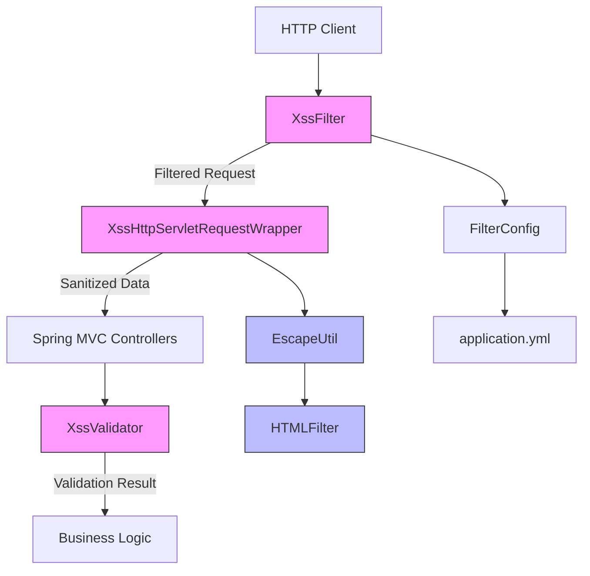
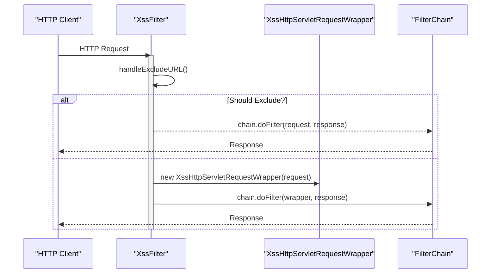
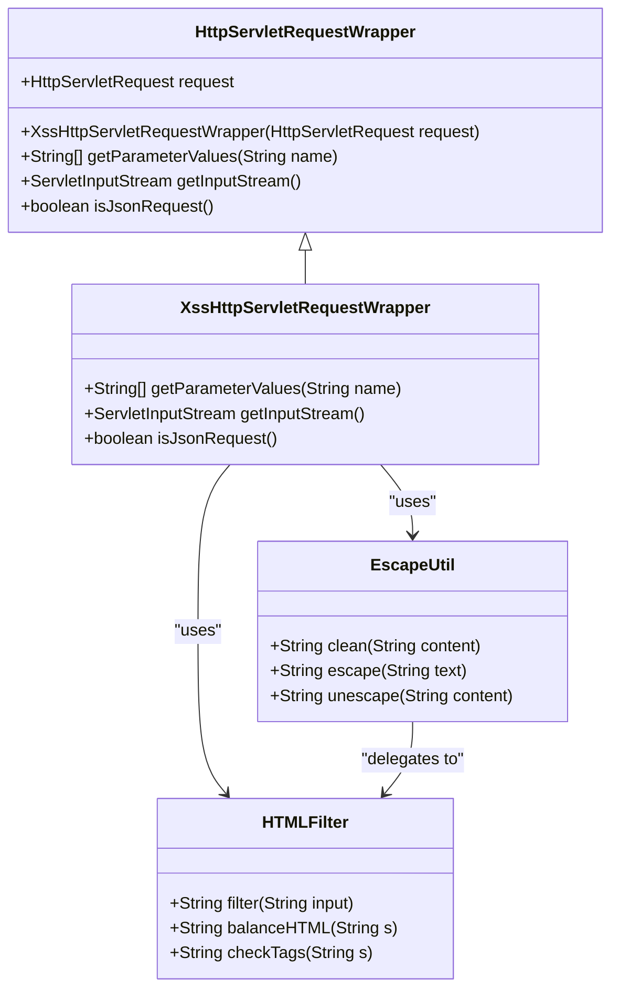

# XSS Protection

<cite>
**Referenced Files in This Document**   
- [XssFilter.java](file://src/main/java/com/ruoyi/common/filter/XssFilter.java)
- [XssHttpServletRequestWrapper.java](file://src/main/java/com/ruoyi/common/filter/XssHttpServletRequestWrapper.java)
- [Xss.java](file://src/main/java/com/ruoyi/common/xss/Xss.java)
- [XssValidator.java](file://src/main/java/com/ruoyi/common/xss/XssValidator.java)
- [EscapeUtil.java](file://src/main/java/com/ruoyi/common/utils/html/EscapeUtil.java)
- [HTMLFilter.java](file://src/main/java/com/ruoyi/common/utils/html/HTMLFilter.java)
- [FilterConfig.java](file://src/main/java/com/ruoyi/framework/config/FilterConfig.java)
- [application.yml](file://src/main/resources/application.yml)
</cite>

## Table of Contents
1. [Introduction](#introduction)
2. [Core Components](#core-components)
3. [Architecture Overview](#architecture-overview)
4. [Detailed Component Analysis](#detailed-component-analysis)
5. [Configuration and Integration](#configuration-and-integration)
6. [Sanitization Logic](#sanitization-logic)
7. [Best Practices and Customization](#best-practices-and-customization)
8. [Conclusion](#conclusion)

## Introduction
The RuoYi-Vue framework implements a comprehensive XSS protection mechanism to prevent cross-site scripting attacks by sanitizing user input across HTTP requests. This document details the implementation of the XSS protection system, which operates through a servlet filter chain that wraps incoming requests and processes potentially malicious content in parameters, headers, and body data. The protection mechanism combines request filtering with annotation-based validation to provide layered security across the application. The system is configurable to allow specific endpoints to bypass filtering when necessary, balancing security with functional requirements.

## Core Components
The XSS protection mechanism in RuoYi-Vue consists of several key components that work together to sanitize user input and prevent malicious script execution. The primary components include the XssFilter servlet filter, which intercepts incoming requests; the XssHttpServletRequestWrapper, which wraps the original request to provide sanitized data; and the XssValidator, which provides annotation-based validation for specific fields. These components are supported by utility classes such as EscapeUtil and HTMLFilter that handle the actual sanitization logic. The integration with Spring MVC ensures that this protection applies consistently across all controller endpoints, providing a robust defense against XSS attacks.

**Section sources**
- [XssFilter.java](file://src/main/java/com/ruoyi/common/filter/XssFilter.java)
- [XssHttpServletRequestWrapper.java](file://src/main/java/com/ruoyi/common/filter/XssHttpServletRequestWrapper.java)
- [Xss.java](file://src/main/java/com/ruoyi/common/xss/Xss.java)
- [XssValidator.java](file://src/main/java/com/ruoyi/common/xss/XssValidator.java)

## Architecture Overview
The XSS protection system in RuoYi-Vue follows a layered architecture that integrates with the Spring MVC framework's filter chain. When an HTTP request enters the application, it first passes through the XssFilter, which determines whether the request should be processed based on URL patterns and HTTP methods. If filtering is required, the filter wraps the original HttpServletRequest with an XssHttpServletRequestWrapper instance. This wrapper intercepts all data access methods, applying sanitization before returning values to the application. The architecture also supports annotation-based validation through the @Xss annotation, which can be applied to specific fields or parameters for additional validation at the business logic layer.



**Diagram sources**
- [XssFilter.java](file://src/main/java/com/ruoyi/common/filter/XssFilter.java)
- [XssHttpServletRequestWrapper.java](file://src/main/java/com/ruoyi/common/filter/XssHttpServletRequestWrapper.java)
- [XssValidator.java](file://src/main/java/com/ruoyi/common/xss/XssValidator.java)
- [EscapeUtil.java](file://src/main/java/com/ruoyi/common/utils/html/EscapeUtil.java)
- [HTMLFilter.java](file://src/main/java/com/ruoyi/common/utils/html/HTMLFilter.java)
- [FilterConfig.java](file://src/main/java/com/ruoyi/framework/config/FilterConfig.java)
- [application.yml](file://src/main/resources/application.yml)

## Detailed Component Analysis

### XssFilter Analysis
The XssFilter is a servlet filter that serves as the entry point for XSS protection in the RuoYi-Vue application. It implements the javax.servlet.Filter interface and is registered in the Spring configuration to intercept incoming HTTP requests. The filter examines each request to determine whether XSS filtering should be applied based on the request method and URL pattern. Notably, GET and DELETE requests are excluded from filtering by default, as specified in the handleExcludeURL method. The filter also supports configuration of excluded URLs through initialization parameters, allowing specific endpoints to bypass the XSS protection mechanism when necessary.



**Diagram sources**
- [XssFilter.java](file://src/main/java/com/ruoyi/common/filter/XssFilter.java)
- [XssHttpServletRequestWrapper.java](file://src/main/java/com/ruoyi/common/filter/XssHttpServletRequestWrapper.java)

**Section sources**
- [XssFilter.java](file://src/main/java/com/ruoyi/common/filter/XssFilter.java#L22-L75)

### XssHttpServletRequestWrapper Analysis
The XssHttpServletRequestWrapper class extends HttpServletRequestWrapper to provide a sanitized view of the original HTTP request. This wrapper intercepts access to request parameters, headers, and body content, applying XSS sanitization before returning values to the application. The wrapper overrides key methods such as getParameterValues() and getInputStream() to ensure that all data retrieved from the request is properly sanitized. For form data, it processes parameter values through the EscapeUtil.clean() method, which removes or encodes potentially malicious content. For JSON requests, it reads the entire request body, applies sanitization, and returns a new input stream with the cleaned content.



**Diagram sources**
- [XssHttpServletRequestWrapper.java](file://src/main/java/com/ruoyi/common/filter/XssHttpServletRequestWrapper.java)
- [EscapeUtil.java](file://src/main/java/com/ruoyi/common/utils/html/EscapeUtil.java)
- [HTMLFilter.java](file://src/main/java/com/ruoyi/common/utils/html/HTMLFilter.java)

**Section sources**
- [XssHttpServletRequestWrapper.java](file://src/main/java/com/ruoyi/common/filter/XssHttpServletRequestWrapper.java#L20-L111)

### XssValidator Analysis
The XssValidator provides annotation-based validation for XSS protection, complementing the request-level filtering with field-level validation. Implemented as a JSR-303 Bean Validation constraint validator, it can be applied to individual fields, method parameters, or entire classes. The validator uses a regular expression pattern to detect HTML content in string values, rejecting any input that contains potential HTML tags or scripts. This approach allows for fine-grained control over XSS protection, enabling developers to apply validation only to specific fields that require it. The validator returns true for null or blank values, allowing optional fields to be properly handled.

```mermaid
classDiagram
class Xss {
+String message() default "不允许任何脚本运行"
+Class<?>[] groups() default {}
+Class<? extends Payload>[] payload() default {}
}
class XssValidator {
-static final String HTML_PATTERN
+boolean isValid(String value, ConstraintValidatorContext context)
+static boolean containsHtml(String value)
}
XssValidator --> Xss : "validatedBy"
XssValidator --> StringUtils : "uses"
class StringUtils {
+boolean isBlank(String str)
}
note right of XssValidator
Implements ConstraintValidator<Xss, String>
Uses regex pattern to detect HTML content
Returns true for null/blank values
end note
```

**Diagram sources**
- [Xss.java](file://src/main/java/com/ruoyi/common/xss/Xss.java)
- [XssValidator.java](file://src/main/java/com/ruoyi/common/xss/XssValidator.java)
- [StringUtils.java](file://src/main/java/com/ruoyi/common/utils/StringUtils.java)

**Section sources**
- [Xss.java](file://src/main/java/com/ruoyi/common/xss/Xss.java#L1-L27)
- [XssValidator.java](file://src/main/java/com/ruoyi/common/xss/XssValidator.java#L1-L39)

## Configuration and Integration
The XSS protection mechanism in RuoYi-Vue is configured through Spring's component model and external configuration files. The FilterConfig class contains the xssFilterRegistration() method, which creates and configures the XssFilter as a Spring bean when the xss.enabled property is set to true. This configuration uses @ConditionalOnProperty to enable or disable the filter based on application settings. The filter's behavior is controlled by properties defined in application.yml, including the list of excluded URLs and the URL patterns to which the filter should apply. This approach allows for flexible configuration without requiring code changes.

The integration with Spring MVC ensures that the XSS protection applies to all controller endpoints that match the specified URL patterns. When a request matches the configured patterns and is not excluded by method type or URL, the XssFilter wraps the request in an XssHttpServletRequestWrapper before passing it to subsequent filters and controllers. This transparent integration means that existing controllers and services can continue to access request data through standard HttpServletRequest methods, while automatically receiving sanitized input.

```mermaid
flowchart TD
A[application.yml] --> B[xss.enabled: true]
A --> C[xss.excludes: /system/notice]
A --> D[xss.urlPatterns: /system/*,/monitor/*,/tool/*]
B --> E[FilterConfig.xssFilterRegistration()]
C --> E
D --> E
E --> F[XssFilter]
F --> G{Request Method}
G --> |GET or DELETE| H[Bypass Filtering]
G --> |POST, PUT, etc.| I{URL Matches Pattern?}
I --> |No| J[Bypass Filtering]
I --> |Yes| K{URL in Excludes?}
K --> |Yes| L[Bypass Filtering]
K --> |No| M[Wrap with XssHttpServletRequestWrapper]
M --> N[Process Request]
```

**Diagram sources**
- [FilterConfig.java](file://src/main/java/com/ruoyi/framework/config/FilterConfig.java)
- [application.yml](file://src/main/resources/application.yml)
- [XssFilter.java](file://src/main/java/com/ruoyi/common/filter/XssFilter.java)

**Section sources**
- [FilterConfig.java](file://src/main/java/com/ruoyi/framework/config/FilterConfig.java#L22-L68)
- [application.yml](file://src/main/resources/application.yml#L129-L137)

## Sanitization Logic
The sanitization logic in RuoYi-Vue's XSS protection system is implemented through the EscapeUtil and HTMLFilter classes, which work together to remove or neutralize potentially malicious content. The primary method, EscapeUtil.clean(), delegates to HTMLFilter.filter() to process input strings. The HTMLFilter class uses a comprehensive set of regular expressions to identify and handle various types of HTML content, including tags, attributes, comments, and entities. It maintains a whitelist of allowed HTML elements (such as 'a', 'img', 'b', 'strong', 'i', 'em') and their permitted attributes, removing any disallowed elements and attributes from the input.

For request parameters, the XssHttpServletRequestWrapper applies the clean() method to all parameter values, effectively stripping out any HTML tags, JavaScript snippets, or event handlers. This includes common XSS vectors such as <script> tags, onerror attributes, and javascript: URIs. The filter also handles encoded content, decoding and re-encoding entities to prevent bypass attempts. For JSON request bodies, the filter reads the entire content, applies sanitization, and creates a new input stream with the cleaned data, ensuring that JSON payloads are also protected against XSS attacks.

The sanitization process follows a multi-step approach:
1. Remove or escape HTML comments
2. Balance HTML tags to handle malformed input
3. Process individual tags, preserving only whitelisted elements and attributes
4. Remove empty tags that contain no content
5. Validate and encode entities to prevent malicious content

This comprehensive approach ensures that user input is safe to use in HTML contexts while preserving legitimate content.

**Section sources**
- [EscapeUtil.java](file://src/main/java/com/ruoyi/common/utils/html/EscapeUtil.java#L1-L168)
- [HTMLFilter.java](file://src/main/java/com/ruoyi/common/utils/html/HTMLFilter.java#L1-L570)
- [XssHttpServletRequestWrapper.java](file://src/main/java/com/ruoyi/common/filter/XssHttpServletRequestWrapper.java#L30-L48)

## Best Practices and Customization
The XSS protection mechanism in RuoYi-Vue provides several options for customization to balance security requirements with application functionality. Developers can modify the configuration in application.yml to adjust which URLs are excluded from filtering or to change the URL patterns that trigger XSS protection. The excludes property allows specific endpoints to bypass filtering, which may be necessary for rich text editors or other functionality that legitimately requires HTML input.

For more granular control, developers can use the @Xss annotation on specific fields or parameters to apply validation only where needed. This approach is particularly useful for fields that may contain limited HTML content that should be preserved, while still protecting against malicious scripts. The XssValidator can also be extended or modified to customize the validation rules, though this should be done with caution to avoid introducing security vulnerabilities.

Best practices for maintaining usability while ensuring security include:
- Carefully considering which endpoints need to be excluded from filtering
- Using the @Xss annotation selectively on fields that require validation
- Regularly reviewing and updating the list of excluded URLs
- Testing the application thoroughly after any changes to XSS configuration
- Monitoring for false positives that might affect legitimate functionality

Developers should also be aware that while the XSS protection mechanism is comprehensive, it should be used in conjunction with other security measures such as Content Security Policy (CSP) headers and proper output encoding in templates to provide defense in depth.

**Section sources**
- [application.yml](file://src/main/resources/application.yml#L129-L137)
- [Xss.java](file://src/main/java/com/ruoyi/common/xss/Xss.java)
- [XssValidator.java](file://src/main/java/com/ruoyi/common/xss/XssValidator.java)

## Conclusion
The XSS protection mechanism in RuoYi-Vue provides a robust defense against cross-site scripting attacks through a combination of request filtering, input sanitization, and annotation-based validation. By implementing a servlet filter that wraps incoming requests and processes potentially malicious content, the framework ensures that user input is sanitized before it reaches application logic. The configurable nature of the protection allows developers to balance security requirements with functional needs, while the integration with Spring MVC ensures consistent application across all endpoints. The multi-layered approach, combining request-level filtering with field-level validation, provides comprehensive protection against XSS vulnerabilities while maintaining flexibility for legitimate use cases.