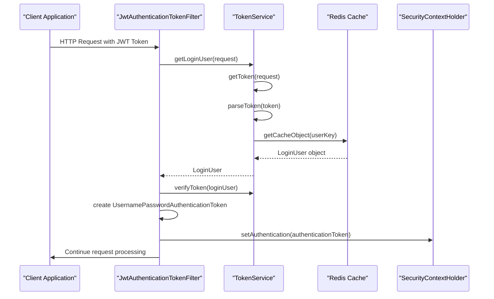
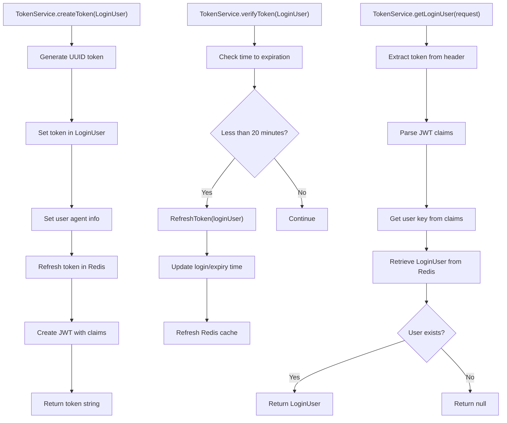
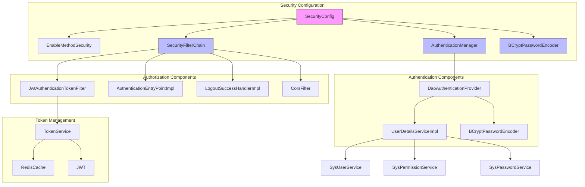

# Security Framework

<cite>
**Referenced Files in This Document**   
- [SecurityConfig.java](file://src/main/java/com/ruoyi/framework/config/SecurityConfig.java)
- [JwtAuthenticationTokenFilter.java](file://src/main/java/com/ruoyi/framework/security/filter/JwtAuthenticationTokenFilter.java)
- [TokenService.java](file://src/main/java/com/ruoyi/framework/security/service/TokenService.java)
- [LoginUser.java](file://src/main/java/com/ruoyi/framework/security/LoginUser.java)
- [UserDetailsServiceImpl.java](file://src/main/java/com/ruoyi/framework/security/service/UserDetailsServiceImpl.java)
- [SysLoginService.java](file://src/main/java/com/ruoyi/framework/security/service/SysLoginService.java)
- [SysPermissionService.java](file://src/main/java/com/ruoyi/framework/security/service/SysPermissionService.java)
- [SysPasswordService.java](file://src/main/java/com/ruoyi/framework/security/service/SysPasswordService.java)
- [AuthenticationEntryPointImpl.java](file://src/main/java/com/ruoyi/framework/security/handle/AuthenticationEntryPointImpl.java)
- [LogoutSuccessHandlerImpl.java](file://src/main/java/com/ruoyi/framework/security/handle/LogoutSuccessHandlerImpl.java)
- [PermitAllUrlProperties.java](file://src/main/java/com/ruoyi/framework/config/properties/PermitAllUrlProperties.java)
- [Constants.java](file://src/main/java/com/ruoyi/common/constant/Constants.java)
- [CacheConstants.java](file://src/main/java/com/ruoyi/common/constant/CacheConstants.java)
- [PermissionService.java](file://src/main/java/com/ruoyi/framework/security/service/PermissionService.java)
- [DataScopeAspect.java](file://src/main/java/com/ruoyi/framework/aspectj/DataScopeAspect.java)
</cite>

## Table of Contents
1. [Authentication Mechanism](#authentication-mechanism)
2. [Authorization Implementation](#authorization-implementation)
3. [Security Filter Chain](#security-filter-chain)
4. [LoginUser and TokenService](#loginuser-and-tokenservice)
5. [Security Configuration](#security-configuration)
6. [Method-Level Security](#method-level-security)
7. [Common Security Issues and Best Practices](#common-security-issues-and-best-practices)

## Authentication Mechanism

The RuoYi-Vue security framework implements a JWT-based authentication mechanism using Spring Security. The authentication process begins with the `SysLoginService` which handles the login validation, including captcha verification, password strength checks, and IP blacklist validation. Upon successful authentication, the system generates a JWT token through the `TokenService`.

The JWT token generation process uses a random UUID as the token identifier, which is stored in Redis with a configurable expiration time (default 30 minutes). The token contains claims with the login user key and username, signed using HS512 algorithm with a secret key configured in the application properties. The `createToken` method in `TokenService` orchestrates this process, setting the token in the `LoginUser` object and refreshing its cache in Redis.

Token validation occurs through the `JwtAuthenticationTokenFilter`, which intercepts incoming requests, extracts the JWT token from the Authorization header (prefixed with "Bearer "), and validates it against the Redis-stored user session. The framework uses `io.jsonwebtoken.Jwts` for parsing and verifying the token signature, ensuring that only valid tokens grant access to protected resources.

**Section sources**
- [SysLoginService.java](file://src/main/java/com/ruoyi/framework/security/service/SysLoginService.java#L63-L99)
- [TokenService.java](file://src/main/java/com/ruoyi/framework/security/service/TokenService.java#L114-L124)
- [Constants.java](file://src/main/java/com/ruoyi/common/constant/Constants.java#L106-L107)
- [CacheConstants.java](file://src/main/java/com/ruoyi/common/constant/CacheConstants.java#L13-L14)

## Authorization Implementation

The authorization system in RuoYi-Vue implements a comprehensive role-based access control (RBAC) model with data scope permissions. The framework uses Spring Security's method-level security annotations, particularly `@PreAuthorize`, to enforce access control at the service and controller levels.

Role-based authorization is managed through the `SysPermissionService`, which retrieves menu and role permissions for authenticated users. Administrators (users with admin role) are granted all permissions (`*:*:*`), while regular users receive permissions based on their assigned roles and menus. The permission checking is performed by the `PermissionService` class, which is exposed as a Spring bean with the name "ss" for use in SpEL expressions.

Data scope permissions are implemented through the `DataScopeAspect` aspect-oriented component, which automatically filters data based on user roles and department affiliations. The framework supports multiple data scope levels:
- All data access
- Custom data access
- Department-level access
- Department and child departments access
- Self-data access only

This ensures that users can only access data within their authorized scope, preventing unauthorized data exposure across departments or roles.

```mermaid
classDiagram
class LoginUser {
+Long userId
+Long deptId
+String token
+Long loginTime
+Long expireTime
+String ipaddr
+String loginLocation
+String browser
+String os
+Set~String~ permissions
+SysUser user
+getUserId() Long
+getDeptId() Long
+getToken() String
+getLoginTime() Long
+getExpireTime() Long
+getIpaddr() String
+getLoginLocation() String
+getBrowser() String
+getOs() String
+getPermissions() Set~String~
+getUser() SysUser
}
class SysPermissionService {
+getRolePermission(SysUser) Set~String~
+getMenuPermission(SysUser) Set~String~
}
class PermissionService {
+hasPermi(String) boolean
+hasRole(String) boolean
+lacksPermi(String) boolean
+lacksRole(String) boolean
}
class DataScopeAspect {
+DATA_SCOPE_ALL String
+DATA_SCOPE_CUSTOM String
+DATA_SCOPE_DEPT String
+DATA_SCOPE_DEPT_AND_CHILD String
+DATA_SCOPE_SELF String
+handleDataScope(JoinPoint, DataScope)
+dataScopeFilter(JoinPoint, SysUser, String, String, String)
}
LoginUser --> SysUser : "contains"
PermissionService --> LoginUser : "retrieves"
SysPermissionService --> LoginUser : "populates"
DataScopeAspect --> LoginUser : "retrieves context"
DataScopeAspect --> PermissionContextHolder : "uses"
```

**Diagram sources**
- [LoginUser.java](file://src/main/java/com/ruoyi/framework/security/LoginUser.java#L15-L267)
- [SysPermissionService.java](file://src/main/java/com/ruoyi/framework/security/service/SysPermissionService.java#L23-L90)
- [PermissionService.java](file://src/main/java/com/ruoyi/framework/security/service/PermissionService.java#L18-L44)
- [DataScopeAspect.java](file://src/main/java/com/ruoyi/framework/aspectj/DataScopeAspect.java#L27-L85)

**Section sources**
- [SysPermissionService.java](file://src/main/java/com/ruoyi/framework/security/service/SysPermissionService.java#L23-L90)
- [PermissionService.java](file://src/main/java/com/ruoyi/framework/security/service/PermissionService.java#L18-L44)
- [DataScopeAspect.java](file://src/main/java/com/ruoyi/framework/aspectj/DataScopeAspect.java#L27-L85)

## Security Filter Chain

The security filter chain in RuoYi-Vue is configured through the `SecurityConfig` class, which defines a stateless security configuration using JWT tokens instead of traditional session-based authentication. The filter chain is implemented as a `SecurityFilterChain` bean with multiple security filters arranged in a specific order.

The core component is the `JwtAuthenticationTokenFilter`, which is added before the `UsernamePasswordAuthenticationFilter` in the filter chain. This filter intercepts all incoming requests, extracts the JWT token from the Authorization header, and validates it against the Redis-stored user session. If the token is valid, the filter sets the authentication context in Spring Security's `SecurityContextHolder`.

The filter chain configuration disables CSRF protection (since the application is stateless), sets session creation policy to STATELESS, and configures exception handling with a custom `AuthenticationEntryPointImpl` that returns appropriate error responses for unauthorized access attempts. The chain also includes a `LogoutSuccessHandlerImpl` for handling logout requests and a CORS filter for cross-origin requests.

The security filter chain allows anonymous access to specific endpoints such as login, registration, captcha, and static resources, while requiring authentication for all other endpoints. This is configured through the `authorizeHttpRequests` method in the `SecurityFilterChain` configuration.

**Diagram sources**
- [SecurityConfig.java](file://src/main/java/com/ruoyi/framework/config/SecurityConfig.java#L97-L128)
- [JwtAuthenticationTokenFilter.java](file://src/main/java/com/ruoyi/framework/security/filter/JwtAuthenticationTokenFilter.java#L25-L45)
- [TokenService.java](file://src/main/java/com/ruoyi/framework/security/service/TokenService.java#L62-L83)
- [AuthenticationEntryPointImpl.java](file://src/main/java/com/ruoyi/framework/security/handle/AuthenticationEntryPointImpl.java#L22-L35)

**Section sources**
- [SecurityConfig.java](file://src/main/java/com/ruoyi/framework/config/SecurityConfig.java#L97-L128)
- [JwtAuthenticationTokenFilter.java](file://src/main/java/com/ruoyi/framework/security/filter/JwtAuthenticationTokenFilter.java#L25-L45)

## LoginUser and TokenService

The `LoginUser` class represents the authenticated user's security context, extending Spring Security's `UserDetails` interface. It contains comprehensive user information including user ID, department ID, authentication token, login timestamp, expiration time, IP address, browser and operating system details, permissions, and the associated `SysUser` entity. The class implements all required `UserDetails` methods, with password retrieval delegated to the underlying `SysUser` object.

The `TokenService` is responsible for all token-related operations, including creation, validation, refresh, and deletion. It uses Redis as a distributed cache to store user sessions, with keys prefixed by `login_tokens:` as defined in `CacheConstants`. The service implements a token refresh mechanism that automatically extends the token's expiration time when it has less than 20 minutes remaining, providing a seamless user experience without requiring re-authentication.

Token refresh occurs when the `verifyToken` method detects that the token is nearing expiration. The service updates the login time and expiration time in the `LoginUser` object and refreshes the Redis cache with the new expiration. This sliding window approach enhances security by limiting the lifetime of each token while maintaining usability.

The `TokenService` also handles user agent detection using `UserAgentUtils`, capturing browser and operating system information during login for audit purposes. This information is stored in the `LoginUser` object and can be used for security monitoring and anomaly detection.

**Diagram sources**
- [LoginUser.java](file://src/main/java/com/ruoyi/framework/security/LoginUser.java#L15-L267)
- [TokenService.java](file://src/main/java/com/ruoyi/framework/security/service/TokenService.java#L32-L233)

**Section sources**
- [LoginUser.java](file://src/main/java/com/ruoyi/framework/security/LoginUser.java#L15-L267)
- [TokenService.java](file://src/main/java/com/ruoyi/framework/security/service/TokenService.java#L32-L233)

## Security Configuration

The security configuration is centralized in the `SecurityConfig` class, which uses Spring Security's Java configuration approach to define the application's security posture. The configuration enables method-level security with `@EnableMethodSecurity(prePostEnabled = true, securedEnabled = true)`, allowing the use of `@PreAuthorize`, `@PostAuthorize`, `@Secured`, and other security annotations on service methods and controllers.

The `SecurityFilterChain` bean configures HTTP security with stateless session management, disabling CSRF protection and session creation. It defines authorization rules that permit anonymous access to login, registration, captcha, and static resources, while requiring authentication for all other endpoints. The configuration also sets up custom authentication and logout handlers.

Password encoding is implemented using Spring Security's `BCryptPasswordEncoder`, providing strong hashing with salt for stored passwords. The authentication manager is configured with a `DaoAuthenticationProvider` that uses the custom `UserDetailsServiceImpl` for user lookup and the BCrypt encoder for password validation.

The configuration also integrates the `PermitAllUrlProperties` component, which automatically discovers endpoints annotated with `@Anonymous` and adds them to the list of permitted URLs. This allows developers to mark specific methods or controllers as publicly accessible without authentication.

**Diagram sources**
- [SecurityConfig.java](file://src/main/java/com/ruoyi/framework/config/SecurityConfig.java#L31-L140)
- [UserDetailsServiceImpl.java](file://src/main/java/com/ruoyi/framework/security/service/UserDetailsServiceImpl.java#L23-L66)
- [SysPasswordService.java](file://src/main/java/com/ruoyi/framework/security/service/SysPasswordService.java#L22-L87)
- [PermitAllUrlProperties.java](file://src/main/java/com/ruoyi/framework/config/properties/PermitAllUrlProperties.java#L27-L74)

**Section sources**
- [SecurityConfig.java](file://src/main/java/com/ruoyi/framework/config/SecurityConfig.java#L31-L140)

## Method-Level Security

Method-level security in RuoYi-Vue is implemented using Spring Security's expression-based access control with `@PreAuthorize` annotations. The framework provides a custom `PermissionService` bean named "ss" that exposes utility methods for permission and role checking in SpEL expressions.

Developers can secure controller and service methods using annotations such as:
- `@PreAuthorize("@ss.hasPermi('system:user:list')")` - Requires specific permission
- `@PreAuthorize("@ss.hasRole('admin')")` - Requires specific role
- `@PreAuthorize("@ss.lacksPermi('system:user:edit')")` - Requires absence of permission

The `@Anonymous` annotation is used to mark endpoints that should be accessible without authentication. This annotation is processed by the `PermitAllUrlProperties` component, which automatically adds the annotated endpoints to the security configuration's permit-all list.

The framework also supports data scope annotations through `@DataScope`, which automatically applies data filtering based on the user's role and department. This aspect-oriented approach ensures that data access is consistently restricted across all service methods without requiring manual filtering code.

The method security configuration is enabled in `SecurityConfig` with `prePostEnabled = true`, allowing the use of `@PreAuthorize`, `@PostAuthorize`, `@Secured`, and other annotations. The securedEnabled attribute also allows the use of JSR-250 annotations like `@RolesAllowed`.

**Section sources**
- [SecurityConfig.java](file://src/main/java/com/ruoyi/framework/config/SecurityConfig.java#L29-L31)
- [PermissionService.java](file://src/main/java/com/ruoyi/framework/security/service/PermissionService.java#L18-L44)
- [PermitAllUrlProperties.java](file://src/main/java/com/ruoyi/framework/config/properties/PermitAllUrlProperties.java#L27-L74)
- [DataScopeAspect.java](file://src/main/java/com/ruoyi/framework/aspectj/DataScopeAspect.java#L27-L85)

## Common Security Issues and Best Practices

The RuoYi-Vue framework addresses several common security issues through its design and implementation:

**Authentication Security**: The framework implements account lockout after a configurable number of failed login attempts (default 5 attempts), preventing brute force attacks. Password strength is enforced with minimum length validation, and passwords are stored using BCrypt hashing with salt.

**Token Security**: JWT tokens are stored in Redis with a limited expiration time (default 30 minutes) and are automatically refreshed when nearing expiration. The tokens are transmitted over HTTPS with the Bearer scheme, and the server validates the token signature on each request.

**Session Management**: The stateless JWT approach eliminates server-side session storage vulnerabilities. User sessions can be invalidated server-side by removing the token from Redis, providing a logout mechanism and the ability to revoke access.

**Input Validation**: The framework includes comprehensive input validation for usernames and passwords, preventing injection attacks. The `SysLoginService` performs validation on username and password length before authentication attempts.

**Rate Limiting and Protection**: The framework supports rate limiting through configuration and includes protection against common attacks like IP blacklisting, which can be configured in the system settings.

**Best Practices**:
1. Always use HTTPS in production to protect token transmission
2. Configure appropriate token expiration times based on security requirements
3. Regularly rotate the JWT secret key
4. Implement proper error handling that doesn't leak sensitive information
5. Use the data scope features to enforce least privilege access
6. Regularly audit authentication logs for suspicious activity
7. Keep dependencies updated to address known vulnerabilities
8. Implement monitoring for failed login attempts and unusual access patterns

**Section sources**
- [SysPasswordService.java](file://src/main/java/com/ruoyi/framework/security/service/SysPasswordService.java#L27-L31)
- [SysLoginService.java](file://src/main/java/com/ruoyi/framework/security/service/SysLoginService.java#L136-L165)
- [TokenService.java](file://src/main/java/com/ruoyi/framework/security/service/TokenService.java#L44-L46)
- [SecurityConfig.java](file://src/main/java/com/ruoyi/framework/config/SecurityConfig.java#L101-L105)