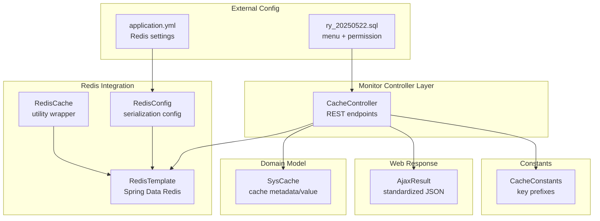
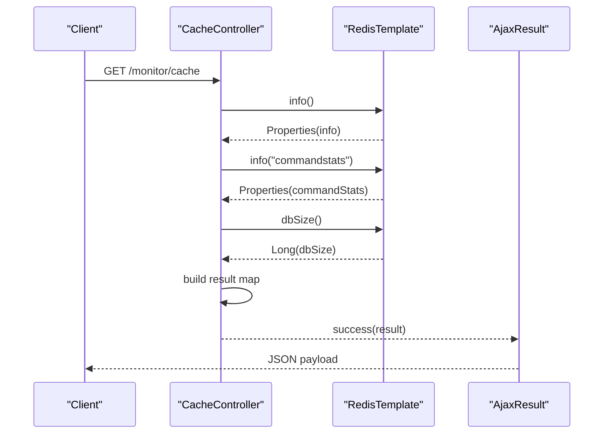
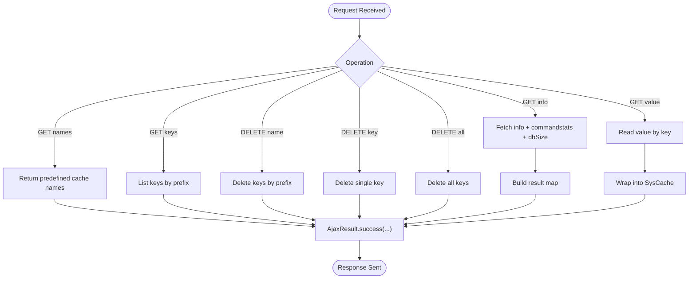
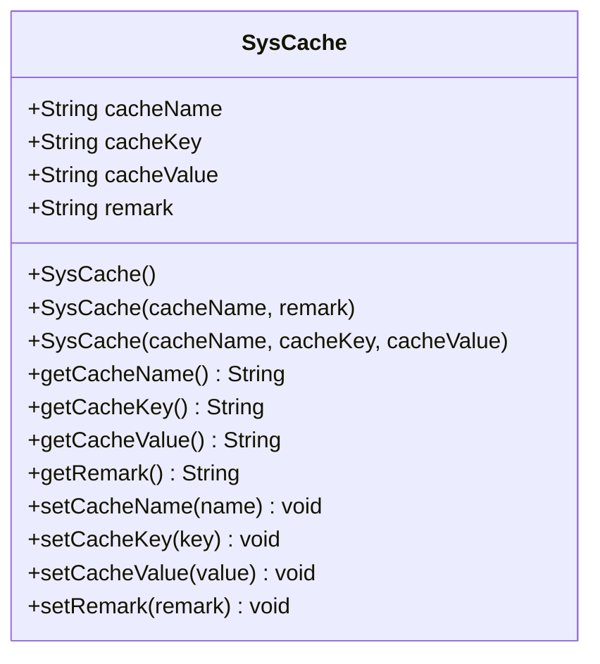
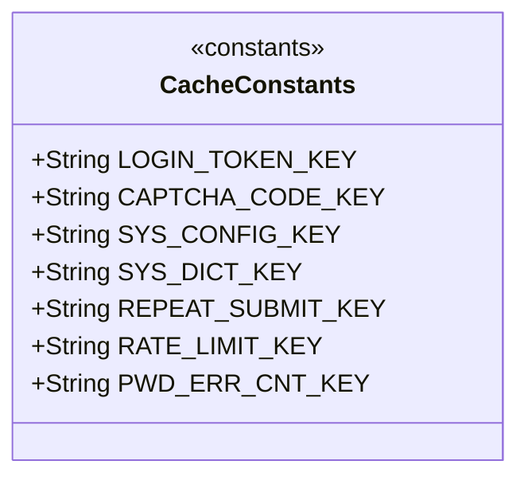
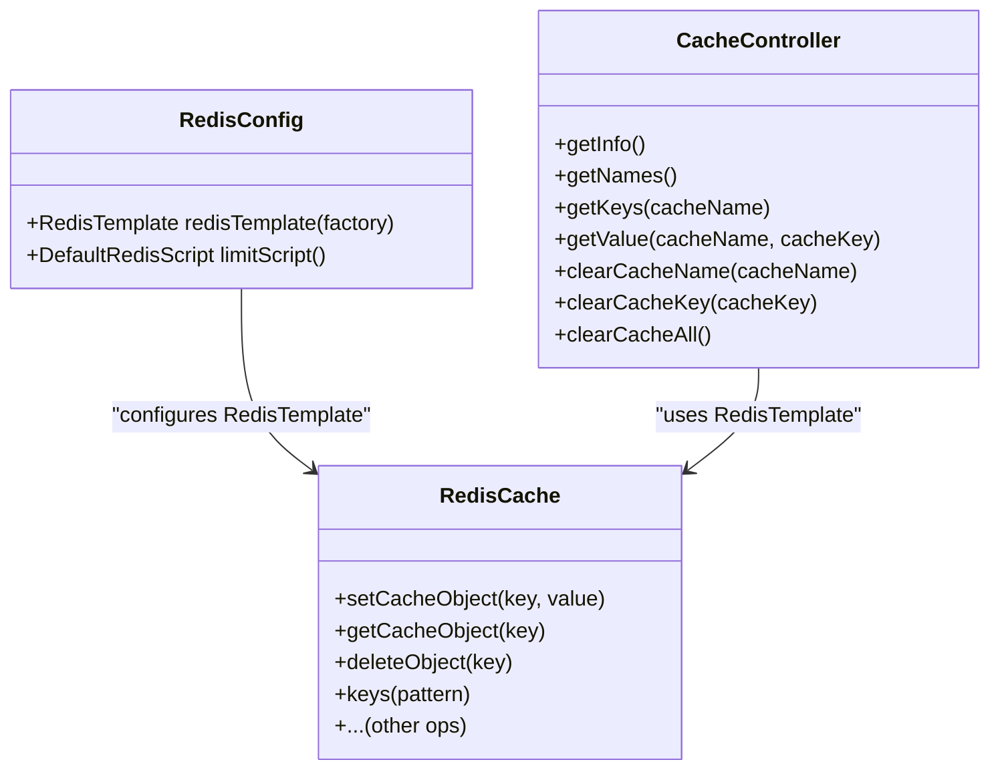
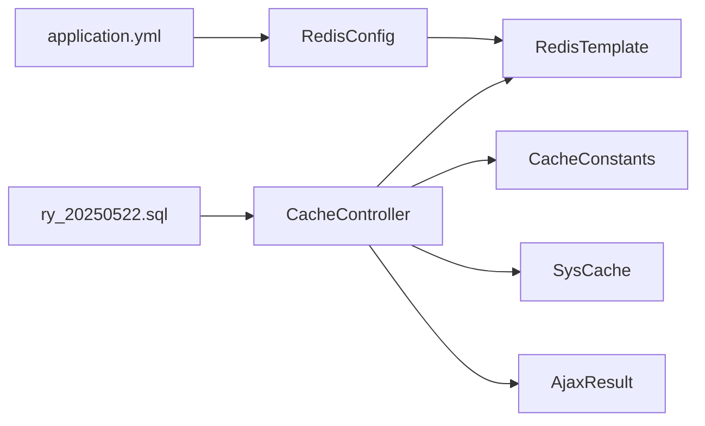

# Cache Monitoring

<cite>
**Referenced Files in This Document**
- [CacheController.java](file://src/main/java/com/ruoyi/project/monitor/controller/CacheController.java)
- [CacheConstants.java](file://src/main/java/com/ruoyi/common/constant/CacheConstants.java)
- [SysCache.java](file://src/main/java/com/ruoyi/project/monitor/domain/SysCache.java)
- [RedisCache.java](file://src/main/java/com/ruoyi/framework/redis/RedisCache.java)
- [RedisConfig.java](file://src/main/java/com/ruoyi/framework/config/RedisConfig.java)
- [AjaxResult.java](file://src/main/java/com/ruoyi/framework/web/domain/AjaxResult.java)
- [application.yml](file://src/main/resources/application.yml)
- [ry_20250522.sql](file://sql/ry_20250522.sql)
</cite>

## Table of Contents
1. [Introduction](#introduction)
2. [Project Structure](#project-structure)
3. [Core Components](#core-components)
4. [Architecture Overview](#architecture-overview)
5. [Detailed Component Analysis](#detailed-component-analysis)
6. [Dependency Analysis](#dependency-analysis)
7. [Performance Considerations](#performance-considerations)
8. [Troubleshooting Guide](#troubleshooting-guide)
9. [Security and Permissions](#security-and-permissions)
10. [Conclusion](#conclusion)

## Introduction
This document explains the Redis cache monitoring feature in RuoYi-Vue. It focuses on how CacheController retrieves Redis server information, command statistics, and database size via RedisTemplate, how the SysCache domain model represents cache entries, and how predefined cache keys from CacheConstants are used. It also documents cache management operations (viewing entries, clearing by name/key, and flushing all), along with security considerations and practical troubleshooting tips.

## Project Structure
The cache monitoring feature spans a small set of cohesive components:
- Controller layer: CacheController exposes REST endpoints for monitoring and cache management.
- Domain model: SysCache encapsulates cache metadata and values for display.
- Constants: CacheConstants defines standardized cache key prefixes used across the system.
- Redis utilities: RedisCache provides convenient Redis operations; RedisConfig configures RedisTemplate serialization.
- Web response: AjaxResult standardizes API responses.
- Configuration: application.yml defines Redis connection settings.
- Menu permission: ry_20250522.sql registers the cache monitoring menu and permission.

**Diagram sources**
- [CacheController.java](file://src/main/java/com/ruoyi/project/monitor/controller/CacheController.java#L30-L121)
- [SysCache.java](file://src/main/java/com/ruoyi/project/monitor/domain/SysCache.java#L1-L82)
- [CacheConstants.java](file://src/main/java/com/ruoyi/common/constant/CacheConstants.java#L1-L45)
- [RedisCache.java](file://src/main/java/com/ruoyi/framework/redis/RedisCache.java#L1-L269)
- [RedisConfig.java](file://src/main/java/com/ruoyi/framework/config/RedisConfig.java#L1-L70)
- [AjaxResult.java](file://src/main/java/com/ruoyi/framework/web/domain/AjaxResult.java#L1-L216)
- [application.yml](file://src/main/resources/application.yml#L69-L90)
- [ry_20250522.sql](file://sql/ry_20250522.sql#L175-L180)

**Section sources**
- [CacheController.java](file://src/main/java/com/ruoyi/project/monitor/controller/CacheController.java#L30-L121)
- [CacheConstants.java](file://src/main/java/com/ruoyi/common/constant/CacheConstants.java#L1-L45)
- [SysCache.java](file://src/main/java/com/ruoyi/project/monitor/domain/SysCache.java#L1-L82)
- [RedisCache.java](file://src/main/java/com/ruoyi/framework/redis/RedisCache.java#L1-L269)
- [RedisConfig.java](file://src/main/java/com/ruoyi/framework/config/RedisConfig.java#L1-L70)
- [AjaxResult.java](file://src/main/java/com/ruoyi/framework/web/domain/AjaxResult.java#L1-L216)
- [application.yml](file://src/main/resources/application.yml#L69-L90)
- [ry_20250522.sql](file://sql/ry_20250522.sql#L175-L180)

## Core Components
- CacheController: Exposes endpoints to retrieve Redis info, command stats, and database size; lists predefined cache names; lists keys by name prefix; reads a specific cache value; clears by name/prefix, by key, or flushes all.
- SysCache: A simple POJO to represent cache entries with name, key, value, and remark.
- CacheConstants: Defines cache key prefixes for user tokens, captcha codes, system configuration, dictionary data, repeat submit protection, rate limiting, and password error counts.
- RedisCache: Utility wrapper around RedisTemplate for common operations (get/set/list/set, hash/map, sets, expire, keys).
- RedisConfig: Configures RedisTemplate with appropriate serializers and exposes a rate-limiting script bean.
- AjaxResult: Standardizes HTTP responses for API endpoints.
- application.yml: Provides Redis connection parameters (host, port, database, password, timeouts, and Lettuce pool settings).
- ry_20250522.sql: Registers the cache monitoring menu and permission code used by the controller’s authorization checks.

**Section sources**
- [CacheController.java](file://src/main/java/com/ruoyi/project/monitor/controller/CacheController.java#L30-L121)
- [SysCache.java](file://src/main/java/com/ruoyi/project/monitor/domain/SysCache.java#L1-L82)
- [CacheConstants.java](file://src/main/java/com/ruoyi/common/constant/CacheConstants.java#L1-L45)
- [RedisCache.java](file://src/main/java/com/ruoyi/framework/redis/RedisCache.java#L1-L269)
- [RedisConfig.java](file://src/main/java/com/ruoyi/framework/config/RedisConfig.java#L1-L70)
- [AjaxResult.java](file://src/main/java/com/ruoyi/framework/web/domain/AjaxResult.java#L1-L216)
- [application.yml](file://src/main/resources/application.yml#L69-L90)
- [ry_20250522.sql](file://sql/ry_20250522.sql#L175-L180)

## Architecture Overview
CacheController orchestrates monitoring and management operations against Redis via RedisTemplate. It uses Redis callbacks to fetch server info and command stats, and uses value operations to read cache values. It also uses keys and delete operations to manage cache entries. Responses are wrapped in AjaxResult. RedisTemplate is configured by RedisConfig with StringRedisSerializer for keys and a JSON serializer for values.

**Diagram sources**
- [CacheController.java](file://src/main/java/com/ruoyi/project/monitor/controller/CacheController.java#L48-L70)
- [AjaxResult.java](file://src/main/java/com/ruoyi/framework/web/domain/AjaxResult.java#L67-L103)

**Section sources**
- [CacheController.java](file://src/main/java/com/ruoyi/project/monitor/controller/CacheController.java#L48-L70)
- [RedisConfig.java](file://src/main/java/com/ruoyi/framework/config/RedisConfig.java#L21-L40)
- [AjaxResult.java](file://src/main/java/com/ruoyi/framework/web/domain/AjaxResult.java#L67-L103)

## Detailed Component Analysis

### CacheController: Monitoring and Management
- Endpoints:
  - GET /monitor/cache: Retrieves Redis server info, command statistics, and database size; builds a pie-like list of command call counts.
  - GET /monitor/cache/getNames: Returns a curated list of cache names and remarks derived from CacheConstants.
  - GET /monitor/cache/getKeys/{cacheName}: Lists Redis keys matching the given prefix.
  - GET /monitor/cache/getValue/{cacheName}/{cacheKey}: Reads a single cache value by key and wraps it into a SysCache object.
  - DELETE /monitor/cache/clearCacheName/{cacheName}: Deletes all keys matching the prefix.
  - DELETE /monitor/cache/clearCacheKey/{cacheKey}: Deletes a single key.
  - DELETE /monitor/cache/clearCacheAll: Flushes all keys using wildcard deletion.
- Security: Each endpoint is protected by PreAuthorize using a permission code registered in the database menu.

**Diagram sources**
- [CacheController.java](file://src/main/java/com/ruoyi/project/monitor/controller/CacheController.java#L48-L121)
- [SysCache.java](file://src/main/java/com/ruoyi/project/monitor/domain/SysCache.java#L29-L40)
- [AjaxResult.java](file://src/main/java/com/ruoyi/framework/web/domain/AjaxResult.java#L67-L103)

**Section sources**
- [CacheController.java](file://src/main/java/com/ruoyi/project/monitor/controller/CacheController.java#L48-L121)
- [SysCache.java](file://src/main/java/com/ruoyi/project/monitor/domain/SysCache.java#L29-L40)
- [AjaxResult.java](file://src/main/java/com/ruoyi/framework/web/domain/AjaxResult.java#L67-L103)

### SysCache Domain Model
- Purpose: Encapsulate cache metadata and value for presentation and management.
- Behavior:
  - Constructors support initializing with name/remark and with name/key/value.
  - Utility logic strips separators from name and key to normalize display.
- Usage: Returned by getValue endpoint and used to render cache entries.

**Diagram sources**
- [SysCache.java](file://src/main/java/com/ruoyi/project/monitor/domain/SysCache.java#L1-L82)

**Section sources**
- [SysCache.java](file://src/main/java/com/ruoyi/project/monitor/domain/SysCache.java#L1-L82)

### CacheConstants: Predefined Cache Keys
- Keys:
  - User tokens: login_tokens:
  - Captcha codes: captcha_codes:
  - System configuration: sys_config:
  - Dictionary data: sys_dict:
  - Repeat submit protection: repeat_submit:
  - Rate limiting: rate_limit:
  - Password error count: pwd_err_cnt:
- Role: Centralized constants used by controllers and services to ensure consistent key naming across the application.

**Diagram sources**
- [CacheConstants.java](file://src/main/java/com/ruoyi/common/constant/CacheConstants.java#L1-L45)

**Section sources**
- [CacheConstants.java](file://src/main/java/com/ruoyi/common/constant/CacheConstants.java#L1-L45)

### RedisTemplate and RedisCache Integration
- RedisTemplate:
  - Used directly by CacheController for info, dbSize, keys, and value get/delete operations.
  - Configured by RedisConfig to serialize keys as strings and values with a JSON serializer.
- RedisCache:
  - Utility component that wraps RedisTemplate for common operations (values, lists, sets, hashes, expire, keys).
  - Used by application services (e.g., configuration cache loading) to set and manage cache entries.

**Diagram sources**
- [RedisConfig.java](file://src/main/java/com/ruoyi/framework/config/RedisConfig.java#L21-L40)
- [RedisCache.java](file://src/main/java/com/ruoyi/framework/redis/RedisCache.java#L1-L269)
- [CacheController.java](file://src/main/java/com/ruoyi/project/monitor/controller/CacheController.java#L48-L121)

**Section sources**
- [RedisConfig.java](file://src/main/java/com/ruoyi/framework/config/RedisConfig.java#L21-L40)
- [RedisCache.java](file://src/main/java/com/ruoyi/framework/redis/RedisCache.java#L1-L269)
- [CacheController.java](file://src/main/java/com/ruoyi/project/monitor/controller/CacheController.java#L48-L121)

## Dependency Analysis
- Controller depends on:
  - RedisTemplate for low-level Redis operations.
  - CacheConstants for key naming.
  - SysCache for response modeling.
  - AjaxResult for standardized responses.
- RedisConfig supplies RedisTemplate with serializers and scripts.
- application.yml provides runtime Redis connectivity.
- Menu permission registration ties the controller’s PreAuthorize to a database-defined permission.

**Diagram sources**
- [CacheController.java](file://src/main/java/com/ruoyi/project/monitor/controller/CacheController.java#L30-L121)
- [CacheConstants.java](file://src/main/java/com/ruoyi/common/constant/CacheConstants.java#L1-L45)
- [SysCache.java](file://src/main/java/com/ruoyi/project/monitor/domain/SysCache.java#L1-L82)
- [AjaxResult.java](file://src/main/java/com/ruoyi/framework/web/domain/AjaxResult.java#L1-L216)
- [RedisConfig.java](file://src/main/java/com/ruoyi/framework/config/RedisConfig.java#L1-L70)
- [application.yml](file://src/main/resources/application.yml#L69-L90)
- [ry_20250522.sql](file://sql/ry_20250522.sql#L175-L180)

**Section sources**
- [CacheController.java](file://src/main/java/com/ruoyi/project/monitor/controller/CacheController.java#L30-L121)
- [RedisConfig.java](file://src/main/java/com/ruoyi/framework/config/RedisConfig.java#L1-L70)
- [application.yml](file://src/main/resources/application.yml#L69-L90)
- [ry_20250522.sql](file://sql/ry_20250522.sql#L175-L180)

## Performance Considerations
- Command statistics parsing: The controller extracts command call counts from Redis info commandstats. Large command volumes can produce significant payloads; consider paginating or filtering results in UI.
- Keys wildcard usage: Operations like listing keys by prefix and deleting by wildcard traverse Redis keyspace. Prefer targeted prefix-based operations and avoid broad deletions in production.
- Serialization overhead: JSON serialization for values adds CPU overhead; ensure only necessary data is cached and keep values compact.
- Connection pooling: Tune Lettuce pool sizes and timeouts according to workload to reduce latency and improve throughput.
- Monitoring cadence: Cache monitoring endpoints should be called judiciously to avoid overloading Redis.

[No sources needed since this section provides general guidance]

## Troubleshooting Guide
- Redis connectivity failures:
  - Verify Redis host/port/password/database in application.yml and ensure the server is reachable.
  - Confirm Lettuce pool settings are adequate for concurrent requests.
- Permission denied errors:
  - Ensure the logged-in user has the monitor:cache:list permission; it is registered in the menu SQL.
- Unexpected empty results:
  - Confirm cache keys match the expected prefixes from CacheConstants.
  - For getValue, ensure the key exists and is not expired.
- High latency on monitoring:
  - Reduce polling frequency or cache the results at the application layer temporarily.
- Deleting keys unexpectedly affects data:
  - Use clearCacheName with a specific prefix to target only intended cache groups.
  - Avoid clearCacheAll unless absolutely necessary.

**Section sources**
- [application.yml](file://src/main/resources/application.yml#L69-L90)
- [ry_20250522.sql](file://sql/ry_20250522.sql#L175-L180)
- [CacheController.java](file://src/main/java/com/ruoyi/project/monitor/controller/CacheController.java#L72-L121)

## Security and Permissions
- Endpoint protection: All cache endpoints are guarded by PreAuthorize using the permission code monitor:cache:list.
- Menu registration: The cache monitoring menu entry includes the permission code, enabling RBAC enforcement.
- Recommendation: Restrict cache management operations to administrators only; consider adding audit logs for destructive operations (clearCacheName, clearCacheKey, clearCacheAll).

**Section sources**
- [CacheController.java](file://src/main/java/com/ruoyi/project/monitor/controller/CacheController.java#L48-L121)
- [ry_20250522.sql](file://sql/ry_20250522.sql#L175-L180)

## Conclusion
RuoYi-Vue’s cache monitoring feature provides a focused set of endpoints to observe Redis health and manage cache entries safely. CacheController leverages RedisTemplate to gather server metrics and perform targeted cache operations, while SysCache and CacheConstants standardize cache metadata and key naming. RedisConfig ensures appropriate serialization, and application.yml supplies runtime Redis configuration. Proper permissions and cautious use of destructive operations are essential for safe operations.