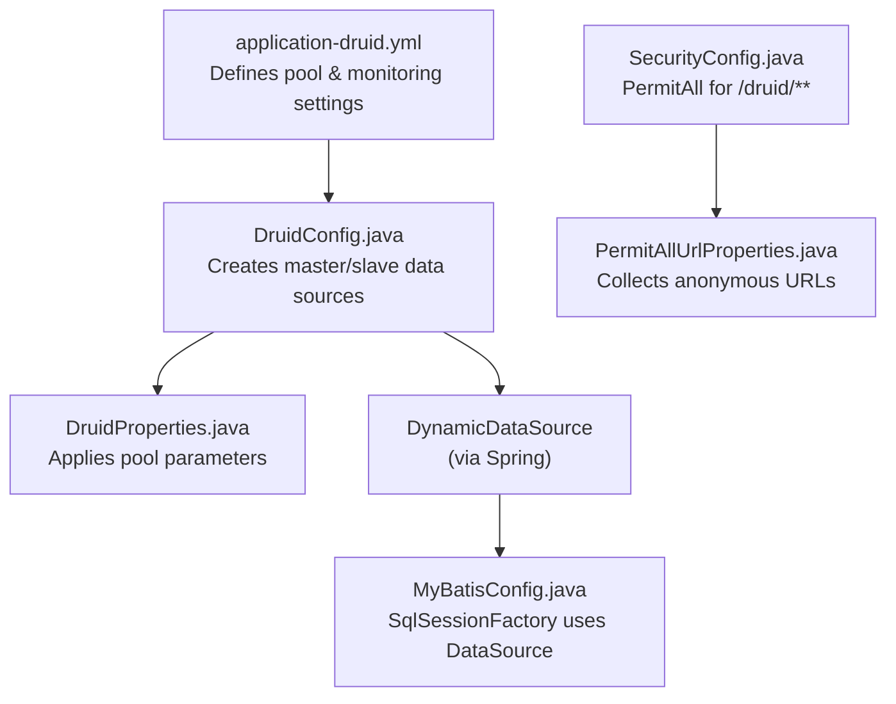
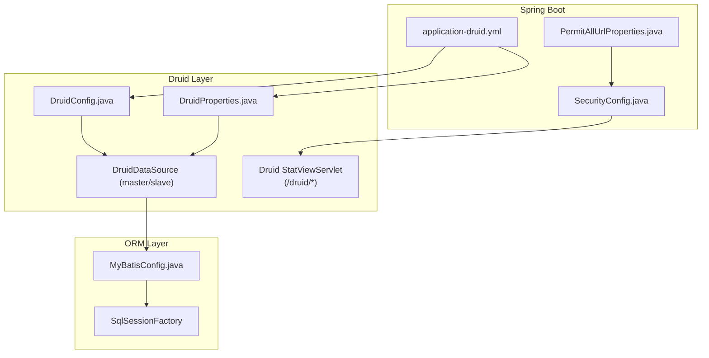
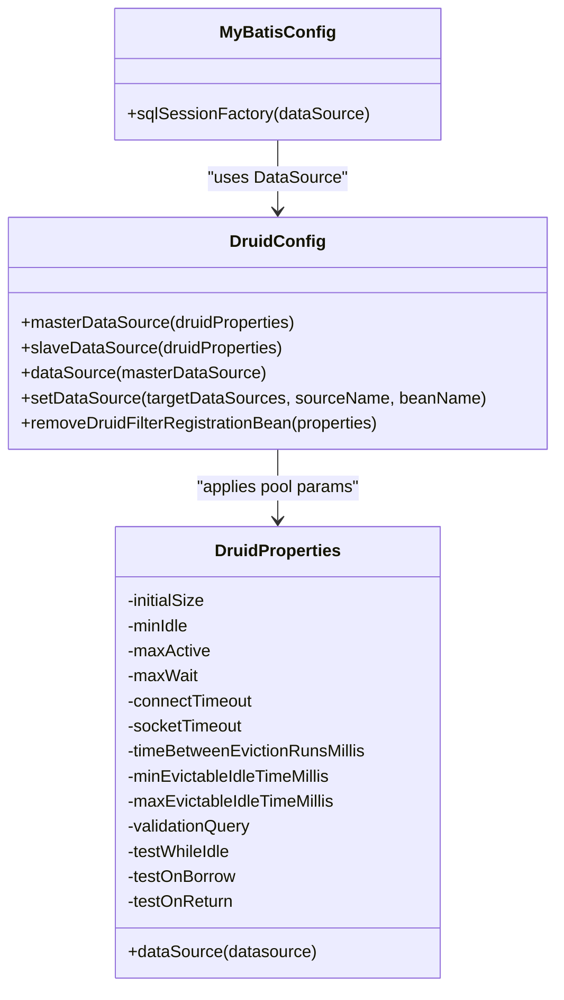
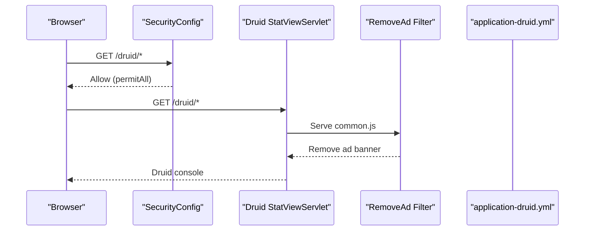
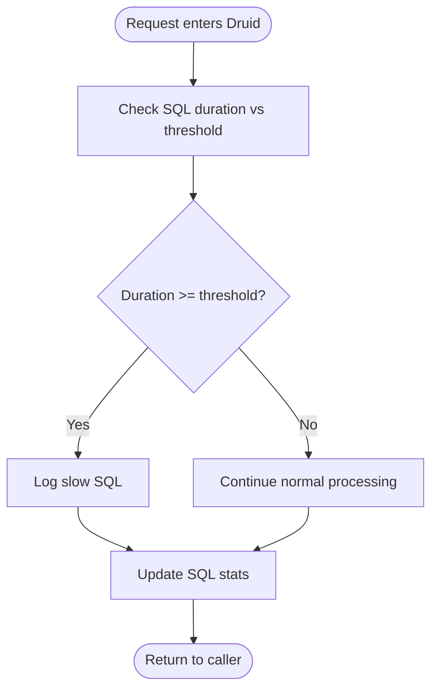
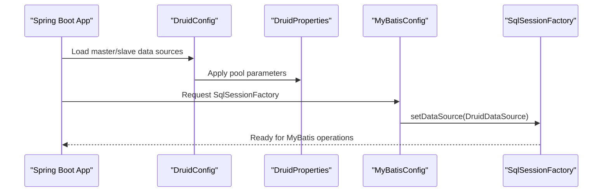
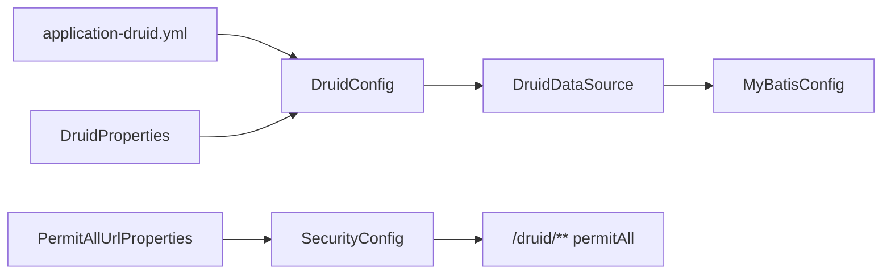

# Connection Pool Monitoring

<cite>
**Referenced Files in This Document**
- [DruidConfig.java](file://src/main/java/com/ruoyi/framework/config/DruidConfig.java)
- [DruidProperties.java](file://src/main/java/com/ruoyi/framework/config/properties/DruidProperties.java)
- [MyBatisConfig.java](file://src/main/java/com/ruoyi/framework/config/MyBatisConfig.java)
- [application-druid.yml](file://src/main/resources/application-druid.yml)
- [SecurityConfig.java](file://src/main/java/com/ruoyi/framework/config/SecurityConfig.java)
- [PermitAllUrlProperties.java](file://src/main/java/com/ruoyi/framework/config/properties/PermitAllUrlProperties.java)
</cite>

## Table of Contents
1. [Introduction](#introduction)
2. [Project Structure](#project-structure)
3. [Core Components](#core-components)
4. [Architecture Overview](#architecture-overview)
5. [Detailed Component Analysis](#detailed-component-analysis)
6. [Dependency Analysis](#dependency-analysis)
7. [Performance Considerations](#performance-considerations)
8. [Troubleshooting Guide](#troubleshooting-guide)
9. [Conclusion](#conclusion)

## Introduction
This document explains how Druid connection pool monitoring is configured and integrated in RuoYi-Vue. It covers:
- How the Druid data source is defined and tuned via application-druid.yml and initialized by DruidConfig.java
- How MyBatis integrates with the Druid-backed data source
- How the Druid monitoring console is exposed under the /druid path
- Available monitoring metrics such as active connections, pool size, SQL execution statistics, and slow query detection
- Security controls protecting the monitoring endpoint
- Guidance on interpreting metrics to detect performance bottlenecks and connection leaks
- Best practices for tuning pool parameters based on observed load patterns

## Project Structure
The Druid monitoring stack in this project spans configuration files and Java classes:
- application-druid.yml defines Druid pool settings and monitoring controls
- DruidConfig.java builds the primary data source beans and registers a filter to remove ad banners from the monitoring UI
- DruidProperties.java binds pool parameters and applies them to DruidDataSource instances
- MyBatisConfig.java wires the data source into MyBatis
- SecurityConfig.java and PermitAllUrlProperties.java configure access to the /druid path

**Diagram sources**
- [application-druid.yml](file://src/main/resources/application-druid.yml#L1-L61)
- [DruidConfig.java](file://src/main/java/com/ruoyi/framework/config/DruidConfig.java#L1-L127)
- [DruidProperties.java](file://src/main/java/com/ruoyi/framework/config/properties/DruidProperties.java#L1-L90)
- [MyBatisConfig.java](file://src/main/java/com/ruoyi/framework/config/MyBatisConfig.java#L116-L132)
- [SecurityConfig.java](file://src/main/java/com/ruoyi/framework/config/SecurityConfig.java#L96-L120)
- [PermitAllUrlProperties.java](file://src/main/java/com/ruoyi/framework/config/properties/PermitAllUrlProperties.java#L37-L67)

**Section sources**
- [application-druid.yml](file://src/main/resources/application-druid.yml#L1-L61)
- [DruidConfig.java](file://src/main/java/com/ruoyi/framework/config/DruidConfig.java#L1-L127)
- [DruidProperties.java](file://src/main/java/com/ruoyi/framework/config/properties/DruidProperties.java#L1-L90)
- [MyBatisConfig.java](file://src/main/java/com/ruoyi/framework/config/MyBatisConfig.java#L116-L132)
- [SecurityConfig.java](file://src/main/java/com/ruoyi/framework/config/SecurityConfig.java#L96-L120)
- [PermitAllUrlProperties.java](file://src/main/java/com/ruoyi/framework/config/properties/PermitAllUrlProperties.java#L37-L67)

## Core Components
- Druid data source configuration and initialization:
  - application-druid.yml sets JDBC URL, credentials, pool sizing, timeouts, eviction, validation, and monitoring filters
  - DruidConfig.java creates master and optional slave data sources and wires them into a dynamic data source
  - DruidProperties.java reads pool parameters and applies them to DruidDataSource instances
- MyBatis integration:
  - MyBatisConfig.java constructs a SqlSessionFactory that uses the configured DataSource
- Monitoring console exposure:
  - application-druid.yml enables the statViewServlet and sets the URL pattern and credentials
  - DruidConfig.java registers a filter to remove ad banners from the monitoring UI
  - SecurityConfig.java permits access to /druid/** without authentication
- Slow SQL and SQL statistics:
  - application-druid.yml enables the stat filter and slow SQL logging thresholds

**Section sources**
- [application-druid.yml](file://src/main/resources/application-druid.yml#L1-L61)
- [DruidConfig.java](file://src/main/java/com/ruoyi/framework/config/DruidConfig.java#L35-L60)
- [DruidProperties.java](file://src/main/java/com/ruoyi/framework/config/properties/DruidProperties.java#L54-L88)
- [MyBatisConfig.java](file://src/main/java/com/ruoyi/framework/config/MyBatisConfig.java#L116-L132)
- [SecurityConfig.java](file://src/main/java/com/ruoyi/framework/config/SecurityConfig.java#L111-L118)

## Architecture Overview
The Druid monitoring architecture integrates pool configuration, MyBatis, and the monitoring UI behind a controlled security policy.

**Diagram sources**
- [application-druid.yml](file://src/main/resources/application-druid.yml#L1-L61)
- [DruidConfig.java](file://src/main/java/com/ruoyi/framework/config/DruidConfig.java#L35-L60)
- [DruidProperties.java](file://src/main/java/com/ruoyi/framework/config/properties/DruidProperties.java#L54-L88)
- [MyBatisConfig.java](file://src/main/java/com/ruoyi/framework/config/MyBatisConfig.java#L116-L132)
- [SecurityConfig.java](file://src/main/java/com/ruoyi/framework/config/SecurityConfig.java#L111-L118)
- [PermitAllUrlProperties.java](file://src/main/java/com/ruoyi/framework/config/properties/PermitAllUrlProperties.java#L37-L67)

## Detailed Component Analysis

### Druid Data Source Initialization and Pool Tuning
- Pool parameters are defined in application-druid.yml and bound by DruidProperties.java, which then applies them to DruidDataSource instances created by DruidConfig.java
- DruidConfig.java builds:
  - Master data source from spring.datasource.druid.master
  - Optional slave data source from spring.datasource.druid.slave (conditional on enabled flag)
  - A dynamic data source that routes to master and optionally slave
- DruidProperties.java applies:
  - Initial size, min idle, max active
  - Max wait, connect timeout, socket timeout
  - Eviction intervals and min/max idle lifetimes
  - Validation query and test flags

**Diagram sources**
- [DruidConfig.java](file://src/main/java/com/ruoyi/framework/config/DruidConfig.java#L35-L60)
- [DruidProperties.java](file://src/main/java/com/ruoyi/framework/config/properties/DruidProperties.java#L15-L88)
- [MyBatisConfig.java](file://src/main/java/com/ruoyi/framework/config/MyBatisConfig.java#L116-L132)

**Section sources**
- [application-druid.yml](file://src/main/resources/application-druid.yml#L1-L61)
- [DruidConfig.java](file://src/main/java/com/ruoyi/framework/config/DruidConfig.java#L35-L60)
- [DruidProperties.java](file://src/main/java/com/ruoyi/framework/config/properties/DruidProperties.java#L54-L88)
- [MyBatisConfig.java](file://src/main/java/com/ruoyi/framework/config/MyBatisConfig.java#L116-L132)

### Monitoring Console Exposure and Security
- application-druid.yml enables statViewServlet and sets:
  - URL pattern /druid/*
  - Allowlist (empty by default allows all)
  - Credentials for the console
- DruidConfig.java registers a filter to remove ad banners from the monitoring UI JS resource
- SecurityConfig.java permits access to /druid/** without authentication by adding it to the permit-all list
- PermitAllUrlProperties.java collects anonymous-accessible URLs from annotations and configuration; while not directly annotated for /druid/**, SecurityConfig explicitly whitelists it

**Diagram sources**
- [application-druid.yml](file://src/main/resources/application-druid.yml#L44-L51)
- [DruidConfig.java](file://src/main/java/com/ruoyi/framework/config/DruidConfig.java#L84-L125)
- [SecurityConfig.java](file://src/main/java/com/ruoyi/framework/config/SecurityConfig.java#L111-L118)

**Section sources**
- [application-druid.yml](file://src/main/resources/application-druid.yml#L44-L51)
- [DruidConfig.java](file://src/main/java/com/ruoyi/framework/config/DruidConfig.java#L84-L125)
- [SecurityConfig.java](file://src/main/java/com/ruoyi/framework/config/SecurityConfig.java#L111-L118)
- [PermitAllUrlProperties.java](file://src/main/java/com/ruoyi/framework/config/properties/PermitAllUrlProperties.java#L37-L67)

### SQL Execution Statistics and Slow Query Detection
- application-druid.yml enables the stat filter and slow SQL logging:
  - filter.stat.enabled: true
  - filter.stat.log-slow-sql: true
  - filter.stat.slow-sql-millis: threshold
  - filter.stat.merge-sql: true
- These settings enable Druid to collect SQL execution statistics and record slow queries according to the configured threshold

**Diagram sources**
- [application-druid.yml](file://src/main/resources/application-druid.yml#L53-L58)

**Section sources**
- [application-druid.yml](file://src/main/resources/application-druid.yml#L53-L58)

### MyBatis Integration with Druid
- MyBatisConfig.java constructs a SqlSessionFactory and sets the DataSource to the Druid-backed data source produced by DruidConfig.java
- This ensures all MyBatis operations use the Druid connection pool

**Diagram sources**
- [DruidConfig.java](file://src/main/java/com/ruoyi/framework/config/DruidConfig.java#L35-L60)
- [DruidProperties.java](file://src/main/java/com/ruoyi/framework/config/properties/DruidProperties.java#L54-L88)
- [MyBatisConfig.java](file://src/main/java/com/ruoyi/framework/config/MyBatisConfig.java#L116-L132)

**Section sources**
- [DruidConfig.java](file://src/main/java/com/ruoyi/framework/config/DruidConfig.java#L35-L60)
- [DruidProperties.java](file://src/main/java/com/ruoyi/framework/config/properties/DruidProperties.java#L54-L88)
- [MyBatisConfig.java](file://src/main/java/com/ruoyi/framework/config/MyBatisConfig.java#L116-L132)

## Dependency Analysis
- DruidConfig depends on:
  - DruidProperties for applying pool parameters
  - Spring’s conditional annotations to enable slave data source only when enabled
  - SpringUtils to fetch named beans dynamically
- DruidProperties depends on application-druid.yml values and applies them to DruidDataSource
- MyBatisConfig depends on the DataSource bean provided by DruidConfig
- SecurityConfig depends on PermitAllUrlProperties to manage additional permit-all URLs and explicitly whitelists /druid/**
- The monitoring UI relies on Druid’s built-in StatViewServlet and a filter to modify the UI

**Diagram sources**
- [application-druid.yml](file://src/main/resources/application-druid.yml#L1-L61)
- [DruidConfig.java](file://src/main/java/com/ruoyi/framework/config/DruidConfig.java#L35-L60)
- [DruidProperties.java](file://src/main/java/com/ruoyi/framework/config/properties/DruidProperties.java#L54-L88)
- [MyBatisConfig.java](file://src/main/java/com/ruoyi/framework/config/MyBatisConfig.java#L116-L132)
- [SecurityConfig.java](file://src/main/java/com/ruoyi/framework/config/SecurityConfig.java#L111-L118)
- [PermitAllUrlProperties.java](file://src/main/java/com/ruoyi/framework/config/properties/PermitAllUrlProperties.java#L37-L67)

**Section sources**
- [DruidConfig.java](file://src/main/java/com/ruoyi/framework/config/DruidConfig.java#L35-L60)
- [DruidProperties.java](file://src/main/java/com/ruoyi/framework/config/properties/DruidProperties.java#L54-L88)
- [MyBatisConfig.java](file://src/main/java/com/ruoyi/framework/config/MyBatisConfig.java#L116-L132)
- [SecurityConfig.java](file://src/main/java/com/ruoyi/framework/config/SecurityConfig.java#L111-L118)
- [PermitAllUrlProperties.java](file://src/main/java/com/ruoyi/framework/config/properties/PermitAllUrlProperties.java#L37-L67)

## Performance Considerations
- Pool sizing:
  - initialSize, minIdle, maxActive define baseline capacity and growth limits
  - Adjust maxActive based on peak concurrency and database capacity
- Wait and timeout tuning:
  - maxWait controls queueing behavior; long waits indicate pool exhaustion
  - connectTimeout and socketTimeout influence responsiveness under load
- Eviction and validation:
  - timeBetweenEvictionRunsMillis balances cleanup overhead vs stale connection removal
  - minEvictableIdleTimeMillis and maxEvictableIdleTimeMillis control idle lifetime
  - validationQuery and testWhileIdle help keep connections healthy
- Monitoring:
  - Enable statViewServlet and review pool metrics regularly
  - Use filter.stat to capture slow SQL and tune queries accordingly

[No sources needed since this section provides general guidance]

## Troubleshooting Guide
- Monitoring console not accessible:
  - Verify statViewServlet.enabled and url-pattern in application-druid.yml
  - Confirm /druid/** is permitted by SecurityConfig
- Ad banner present in UI:
  - Ensure removeDruidFilterRegistrationBean is active (conditional on statViewServlet.enabled)
- Slow SQL not logged:
  - Check filter.stat.enabled, log-slow-sql, slow-sql-millis, and merge-sql in application-druid.yml
- Connection exhaustion symptoms:
  - Inspect pool metrics (active connections, pool size) and increase maxActive or reduce contention
  - Review maxWait; persistent waits suggest insufficient pool capacity
- Stale or broken connections:
  - Increase eviction intervals and adjust minEvictableIdleTimeMillis
  - Ensure validationQuery is valid and testWhileIdle is enabled

**Section sources**
- [application-druid.yml](file://src/main/resources/application-druid.yml#L44-L58)
- [DruidConfig.java](file://src/main/java/com/ruoyi/framework/config/DruidConfig.java#L84-L125)
- [SecurityConfig.java](file://src/main/java/com/ruoyi/framework/config/SecurityConfig.java#L111-L118)

## Conclusion
RuoYi-Vue integrates Druid as the connection pool with clear configuration in application-druid.yml and initialization in DruidConfig.java. MyBatis consumes the Druid DataSource seamlessly. The monitoring console is exposed at /druid with explicit security allowance and ad-banner removal. The configuration enables SQL statistics and slow query logging, and the pool parameters can be tuned to match observed load patterns. Use the monitoring metrics to detect bottlenecks and leaks, and apply the best practices outlined here to maintain a robust and responsive data access layer.