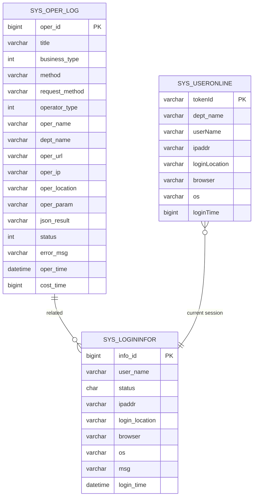
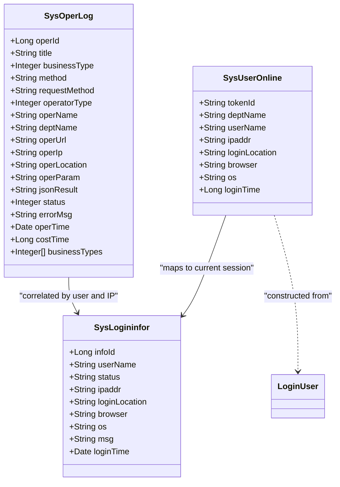
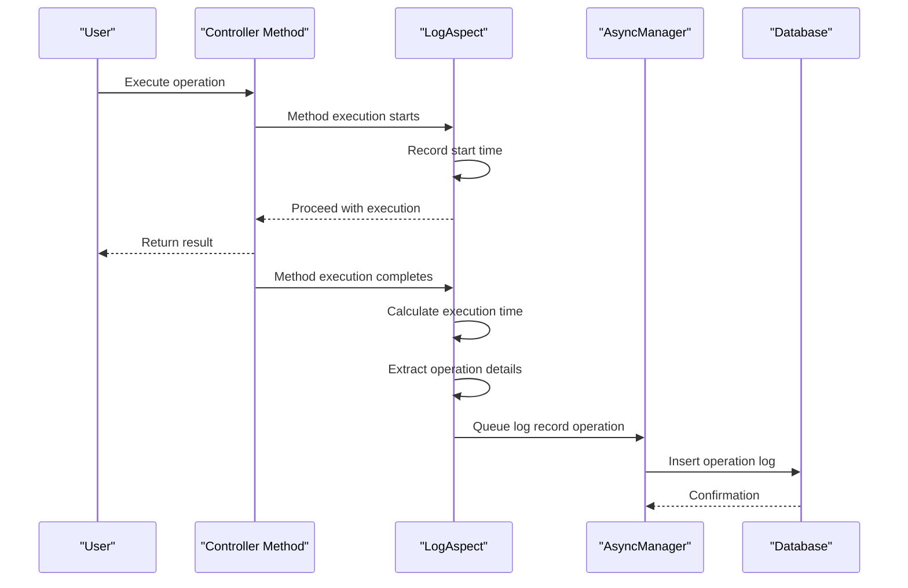
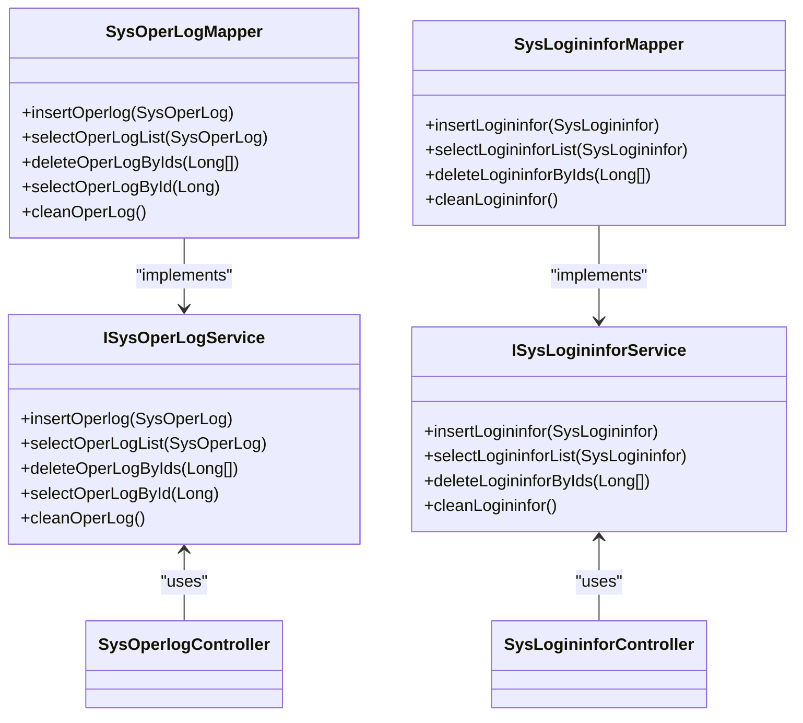
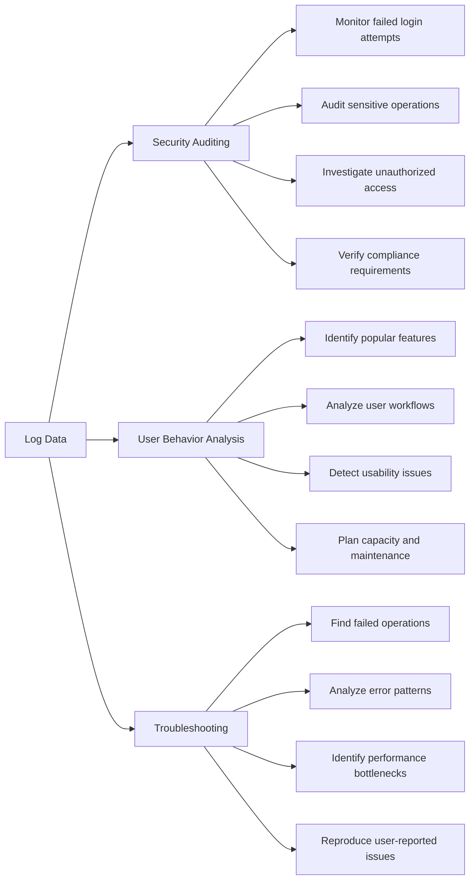

# Log Management

<cite>
**Referenced Files in This Document**   
- [SysOperLog.java](file://src/main/java/com/ruoyi/project/monitor/domain/SysOperLog.java)
- [SysLogininfor.java](file://src/main/java/com/ruoyi/project/monitor/domain/SysLogininfor.java)
- [SysUserOnline.java](file://src/main/java/com/ruoyi/project/monitor/domain/SysUserOnline.java)
- [Log.java](file://src/main/java/com/ruoyi/framework/aspectj/lang/annotation/Log.java)
- [LogAspect.java](file://src/main/java/com/ruoyi/framework/aspectj/LogAspect.java)
- [SysOperlogController.java](file://src/main/java/com/ruoyi/project/monitor/controller/SysOperlogController.java)
- [SysLogininforController.java](file://src/main/java/com/ruoyi/project/monitor/controller/SysLogininforController.java)
- [SysUserOnlineController.java](file://src/main/java/com/ruoyi/project/monitor/controller/SysUserOnlineController.java)
- [SysOperLogMapper.xml](file://src/main/resources/mybatis/monitor/SysOperLogMapper.xml)
- [SysLogininforMapper.xml](file://src/main/resources/mybatis/monitor/SysLogininforMapper.xml)
- [ry_20250522.sql](file://sql/ry_20250522.sql)
- [SysOperLogServiceImpl.java](file://src/main/java/com/ruoyi/project/monitor/service/impl/SysOperLogServiceImpl.java)
- [SysLogininforServiceImpl.java](file://src/main/java/com/ruoyi/project/monitor/service/impl/SysLogininforServiceImpl.java)
- [SysUserOnlineServiceImpl.java](file://src/main/java/com/ruoyi/project/system/service/impl/SysUserOnlineServiceImpl.java)
</cite>

## Table of Contents
1. [Introduction](#introduction)
2. [Data Model Overview](#data-model-overview)
3. [Entity Relationships](#entity-relationships)
4. [Field Definitions and Constraints](#field-definitions-and-constraints)
5. [Data Collection Mechanisms](#data-collection-mechanisms)
6. [Log Controllers and API Endpoints](#log-controllers-and-api-endpoints)
7. [Database Schema and MyBatis Mappings](#database-schema-and-mybatis-mappings)
8. [Use Cases](#use-cases)
9. [Conclusion](#conclusion)

## Introduction

The RuoYi-Vue log management system provides comprehensive monitoring capabilities through three primary entities: SysOperLog (operation logs), SysLogininfor (login logs), and SysUserOnline (online user tracking). This documentation details the data model, relationships, field definitions, data collection mechanisms, controller implementations, and practical use cases for security auditing, user behavior analysis, and troubleshooting. The system leverages AOP (Aspect-Oriented Programming) with the @Log annotation for automatic operation logging and maintains separate tables for login attempts and active user sessions.

**Section sources**
- [SysOperLog.java](file://src/main/java/com/ruoyi/project/monitor/domain/SysOperLog.java#L1-L270)
- [SysLogininfor.java](file://src/main/java/com/ruoyi/project/monitor/domain/SysLogininfor.java#L1-L144)
- [SysUserOnline.java](file://src/main/java/com/ruoyi/project/monitor/domain/SysUserOnline.java#L1-L114)

## Data Model Overview

The log management system consists of three core entities that serve distinct purposes in monitoring system activity. SysOperLog records detailed information about user operations on the system, including CRUD operations, exports, imports, and other business functions. SysLogininfor captures login attempts, both successful and failed, providing security audit trails for authentication activities. SysUserOnline maintains real-time information about currently active user sessions, enabling monitoring of online users and session management capabilities such as forced logout.



**Diagram sources**
- [SysOperLog.java](file://src/main/java/com/ruoyi/project/monitor/domain/SysOperLog.java#L1-L270)
- [SysLogininfor.java](file://src/main/java/com/ruoyi/project/monitor/domain/SysLogininfor.java#L1-L144)
- [SysUserOnline.java](file://src/main/java/com/ruoyi/project/monitor/domain/SysUserOnline.java#L1-L114)
- [ry_20250522.sql](file://sql/ry_20250522.sql#L419-L575)

## Entity Relationships

The three log entities have distinct but complementary roles in the monitoring system. SysOperLog and SysLogininfor are persistent records stored in the database, with SysOperLog focusing on user operations and SysLogininfor on authentication events. While they don't have direct foreign key relationships, they are linked through common fields such as user_name/oper_name and ipaddr, allowing correlation of operation logs with login activities. SysUserOnline differs from the other two entities as it represents real-time session data stored in Redis rather than the database, providing current online status that can be correlated with recent login records in SysLogininfor.

The relationship between SysUserOnline and SysLogininfor is particularly important for security monitoring, as it allows administrators to identify which login records correspond to currently active sessions. This enables operations like forced logout of specific users. The system uses the tokenId as a bridge between the Redis-stored online sessions and the authentication context, allowing lookup of online users by IP address, username, or combined criteria through the SysUserOnlineService implementation.



**Diagram sources**
- [SysOperLog.java](file://src/main/java/com/ruoyi/project/monitor/domain/SysOperLog.java#L1-L270)
- [SysLogininfor.java](file://src/main/java/com/ruoyi/project/monitor/domain/SysLogininfor.java#L1-L144)
- [SysUserOnline.java](file://src/main/java/com/ruoyi/project/monitor/domain/SysUserOnline.java#L1-L114)
- [SysUserOnlineServiceImpl.java](file://src/main/java/com/ruoyi/project/system/service/impl/SysUserOnlineServiceImpl.java#L1-L97)

## Field Definitions and Constraints

### SysOperLog (Operation Logs)
The SysOperLog entity captures detailed information about user operations within the system:

| Field | Data Type | Constraints | Description |
|-------|---------|------------|-------------|
| operId | bigint(20) | PRIMARY KEY, AUTO_INCREMENT | Unique identifier for the operation log entry |
| title | varchar(50) | DEFAULT '' | Module title describing the operation |
| businessType | int(2) | DEFAULT 0 | Type of business operation (0=Other, 1=Add, 2=Edit, 3=Delete, 4=Authorize, 5=Export, 6=Import, 7=Force Logout, 8=Generate Code, 9=Clear Data) |
| method | varchar(200) | DEFAULT '' | Fully qualified name of the method executed |
| requestMethod | varchar(10) | DEFAULT '' | HTTP method (GET, POST, PUT, DELETE) |
| operatorType | int(1) | DEFAULT 0 | Type of operator (0=Other, 1=Management User, 2=Mobile User) |
| operName | varchar(50) | DEFAULT '' | Name of the user who performed the operation |
| deptName | varchar(50) | DEFAULT '' | Department name of the operator |
| operUrl | varchar(255) | DEFAULT '' | Request URL that was accessed |
| operIp | varchar(128) | DEFAULT '' | IP address from which the operation was performed |
| operLocation | varchar(255) | DEFAULT '' | Geographical location derived from IP address |
| operParam | varchar(2000) | DEFAULT '' | Request parameters passed to the operation |
| jsonResult | varchar(2000) | DEFAULT '' | Response data returned by the operation |
| status | int(1) | DEFAULT 0 | Execution status (0=Success, 1=Exception) |
| errorMsg | varchar(2000) | DEFAULT '' | Error message if the operation failed |
| operTime | datetime | | Timestamp when the operation was performed |
| costTime | bigint(20) | DEFAULT 0 | Time taken to execute the operation in milliseconds |

### SysLogininfor (Login Logs)
The SysLogininfor entity records all login attempts to the system:

| Field | Data Type | Constraints | Description |
|-------|---------|------------|-------------|
| infoId | bigint(20) | PRIMARY KEY, AUTO_INCREMENT | Unique identifier for the login log entry |
| userName | varchar(50) | DEFAULT '' | Username used in the login attempt |
| ipaddr | varchar(128) | DEFAULT '' | IP address from which the login was attempted |
| loginLocation | varchar(255) | DEFAULT '' | Geographical location derived from IP address |
| browser | varchar(50) | DEFAULT '' | Browser type and version used for login |
| os | varchar(50) | DEFAULT '' | Operating system of the client device |
| status | char(1) | DEFAULT '0' | Login status (0=Success, 1=Failure) |
| msg | varchar(255) | DEFAULT '' | Descriptive message about the login attempt |
| loginTime | datetime | | Timestamp when the login attempt occurred |

### SysUserOnline (Online User Tracking)
The SysUserOnline entity represents currently active user sessions:

| Field | Data Type | Constraints | Description |
|-------|---------|------------|-------------|
| tokenId | varchar | PRIMARY KEY | Unique token identifier for the session |
| deptName | varchar | | Department name of the user |
| userName | varchar | | Username of the logged-in user |
| ipaddr | varchar | | Current IP address of the user |
| loginLocation | varchar | | Current geographical location |
| browser | varchar | | Browser type being used |
| os | varchar | | Operating system of the client |
| loginTime | bigint | | Timestamp (in milliseconds) when the user logged in |

**Section sources**
- [SysOperLog.java](file://src/main/java/com/ruoyi/project/monitor/domain/SysOperLog.java#L1-L270)
- [SysLogininfor.java](file://src/main/java/com/ruoyi/project/monitor/domain/SysLogininfor.java#L1-L144)
- [SysUserOnline.java](file://src/main/java/com/ruoyi/project/monitor/domain/SysUserOnline.java#L1-L114)
- [ry_20250522.sql](file://sql/ry_20250522.sql#L419-L575)

## Data Collection Mechanisms

### Automatic Operation Logging with @Log Annotation
The system implements automatic operation logging through AOP (Aspect-Oriented Programming) using the @Log annotation. This annotation is applied to controller methods that require logging, specifying metadata about the operation:



The @Log annotation accepts several parameters to customize logging behavior:
- **title**: Specifies the module or feature name for the operation
- **businessType**: Defines the type of business operation being performed
- **operatorType**: Indicates whether the operator is a management user or mobile user
- **isSaveRequestData**: Determines whether to log request parameters (default: true)
- **isSaveResponseData**: Determines whether to log response data (default: true)
- **excludeParamNames**: Specifies parameter names to exclude from logging (e.g., passwords)

The LogAspect class processes the @Log annotation and captures relevant information before and after method execution. It records the operation details, execution time, request parameters, and response data (if enabled), while automatically filtering sensitive information like passwords through the PropertyPreExcludeFilter.

### Login Attempt Tracking
Login attempts are tracked through direct service calls to the SysLogininforService. Whenever a login attempt occurs (successful or failed), the system creates a SysLogininfor record containing details about the attempt. This includes the username, IP address, browser information, operating system, and the outcome of the login attempt. The SysPasswordService also maintains login attempt records for security purposes, including the ability to clear login records from the cache via the unlock endpoint.

**Section sources**
- [Log.java](file://src/main/java/com/ruoyi/framework/aspectj/lang/annotation/Log.java#L1-L52)
- [LogAspect.java](file://src/main/java/com/ruoyi/framework/aspectj/LogAspect.java#L1-L265)
- [SysLogininforController.java](file://src/main/java/com/ruoyi/project/monitor/controller/SysLogininforController.java#L1-L83)
- [SysLogininforServiceImpl.java](file://src/main/java/com/ruoyi/project/monitor/service/impl/SysLogininforServiceImpl.java#L1-L66)

## Log Controllers and API Endpoints

### SysOperlogController
The SysOperlogController provides REST endpoints for managing operation logs:

| Endpoint | Method | Parameters | Description | Permissions |
|---------|--------|-----------|-------------|-------------|
| /monitor/operlog/list | GET | SysOperLog object with filter criteria | Retrieves a paginated list of operation logs with filtering options | monitor:operlog:list |
| /monitor/operlog/export | POST | SysOperLog object with filter criteria | Exports operation logs matching criteria to Excel | monitor:operlog:export |
| /monitor/operlog/{operIds} | DELETE | Array of operation log IDs | Deletes specified operation logs | monitor:operlog:remove |
| /monitor/operlog/clean | DELETE | None | Clears all operation logs from the system | monitor:operlog:remove |

### SysLogininforController
The SysLogininforController manages login attempt records:

| Endpoint | Method | Parameters | Description | Permissions |
|---------|--------|-----------|-------------|-------------|
| /monitor/logininfor/list | GET | SysLogininfor object with filter criteria | Retrieves a paginated list of login attempts with filtering | monitor:logininfor:list |
| /monitor/logininfor/export | POST | SysLogininfor object with filter criteria | Exports login records matching criteria to Excel | monitor:logininfor:export |
| /monitor/logininfor/{infoIds} | DELETE | Array of login record IDs | Deletes specified login records | monitor:logininfor:remove |
| /monitor/logininfor/clean | DELETE | None | Clears all login records from the system | monitor:logininfor:remove |
| /monitor/logininfor/unlock/{userName} | GET | Username to unlock | Clears login attempt records for a specific user | monitor:logininfor:unlock |

### SysUserOnlineController
The SysUserOnlineController handles online user monitoring:

| Endpoint | Method | Parameters | Description | Permissions |
|---------|--------|-----------|-------------|-------------|
| /monitor/online/list | GET | ipaddr, userName | Retrieves a list of currently online users with optional filtering by IP or username | monitor:online:list |
| /monitor/online/{tokenId} | DELETE | Token ID | Forces logout of a specific user session by removing their token from Redis | monitor:online:forceLogout |

```mermaid
flowchart TD
A[Client Request] --> B{Endpoint}
B --> C[/monitor/operlog/*]
B --> D[/monitor/logininfor/*]
B --> E[/monitor/online/*]
C --> F[SysOperlogController]
F --> G[ISysOperLogService]
G --> H[SysOperLogMapper]
H --> I[sys_oper_log DB Table]
D --> J[SysLogininforController]
J --> K[ISysLogininforService]
K --> L[SysLogininforMapper]
L --> M[sys_logininfor DB Table]
E --> N[SysUserOnlineController]
N --> O[ISysUserOnlineService]
O --> P[Redis Cache]
P --> Q[sys_user_online Session Data]
```

**Section sources**
- [SysOperlogController.java](file://src/main/java/com/ruoyi/project/monitor/controller/SysOperlogController.java#L1-L70)
- [SysLogininforController.java](file://src/main/java/com/ruoyi/project/monitor/controller/SysLogininforController.java#L1-L83)
- [SysUserOnlineController.java](file://src/main/java/com/ruoyi/project/monitor/controller/SysUserOnlineController.java#L1-L84)
- [SysOperLogServiceImpl.java](file://src/main/java/com/ruoyi/project/monitor/service/impl/SysOperLogServiceImpl.java#L1-L77)
- [SysLogininforServiceImpl.java](file://src/main/java/com/ruoyi/project/monitor/service/impl/SysLogininforServiceImpl.java#L1-L66)
- [SysUserOnlineServiceImpl.java](file://src/main/java/com/ruoyi/project/system/service/impl/SysUserOnlineServiceImpl.java#L1-L97)

## Database Schema and MyBatis Mappings

### Database Schema
The database schema for the log management system is defined in the ry_20250522.sql file, which creates the necessary tables with appropriate constraints and indexes:

**sys_oper_log Table**
- Primary key: oper_id (auto-incrementing bigint)
- Indexes: business_type, status, oper_time for efficient querying
- Storage engine: InnoDB with auto-increment starting at 100
- Comment: "操作日志记录"

**sys_logininfor Table**
- Primary key: info_id (auto-incrementing bigint)
- Indexes: status, login_time for efficient querying of login attempts
- Storage engine: InnoDB with auto-increment starting at 100
- Comment: "系统访问记录"

### MyBatis Mappings
The MyBatis XML mappings define the SQL operations for interacting with the log entities:

**SysOperLogMapper.xml**
- insertOperlog: Inserts a new operation log record with sysdate() for oper_time
- selectOperLogList: Selects operation logs with dynamic filtering by IP, title, business type, status, operator name, and date range
- deleteOperLogByIds: Deletes multiple operation logs by their IDs
- selectOperLogById: Retrieves a specific operation log by ID
- cleanOperLog: Truncates the entire operation log table

**SysLogininforMapper.xml**
- insertLogininfor: Inserts a new login record with sysdate() for login_time
- selectLogininforList: Selects login records with dynamic filtering by IP, status, username, and date range
- deleteLogininforByIds: Deletes multiple login records by their IDs
- cleanLogininfor: Truncates the entire login record table

The mappings use parameterized queries and dynamic SQL elements (<if>, <foreach>) to support flexible filtering while preventing SQL injection. Result maps (SysOperLogResult, SysLogininforResult) define the column-to-property mappings for converting database rows to Java objects.



**Diagram sources**
- [SysOperLogMapper.xml](file://src/main/resources/mybatis/monitor/SysOperLogMapper.xml#L1-L87)
- [SysLogininforMapper.xml](file://src/main/resources/mybatis/monitor/SysLogininforMapper.xml#L1-L57)
- [ry_20250522.sql](file://sql/ry_20250522.sql#L419-L575)
- [SysOperLogServiceImpl.java](file://src/main/java/com/ruoyi/project/monitor/service/impl/SysOperLogServiceImpl.java#L1-L77)
- [SysLogininforServiceImpl.java](file://src/main/java/com/ruoyi/project/monitor/service/impl/SysLogininforServiceImpl.java#L1-L66)

## Use Cases

### Security Auditing
The log management system provides comprehensive capabilities for security auditing by tracking all user activities and authentication attempts. Administrators can use the operation logs (SysOperLog) to audit sensitive operations such as user management, role assignments, and configuration changes. The login logs (SysLogininfor) enable monitoring of authentication patterns, including failed login attempts that may indicate brute force attacks. By analyzing the frequency and patterns of failed logins, security teams can identify potential security threats and take preventive measures.

The system also supports account unlocking functionality through the /monitor/logininfor/unlock/{userName} endpoint, which clears login attempt records from the cache. This is particularly useful when users are locked out due to exceeding the maximum number of failed login attempts. Security audits can correlate operation logs with login records to verify that sensitive operations were performed by authenticated users during valid sessions.

### User Behavior Analysis
The log data enables detailed analysis of user behavior patterns within the application. By examining operation logs, administrators can identify which features are most frequently used, the typical workflows users follow, and potential usability issues. For example, a high number of failed operations in a particular module might indicate that users are finding that feature difficult to use. The timing of operations can reveal peak usage periods, helping with capacity planning and maintenance scheduling.

Login pattern analysis can provide insights into user engagement and adoption. Regular login times, preferred devices (browser/OS), and geographical locations can inform decisions about feature prioritization, localization efforts, and targeted training. The online user tracking (SysUserOnline) provides real-time visibility into active users, allowing support teams to proactively assist users who have been idle for extended periods on complex workflows.

### Troubleshooting System Issues
The comprehensive logging system is invaluable for troubleshooting system issues and debugging errors. When users report problems, support teams can search the operation logs for entries with status=1 (exception) to identify failed operations. The detailed error messages, request parameters, and execution timestamps help developers reproduce and fix issues efficiently. The costTime field allows identification of performance bottlenecks by highlighting operations that take an unusually long time to complete.

For intermittent issues, the ability to correlate login attempts with operation logs helps determine whether problems are related to specific users, IP addresses, or client environments. The system's export functionality enables sharing log data with development teams for deeper analysis while maintaining data privacy through automatic filtering of sensitive fields. The clean operations (truncate table) provide a way to reset log tables when they grow too large, though this should be done cautiously to preserve audit trails.



**Section sources**
- [SysOperLog.java](file://src/main/java/com/ruoyi/project/monitor/domain/SysOperLog.java#L1-L270)
- [SysLogininfor.java](file://src/main/java/com/ruoyi/project/monitor/domain/SysLogininfor.java#L1-L144)
- [SysUserOnline.java](file://src/main/java/com/ruoyi/project/monitor/domain/SysUserOnline.java#L1-L114)
- [SysOperlogController.java](file://src/main/java/com/ruoyi/project/monitor/controller/SysOperlogController.java#L1-L70)
- [SysLogininforController.java](file://src/main/java/com/ruoyi/project/monitor/controller/SysLogininforController.java#L1-L83)

## Conclusion

The RuoYi-Vue log management system provides a comprehensive solution for monitoring, auditing, and analyzing system activity through its three core entities: SysOperLog, SysLogininfor, and SysUserOnline. The system leverages AOP with the @Log annotation to automatically capture detailed operation logs, while maintaining separate records for login attempts and real-time user sessions. The well-defined data model, with appropriate field definitions and constraints, supports efficient querying and reporting.

The implementation follows a clean separation of concerns with dedicated controllers, services, and data access layers, making the system maintainable and extensible. The integration with MyBatis provides flexible data access with dynamic query capabilities, while the use of Redis for online user tracking ensures real-time performance. The comprehensive API endpoints enable filtering, searching, exporting, and management of log data, supporting critical use cases in security auditing, user behavior analysis, and troubleshooting.

Organizations can leverage this log management system to enhance security posture, improve user experience, and ensure system reliability through data-driven insights and proactive monitoring.