# Server Monitoring

<cite>
**Referenced Files in This Document**   
- [Server.java](file://src/main/java/com/ruoyi/framework/web/domain/Server.java)
- [Cpu.java](file://src/main/java/com/ruoyi/framework/web/domain/server/Cpu.java)
- [Mem.java](file://src/main/java/com/ruoyi/framework/web/domain/server/Mem.java)
- [Jvm.java](file://src/main/java/com/ruoyi/framework/web/domain/server/Jvm.java)
- [Sys.java](file://src/main/java/com/ruoyi/framework/web/domain/server/Sys.java)
- [SysFile.java](file://src/main/java/com/ruoyi/framework/web/domain/server/SysFile.java)
- [ServerController.java](file://src/main/java/com/ruoyi/project/monitor/controller/ServerController.java)
- [AjaxResult.java](file://src/main/java/com/ruoyi/framework/web/domain/AjaxResult.java)
- [Arith.java](file://src/main/java/com/ruoyi/common/utils/Arith.java)
- [application.yml](file://src/main/resources/application.yml)
- [ry_20250522.sql](file://sql/ry_20250522.sql)
</cite>

## Table of Contents
1. [Introduction](#introduction)
2. [Core Components](#core-components)
3. [Architecture Overview](#architecture-overview)
4. [Detailed Component Analysis](#detailed-component-analysis)
5. [Data Structure Definitions](#data-structure-definitions)
6. [REST API Implementation](#rest-api-implementation)
7. [Frontend Integration](#frontend-integration)
8. [Permission Requirements](#permission-requirements)
9. [Performance Monitoring and Capacity Planning](#performance-monitoring-and-capacity-planning)
10. [Conclusion](#conclusion)

## Introduction
RuoYi-Vue provides comprehensive server monitoring capabilities that allow administrators to monitor real-time system metrics including CPU usage, memory consumption, disk utilization, and JVM performance. The monitoring system leverages the OSHI (Operating System and Hardware Information) library to collect accurate hardware and operating system metrics across different platforms. This document details the implementation of the server monitoring feature, focusing on the Server domain object, its constituent components, the REST API endpoint, and integration with the frontend dashboard.

## Core Components
The server monitoring functionality in RuoYi-Vue is built around several core components that work together to collect, process, and expose system metrics. The main components include the Server domain object, which aggregates various system metrics, and its constituent classes (Cpu, Mem, Jvm, Sys, and SysFile) that represent specific aspects of system performance. The ServerController exposes these metrics via a REST endpoint, while the frontend dashboard consumes this data for visualization.

**Section sources**
- [Server.java](file://src/main/java/com/ruoyi/framework/web/domain/Server.java)
- [ServerController.java](file://src/main/java/com/ruoyi/project/monitor/controller/ServerController.java)

## Architecture Overview
The server monitoring architecture in RuoYi-Vue follows a layered approach where the OSHI library collects low-level system information, which is then processed and aggregated by domain objects before being exposed through a REST API. The frontend dashboard consumes this API to provide real-time monitoring capabilities to administrators.

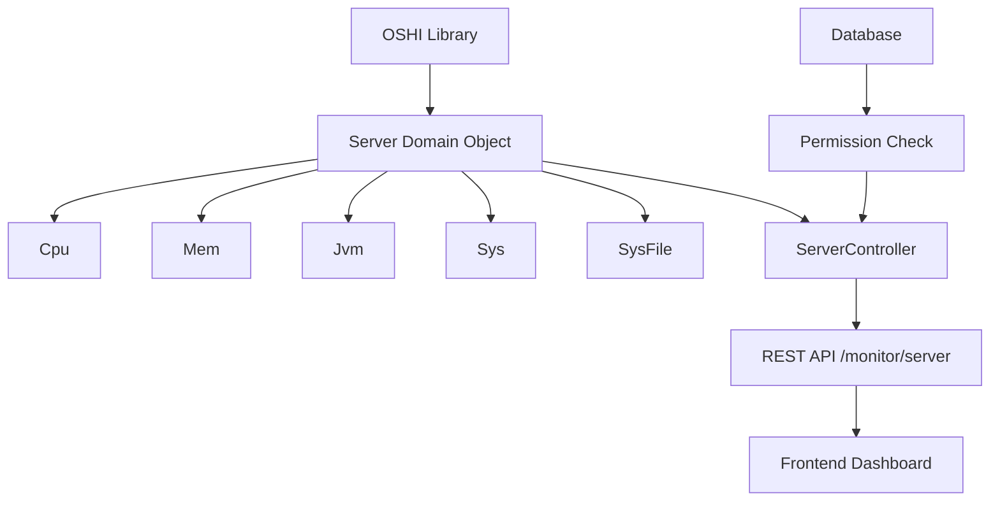

**Diagram sources **
- [Server.java](file://src/main/java/com/ruoyi/framework/web/domain/Server.java)
- [ServerController.java](file://src/main/java/com/ruoyi/project/monitor/controller/ServerController.java)

## Detailed Component Analysis
The server monitoring system in RuoYi-Vue is composed of several specialized components that collect and process different types of system metrics. Each component is responsible for a specific aspect of system performance monitoring, and they work together to provide a comprehensive view of the server's health and resource utilization.

### Server Domain Object
The Server class serves as the main container for all system monitoring data. It uses the OSHI library to collect real-time metrics from the operating system and hardware. The Server object orchestrates the collection of CPU, memory, JVM, system, and disk information through its constituent components.

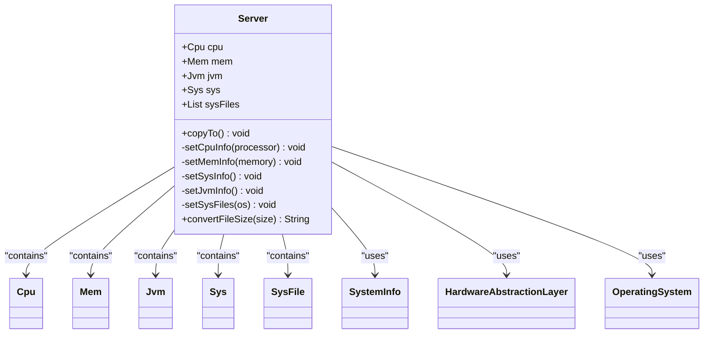

**Diagram sources **
- [Server.java](file://src/main/java/com/ruoyi/framework/web/domain/Server.java)

**Section sources**
- [Server.java](file://src/main/java/com/ruoyi/framework/web/domain/Server.java)

### OSHI Library Integration
The server monitoring system leverages the OSHI library to collect hardware and operating system information in a cross-platform manner. OSHI provides a Java-native interface to obtain system information without requiring additional native libraries.

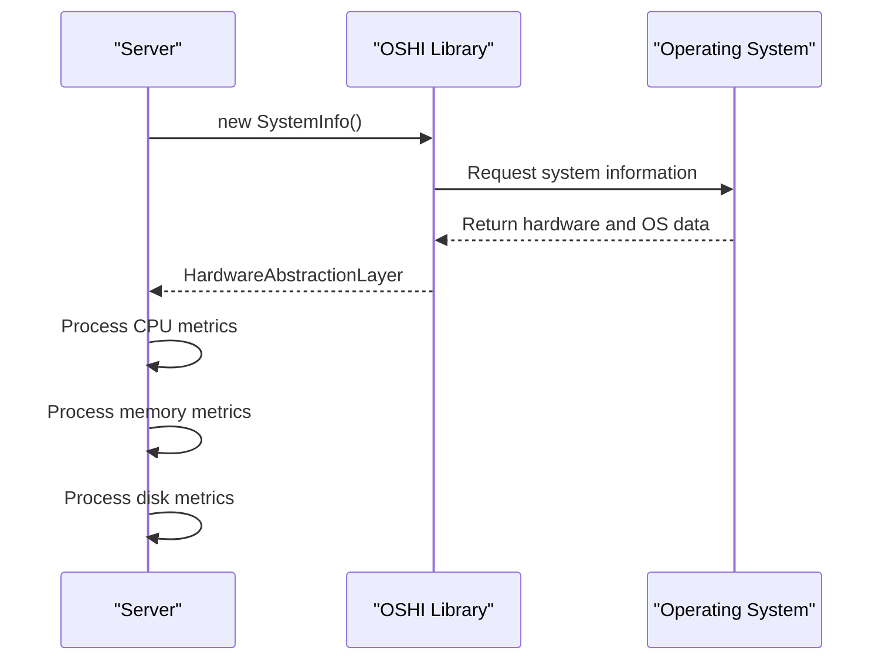

**Diagram sources **
- [Server.java](file://src/main/java/com/ruoyi/framework/web/domain/Server.java)

## Data Structure Definitions
The server monitoring system uses a set of well-defined data structures to represent different aspects of system performance. These classes encapsulate the raw system metrics and provide calculated values in a format suitable for display and analysis.

### Cpu Class Analysis
The Cpu class represents CPU usage metrics collected from the system. It provides detailed information about CPU utilization, including user, system, wait, and idle times, expressed as percentages of total CPU usage.

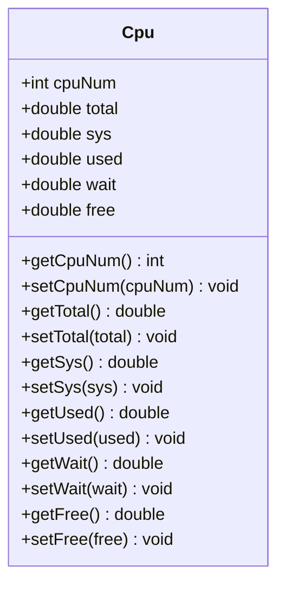

**Diagram sources **
- [Cpu.java](file://src/main/java/com/ruoyi/framework/web/domain/server/Cpu.java)

**Section sources**
- [Cpu.java](file://src/main/java/com/ruoyi/framework/web/domain/server/Cpu.java)

### Mem Class Analysis
The Mem class represents memory usage metrics, providing information about total, used, and free memory. The values are automatically converted from bytes to gigabytes for easier interpretation.

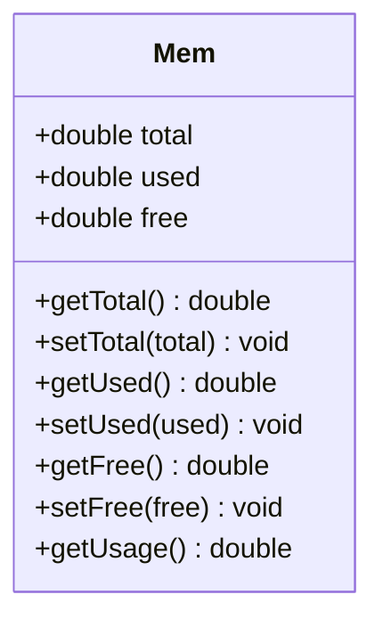

**Diagram sources **
- [Mem.java](file://src/main/java/com/ruoyi/framework/web/domain/server/Mem.java)

**Section sources**
- [Mem.java](file://src/main/java/com/ruoyi/framework/web/domain/server/Mem.java)

### Jvm Class Analysis
The Jvm class provides information about the Java Virtual Machine running the application, including memory usage, version, and runtime statistics.

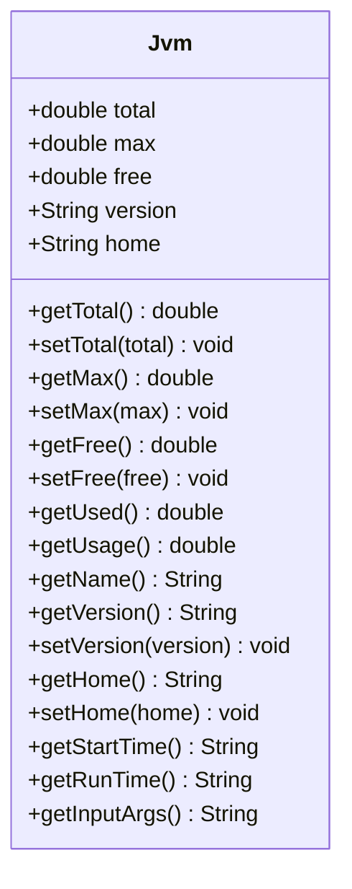

**Diagram sources **
- [Jvm.java](file://src/main/java/com/ruoyi/framework/web/domain/server/Jvm.java)

**Section sources**
- [Jvm.java](file://src/main/java/com/ruoyi/framework/web/domain/server/Jvm.java)

### Sys Class Analysis
The Sys class contains basic system information such as the server name, IP address, operating system, and architecture.

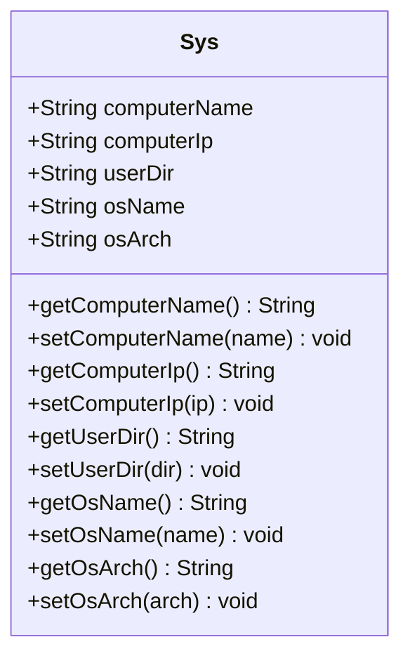

**Diagram sources **
- [Sys.java](file://src/main/java/com/ruoyi/framework/web/domain/server/Sys.java)

**Section sources**
- [Sys.java](file://src/main/java/com/ruoyi/framework/web/domain/server/Sys.java)

### SysFile Class Analysis
The SysFile class represents disk usage information for each mounted file system, including total space, free space, used space, and usage percentage.

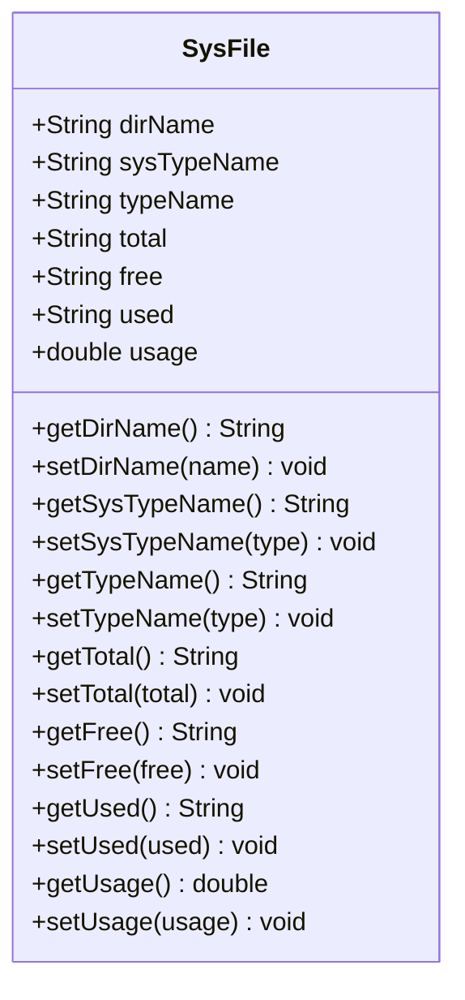

**Diagram sources **
- [SysFile.java](file://src/main/java/com/ruoyi/framework/web/domain/server/SysFile.java)

**Section sources**
- [SysFile.java](file://src/main/java/com/ruoyi/framework/web/domain/server/SysFile.java)

## REST API Implementation
The server monitoring metrics are exposed through a REST API endpoint implemented in the ServerController class. This controller handles HTTP GET requests and returns the collected system metrics in a structured JSON format.

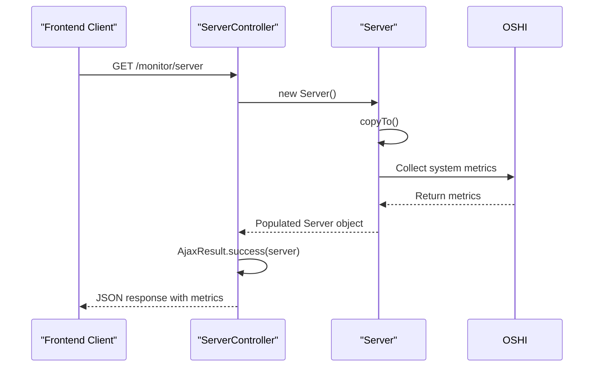

**Diagram sources **
- [ServerController.java](file://src/main/java/com/ruoyi/project/monitor/controller/ServerController.java)
- [Server.java](file://src/main/java/com/ruoyi/framework/web/domain/Server.java)
- [AjaxResult.java](file://src/main/java/com/ruoyi/framework/web/domain/AjaxResult.java)

**Section sources**
- [ServerController.java](file://src/main/java/com/ruoyi/project/monitor/controller/ServerController.java)

## Frontend Integration
The server monitoring data is integrated into the RuoYi-Vue frontend dashboard, where it is visualized in a user-friendly format. The frontend makes HTTP requests to the /monitor/server endpoint and displays the metrics in various charts and tables.

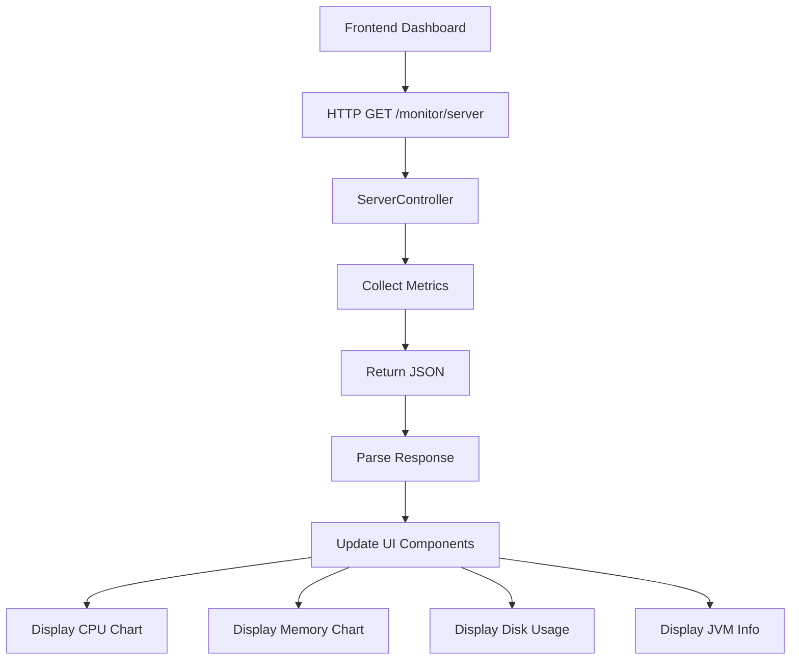

**Diagram sources **
- [ServerController.java](file://src/main/java/com/ruoyi/project/monitor/controller/ServerController.java)

## Permission Requirements
Access to the server monitoring functionality is protected by role-based access control. Users must have the appropriate permission to view server metrics, ensuring that sensitive system information is only available to authorized personnel.

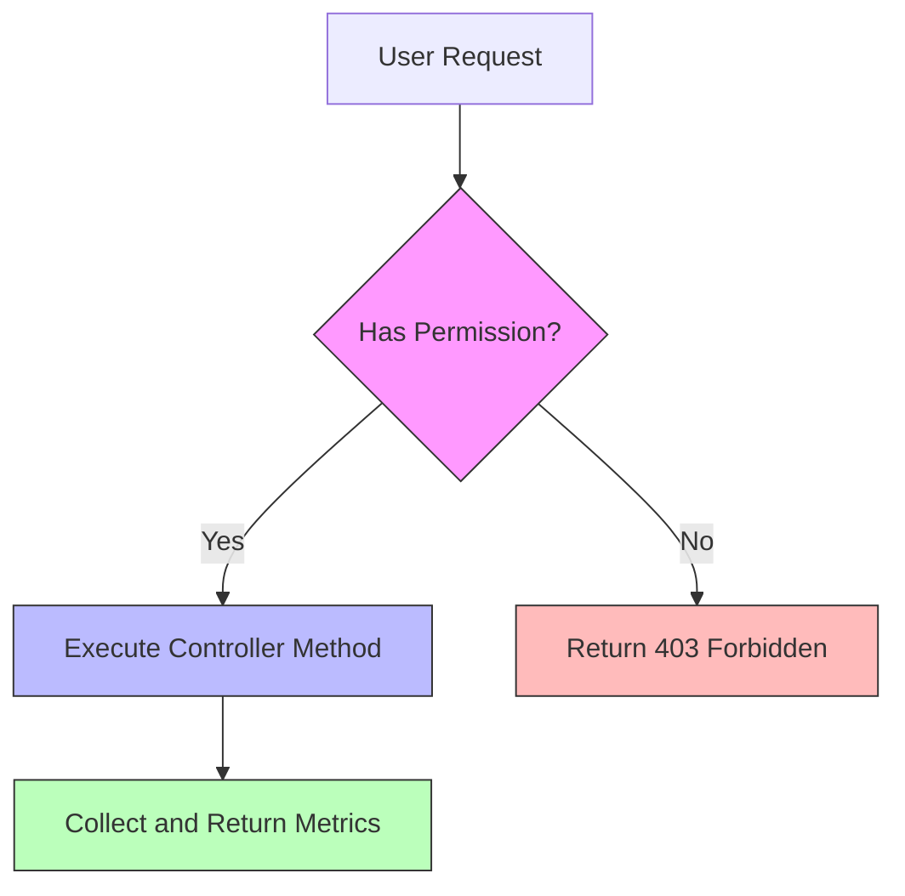

**Diagram sources **
- [ServerController.java](file://src/main/java/com/ruoyi/project/monitor/controller/ServerController.java)
- [ry_20250522.sql](file://sql/ry_20250522.sql)

**Section sources**
- [ServerController.java](file://src/main/java/com/ruoyi/project/monitor/controller/ServerController.java)
- [ry_20250522.sql](file://sql/ry_20250522.sql)

## Performance Monitoring and Capacity Planning
The server monitoring metrics provided by RuoYi-Vue enable administrators to perform effective performance monitoring and capacity planning. By analyzing the collected metrics, administrators can identify performance bottlenecks, plan for resource upgrades, and ensure optimal system performance.

### Interpreting CPU Metrics
CPU usage metrics help administrators understand the computational load on the server:
- **CPU Usage**: High CPU usage over extended periods may indicate performance bottlenecks or the need for additional processing power
- **User vs System Time**: A high ratio of system time to user time may indicate excessive system calls or I/O operations
- **Wait Time**: High wait times suggest I/O bottlenecks, possibly due to disk or network constraints
- **Idle Time**: Consistently high idle time indicates underutilized CPU resources

### Interpreting Memory Metrics
Memory usage metrics provide insights into the server's memory utilization:
- **Memory Usage**: Sustained high memory usage may lead to swapping and degraded performance
- **Free Memory**: Low free memory indicates potential memory pressure
- **Trends**: Monitoring memory usage trends helps predict when additional RAM may be needed

### Interpreting JVM Metrics
JVM performance metrics are crucial for Java application performance:
- **Heap Usage**: High heap usage may indicate memory leaks or insufficient heap size
- **Garbage Collection**: Frequent garbage collection cycles can impact application performance
- **Runtime**: Long-running JVM instances may benefit from periodic restarts to clear memory fragmentation

### Interpreting Disk Metrics
Disk usage metrics help with storage capacity planning:
- **Disk Usage**: High disk utilization may require storage expansion
- **Multiple Mount Points**: Monitoring all mounted file systems ensures comprehensive coverage
- **Growth Trends**: Analyzing disk usage trends helps predict when additional storage will be needed

**Section sources**
- [Server.java](file://src/main/java/com/ruoyi/framework/web/domain/Server.java)
- [Cpu.java](file://src/main/java/com/ruoyi/framework/web/domain/server/Cpu.java)
- [Mem.java](file://src/main/java/com/ruoyi/framework/web/domain/server/Mem.java)
- [Jvm.java](file://src/main/java/com/ruoyi/framework/web/domain/server/Jvm.java)
- [SysFile.java](file://src/main/java/com/ruoyi/framework/web/domain/server/SysFile.java)

## Conclusion
The server monitoring capabilities in RuoYi-Vue provide administrators with comprehensive insights into system performance and resource utilization. By leveraging the OSHI library, the system collects accurate, real-time metrics across different platforms and presents them through a well-structured API. The integration of CPU, memory, JVM, system, and disk monitoring enables effective performance analysis and capacity planning. The role-based access control ensures that sensitive system information is protected, while the frontend dashboard provides an intuitive interface for monitoring server health. This comprehensive monitoring solution helps maintain optimal system performance and supports proactive infrastructure management.