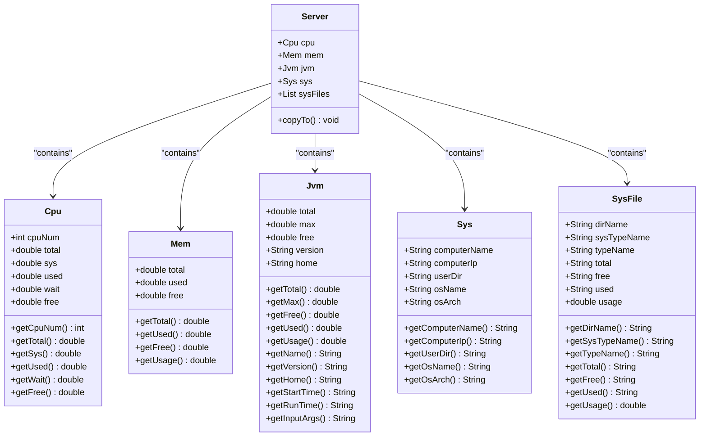
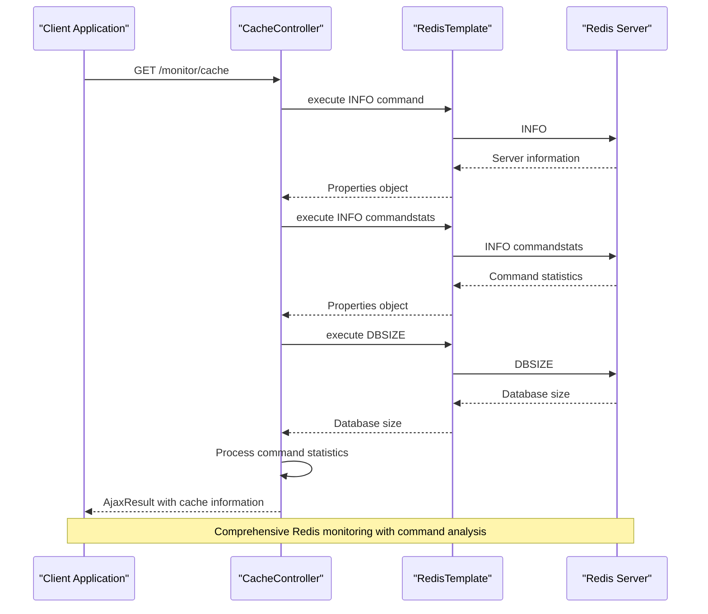
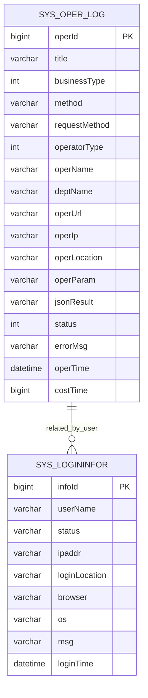

# System Monitoring

<cite>
**Referenced Files in This Document**   
- [ServerController.java](file://src/main/java/com/ruoyi/project/monitor/controller/ServerController.java)
- [CacheController.java](file://src/main/java/com/ruoyi/project/monitor/controller/CacheController.java)
- [Server.java](file://src/main/java/com/ruoyi/framework/web/domain/Server.java)
- [Cpu.java](file://src/main/java/com/ruoyi/framework/web/domain/server/Cpu.java)
- [Mem.java](file://src/main/java/com/ruoyi/framework/web/domain/server/Mem.java)
- [Jvm.java](file://src/main/java/com/ruoyi/framework/web/domain/server/Jvm.java)
- [Sys.java](file://src/main/java/com/ruoyi/framework/web/domain/server/Sys.java)
- [SysFile.java](file://src/main/java/com/ruoyi/framework/web/domain/server/SysFile.java)
- [SysOperlogController.java](file://src/main/java/com/ruoyi/project/monitor/controller/SysOperlogController.java)
- [SysLogininforController.java](file://src/main/java/com/ruoyi/project/monitor/controller/SysLogininforController.java)
- [SysOperLog.java](file://src/main/java/com/ruoyi/project/monitor/domain/SysOperLog.java)
- [SysLogininfor.java](file://src/main/java/com/ruoyi/project/monitor/domain/SysLogininfor.java)
- [DruidConfig.java](file://src/main/java/com/ruoyi/framework/config/DruidConfig.java)
- [application-druid.yml](file://src/main/resources/application-druid.yml)
</cite>

## Table of Contents
1. [Server Monitoring](#server-monitoring)
2. [Cache Monitoring](#cache-monitoring)
3. [Connection Pool Monitoring](#connection-pool-monitoring)
4. [Log Management](#log-management)
5. [Implementation Details](#implementation-details)
6. [Performance Tuning Examples](#performance-tuning-examples)

## Server Monitoring

The RuoYi-Vue system provides comprehensive server monitoring capabilities through the Server domain object and OSHI (Operating System and Hardware Information) library. The monitoring system collects real-time data on CPU usage, memory consumption, disk utilization, and JVM performance metrics.

The `Server` class serves as the central domain object that aggregates all server monitoring information. It contains nested objects for CPU (`Cpu`), memory (`Mem`), JVM (`Jvm`), system information (`Sys`), and disk information (`SysFile`). When the monitoring endpoint is accessed, the `copyTo()` method is invoked to populate all these components with current system data.

CPU monitoring tracks several key metrics including total usage, system usage, user usage, wait time, and idle time. The system calculates CPU utilization by sampling tick counts before and after a short delay (1000ms), then computing the percentage of time spent in various states. The `Cpu` class provides getters that automatically convert raw values to percentage format for display.

Memory monitoring captures both physical memory and JVM heap usage. The `Mem` class reports total, used, and free memory in gigabytes, with usage percentage calculated automatically. The system distinguishes between system memory (via OSHI) and JVM memory (via Runtime.getRuntime()), providing insights into both OS-level and application-level memory consumption.

**Diagram sources**
- [Server.java](file://src/main/java/com/ruoyi/framework/web/domain/Server.java)
- [Cpu.java](file://src/main/java/com/ruoyi/framework/web/domain/server/Cpu.java)
- [Mem.java](file://src/main/java/com/ruoyi/framework/web/domain/server/Mem.java)
- [Jvm.java](file://src/main/java/com/ruoyi/framework/web/domain/server/Jvm.java)
- [Sys.java](file://src/main/java/com/ruoyi/framework/web/domain/server/Sys.java)
- [SysFile.java](file://src/main/java/com/ruoyi/framework/web/domain/server/SysFile.java)

**Section sources**
- [Server.java](file://src/main/java/com/ruoyi/framework/web/domain/Server.java#L29-L241)
- [ServerController.java](file://src/main/java/com/ruoyi/project/monitor/controller/ServerController.java#L15-L27)

## Cache Monitoring

The RuoYi-Vue system includes robust cache monitoring functionality that provides detailed Redis statistics and command analysis. The cache monitoring is implemented through the `CacheController` class, which exposes endpoints to retrieve comprehensive information about the Redis cache instance.

The monitoring system collects various Redis server metrics by executing the INFO command through the RedisTemplate. This includes general server information, memory usage statistics, client connections, and command execution statistics. The system also retrieves the database size to monitor data volume.

A key feature of the cache monitoring is command statistics analysis. By querying the "commandstats" section of Redis INFO, the system extracts performance data for each Redis command, including the number of calls and execution time. This data is processed to create a pie chart representation showing the distribution of command usage, helping administrators identify frequently used operations and potential performance bottlenecks.

The system defines a set of standard cache areas through the `caches` list in the `CacheController`, including login tokens, system configuration, data dictionaries, captcha codes, repeat submission prevention, rate limiting, and password error counting. Administrators can view all keys within a specific cache area and inspect the value of any individual cache entry.

The monitoring interface also provides cache management capabilities, allowing administrators to clear specific cache entries, all entries within a cache area, or the entire cache. This is particularly useful for troubleshooting and maintaining cache consistency.

**Diagram sources**
- [CacheController.java](file://src/main/java/com/ruoyi/project/monitor/controller/CacheController.java#L30-L122)

**Section sources**
- [CacheController.java](file://src/main/java/com/ruoyi/project/monitor/controller/CacheController.java#L30-L122)

## Connection Pool Monitoring

The RuoYi-Vue system implements connection pool monitoring through Druid, a high-performance database connection pool. The monitoring is configured through `DruidConfig` and the `application-druid.yml` configuration file, providing comprehensive insights into database connection usage and SQL execution performance.

Druid configuration includes key pool parameters such as initial connection size (5), minimum idle connections (10), maximum active connections (20), and various timeout settings. The connection pool is configured with validation queries to ensure connection health and includes eviction policies to manage idle connections.

A critical feature of the Druid monitoring is the SQL execution analysis capability. The system enables the StatFilter with slow SQL logging, capturing queries that exceed a configurable threshold (1000ms). This allows administrators to identify performance bottlenecks in database operations and optimize problematic queries.

The monitoring interface is accessible through the `/druid/*` endpoint, protected by authentication credentials configured in the application properties. The system includes a filter to remove advertising content from the Druid monitoring interface, providing a clean administrative view.

Druid's wall filter is configured to allow multi-statement SQL execution, which is necessary for certain batch operations while maintaining security controls. The monitoring system provides real-time statistics on connection acquisition, usage patterns, and SQL execution metrics, enabling administrators to tune the connection pool configuration based on actual usage patterns.

**Section sources**
- [DruidConfig.java](file://src/main/java/com/ruoyi/framework/config/DruidConfig.java#L32-L127)
- [application-druid.yml](file://src/main/resources/application-druid.yml#L1-L61)

## Log Management

The RuoYi-Vue system implements a comprehensive log management system that includes operation logs, login logs, and error tracking. The logging infrastructure is built around domain entities and controllers that provide CRUD operations and analysis capabilities for log data.

Operation logs are captured through the `@Log` annotation applied to service methods, recording details of business operations including the operator, operation type, request parameters, execution result, and processing time. The `SysOperLog` entity stores comprehensive information about each operation, including the operation module, business type (create, update, delete, etc.), request method, URL, IP address, location, and any error messages.

Login monitoring is implemented through the `SysLogininfor` entity, which tracks user authentication attempts. Each login event is recorded with the username, login status (success/failure), IP address, location, browser type, operating system, and timestamp. This information is crucial for security analysis, allowing administrators to detect suspicious login patterns and potential brute force attacks.

Both log types support export functionality, enabling administrators to download log data in Excel format for offline analysis. The system also provides bulk deletion capabilities, allowing cleanup of old log entries to manage storage requirements. For login logs, the system includes a specific "unlock" feature that clears login attempt records for a user, which can be used to reset account lockouts after failed password attempts.

The log management controllers (`SysOperlogController` and `SysLogininforController`) extend the base `BaseController`, inheriting pagination and response handling functionality. They implement standard RESTful endpoints for listing, exporting, and deleting log entries, with appropriate security annotations to control access based on user permissions.

**Diagram sources**
- [SysOperLog.java](file://src/main/java/com/ruoyi/project/monitor/domain/SysOperLog.java#L14-L270)
- [SysLogininfor.java](file://src/main/java/com/ruoyi/project/monitor/domain/SysLogininfor.java#L14-L144)

**Section sources**
- [SysOperlogController.java](file://src/main/java/com/ruoyi/project/monitor/controller/SysOperlogController.java#L27-L70)
- [SysLogininforController.java](file://src/main/java/com/ruoyi/project/monitor/controller/SysLogininforController.java#L28-L83)
- [SysOperLog.java](file://src/main/java/com/ruoyi/project/monitor/domain/SysOperLog.java#L14-L270)
- [SysLogininfor.java](file://src/main/java/com/ruoyi/project/monitor/domain/SysLogininfor.java#L14-L144)

## Implementation Details

The monitoring system in RuoYi-Vue is implemented through a combination of controllers, domain objects, and configuration classes that work together to collect, process, and present system information. The architecture follows a clean separation of concerns, with dedicated components for each monitoring aspect.

Server monitoring is implemented through the `ServerController` which orchestrates data collection from various system components. When the `/monitor/server` endpoint is accessed, the controller creates a `Server` instance and invokes the `copyTo()` method. This method uses the OSHI library to gather hardware and operating system information, populating the various sub-components (CPU, memory, disk, etc.).

The OSHI library provides a cross-platform interface to system information, abstracting the underlying operating system differences. The `Server` class uses OSHI's `SystemInfo` class to access hardware abstraction layers for CPU, memory, and file system information. For CPU usage calculation, the system takes two samples of CPU tick counts with a 1-second interval, then computes the utilization percentages based on the differences.

Cache monitoring leverages Spring Data Redis and the `RedisTemplate` to communicate with the Redis server. The `CacheController` executes Redis commands through the `RedisCallback` interface, which provides low-level access to the Redis connection. This allows the system to execute INFO commands and retrieve server statistics directly.

The monitoring endpoints are protected by Spring Security annotations (`@PreAuthorize`) that check user permissions before allowing access. The `@ss.hasPermi('monitor:cache:list')` expression verifies that the authenticated user has the appropriate permission to view monitoring information.

All monitoring controllers return data in a standardized format using the `AjaxResult` class, which provides a consistent response structure with success status, data payload, and optional messages. This enables the frontend to handle responses uniformly across different monitoring features.

**Section sources**
- [ServerController.java](file://src/main/java/com/ruoyi/project/monitor/controller/ServerController.java#L15-L27)
- [Server.java](file://src/main/java/com/ruoyi/framework/web/domain/Server.java#L29-L241)
- [CacheController.java](file://src/main/java/com/ruoyi/project/monitor/controller/CacheController.java#L30-L122)

## Performance Tuning Examples

Administrators can leverage the monitoring tools in RuoYi-Vue for various performance tuning scenarios. The comprehensive monitoring data provides actionable insights that can be used to optimize system performance and resource utilization.

For server performance tuning, administrators can monitor CPU usage patterns to identify peak load times and potential bottlenecks. If CPU usage consistently exceeds 80%, it may indicate the need to optimize application code, add caching, or scale the infrastructure. Memory monitoring helps identify memory leaks by tracking JVM heap usage over time. A steadily increasing memory usage without corresponding increases in load suggests a potential memory leak that requires investigation.

The Redis command statistics provide valuable insights for cache optimization. By analyzing the command distribution pie chart, administrators can identify frequently executed commands and optimize their usage. For example, if GET commands dominate the statistics, it may indicate opportunities to implement client-side caching or optimize data access patterns. High-frequency SET commands might suggest inefficient cache invalidation strategies that could be improved.

Connection pool monitoring through Druid enables database performance tuning. The slow SQL log captures queries exceeding 1000ms, allowing administrators to identify and optimize problematic database operations. By examining these slow queries, developers can add appropriate indexes, rewrite inefficient queries, or implement caching strategies to reduce database load.

Login pattern analysis can improve system security and performance. By monitoring login attempts, administrators can identify brute force attacks and adjust security policies accordingly. Frequent failed login attempts from specific IP addresses can trigger rate limiting or temporary blocking. The system's ability to unlock accounts through the monitoring interface allows administrators to quickly resolve legitimate user lockout issues.

Operation logs with execution time metrics help identify slow business processes. By sorting operation logs by cost time, administrators can pinpoint the most time-consuming operations and prioritize optimization efforts. This data-driven approach ensures that performance improvements are focused on the areas that will have the greatest impact on user experience.

**Section sources**
- [Server.java](file://src/main/java/com/ruoyi/framework/web/domain/Server.java#L29-L241)
- [CacheController.java](file://src/main/java/com/ruoyi/project/monitor/controller/CacheController.java#L30-L122)
- [application-druid.yml](file://src/main/resources/application-druid.yml#L1-L61)
- [SysOperLog.java](file://src/main/java/com/ruoyi/project/monitor/domain/SysOperLog.java#L14-L270)