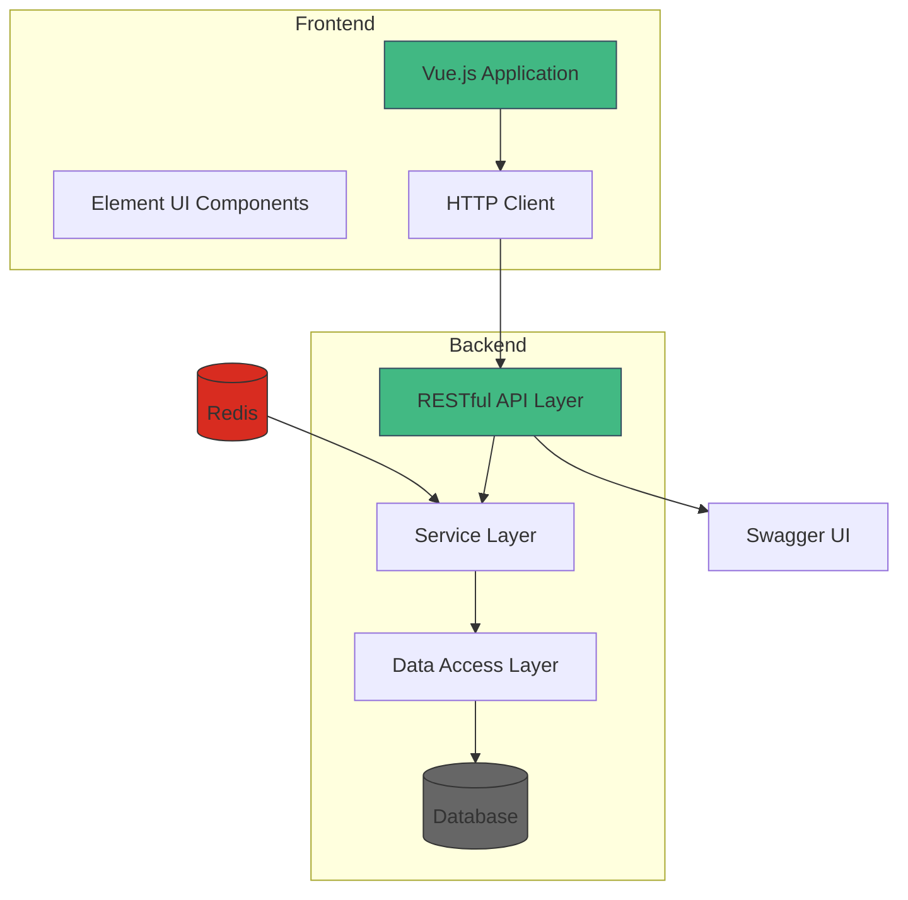
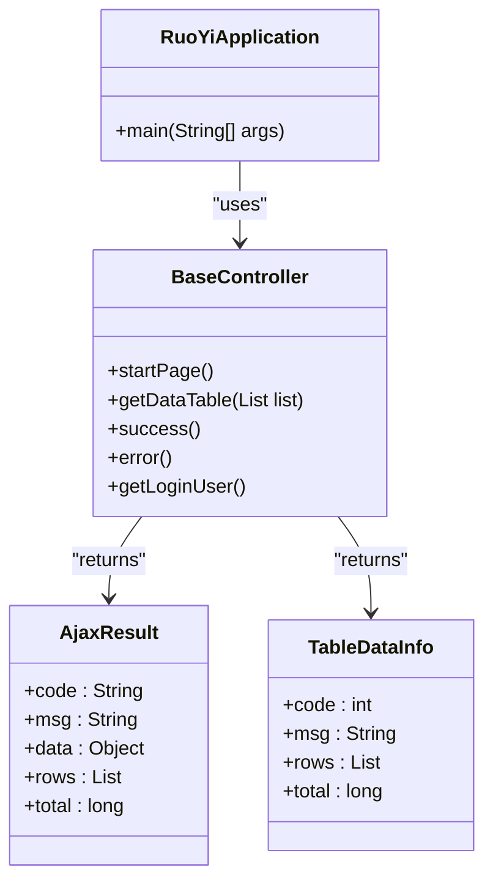
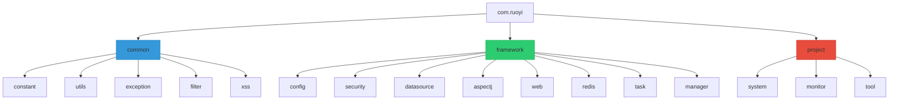
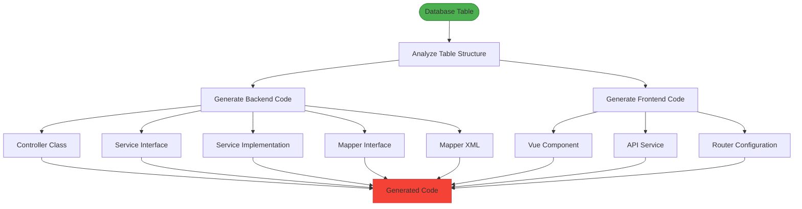
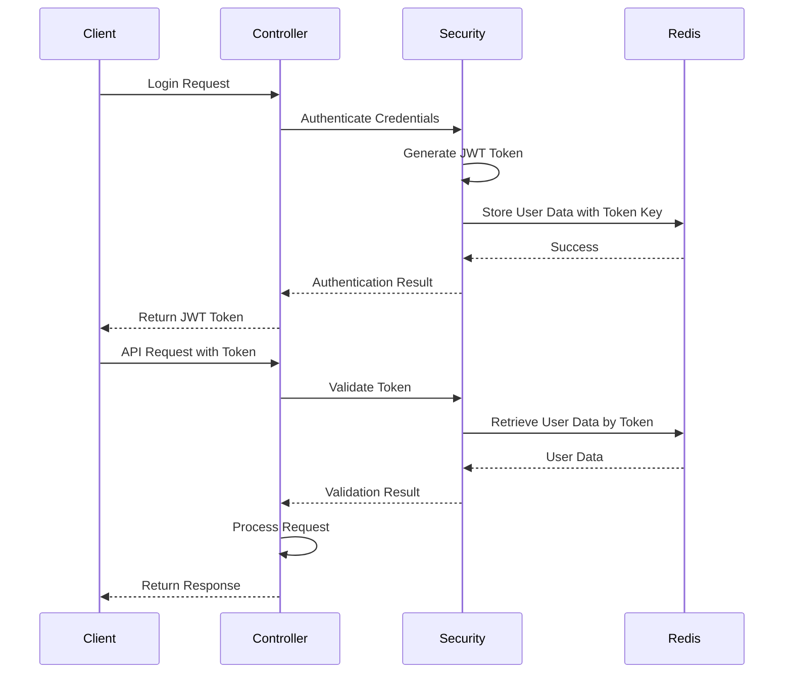
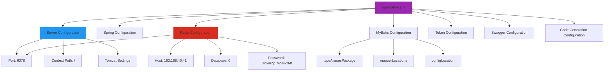

# System Overview

<cite>
**Referenced Files in This Document**   
- [RuoYiApplication.java](file://src/main/java/com/ruoyi/RuoYiApplication.java)
- [pom.xml](file://pom.xml)
- [application.yml](file://src/main/resources/application.yml)
- [README.md](file://README.md)
- [SecurityConfig.java](file://src/main/java/com/ruoyi/framework/config/SecurityConfig.java)
- [MyBatisConfig.java](file://src/main/java/com/ruoyi/framework/config/MyBatisConfig.java)
- [RedisConfig.java](file://src/main/java/com/ruoyi/framework/config/RedisConfig.java)
- [SwaggerConfig.java](file://src/main/java/com/ruoyi/framework/config/SwaggerConfig.java)
- [Constants.java](file://src/main/java/com/ruoyi/common/constant/Constants.java)
- [BaseController.java](file://src/main/java/com/ruoyi/framework/web/controller/BaseController.java)
- [SysUser.java](file://src/main/java/com/ruoyi/project/system/domain/SysUser.java)
- [DynamicDataSource.java](file://src/main/java/com/ruoyi/framework/datasource/DynamicDataSource.java)
- [TokenService.java](file://src/main/java/com/ruoyi/framework/security/service/TokenService.java)
- [mybatis-config.xml](file://src/main/resources/mybatis/mybatis-config.xml)
</cite>

## Table of Contents
1. [Introduction](#introduction)
2. [Architecture Overview](#architecture-overview)
3. [Core Components](#core-components)
4. [Modular Structure](#modular-structure)
5. [Code Generation Capabilities](#code-generation-capabilities)
6. [Security Implementation](#security-implementation)
7. [Configuration and Deployment](#configuration-and-deployment)
8. [Performance Considerations](#performance-considerations)

## Introduction

RuoYi-Vue is a full-stack Java rapid development framework based on SpringBoot and Vue with front-end and back-end separation. It provides a comprehensive solution for enterprise application development with built-in features such as user management, department management, role-based access control, system monitoring, and code generation. The framework follows modern web development practices with a clean separation of concerns between the frontend and backend components.

The system is designed to accelerate development through its code generation capabilities, allowing developers to quickly create CRUD operations for database tables with automatically generated frontend and backend code. This significantly reduces development time and ensures consistency across the application.

**Section sources**
- [README.md](file://README.md#L1-L94)

## Architecture Overview

RuoYi-Vue follows a layered architecture with clear separation between the frontend and backend components. The backend is built on SpringBoot and provides a RESTful API layer that serves as the interface between the frontend and the business logic. The frontend is built with Vue.js and communicates with the backend through HTTP requests.

**Diagram sources**
- [RuoYiApplication.java](file://src/main/java/com/ruoyi/RuoYiApplication.java#L1-L31)
- [pom.xml](file://pom.xml#L1-L276)

**Section sources**
- [README.md](file://README.md#L1-L94)
- [pom.xml](file://pom.xml#L1-L276)

## Core Components

The RuoYi-Vue system consists of several core components that work together to provide a complete development framework. The backend RESTful API layer handles HTTP requests and responses, while the service layer contains the business logic and the data access layer manages database operations.

The main application entry point is the RuoYiApplication class, which uses Spring Boot's @SpringBootApplication annotation to enable auto-configuration and component scanning. The application is configured to exclude DataSourceAutoConfiguration, allowing for custom data source configuration.

**Diagram sources**
- [RuoYiApplication.java](file://src/main/java/com/ruoyi/RuoYiApplication.java#L1-L31)
- [BaseController.java](file://src/main/java/com/ruoyi/framework/web/controller/BaseController.java#L1-L195)

**Section sources**
- [RuoYiApplication.java](file://src/main/java/com/ruoyi/RuoYiApplication.java#L1-L31)
- [BaseController.java](file://src/main/java/com/ruoyi/framework/web/controller/BaseController.java#L1-L195)

## Modular Structure

The RuoYi-Vue framework is organized into three main packages: common, framework, and project. Each package serves a specific purpose in the overall architecture.

The common package contains utility classes and constants that are used throughout the application. The framework package contains the core infrastructure components such as security, configuration, and data access. The project package contains the actual business modules such as system management, monitoring, and code generation.

**Diagram sources**
- [Constants.java](file://src/main/java/com/ruoyi/common/constant/Constants.java#L1-L174)
- [SysUser.java](file://src/main/java/com/ruoyi/project/system/domain/SysUser.java#L1-L341)

**Section sources**
- [SysUser.java](file://src/main/java/com/ruoyi/project/system/domain/SysUser.java#L1-L341)
- [Constants.java](file://src/main/java/com/ruoyi/common/constant/Constants.java#L1-L174)

## Code Generation Capabilities

One of the key features of RuoYi-Vue is its code generation capabilities. The framework includes a code generator that can automatically create frontend and backend code for database tables. This significantly reduces development time and ensures consistency across the application.

The code generation is implemented using Apache Velocity templates stored in the resources/vm directory. These templates define the structure of the generated code for controllers, services, mappers, and Vue components. The generator analyzes the database table structure and uses the templates to create the appropriate code files.

**Diagram sources**
- [GenController.java](file://src/main/java/com/ruoyi/project/tool/gen/controller/GenController.java)
- [velocity-utils.java](file://src/main/java/com/ruoyi/project/tool/gen/util/VelocityUtils.java)

**Section sources**
- [application.yml](file://src/main/resources/application.yml#L138-L149)

## Security Implementation

RuoYi-Vue implements a comprehensive security model using Spring Security, JWT (JSON Web Tokens), and Redis. The security configuration is defined in the SecurityConfig class, which sets up authentication, authorization, and token-based authentication.

The system uses JWT for stateless authentication, where tokens are issued upon successful login and included in subsequent requests. The tokens are validated on each request, and user information is stored in Redis for quick retrieval. This approach allows for scalable authentication without the need for server-side sessions.

**Diagram sources**
- [SecurityConfig.java](file://src/main/java/com/ruoyi/framework/config/SecurityConfig.java#L1-L140)
- [TokenService.java](file://src/main/java/com/ruoyi/framework/security/service/TokenService.java#L1-L233)
- [RedisConfig.java](file://src/main/java/com/ruoyi/framework/config/RedisConfig.java#L1-L70)

**Section sources**
- [SecurityConfig.java](file://src/main/java/com/ruoyi/framework/config/SecurityConfig.java#L1-L140)
- [TokenService.java](file://src/main/java/com/ruoyi/framework/security/service/TokenService.java#L1-L233)

## Configuration and Deployment

The RuoYi-Vue framework is configured using YAML configuration files, with the main application.yml file containing settings for the application, server, database, Redis, and other components. The configuration supports multiple profiles, allowing for different settings in development, testing, and production environments.

The application is packaged as a JAR file and can be deployed using the provided batch scripts or run directly with Java. The configuration includes settings for Tomcat, Redis, MyBatis, and other components, making it easy to customize the application for different deployment scenarios.

**Diagram sources**
- [application.yml](file://src/main/resources/application.yml#L1-L149)
- [pom.xml](file://pom.xml#L1-L276)

**Section sources**
- [application.yml](file://src/main/resources/application.yml#L1-L149)
- [pom.xml](file://pom.xml#L1-L276)

## Performance Considerations

RuoYi-Vue includes several performance optimizations to ensure efficient operation in enterprise environments. The framework uses Redis for caching frequently accessed data, reducing database load and improving response times. The MyBatis configuration includes settings for caching and efficient SQL execution.

The application is configured with optimized Tomcat settings, including a high maximum thread count (800) and appropriate connection pool settings. The code generation feature helps maintain performance by ensuring consistent and optimized code patterns across the application.

Additional performance features include:
- PageHelper for efficient database pagination
- Connection pooling with Druid
- Efficient JWT token validation using Redis
- Caching of frequently accessed system data
- Optimized database queries through MyBatis

These performance considerations make RuoYi-Vue suitable for enterprise applications with high traffic and demanding performance requirements.

**Section sources**
- [application.yml](file://src/main/resources/application.yml#L18-L32)
- [mybatis-config.xml](file://src/main/resources/mybatis/mybatis-config.xml#L1-L21)
- [pom.xml](file://pom.xml#L111-L116)