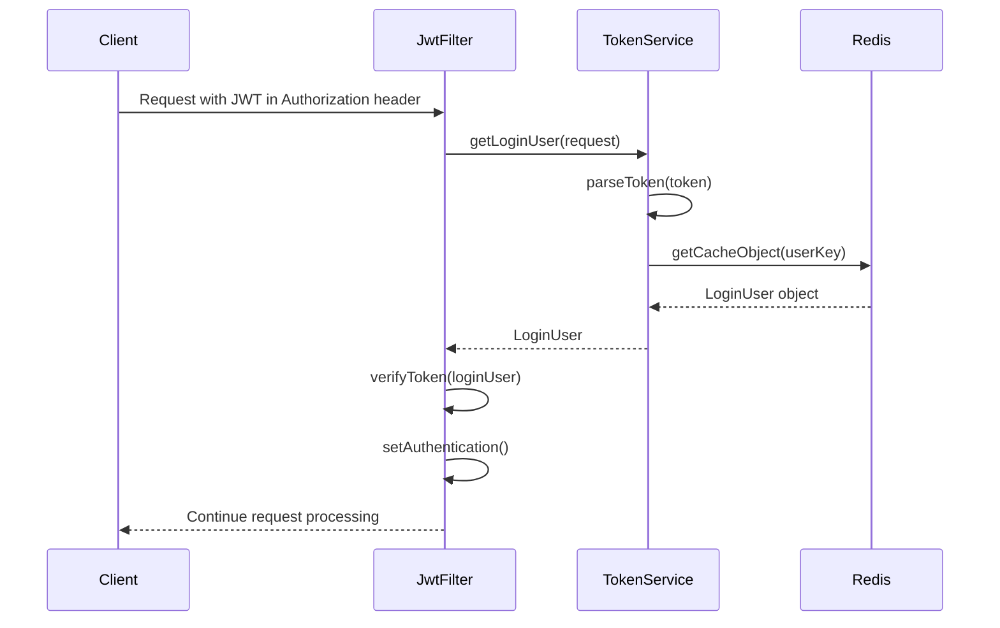
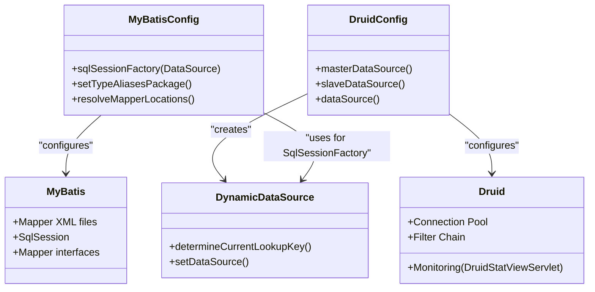
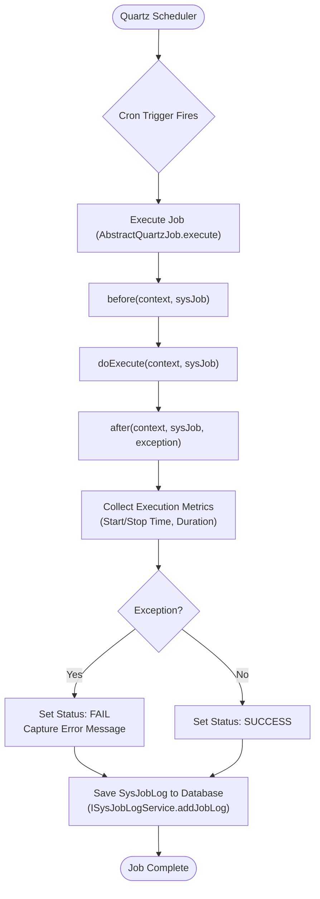

# Technology Stack

<cite>
**Referenced Files in This Document**   
- [pom.xml](file://pom.xml)
- [application.yml](file://src/main/resources/application.yml)
- [SecurityConfig.java](file://src/main/java/com/ruoyi/framework/config/SecurityConfig.java)
- [MyBatisConfig.java](file://src/main/java/com/ruoyi/framework/config/MyBatisConfig.java)
- [DruidConfig.java](file://src/main/java/com/ruoyi/framework/config/DruidConfig.java)
- [RedisConfig.java](file://src/main/java/com/ruoyi/framework/config/RedisConfig.java)
- [JwtAuthenticationTokenFilter.java](file://src/main/java/com/ruoyi/framework/security/filter/JwtAuthenticationTokenFilter.java)
- [TokenService.java](file://src/main/java/com/ruoyi/framework/security/service/TokenService.java)
- [RedisCache.java](file://src/main/java/com/ruoyi/framework/redis/RedisCache.java)
- [mybatis-config.xml](file://src/main/resources/mybatis/mybatis-config.xml)
- [VelocityInitializer.java](file://src/main/java/com/ruoyi/project/tool/gen/util/VelocityInitializer.java)
- [AbstractQuartzJob.java](file://src/main/java/com/ruoyi/common/utils/job/AbstractQuartzJob.java)
</cite>

## Table of Contents
1. [Backend Framework Components](#backend-framework-components)
2. [Security Implementation with JWT and Redis](#security-implementation-with-jwt-and-redis)
3. [Database Access Layer with MyBatis and Druid](#database-access-layer-with-mybatis-and-druid)
4. [Frontend Integration via Velocity Templates](#frontend-integration-via-velocity-templates)
5. [Monitoring and Scheduling Components](#monitoring-and-scheduling-components)
6. [Configuration and Dependency Management](#configuration-and-dependency-management)

## Backend Framework Components

The RuoYi-Vue technology stack is built on a robust backend foundation using Spring Boot 2.5.15 (based on Spring Framework 5.3.39), Spring Security 5.7.14, MyBatis, and Aspect-Oriented Programming (AOP). The application follows a modular architecture with clear separation of concerns across packages such as `common`, `framework`, and `project`. Spring Boot provides the core container and auto-configuration capabilities, enabling rapid development and deployment. Spring Security handles authentication and authorization, while AOP is used extensively for cross-cutting concerns like logging, rate limiting, and data scope control through custom annotations such as `@Log`, `@RateLimiter`, and `@DataScope`. These aspects are implemented in classes like `LogAspect.java` and `RateLimiterAspect.java` under the `framework/aspectj` package, allowing declarative application of behavior across the system without code duplication.

**Section sources**
- [pom.xml](file://pom.xml#L16-L20)
- [SecurityConfig.java](file://src/main/java/com/ruoyi/framework/config/SecurityConfig.java#L29-L31)

## Security Implementation with JWT and Redis

Security in RuoYi-Vue is implemented using JSON Web Tokens (JWT) version 0.9.1 in conjunction with Redis for secure token management. The system uses stateless authentication, where JWTs are issued upon successful login and included in the `Authorization` header for subsequent requests. The `JwtAuthenticationTokenFilter` intercepts incoming requests, extracts the token, and validates it using the `TokenService`. This service leverages the `jjwt` library to parse and verify the token's signature using a secret key configured in `application.yml`. Upon validation, user details are retrieved from Redis using a key derived from the token UUID. Redis, configured with a 30-minute expiration (configurable via `token.expireTime`), stores serialized `LoginUser` objects, ensuring session persistence across application restarts and supporting distributed environments. The `TokenService` also handles token refresh logic, automatically extending the validity period if the token is within 20 minutes of expiry, thus providing a seamless user experience without requiring re-authentication.

**Diagram sources**
- [JwtAuthenticationTokenFilter.java](file://src/main/java/com/ruoyi/framework/security/filter/JwtAuthenticationTokenFilter.java#L30-L42)
- [TokenService.java](file://src/main/java/com/ruoyi/framework/security/service/TokenService.java#L62-L82)
- [RedisCache.java](file://src/main/java/com/ruoyi/framework/redis/RedisCache.java#L105-L109)

## Database Access Layer with MyBatis and Druid

The database access layer is powered by MyBatis as the persistence framework, integrated with the Druid connection pool for efficient database resource management. MyBatis is configured through `MyBatisConfig.java`, which sets up the `SqlSessionFactory` with type aliases for domain objects under `com.ruoyi.project.**.domain` and maps XML mapper files located in the classpath under `mybatis/**/*Mapper.xml`. The global MyBatis configuration in `mybatis-config.xml` enables features like caching, auto-generated keys, and SLF4J logging. Druid, version 1.2.23, is configured as the primary data source, providing robust connection pooling with parameters for maximum active connections, minimum idle connections, and connection validation. The `DruidConfig` class sets up the data source and includes a filter to remove advertising from the Druid monitoring page. The system supports a master-slave database configuration through `DynamicDataSource`, allowing for read-write separation. SQL queries are defined in XML mapper files (e.g., `SysUserMapper.xml`), which are bound to corresponding Java mapper interfaces, providing a clear separation between SQL logic and business code.

**Diagram sources**
- [MyBatisConfig.java](file://src/main/java/com/ruoyi/framework/config/MyBatisConfig.java#L32-L132)
- [DruidConfig.java](file://src/main/java/com/ruoyi/framework/config/DruidConfig.java#L32-L127)
- [mybatis-config.xml](file://src/main/resources/mybatis/mybatis-config.xml#L1-L21)
- [DynamicDataSource.java](file://src/main/java/com/ruoyi/framework/datasource/DynamicDataSource.java)

## Frontend Integration via Velocity Templates

Frontend integration and code generation in RuoYi-Vue are facilitated through the Apache Velocity template engine, version 2.3. The system includes a built-in code generator that uses Velocity templates to produce Vue.js frontend code, Java backend code (controllers, services, mappers), and SQL scripts. Templates are stored in the `src/main/resources/vm/` directory, organized by language and component type (e.g., `vue/index.vue.vm` for Vue list pages, `java/controller.java.vm` for Spring controllers). The `VelocityInitializer` class configures the Velocity engine to load these templates from the classpath. The `GenUtils` class orchestrates the code generation process, populating the templates with metadata from database tables and user-defined configurations (like package name and author) from `application.yml`. This allows for rapid scaffolding of CRUD operations, significantly reducing boilerplate code. The generated Vue.js code follows a standard structure compatible with the project's frontend build system, enabling seamless integration into the Vue application.

**Section sources**
- [VelocityInitializer.java](file://src/main/java/com/ruoyi/project/tool/gen/util/VelocityInitializer.java#L12-L35)
- [application.yml](file://src/main/resources/application.yml#L138-L149)

## Monitoring and Scheduling Components

The RuoYi-Vue stack includes comprehensive monitoring and scheduling capabilities. System monitoring is achieved using OSHI (Operating System and Hardware Information) library version 6.8.3, which provides detailed real-time information about the server's CPU, memory, disk usage, and JVM performance. This data is exposed through the `ServerController` and displayed in the system's monitoring dashboard. For task scheduling, the system integrates Quartz Scheduler, which is configured to run jobs based on cron expressions. The `AbstractQuartzJob` class provides a base implementation for scheduled tasks, handling common functionality like execution logging, performance timing, and error reporting. Each job execution is recorded in the `sys_job_log` table, capturing start time, end time, duration, and any exceptions. The `ScheduleConfig` class (though currently commented out) indicates support for both standalone and clustered Quartz deployments, with the latter requiring the `qrtz` database tables. This allows for reliable execution of periodic tasks such as data cleanup, report generation, or system health checks.

**Diagram sources**
- [AbstractQuartzJob.java](file://src/main/java/com/ruoyi/common/utils/job/AbstractQuartzJob.java#L23-L107)
- [ScheduleConfig.java](file://src/main/java/com/ruoyi/framework/config/ScheduleConfig.java)
- [oshi-core](file://pom.xml#L191-L195)

## Configuration and Dependency Management

Configuration and dependency management are centralized using Spring Boot's convention-over-configuration principles. The primary configuration file, `application.yml`, defines application settings (name, version), server port (8080), logging levels, and module-specific configurations for user management, file upload limits, and security. External services like Redis are configured with host, port, password, and connection pool settings. Security-related parameters, such as the JWT secret key and token expiration time (30 minutes), are also defined here. Dependency management is handled by Maven through the `pom.xml` file, which declares all project dependencies with their specific versions. Key dependencies include Spring Boot 2.5.15, Spring Security 5.7.14, MyBatis, Druid 1.2.23, Fastjson2 2.0.58, JWT 0.9.1, OSHI 6.8.3, Velocity 2.3, and Quartz. The `properties` section in `pom.xml` ensures version consistency across related libraries. This approach provides a clear, maintainable, and reproducible build environment, allowing developers to understand the exact technology stack and its versions at a glance.

**Section sources**
- [application.yml](file://src/main/resources/application.yml#L1-L149)
- [pom.xml](file://pom.xml#L22-L43)