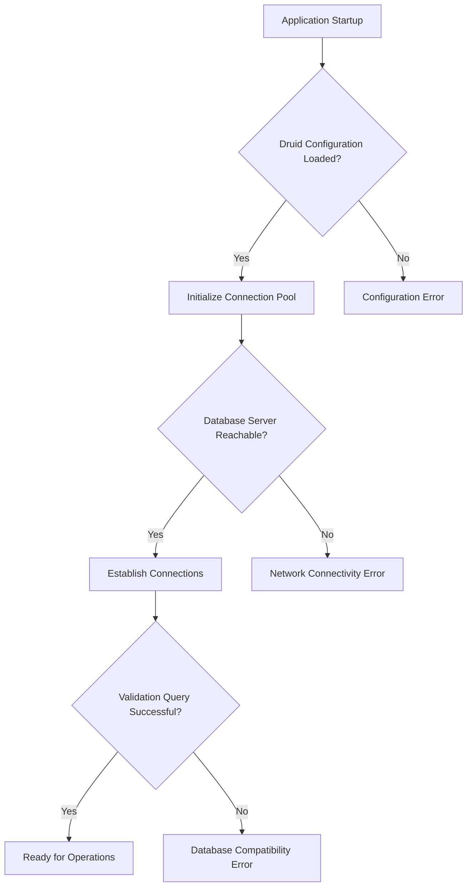
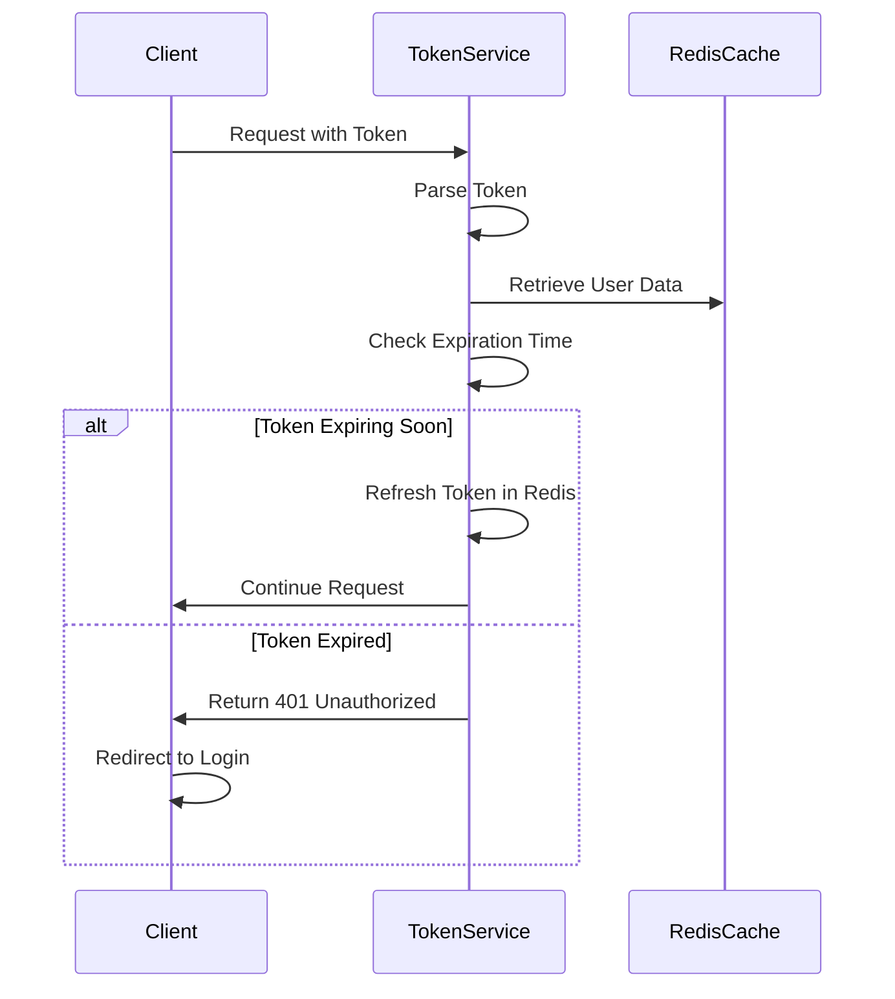
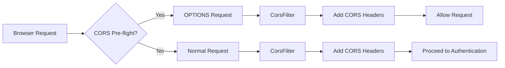
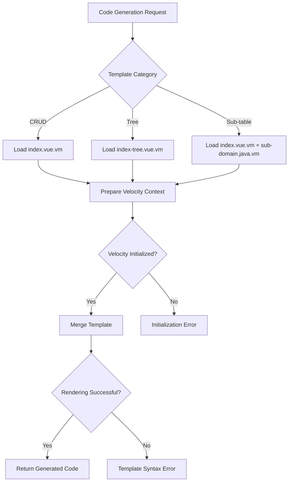
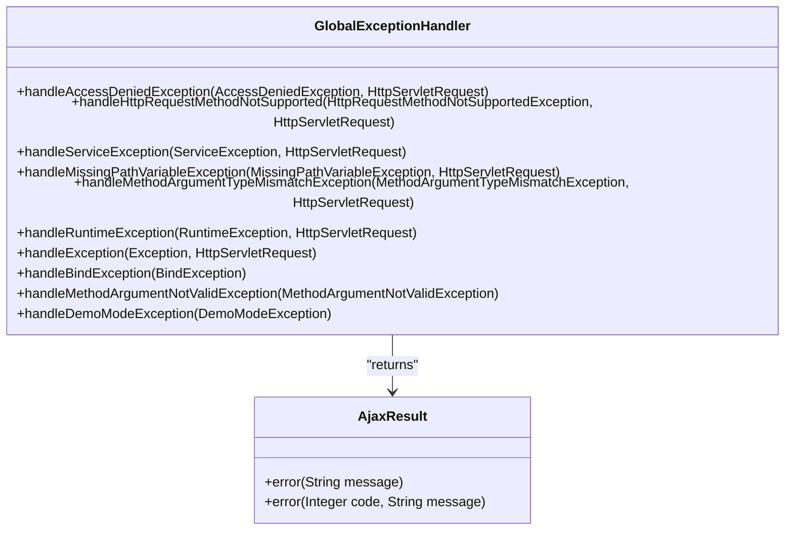

# Common Issues

<cite>
**Referenced Files in This Document**   
- [application.yml](file://src/main/resources/application.yml)
- [application-druid.yml](file://src/main/resources/application-druid.yml)
- [GlobalExceptionHandler.java](file://src/main/java/com/ruoyi/framework/web/exception/GlobalExceptionHandler.java)
- [DruidProperties.java](file://src/main/java/com/ruoyi/framework/config/properties/DruidProperties.java)
- [DruidConfig.java](file://src/main/java/com/ruoyi/framework/config/DruidConfig.java)
- [TokenService.java](file://src/main/java/com/ruoyi/framework/security/service/TokenService.java)
- [JwtAuthenticationTokenFilter.java](file://src/main/java/com/ruoyi/framework/security/filter/JwtAuthenticationTokenFilter.java)
- [SecurityConfig.java](file://src/main/java/com/ruoyi/framework/config/SecurityConfig.java)
- [ResourcesConfig.java](file://src/main/java/com/ruoyi/framework/config/ResourcesConfig.java)
- [GenTableServiceImpl.java](file://src/main/java/com/ruoyi/project/tool/gen/service/GenTableServiceImpl.java)
- [VelocityUtils.java](file://src/main/java/com/ruoyi/project/tool/gen/util/VelocityUtils.java)
- [ry.bat](file://ry.bat)
</cite>

## Table of Contents
1. [Application Startup Failures](#application-startup-failures)
2. [Database Connection Errors with Druid](#database-connection-errors-with-druid)
3. [Authentication Token Expiration](#authentication-token-expiration)
4. [CORS Issues](#cors-issues)
5. [Code Generation Template Rendering Failures](#code-generation-template-rendering-failures)
6. [Global Exception Handling Mechanism](#global-exception-handling-mechanism)
7. [Configuration Troubleshooting](#configuration-troubleshooting)
8. [Diagnostic Commands and Log Inspection](#diagnostic-commands-and-log-inspection)

## Application Startup Failures

Application startup failures in RuoYi-Vue typically stem from incorrect environment setup, missing dependencies, or misconfigured startup scripts. The primary startup script `ry.bat` manages the application lifecycle through various options including start, stop, restart, and status checks. Issues often arise when the JAR file name specified in the script does not match the actual packaged JAR file, or when JVM parameters are incorrectly configured. The script uses `jps` to detect running processes and `taskkill` to terminate them, which requires proper Java installation and PATH configuration. Additionally, the Spring Boot application entry point `RuoYiApplication.java` must be correctly configured with the appropriate annotations and component scanning to ensure all beans are properly initialized during startup.

**Section sources**
- [ry.bat](file://ry.bat#L1-L67)
- [RuoYiApplication.java](file://src/main/java/com/ruoyi/RuoYiApplication.java#L1-L30)

## Database Connection Errors with Druid

Database connection errors with Druid primarily occur due to misconfiguration in the `application-druid.yml` file or network connectivity issues with the database server. The Druid connection pool configuration includes critical parameters such as `initialSize`, `minIdle`, `maxActive`, and `maxWait` that must be properly tuned for the specific deployment environment. Connection timeouts can occur if `connectTimeout` and `socketTimeout` values are too low, while connection leaks may happen if `timeBetweenEvictionRunsMillis` and `minEvictableIdleTimeMillis` are not properly configured. The validation query `SELECT 1 FROM DUAL` must be compatible with the target database system. Additionally, the master data source URL, username, and password must be correctly specified, and the database server must be accessible from the application server on the specified port (default 3306 for MySQL).

**Diagram sources **
- [application-druid.yml](file://src/main/resources/application-druid.yml#L1-L61)
- [DruidConfig.java](file://src/main/java/com/ruoyi/framework/config/DruidConfig.java#L1-L68)
- [DruidProperties.java](file://src/main/java/com/ruoyi/framework/config/properties/DruidProperties.java#L1-L74)

## Authentication Token Expiration

Authentication token expiration in RuoYi-Vue is managed by the `TokenService` class, which handles JWT token creation, validation, and refreshment. Tokens are configured to expire after a specified period (default 30 minutes) as defined in the `token.expireTime` property in `application.yml`. The system automatically refreshes tokens when they are within 20 minutes of expiration, updating the Redis cache with a new expiration time. This refresh mechanism prevents abrupt session terminations and provides a seamless user experience. The token header name is configurable via `token.header` (default "Authorization"), and the secret key for token signing is specified in `token.secret`. When a token expires and cannot be refreshed, users are required to re-authenticate through the login process.

**Diagram sources **
- [TokenService.java](file://src/main/java/com/ruoyi/framework/security/service/TokenService.java#L1-L233)
- [application.yml](file://src/main/resources/application.yml#L91-L98)
- [JwtAuthenticationTokenFilter.java](file://src/main/java/com/ruoyi/framework/security/filter/JwtAuthenticationTokenFilter.java#L1-L45)

## CORS Issues

CORS (Cross-Origin Resource Sharing) issues in RuoYi-Vue are addressed through the `CorsFilter` configured in `ResourcesConfig.java`. The application allows all origins, headers, and methods by default, with a maximum age of 1800 seconds (30 minutes). This permissive configuration enables the Vue frontend to communicate with the backend API without restriction. The CORS filter is registered as a bean and added to the filter chain before the JWT authentication filter, ensuring that preflight OPTIONS requests are properly handled. While this configuration facilitates development, it should be tightened in production environments by specifying exact allowed origins rather than using wildcards. The filter is automatically applied to all request paths through the `/**` mapping in the `UrlBasedCorsConfigurationSource`.

**Diagram sources **
- [ResourcesConfig.java](file://src/main/java/com/ruoyi/framework/config/ResourcesConfig.java#L1-L72)
- [SecurityConfig.java](file://src/main/java/com/ruoyi/framework/config/SecurityConfig.java#L1-L140)

## Code Generation Template Rendering Failures

Code generation template rendering failures occur in the code generation module when Velocity templates cannot be properly processed. The system uses Apache Velocity as the template engine, with templates stored in the `vm/` directory under resources. The `GenTableServiceImpl` class handles the code generation process, using `VelocityUtils` to prepare the context and merge templates. Common issues include missing template files, incorrect template paths, or problems with the Velocity context initialization. The `previewCode` method in `GenTableServiceImpl` attempts to render templates and may fail if the Velocity engine is not properly initialized through `VelocityInitializer.initVelocity()`. Template rendering also depends on correct configuration of the template list based on the generation category (CRUD, tree, or sub-table) and frontend type (element-plus or standard Vue).

**Diagram sources **
- [GenTableServiceImpl.java](file://src/main/java/com/ruoyi/project/tool/gen/service/GenTableServiceImpl.java#L1-L531)
- [VelocityUtils.java](file://src/main/java/com/ruoyi/project/tool/gen/util/VelocityUtils.java#L1-L409)

## Global Exception Handling Mechanism

The global exception handling mechanism in RuoYi-Vue is implemented through the `@RestControllerAdvice` annotated `GlobalExceptionHandler` class. This centralized exception handler intercepts various types of exceptions and converts them into standardized, user-friendly responses. The handler maps specific exception types to appropriate HTTP responses, providing consistent error reporting across the application. For example, `AccessDeniedException` is mapped to a 403 Forbidden response with a clear message about insufficient permissions, while `ServiceException` exceptions are converted to error responses that may include custom error codes. The handler also processes validation exceptions from Spring's validation framework, extracting the first error message to return to the client. Runtime and general exceptions are caught by broader handlers that log the error and return a generic error message.

**Diagram sources **
- [GlobalExceptionHandler.java](file://src/main/java/com/ruoyi/framework/web/exception/GlobalExceptionHandler.java#L1-L146)
- [AjaxResult.java](file://src/main/java/com/ruoyi/framework/web/domain/AjaxResult.java)

## Configuration Troubleshooting

Configuration troubleshooting in RuoYi-Vue involves verifying settings in both `application.yml` and profile-specific configuration files like `application-druid.yml`. The active profile is specified in `application.yml` under `spring.profiles.active`, which determines which configuration file is loaded. Common misconfigurations include incorrect database connection parameters, mismatched token secrets between frontend and backend, and improper file upload size limits. The Druid monitoring interface is accessible at `/druid/*` and can be secured with username and password configured in `application-druid.yml`. Redis connection settings must match the Redis server configuration, including host, port, password, and database index. For development environments, hot reloading can be controlled through the `spring.devtools.restart.enabled` property.

**Section sources**
- [application.yml](file://src/main/resources/application.yml#L1-L149)
- [application-druid.yml](file://src/main/resources/application-druid.yml#L1-L61)

## Diagnostic Commands and Log Inspection

Diagnostic commands and log inspection are essential for troubleshooting issues in both development and production environments. The `ry.bat` script provides basic process management commands to start, stop, restart, and check the status of the application. For more detailed diagnostics, developers should examine the application logs configured in `logback.xml`, which typically output to the console and to file-based appenders. Key areas to inspect in logs include startup sequences, database connection attempts, authentication events, and exception stack traces. When investigating database connection issues, enabling Druid's slow SQL logging (`log-slow-sql: true`) can help identify performance bottlenecks. For authentication issues, examining the token creation and validation flow in the logs can reveal problems with token expiration or parsing. The application's logging level can be adjusted in `application.yml` under the `logging.level` section to increase verbosity for specific packages during troubleshooting.

**Section sources**
- [ry.bat](file://ry.bat#L1-L67)
- [application.yml](file://src/main/resources/application.yml#L34-L39)
- [application-druid.yml](file://src/main/resources/application-druid.yml#L53-L58)