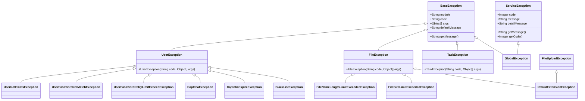
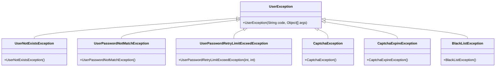
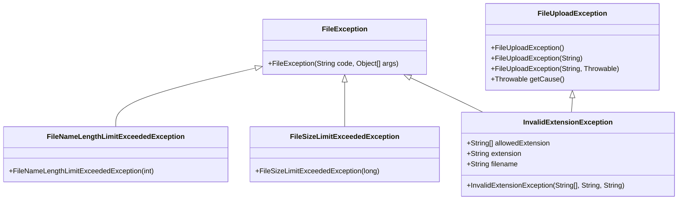
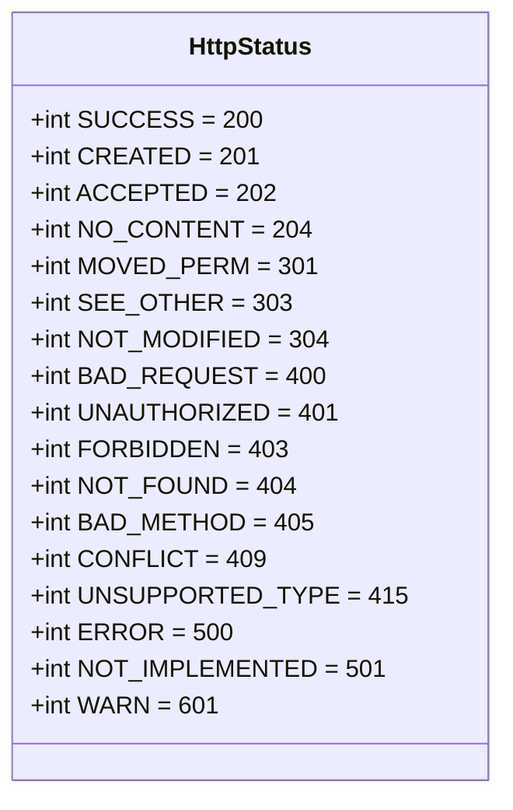
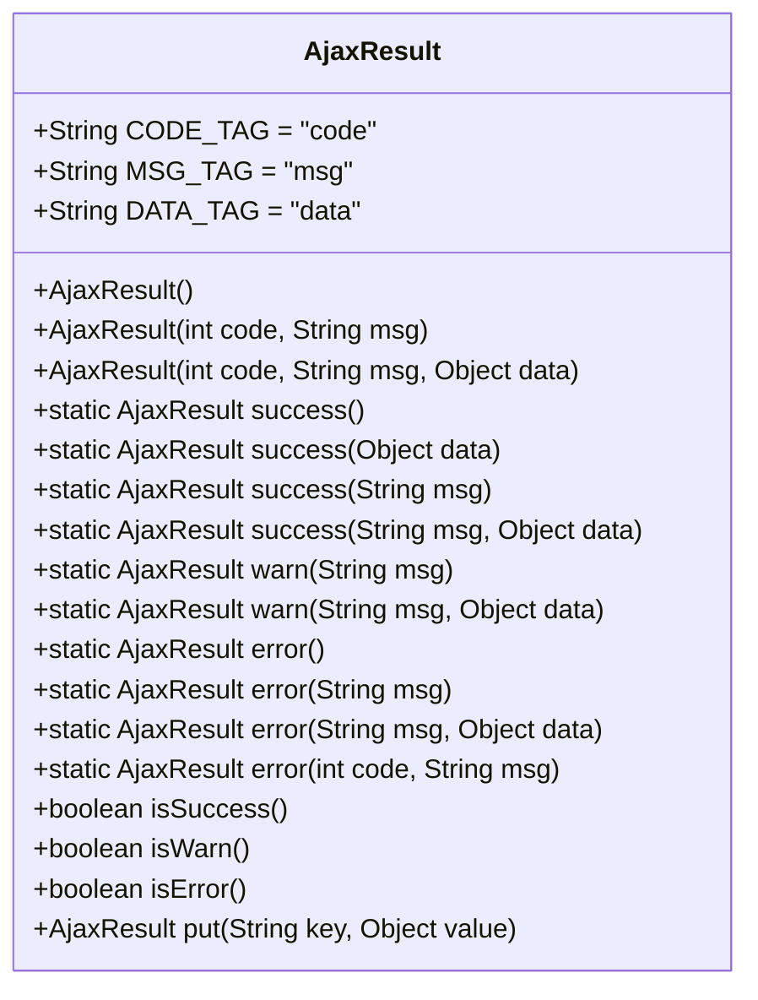
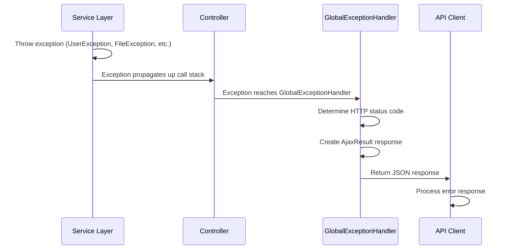

# Error Codes

<cite>
**Referenced Files in This Document**   
- [BaseException.java](file://src/main/java/com/ruoyi/common/exception/base/BaseException.java)
- [ServiceException.java](file://src/main/java/com/ruoyi/common/exception/ServiceException.java)
- [UserException.java](file://src/main/java/com/ruoyi/common/exception/user/UserException.java)
- [UserNotExistsException.java](file://src/main/java/com/ruoyi/common/exception/user/UserNotExistsException.java)
- [UserPasswordNotMatchException.java](file://src/main/java/com/ruoyi/common/exception/user/UserPasswordNotMatchException.java)
- [UserPasswordRetryLimitExceedException.java](file://src/main/java/com/ruoyi/common/exception/user/UserPasswordRetryLimitExceedException.java)
- [CaptchaException.java](file://src/main/java/com/ruoyi/common/exception/user/CaptchaException.java)
- [CaptchaExpireException.java](file://src/main/java/com/ruoyi/common/exception/user/CaptchaExpireException.java)
- [BlackListException.java](file://src/main/java/com/ruoyi/common/exception/user/BlackListException.java)
- [FileException.java](file://src/main/java/com/ruoyi/common/exception/file/FileException.java)
- [FileNameLengthLimitExceededException.java](file://src/main/java/com/ruoyi/common/exception/file/FileNameLengthLimitExceededException.java)
- [FileSizeLimitExceededException.java](file://src/main/java/com/ruoyi/common/exception/file/FileSizeLimitExceededException.java)
- [InvalidExtensionException.java](file://src/main/java/com/ruoyi/common/exception/file/InvalidExtensionException.java)
- [TaskException.java](file://src/main/java/com/ruoyi/common/exception/job/TaskException.java)
- [HttpStatus.java](file://src/main/java/com/ruoyi/common/constant/HttpStatus.java)
- [AjaxResult.java](file://src/main/java/com/ruoyi/framework/web/domain/AjaxResult.java)
- [GlobalExceptionHandler.java](file://src/main/java/com/ruoyi/framework/web/exception/GlobalExceptionHandler.java)
</cite>

## Table of Contents
1. [Introduction](#introduction)
2. [Exception Hierarchy Overview](#exception-hierarchy-overview)
3. [Base Exception Class](#base-exception-class)
4. [ServiceException](#serviceexception)
5. [User-Related Exceptions](#user-related-exceptions)
6. [File-Related Exceptions](#file-related-exceptions)
7. [TaskException](#taskexception)
8. [HTTP Status Code Mappings](#http-status-code-mappings)
9. [Error Response Serialization](#error-response-serialization)
10. [Exception Handling Flow](#exception-handling-flow)
11. [Error Code Reference](#error-code-reference)
12. [Usage Examples](#usage-examples)
13. [Conclusion](#conclusion)

## Introduction

This document provides comprehensive documentation for the exception hierarchy in the RuoYi-Vue framework. It details the structure, behavior, and usage patterns of all exception types that extend the BaseException class, including ServiceException, user-related exceptions, file-related exceptions, and TaskException. The documentation covers error code semantics, HTTP status mappings via HttpStatus.java, and how exceptions are serialized into AjaxResult responses. It also includes a complete reference table of error codes with messages and recommended actions for developers and end users.

## Exception Hierarchy Overview

The RuoYi-Vue exception system is organized in a hierarchical structure with BaseException as the foundation for domain-specific exceptions. The framework uses a combination of checked and unchecked exceptions to handle various error conditions across different functional areas including user authentication, file operations, and scheduled tasks.



**Diagram sources**
- [BaseException.java](file://src/main/java/com/ruoyi/common/exception/base/BaseException.java)
- [ServiceException.java](file://src/main/java/com/ruoyi/common/exception/ServiceException.java)
- [UserException.java](file://src/main/java/com/ruoyi/common/exception/user/UserException.java)
- [FileException.java](file://src/main/java/com/ruoyi/common/exception/file/FileException.java)
- [TaskException.java](file://src/main/java/com/ruoyi/common/exception/job/TaskException.java)

**Section sources**
- [BaseException.java](file://src/main/java/com/ruoyi/common/exception/base/BaseException.java#L1-L98)
- [ServiceException.java](file://src/main/java/com/ruoyi/common/exception/ServiceException.java#L1-L74)

## Base Exception Class

The BaseException class serves as the foundation for all domain-specific exceptions in the RuoYi-Vue framework. It extends RuntimeException and provides a structured approach to error handling with support for internationalization through message codes and parameters.

BaseException contains four key properties:
- **module**: Identifies the functional module where the exception occurred
- **code**: A unique error code used for message lookup
- **args**: Parameters used to format the error message
- **defaultMessage**: Fallback message when code-based lookup fails

The exception resolution process first attempts to retrieve a message using the code and args through MessageUtils.message(), falling back to the defaultMessage if unavailable.

**Section sources**
- [BaseException.java](file://src/main/java/com/ruoyi/common/exception/base/BaseException.java#L1-L98)

## ServiceException

ServiceException is a final class that extends RuntimeException and is used for business logic exceptions. Unlike BaseException, it uses integer error codes rather than string codes, making it suitable for API responses that require numeric status indicators.

Key features of ServiceException:
- Uses integer codes aligned with HTTP status semantics
- Supports detailed error messages for debugging
- Provides fluent interface methods (setMessage, setDetailMessage)
- Designed for direct serialization in API responses

ServiceException is typically used for validation errors, business rule violations, and other application-level errors that should be communicated directly to the client.

**Section sources**
- [ServiceException.java](file://src/main/java/com/ruoyi/common/exception/ServiceException.java#L1-L74)

## User-Related Exceptions

User-related exceptions are specialized exceptions that extend UserException, which in turn extends BaseException. These exceptions handle various authentication and user management scenarios.



**Diagram sources**
- [UserException.java](file://src/main/java/com/ruoyi/common/exception/user/UserException.java#L1-L19)
- [UserNotExistsException.java](file://src/main/java/com/ruoyi/common/exception/user/UserNotExistsException.java#L1-L17)
- [UserPasswordNotMatchException.java](file://src/main/java/com/ruoyi/common/exception/user/UserPasswordNotMatchException.java#L1-L17)
- [UserPasswordRetryLimitExceedException.java](file://src/main/java/com/ruoyi/common/exception/user/UserPasswordRetryLimitExceedException.java#L1-L17)
- [CaptchaException.java](file://src/main/java/com/ruoyi/common/exception/user/CaptchaException.java#L1-L17)
- [CaptchaExpireException.java](file://src/main/java/com/ruoyi/common/exception/user/CaptchaExpireException.java#L1-L17)
- [BlackListException.java](file://src/main/java/com/ruoyi/common/exception/user/BlackListException.java#L1-L17)

**Section sources**
- [UserException.java](file://src/main/java/com/ruoyi/common/exception/user/UserException.java#L1-L19)
- [UserNotExistsException.java](file://src/main/java/com/ruoyi/common/exception/user/UserNotExistsException.java#L1-L17)
- [UserPasswordNotMatchException.java](file://src/main/java/com/ruoyi/common/exception/user/UserPasswordNotMatchException.java#L1-L17)
- [UserPasswordRetryLimitExceedException.java](file://src/main/java/com/ruoyi/common/exception/user/UserPasswordRetryLimitExceedException.java#L1-L17)
- [CaptchaException.java](file://src/main/java/com/ruoyi/common/exception/user/CaptchaException.java#L1-L17)
- [CaptchaExpireException.java](file://src/main/java/com/ruoyi/common/exception/user/CaptchaExpireException.java#L1-L17)
- [BlackListException.java](file://src/main/java/com/ruoyi/common/exception/user/BlackListException.java#L1-L17)

### UserNotExistsException

Thrown when a requested user account cannot be found in the system. This exception is typically triggered during login attempts with non-existent usernames.

**Triggering conditions:**
- Login attempt with non-existent username
- User lookup by ID that doesn't exist
- Profile access for deleted users

### UserPasswordNotMatchException

Thrown when the provided password does not match the stored password for a user account.

**Triggering conditions:**
- Incorrect password during login
- Password validation failure in security checks
- Authentication token validation failure

### UserPasswordRetryLimitExceedException

Thrown when a user exceeds the maximum allowed number of failed login attempts within a specified time period.

**Triggering conditions:**
- Exceeding configured retry limit for password attempts
- Brute force attack detection
- Account temporary lockout due to repeated failures

**Parameters:**
- retryLimitCount: Maximum allowed retry attempts
- lockTime: Duration of account lockout in minutes

### CaptchaException

Thrown when the provided CAPTCHA code does not match the expected value.

**Triggering conditions:**
- Incorrect CAPTCHA input during login
- Mismatched verification code in registration
- Failed CAPTCHA validation in form submissions

### CaptchaExpireException

Thrown when a CAPTCHA code has expired and can no longer be used for validation.

**Triggering conditions:**
- Using a CAPTCHA code after its time-to-live has expired
- Delayed form submission with CAPTCHA
- Session timeout affecting CAPTCHA validity

### BlackListException

Thrown when an IP address or user agent is blocked due to security policies.

**Triggering conditions:**
- Access from blacklisted IP addresses
- Suspicious activity detection
- Security policy violations
- Malicious request patterns

## File-Related Exceptions

File-related exceptions handle various file operation errors and are organized under the FileException hierarchy.



**Diagram sources**
- [FileException.java](file://src/main/java/com/ruoyi/common/exception/file/FileException.java#L1-L20)
- [FileNameLengthLimitExceededException.java](file://src/main/java/com/ruoyi/common/exception/file/FileNameLengthLimitExceededException.java#L1-L17)
- [FileSizeLimitExceededException.java](file://src/main/java/com/ruoyi/common/exception/file/FileSizeLimitExceededException.java#L1-L17)
- [InvalidExtensionException.java](file://src/main/java/com/ruoyi/common/exception/file/InvalidExtensionException.java#L1-L81)
- [FileUploadException.java](file://src/main/java/com/ruoyi/common/exception/file/FileUploadException.java#L1-L62)

**Section sources**
- [FileException.java](file://src/main/java/com/ruoyi/common/exception/file/FileException.java#L1-L20)
- [FileNameLengthLimitExceededException.java](file://src/main/java/com/ruoyi/common/exception/file/FileNameLengthLimitExceededException.java#L1-L17)
- [FileSizeLimitExceededException.java](file://src/main/java/com/ruoyi/common/exception/file/FileSizeLimitExceededException.java#L1-L17)
- [InvalidExtensionException.java](file://src/main/java/com/ruoyi/common/exception/file/InvalidExtensionException.java#L1-L81)
- [FileUploadException.java](file://src/main/java/com/ruoyi/common/exception/file/FileUploadException.java#L1-L62)

### FileNameLengthLimitExceededException

Thrown when a file name exceeds the maximum allowed length.

**Triggering conditions:**
- Uploading files with names longer than system limit
- Creating documents with excessively long names
- File operations with long path names

**Parameters:**
- defaultFileNameLength: Maximum allowed file name length

### FileSizeLimitExceededException

Thrown when a file exceeds the maximum allowed size for upload or processing.

**Triggering conditions:**
- Uploading files larger than configured limits
- Processing oversized documents
- Attachment size violations

**Parameters:**
- defaultMaxSize: Maximum allowed file size in bytes

### InvalidExtensionException

Thrown when a file has an extension that is not allowed by the system's security policy.

**Triggering conditions:**
- Uploading files with disallowed extensions
- Security validation of file types
- MIME type verification failures

**Properties:**
- allowedExtension: Array of permitted file extensions
- extension: The actual file extension that was rejected
- filename: Name of the file that caused the exception

This exception includes nested static classes for specific file type validations:
- InvalidImageExtensionException
- InvalidFlashExtensionException
- InvalidMediaExtensionException
- InvalidVideoExtensionException

## TaskException

TaskException extends BaseException and is used specifically for job scheduling and task execution errors in the Quartz-based job system.

**Module:** "job"

**Common use cases:**
- Task execution failures
- Job configuration errors
- Scheduler initialization problems
- Cron expression validation failures

TaskException follows the same pattern as other BaseException derivatives, using error codes prefixed with "job." for message resolution. It is typically thrown by components in the job execution pipeline and handled by the global exception handler.

**Section sources**
- [TaskException.java](file://src/main/java/com/ruoyi/common/exception/job/TaskException.java)

## HTTP Status Code Mappings

The HttpStatus.java class defines standard HTTP status codes used throughout the RuoYi-Vue framework for API responses.



**Diagram sources**
- [HttpStatus.java](file://src/main/java/com/ruoyi/common/constant/HttpStatus.java#L1-L95)

**Section sources**
- [HttpStatus.java](file://src/main/java/com/ruoyi/common/constant/HttpStatus.java#L1-L95)

The framework maps business exceptions to appropriate HTTP status codes:
- **200 (SUCCESS)**: Successful operations
- **400 (BAD_REQUEST)**: Validation errors, malformed requests
- **401 (UNAUTHORIZED)**: Authentication failures
- **403 (FORBIDDEN)**: Authorization failures, blacklisted access
- **404 (NOT_FOUND)**: Resource not found
- **500 (ERROR)**: System errors, unhandled exceptions
- **601 (WARN)**: Warning messages, non-critical issues

## Error Response Serialization

Exceptions are serialized into a standardized JSON format using the AjaxResult class, which extends HashMap to provide a flexible response structure.



**Diagram sources**
- [AjaxResult.java](file://src/main/java/com/ruoyi/framework/web/domain/AjaxResult.java#L1-L217)

**Section sources**
- [AjaxResult.java](file://src/main/java/com/ruoyi/framework/web/domain/AjaxResult.java#L1-L217)

The AjaxResult class provides:
- **code**: Numeric status code (200, 500, 601, etc.)
- **msg**: Human-readable error message
- **data**: Optional additional data or details
- Static factory methods for common response types
- Fluent interface for building responses

When an exception reaches the GlobalExceptionHandler, it is converted into an AjaxResult with appropriate status code and message.

## Exception Handling Flow

The exception handling process in RuoYi-Vue follows a consistent pattern from exception throwing to client response.



**Diagram sources**
- [GlobalExceptionHandler.java](file://src/main/java/com/ruoyi/framework/web/exception/GlobalExceptionHandler.java)
- [AjaxResult.java](file://src/main/java/com/ruoyi/framework/web/domain/AjaxResult.java)

**Section sources**
- [GlobalExceptionHandler.java](file://src/main/java/com/ruoyi/framework/web/exception/GlobalExceptionHandler.java)
- [AjaxResult.java](file://src/main/java/com/ruoyi/framework/web/domain/AjaxResult.java)

The GlobalExceptionHandler class uses @ControllerAdvice to catch exceptions globally and convert them to standardized responses. It handles various exception types with specific methods:
- handleServiceException: For ServiceException
- handleException: For general exceptions
- Other specialized handlers as needed

## Error Code Reference

The following table provides a comprehensive reference of error codes used in the RuoYi-Vue framework:

| Code | Module | Message Key | HTTP Status | Description | Developer Action | User Action |
|------|--------|-------------|-------------|-------------|------------------|-------------|
| user.not.exists | user | User account does not exist | 400 | User lookup failed | Verify user ID/username | Check username spelling |
| user.password.not.match | user | Password does not match | 401 | Authentication failed | Check password encoding | Reset password if forgotten |
| user.password.retry.limit.exceed | user | Password retry limit exceeded | 401 | Account temporarily locked | Check lockout policy | Wait for lockout period to expire |
| user.jcaptcha.error | user | CAPTCHA code error | 400 | CAPTCHA validation failed | Verify CAPTCHA implementation | Enter correct CAPTCHA code |
| user.jcaptcha.expire | user | CAPTCHA code has expired | 400 | CAPTCHA timeout | Check session timeout settings | Refresh CAPTCHA and try again |
| login.blocked | user | Login blocked | 403 | IP/user agent blacklisted | Review security logs | Contact administrator |
| upload.filename.exceed.length | file | File name exceeds length limit | 400 | File name too long | Check filename.length property | Shorten file name |
| upload.exceed.maxSize | file | File size exceeds maximum limit | 400 | File too large | Check file.size.max property | Upload smaller file |
| job.* | job | Task execution error | 500 | Job scheduling failure | Check job configuration | Contact administrator |

**Section sources**
- [BaseException.java](file://src/main/java/com/ruoyi/common/exception/base/BaseException.java)
- [HttpStatus.java](file://src/main/java/com/ruoyi/common/constant/HttpStatus.java)
- [AjaxResult.java](file://src/main/java/com/ruoyi/framework/web/domain/AjaxResult.java)

## Usage Examples

The following examples demonstrate how exceptions are typically used in the RuoYi-Vue framework:

### Throwing User Exceptions

```java
// In authentication service
if (!userExists) {
    throw new UserNotExistsException();
}

if (!passwordMatches) {
    throw new UserPasswordNotMatchException();
}

if (retryCount >= maxRetries) {
    throw new UserPasswordRetryLimitExceedException(maxRetries, lockMinutes);
}
```

### Throwing File Exceptions

```java
// In file upload service
if (filename.length() > maxLength) {
    throw new FileNameLengthLimitExceededException(maxLength);
}

if (fileSize > maxSize) {
    throw new FileSizeLimitExceededException(maxSize);
}

if (!allowedExtensions.contains(extension)) {
    throw new InvalidExtensionException(allowedExtensions, extension, filename);
}
```

### Throwing Service Exceptions

```java
// In business service
if (businessRuleViolated) {
    throw new ServiceException("Invalid business operation", 400);
}

if (resourceNotFound) {
    throw new ServiceException("Resource not found", 404);
}
```

### Exception Handling in Controllers

```java
// Global exception handler automatically catches and processes
@ExceptionHandler(ServiceException.class)
public AjaxResult handleServiceException(ServiceException e) {
    if (e.getCode() == null) {
        return AjaxResult.error(e.getMessage());
    }
    return AjaxResult.error(e.getCode(), e.getMessage());
}
```

**Section sources**
- [UserNotExistsException.java](file://src/main/java/com/ruoyi/common/exception/user/UserNotExistsException.java)
- [UserPasswordNotMatchException.java](file://src/main/java/com/ruoyi/common/exception/user/UserPasswordNotMatchException.java)
- [UserPasswordRetryLimitExceedException.java](file://src/main/java/com/ruoyi/common/exception/user/UserPasswordRetryLimitExceedException.java)
- [FileNameLengthLimitExceededException.java](file://src/main/java/com/ruoyi/common/exception/file/FileNameLengthLimitExceededException.java)
- [FileSizeLimitExceededException.java](file://src/main/java/com/ruoyi/common/exception/file/FileSizeLimitExceededException.java)
- [InvalidExtensionException.java](file://src/main/java/com/ruoyi/common/exception/file/InvalidExtensionException.java)
- [ServiceException.java](file://src/main/java/com/ruoyi/common/exception/ServiceException.java)
- [GlobalExceptionHandler.java](file://src/main/java/com/ruoyi/framework/web/exception/GlobalExceptionHandler.java)

## Conclusion

The RuoYi-Vue exception hierarchy provides a comprehensive and consistent approach to error handling across the application. By extending BaseException, domain-specific exceptions can leverage standardized error code resolution and internationalization. The integration with HttpStatus and AjaxResult ensures that errors are properly communicated to clients in a predictable format.

Key benefits of this approach include:
- Consistent error handling across modules
- Support for internationalization through message codes
- Clear separation of concerns between exception types
- Standardized API responses
- Comprehensive error tracking and logging
- Improved user experience through meaningful error messages

Developers should use the appropriate exception type for their domain, leverage the error code system for consistency, and ensure that user-facing messages are clear and actionable. The framework's global exception handling ensures that all errors are properly captured and communicated to clients in a standardized format.