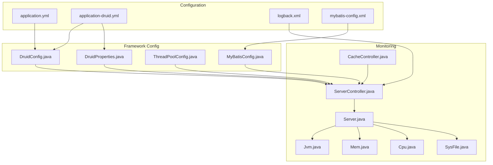
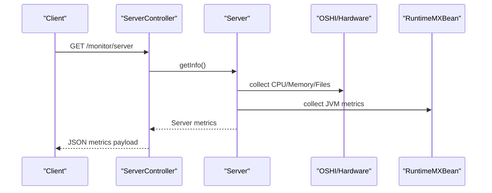
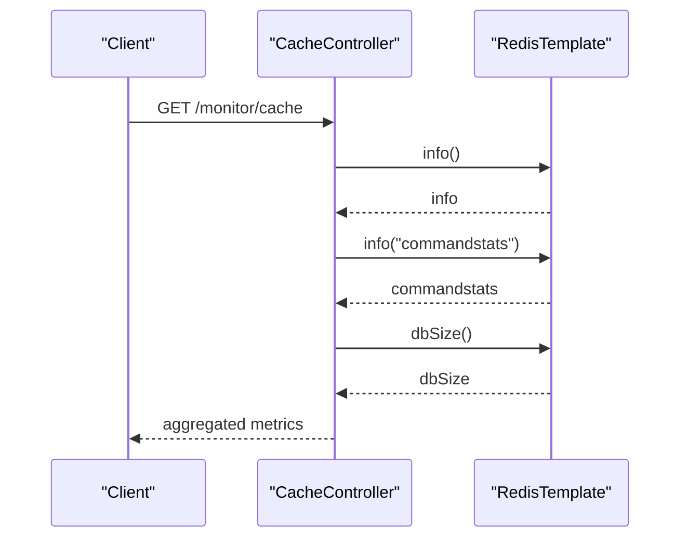
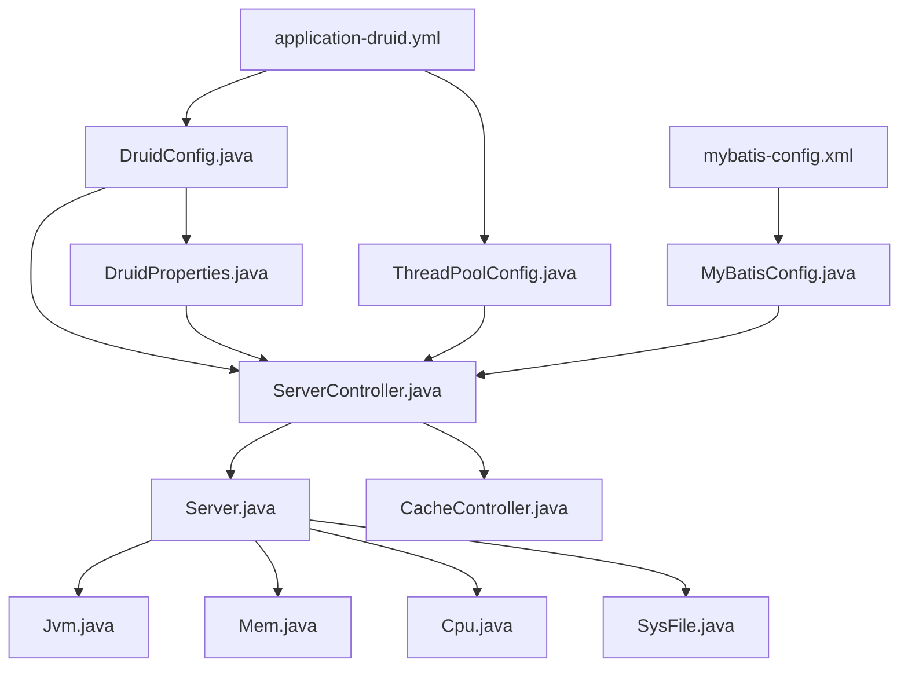

# Performance Tuning

<cite>
**Referenced Files in This Document**
- [application.yml](file://src/main/resources/application.yml)
- [application-druid.yml](file://src/main/resources/application-druid.yml)
- [logback.xml](file://src/main/resources/logback.xml)
- [DruidConfig.java](file://src/main/java/com/ruoyi/framework/config/DruidConfig.java)
- [DruidProperties.java](file://src/main/java/com/ruoyi/framework/config/properties/DruidProperties.java)
- [ThreadPoolConfig.java](file://src/main/java/com/ruoyi/framework/config/ThreadPoolConfig.java)
- [MyBatisConfig.java](file://src/main/java/com/ruoyi/framework/config/MyBatisConfig.java)
- [mybatis-config.xml](file://src/main/resources/mybatis/mybatis-config.xml)
- [ServerController.java](file://src/main/java/com/ruoyi/project/monitor/controller/ServerController.java)
- [CacheController.java](file://src/main/java/com/ruoyi/project/monitor/controller/CacheController.java)
- [Server.java](file://src/main/java/com/ruoyi/framework/web/domain/Server.java)
- [Jvm.java](file://src/main/java/com/ruoyi/framework/web/domain/server/Jvm.java)
- [Mem.java](file://src/main/java/com/ruoyi/framework/web/domain/server/Mem.java)
- [Cpu.java](file://src/main/java/com/ruoyi/framework/web/domain/server/Cpu.java)
- [SysFile.java](file://src/main/java/com/ruoyi/framework/web/domain/server/SysFile.java)
</cite>

## Table of Contents
1. [Introduction](#introduction)
2. [Project Structure](#project-structure)
3. [Core Components](#core-components)
4. [Architecture Overview](#architecture-overview)
5. [Detailed Component Analysis](#detailed-component-analysis)
6. [Dependency Analysis](#dependency-analysis)
7. [Performance Considerations](#performance-considerations)
8. [Troubleshooting Guide](#troubleshooting-guide)
9. [Conclusion](#conclusion)
10. [Appendices](#appendices)

## Introduction
This document provides a comprehensive guide to performance tuning for RuoYi-Vue applications. It focuses on optimizing the Druid connection pool, analyzing slow SQL queries using Druid’s built-in monitoring, tuning JVM settings for Spring Boot applications, minimizing logging I/O overhead, leveraging built-in server and cache monitoring endpoints, and establishing benchmarking practices to identify bottlenecks in service and data access layers.

## Project Structure
RuoYi-Vue organizes performance-critical configurations under resources and framework configuration packages:
- Connection pooling and SQL monitoring are configured via application-druid.yml and DruidConfig/DruidProperties.
- Logging policy is defined in logback.xml.
- Thread pools are configured in ThreadPoolConfig.
- MyBatis settings are centralized in mybatis-config.xml and MyBatisConfig.
- Built-in monitoring endpoints expose server and cache metrics.

**Diagram sources**
- [application.yml](file://src/main/resources/application.yml#L1-L149)
- [application-druid.yml](file://src/main/resources/application-druid.yml#L1-L61)
- [logback.xml](file://src/main/resources/logback.xml#L1-L93)
- [mybatis-config.xml](file://src/main/resources/mybatis/mybatis-config.xml#L1-L21)
- [DruidConfig.java](file://src/main/java/com/ruoyi/framework/config/DruidConfig.java#L1-L127)
- [DruidProperties.java](file://src/main/java/com/ruoyi/framework/config/properties/DruidProperties.java#L1-L90)
- [ThreadPoolConfig.java](file://src/main/java/com/ruoyi/framework/config/ThreadPoolConfig.java#L1-L64)
- [MyBatisConfig.java](file://src/main/java/com/ruoyi/framework/config/MyBatisConfig.java#L1-L132)
- [ServerController.java](file://src/main/java/com/ruoyi/project/monitor/controller/ServerController.java#L1-L28)
- [CacheController.java](file://src/main/java/com/ruoyi/project/monitor/controller/CacheController.java#L1-L122)
- [Server.java](file://src/main/java/com/ruoyi/framework/web/domain/Server.java#L1-L241)
- [Jvm.java](file://src/main/java/com/ruoyi/framework/web/domain/server/Jvm.java#L1-L131)
- [Mem.java](file://src/main/java/com/ruoyi/framework/web/domain/server/Mem.java#L1-L61)
- [Cpu.java](file://src/main/java/com/ruoyi/framework/web/domain/server/Cpu.java#L1-L101)
- [SysFile.java](file://src/main/java/com/ruoyi/framework/web/domain/server/SysFile.java#L1-L115)

**Section sources**
- [application.yml](file://src/main/resources/application.yml#L1-L149)
- [application-druid.yml](file://src/main/resources/application-druid.yml#L1-L61)
- [logback.xml](file://src/main/resources/logback.xml#L1-L93)
- [mybatis-config.xml](file://src/main/resources/mybatis/mybatis-config.xml#L1-L21)

## Core Components
- Druid connection pool: configured via application-druid.yml and applied by DruidConfig and DruidProperties beans.
- Logging: controlled by logback.xml with rolling policies and level filters.
- Thread pools: configured in ThreadPoolConfig for async tasks and scheduled jobs.
- MyBatis: settings in mybatis-config.xml and SqlSessionFactory assembly in MyBatisConfig.
- Monitoring endpoints: ServerController and CacheController expose system and Redis metrics.

**Section sources**
- [DruidConfig.java](file://src/main/java/com/ruoyi/framework/config/DruidConfig.java#L1-L127)
- [DruidProperties.java](file://src/main/java/com/ruoyi/framework/config/properties/DruidProperties.java#L1-L90)
- [ThreadPoolConfig.java](file://src/main/java/com/ruoyi/framework/config/ThreadPoolConfig.java#L1-L64)
- [MyBatisConfig.java](file://src/main/java/com/ruoyi/framework/config/MyBatisConfig.java#L1-L132)
- [mybatis-config.xml](file://src/main/resources/mybatis/mybatis-config.xml#L1-L21)
- [ServerController.java](file://src/main/java/com/ruoyi/project/monitor/controller/ServerController.java#L1-L28)
- [CacheController.java](file://src/main/java/com/ruoyi/project/monitor/controller/CacheController.java#L1-L122)

## Architecture Overview
The performance tuning architecture integrates configuration-driven components with runtime monitoring:

**Diagram sources**
- [ServerController.java](file://src/main/java/com/ruoyi/project/monitor/controller/ServerController.java#L1-L28)
- [Server.java](file://src/main/java/com/ruoyi/framework/web/domain/Server.java#L1-L241)
- [Jvm.java](file://src/main/java/com/ruoyi/framework/web/domain/server/Jvm.java#L1-L131)
- [Mem.java](file://src/main/java/com/ruoyi/framework/web/domain/server/Mem.java#L1-L61)
- [Cpu.java](file://src/main/java/com/ruoyi/framework/web/domain/server/Cpu.java#L1-L101)
- [SysFile.java](file://src/main/java/com/ruoyi/framework/web/domain/server/SysFile.java#L1-L115)

## Detailed Component Analysis

### Druid Connection Pool Tuning
- Initial pool sizing: initialSize and minIdle define warm-up and minimum idle connections.
- Concurrency limits: maxActive controls peak concurrency; maxWait bounds queueing latency.
- Network timeouts: connectTimeout and socketTimeout bound connection establishment and query execution.
- Eviction and validation: timeBetweenEvictionRunsMillis, minEvictableIdleTimeMillis, maxEvictableIdleTimeMillis tune idle cleanup; validationQuery and testWhileIdle/testOnBorrow/testOnReturn ensure liveness checks.
- Monitoring: statViewServlet enables the Druid console; stat filter logs slow SQL with configurable thresholds.

Recommended tuning steps:
- Align initialSize and minIdle with concurrent baseline traffic plus safety margin.
- Set maxActive to accommodate bursty load while preventing resource exhaustion.
- Configure maxWait to fail fast under overload rather than queuing indefinitely.
- Enable testWhileIdle and set a reasonable validationQuery to detect stale connections.
- Use statViewServlet and stat filter to capture slow SQL and adjust thresholds accordingly.

**Section sources**
- [application-druid.yml](file://src/main/resources/application-druid.yml#L1-L61)
- [DruidConfig.java](file://src/main/java/com/ruoyi/framework/config/DruidConfig.java#L1-L127)
- [DruidProperties.java](file://src/main/java/com/ruoyi/framework/config/properties/DruidProperties.java#L1-L90)

### Analyzing Slow SQL with Druid
- Enable statViewServlet and configure credentials for secure access.
- Enable stat filter with log-slow-sql and slow-sql-millis to record slow queries.
- Review the Druid console for SQL trends, connection usage, and slow query reports.
- Use merge-sql to aggregate repeated SQL variants for easier analysis.

Operational guidance:
- Start with conservative slow-sql-millis and gradually lower to capture meaningful outliers.
- Monitor the console periodically and correlate with application load spikes.
- Use the recorded slow SQL to optimize indexes, rewrite queries, or adjust batching.

**Section sources**
- [application-druid.yml](file://src/main/resources/application-druid.yml#L1-L61)
- [DruidConfig.java](file://src/main/java/com/ruoyi/framework/config/DruidConfig.java#L1-L127)

### JVM Tuning for Spring Boot Applications
- Heap sizing: set JVM heap via application-druid.yml and system properties to match workload characteristics.
- GC selection: choose appropriate collectors (G1GC or ZGC) and tune GC ergonomics for throughput or latency goals.
- Metaspace sizing: ensure adequate metaspace to prevent classloader leaks.
- Containerized environments: align JVM max memory with container limits to avoid OOMKilled.

Practical tips:
- Use JFR or GC logs to observe pause times and allocation rates.
- Profile hotspots with async-profiler or Java Flight Recorder during load tests.
- Monitor GC metrics via built-in endpoints and external dashboards.

[No sources needed since this section provides general guidance]

### Logging Performance Impacts and Logback Configuration
- Rolling policies: TimeBasedRollingPolicy rotates logs by date with retention windows to cap disk usage.
- Level filtering: LevelFilter restricts INFO and ERROR streams to reduce I/O overhead.
- Appenders: Separate appenders for different log categories to avoid cross-channel contention.
- Pattern layout: Keep patterns concise to minimize formatting overhead.

Best practices:
- Prefer asynchronous appenders for high-throughput scenarios.
- Reduce stacktrace verbosity in production; enable only for critical errors.
- Use structured logging (JSON) for downstream log processors.

**Section sources**
- [logback.xml](file://src/main/resources/logback.xml#L1-L93)

### Monitoring Strategies Using Built-in Endpoints
- Server metrics endpoint: GET /monitor/server returns CPU, memory, JVM, and filesystem metrics.
- Cache metrics endpoint: GET /monitor/cache exposes Redis info, command stats, and DB size; keys and values can be inspected and cleared selectively.

Operational guidance:
- Integrate endpoints into monitoring dashboards (Prometheus, Grafana).
- Set alert thresholds for CPU utilization, memory usage, and GC pauses.
- Use cache endpoints to detect hot keys, eviction patterns, and command hotspots.

**Diagram sources**
- [CacheController.java](file://src/main/java/com/ruoyi/project/monitor/controller/CacheController.java#L1-L122)

**Section sources**
- [ServerController.java](file://src/main/java/com/ruoyi/project/monitor/controller/ServerController.java#L1-L28)
- [CacheController.java](file://src/main/java/com/ruoyi/project/monitor/controller/CacheController.java#L1-L122)
- [Server.java](file://src/main/java/com/ruoyi/framework/web/domain/Server.java#L1-L241)

### Benchmarking Tips and Bottleneck Identification
- Service layer: instrument key controllers and services with timers; track p95/p99 latencies and error rates.
- Data access layer: correlate slow SQL from Druid with DAO/service timings; identify N+1 selects and missing indexes.
- Asynchronous tasks: measure thread pool queue depth and rejection rates; adjust core/max pool sizes and queue capacity.
- MyBatis: leverage SLF4J logging and slow SQL reporting to pinpoint inefficient queries.

Benchmarking checklist:
- Define SLOs for response time and throughput.
- Run load tests with realistic data volumes and concurrent users.
- Capture metrics from Druid, server endpoints, and cache endpoints.
- Iterate tuning based on observed bottlenecks.

[No sources needed since this section provides general guidance]

## Dependency Analysis
The following diagram shows key dependencies among performance-critical components:

**Diagram sources**
- [application-druid.yml](file://src/main/resources/application-druid.yml#L1-L61)
- [DruidConfig.java](file://src/main/java/com/ruoyi/framework/config/DruidConfig.java#L1-L127)
- [DruidProperties.java](file://src/main/java/com/ruoyi/framework/config/properties/DruidProperties.java#L1-L90)
- [ThreadPoolConfig.java](file://src/main/java/com/ruoyi/framework/config/ThreadPoolConfig.java#L1-L64)
- [mybatis-config.xml](file://src/main/resources/mybatis/mybatis-config.xml#L1-L21)
- [MyBatisConfig.java](file://src/main/java/com/ruoyi/framework/config/MyBatisConfig.java#L1-L132)
- [ServerController.java](file://src/main/java/com/ruoyi/project/monitor/controller/ServerController.java#L1-L28)
- [Server.java](file://src/main/java/com/ruoyi/framework/web/domain/Server.java#L1-L241)
- [Jvm.java](file://src/main/java/com/ruoyi/framework/web/domain/server/Jvm.java#L1-L131)
- [Mem.java](file://src/main/java/com/ruoyi/framework/web/domain/server/Mem.java#L1-L61)
- [Cpu.java](file://src/main/java/com/ruoyi/framework/web/domain/server/Cpu.java#L1-L101)
- [SysFile.java](file://src/main/java/com/ruoyi/framework/web/domain/server/SysFile.java#L1-L115)
- [CacheController.java](file://src/main/java/com/ruoyi/project/monitor/controller/CacheController.java#L1-L122)

**Section sources**
- [DruidConfig.java](file://src/main/java/com/ruoyi/framework/config/DruidConfig.java#L1-L127)
- [ThreadPoolConfig.java](file://src/main/java/com/ruoyi/framework/config/ThreadPoolConfig.java#L1-L64)
- [MyBatisConfig.java](file://src/main/java/com/ruoyi/framework/config/MyBatisConfig.java#L1-L132)
- [ServerController.java](file://src/main/java/com/ruoyi/project/monitor/controller/ServerController.java#L1-L28)
- [CacheController.java](file://src/main/java/com/ruoyi/project/monitor/controller/CacheController.java#L1-L122)

## Performance Considerations
- Connection pool sizing: balance initialSize/minIdle against maxActive to avoid starvation or resource contention.
- Timeout tuning: connectTimeout and socketTimeout should reflect network conditions and acceptable latency budgets.
- Validation overhead: prefer testWhileIdle over testOnBorrow/testOnReturn to minimize per-operation validation costs.
- Logging I/O: use rolling policies and level filters to reduce disk writes; avoid excessive stacktraces in production.
- Thread pool saturation: monitor queue depths and rejections; scale core/max sizes and adjust keep-alive seconds.
- MyBatis logging: enable SLF4J logging judiciously; rely on Druid slow SQL for heavy diagnostics.

[No sources needed since this section provides general guidance]

## Troubleshooting Guide
- Slow SQL identified via Druid console: review query plans, add indexes, or refactor queries; adjust slow-sql-millis threshold.
- High GC pauses: inspect GC logs and collector settings; increase heap or switch collectors; reduce object churn.
- Disk I/O spikes: evaluate logback rolling policies and filters; consider asynchronous appenders.
- Cache pressure: use cache endpoints to inspect command stats and DB size; clear targeted keys or adjust TTLs.
- Server endpoint anomalies: verify permissions and roles for /monitor/server; confirm system metrics collection.

**Section sources**
- [application-druid.yml](file://src/main/resources/application-druid.yml#L1-L61)
- [logback.xml](file://src/main/resources/logback.xml#L1-L93)
- [CacheController.java](file://src/main/java/com/ruoyi/project/monitor/controller/CacheController.java#L1-L122)
- [ServerController.java](file://src/main/java/com/ruoyi/project/monitor/controller/ServerController.java#L1-L28)

## Conclusion
Effective performance tuning in RuoYi-Vue hinges on disciplined configuration of the Druid connection pool, careful logging policy design, thoughtful JVM tuning, and robust monitoring via built-in endpoints. By correlating Druid slow SQL, server metrics, and cache insights, teams can iteratively identify and resolve bottlenecks in service and data access layers.

[No sources needed since this section summarizes without analyzing specific files]

## Appendices
- Druid console URL pattern and credentials are configured in application-druid.yml.
- Server endpoint path is /monitor/server; cache endpoint path is /monitor/cache.

**Section sources**
- [application-druid.yml](file://src/main/resources/application-druid.yml#L1-L61)
- [ServerController.java](file://src/main/java/com/ruoyi/project/monitor/controller/ServerController.java#L1-L28)
- [CacheController.java](file://src/main/java/com/ruoyi/project/monitor/controller/CacheController.java#L1-L122)