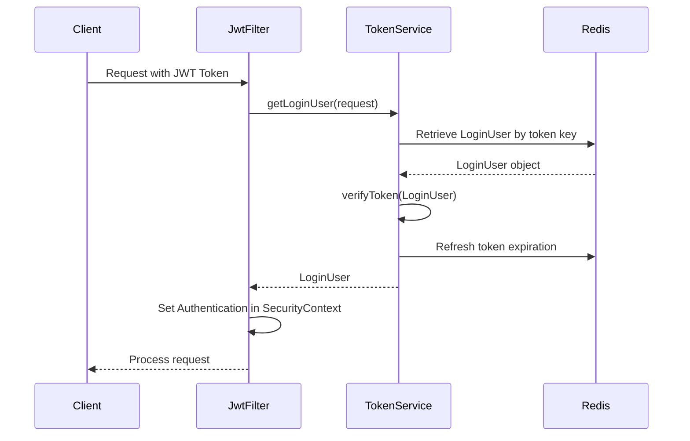
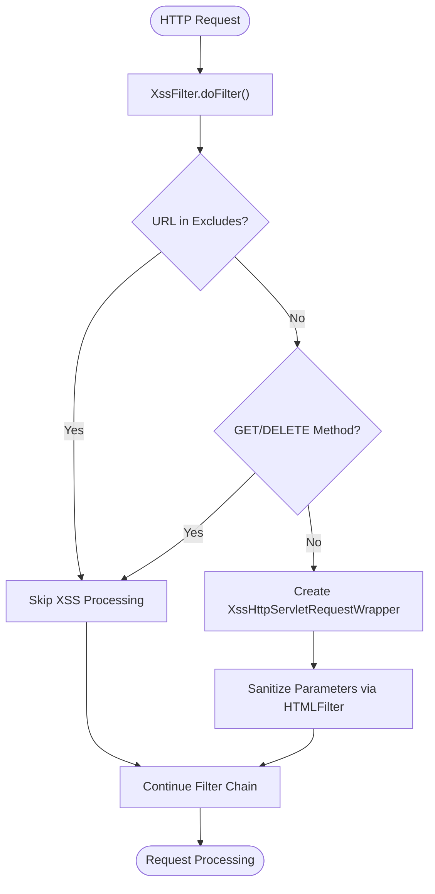
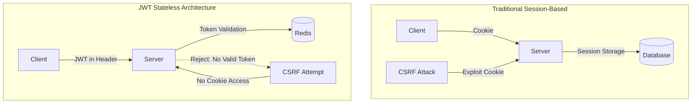
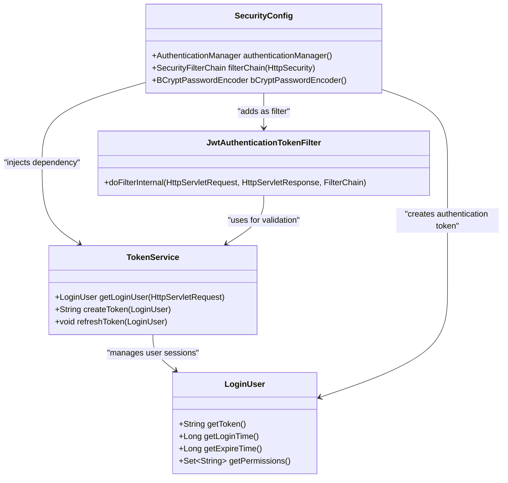
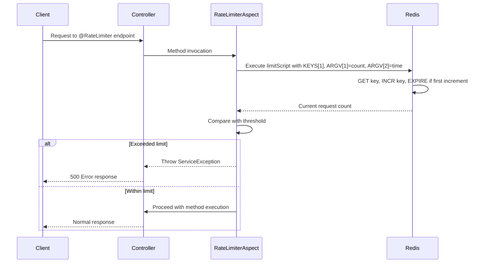
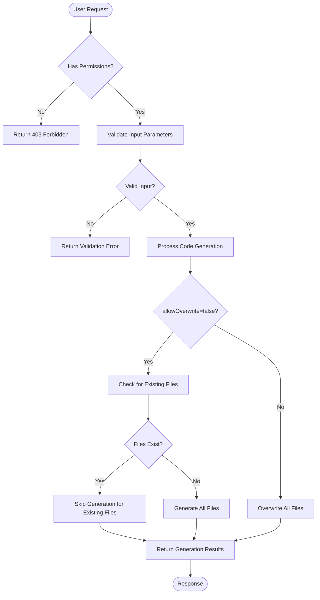
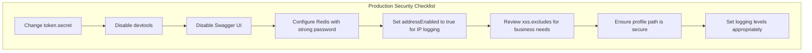

# Security Best Practices

<cite>
**Referenced Files in This Document**   
- [TokenService.java](file://src/main/java/com/ruoyi/framework/security/service/TokenService.java)
- [JwtAuthenticationTokenFilter.java](file://src/main/java/com/ruoyi/framework/security/filter/JwtAuthenticationTokenFilter.java)
- [SecurityConfig.java](file://src/main/java/com/ruoyi/framework/config/SecurityConfig.java)
- [XssFilter.java](file://src/main/java/com/ruoyi/common/filter/XssFilter.java)
- [Xss.java](file://src/main/java/com/ruoyi/common/xss/Xss.java)
- [HTMLFilter.java](file://src/main/java/com/ruoyi/common/utils/html/HTMLFilter.java)
- [RateLimiter.java](file://src/main/java/com/ruoyi/framework/aspectj/lang/annotation/RateLimiter.java)
- [RateLimiterAspect.java](file://src/main/java/com/ruoyi/framework/aspectj/RateLimiterAspect.java)
- [RedisConfig.java](file://src/main/java/com/ruoyi/framework/config/RedisConfig.java)
- [LoginUser.java](file://src/main/java/com/ruoyi/framework/security/LoginUser.java)
- [PermitAllUrlProperties.java](file://src/main/java/com/ruoyi/framework/config/properties/PermitAllUrlProperties.java)
- [AuthenticationEntryPointImpl.java](file://src/main/java/com/ruoyi/framework/security/handle/AuthenticationEntryPointImpl.java)
- [LogoutSuccessHandlerImpl.java](file://src/main/java/com/ruoyi/framework/security/handle/LogoutSuccessHandlerImpl.java)
- [Anonymous.java](file://src/main/java/com/ruoyi/framework/aspectj/lang/annotation/Anonymous.java)
- [application.yml](file://src/main/resources/application.yml)
</cite>

## Table of Contents
1. [Introduction](#introduction)
2. [Secure JWT Token Management](#secure-jwt-token-management)
3. [XSS Protection Implementation](#xss-protection-implementation)
4. [CSRF Considerations in JWT-Based Architecture](#csrf-considerations-in-jwt-based-architecture)
5. [Spring Security Configuration](#spring-security-configuration)
6. [Rate Limiting for Brute Force Protection](#rate-limiting-for-brute-force-protection)
7. [Code Generation Module Security](#code-generation-module-security)
8. [Secure Deployment Configurations](#secure-deployment-configurations)
9. [Audit Logging Practices](#audit-logging-practices)
10. [Conclusion](#conclusion)

## Introduction
RuoYi-Vue is a comprehensive enterprise-level backend management system built with Spring Boot and Vue.js. This document outlines the security best practices implemented in the RuoYi-Vue framework, focusing on critical security aspects such as JWT token management, XSS protection, CSRF considerations, Spring Security configuration, rate limiting, and secure deployment practices. The system employs a stateless authentication mechanism using JWT tokens stored in Redis, providing both security and scalability for enterprise applications.

**Section sources**
- [SecurityConfig.java](file://src/main/java/com/ruoyi/framework/config/SecurityConfig.java#L24-L140)
- [TokenService.java](file://src/main/java/com/ruoyi/framework/security/service/TokenService.java#L26-L233)

## Secure JWT Token Management
The RuoYi-Vue framework implements a robust JWT token management system that combines JSON Web Tokens with Redis storage for enhanced security and performance. The TokenService component handles token creation, validation, and refresh operations, ensuring secure user authentication across sessions.

The system generates a unique token using UUID for each user session, storing the complete user authentication details in Redis with a configurable expiration time (default 30 minutes). The token is included in the Authorization header of HTTP requests, prefixed with "Bearer". When a token is presented, the system parses the JWT to extract the user identifier and retrieves the corresponding LoginUser object from Redis cache.

**Diagram sources**
- [TokenService.java](file://src/main/java/com/ruoyi/framework/security/service/TokenService.java#L62-L83)
- [JwtAuthenticationTokenFilter.java](file://src/main/java/com/ruoyi/framework/security/filter/JwtAuthenticationTokenFilter.java#L34-L42)

The token refresh mechanism automatically extends the user session when the remaining validity period falls below 20 minutes. This approach provides a seamless user experience while maintaining security by periodically updating the token's expiration time in Redis. Upon logout, the system removes the user's token from Redis, immediately invalidating the session.

**Section sources**
- [TokenService.java](file://src/main/java/com/ruoyi/framework/security/service/TokenService.java#L114-L155)
- [LoginUser.java](file://src/main/java/com/ruoyi/framework/security/LoginUser.java#L1-L267)

## XSS Protection Implementation
RuoYi-Vue implements a multi-layered XSS protection strategy combining filter-based sanitization and annotation-driven validation. The system uses both a servlet filter (XssFilter) and a JSR-303 validation annotation (Xss) to prevent cross-site scripting attacks.

The XssFilter operates as a pre-processing filter that wraps incoming HTTP requests with XssHttpServletRequestWrapper, which sanitizes request parameters, headers, and body content. The filter is configured to exclude specific URLs (such as /system/notice) and HTTP methods (GET and DELETE) from processing, optimizing performance while maintaining security coverage.

**Diagram sources**
- [XssFilter.java](file://src/main/java/com/ruoyi/common/filter/XssFilter.java#L44-L55)
- [HTMLFilter.java](file://src/main/java/com/ruoyi/common/utils/html/HTMLFilter.java#L198-L213)

The framework also provides the @Xss annotation for field-level validation, which can be applied to entity properties to ensure data integrity at the model level. The HTMLFilter class implements a comprehensive set of regular expressions to identify and neutralize potential XSS vectors, allowing only a whitelist of safe HTML elements (a, img, b, strong, i, em) with specific attributes.

**Section sources**
- [XssFilter.java](file://src/main/java/com/ruoyi/common/filter/XssFilter.java#L22-L75)
- [Xss.java](file://src/main/java/com/ruoyi/common/xss/Xss.java#L15-L28)
- [HTMLFilter.java](file://src/main/java/com/ruoyi/common/utils/html/HTMLFilter.java#L18-L570)

## CSRF Considerations in JWT-Based Architecture
In the JWT-based stateless architecture of RuoYi-Vue, CSRF protection is inherently addressed through the use of bearer tokens rather than session cookies. The SecurityConfig class explicitly disables CSRF protection (csrf().disable()) since the application does not maintain server-side sessions, eliminating the primary attack vector for CSRF exploits.

The stateless nature of JWT authentication means that each request contains its own authentication token in the Authorization header, making it impossible for an attacker to exploit the browser's automatic cookie submission behavior. This architectural decision follows security best practices for modern API-driven applications, where traditional CSRF tokens are unnecessary when using alternative authentication mechanisms.

**Diagram sources**
- [SecurityConfig.java](file://src/main/java/com/ruoyi/framework/config/SecurityConfig.java#L101-L102)
- [TokenService.java](file://src/main/java/com/ruoyi/framework/security/service/TokenService.java#L114-L125)

The system further enhances security by storing JWT tokens in memory or secure storage on the client side, rather than in browser cookies, preventing potential XSS-to-CSRF attack chains. This approach aligns with OWASP recommendations for stateless authentication in single-page applications.

**Section sources**
- [SecurityConfig.java](file://src/main/java/com/ruoyi/framework/config/SecurityConfig.java#L101-L102)
- [TokenService.java](file://src/main/java/com/ruoyi/framework/security/service/TokenService.java#L37-L46)

## Spring Security Configuration
The RuoYi-Vue framework implements comprehensive security controls through Spring Security configuration, establishing a robust authorization framework with role-based access control and endpoint protection. The SecurityConfig class defines a security filter chain that orchestrates authentication, authorization, and exception handling.

The configuration establishes a stateless session management policy (SessionCreationPolicy.STATELESS), ensuring that no server-side session state is maintained. Anonymous access is permitted to specific endpoints including login, registration, and captcha services, while all other requests require authentication. The system implements method-level security using Spring's @EnableMethodSecurity annotation with prePostEnabled and securedEnabled flags.

**Diagram sources**
- [SecurityConfig.java](file://src/main/java/com/ruoyi/framework/config/SecurityConfig.java#L97-L128)
- [LoginUser.java](file://src/main/java/com/ruoyi/framework/security/LoginUser.java#L15-L267)

The security configuration also disables caching of sensitive responses and sets appropriate frame options to prevent clickjacking attacks. The AuthenticationEntryPointImpl handles authentication failures by returning appropriate HTTP 401 responses, while the LogoutSuccessHandlerImpl manages clean session termination by removing the user's token from Redis.

**Section sources**
- [SecurityConfig.java](file://src/main/java/com/ruoyi/framework/config/SecurityConfig.java#L29-L140)
- [AuthenticationEntryPointImpl.java](file://src/main/java/com/ruoyi/framework/security/handle/AuthenticationEntryPointImpl.java#L22-L35)
- [LogoutSuccessHandlerImpl.java](file://src/main/java/com/ruoyi/framework/security/handle/LogoutSuccessHandlerImpl.java#L27-L53)

## Rate Limiting for Brute Force Protection
RuoYi-Vue implements rate limiting to protect against brute force attacks and denial-of-service attempts through the RateLimiterAspect and associated components. The system uses Redis-based sliding window rate limiting with Lua scripting to ensure atomic operations and consistent performance under high load.

The @RateLimiter annotation provides a declarative way to apply rate limits to controller methods, with configurable parameters for time window, request count, and limiting strategy. The RateLimiterAspect intercepts annotated methods and executes a Lua script that atomically increments a counter and sets expiration, returning the current request count for evaluation.

**Diagram sources**
- [RateLimiter.java](file://src/main/java/com/ruoyi/framework/aspectj/lang/annotation/RateLimiter.java#L16-L41)
- [RateLimiterAspect.java](file://src/main/java/com/ruoyi/framework/aspectj/RateLimiterAspect.java#L49-L73)
- [RedisConfig.java](file://src/main/java/com/ruoyi/framework/config/RedisConfig.java#L54-L67)

The rate limiting system supports different limiting strategies through the LimitType enum, including limiting by IP address, method, or default behavior. This flexibility allows administrators to apply appropriate protection levels to different endpoints based on their sensitivity and usage patterns.

**Section sources**
- [RateLimiterAspect.java](file://src/main/java/com/ruoyi/framework/aspectj/RateLimiterAspect.java#L27-L90)
- [RedisConfig.java](file://src/main/java/com/ruoyi/framework/config/RedisConfig.java#L42-L68)

## Code Generation Module Security
The code generation module in RuoYi-Vue includes several security controls to prevent unauthorized code generation and file system manipulation. The GenController and associated components implement access controls to ensure only authorized users can generate code, and the system includes configuration options to prevent overwriting existing files.

The code generation functionality is protected by Spring Security's method-level authorization, requiring appropriate roles and permissions to access the generation endpoints. The system automatically removes table prefixes (configurable via tablePrefix in application.yml) during code generation, but this feature can be disabled to maintain existing naming conventions.

**Diagram sources**
- [GenController.java](file://src/main/java/com/ruoyi/project/tool/gen/controller/GenController.java)
- [application.yml](file://src/main/resources/application.yml#L138-L149)

The system uses Apache Velocity templates for code generation, which are stored in the vm/ directory and processed through the VelocityUtils component. This template-based approach ensures consistent code quality while preventing direct code injection through the generation process.

**Section sources**
- [application.yml](file://src/main/resources/application.yml#L138-L149)
- [GenController.java](file://src/main/java/com/ruoyi/project/tool/gen/controller/GenController.java)

## Secure Deployment Configurations
The RuoYi-Vue framework provides several configuration options to enhance security in production deployments. The application.yml file contains critical security settings that should be reviewed and hardened before deploying to production environments.

Key security configurations include:
- **Token security**: The token.secret should be changed from the default value and stored securely, preferably using environment variables or a secrets management system
- **Redis security**: Redis should be configured with strong authentication and ideally run on a private network segment
- **Debug controls**: Developer tools like devtools.restart.enabled should be disabled in production
- **Swagger UI**: The swagger.enabled flag should be set to false in production to prevent API enumeration
- **XSS filtering**: The XSS filter can be fine-tuned by adjusting the excluded URLs and patterns based on application requirements

The system also supports the @Anonymous annotation, which allows specific endpoints to be excluded from authentication requirements. This annotation is processed by PermitAllUrlProperties, which automatically configures Spring Security to permit access to annotated methods, providing a clean way to expose public APIs while maintaining overall security.

**Diagram sources**
- [application.yml](file://src/main/resources/application.yml)
- [PermitAllUrlProperties.java](file://src/main/java/com/ruoyi/framework/config/properties/PermitAllUrlProperties.java#L27-L74)

Additional deployment considerations include running the application with minimal privileges, implementing proper logging and monitoring, and regularly updating dependencies to address known vulnerabilities.

**Section sources**
- [application.yml](file://src/main/resources/application.yml)
- [PermitAllUrlProperties.java](file://src/main/java/com/ruoyi/framework/config/properties/PermitAllUrlProperties.java#L27-L74)

## Audit Logging Practices
RuoYi-Vue implements comprehensive audit logging through the AsyncManager and AsyncFactory components, which handle asynchronous logging of security-relevant events. The system captures authentication events, including successful and failed logins, as well as logout operations.

The LogoutSuccessHandlerImpl demonstrates the audit logging pattern by recording logout events through AsyncManager.me().execute(AsyncFactory.recordLogininfor()). This asynchronous approach ensures that logging operations do not impact the performance of critical authentication flows while guaranteeing that security events are recorded.

All audit logs include contextual information such as IP address, browser type, operating system, and timestamp, providing valuable forensic data for security investigations. The system uses Redis as a temporary storage for session data, which can be correlated with audit logs to reconstruct user activity patterns.

**Section sources**
- [LogoutSuccessHandlerImpl.java](file://src/main/java/com/ruoyi/framework/security/handle/LogoutSuccessHandlerImpl.java#L48-L49)
- [AsyncManager.java](file://src/main/java/com/ruoyi/framework/manager/AsyncManager.java)
- [AsyncFactory.java](file://src/main/java/com/ruoyi/framework/manager/factory/AsyncFactory.java)

## Conclusion
The RuoYi-Vue framework implements a comprehensive security model that addresses modern web application threats through a combination of JWT-based authentication, XSS protection, rate limiting, and secure configuration practices. The system's architecture prioritizes security without sacrificing usability, providing enterprise-grade protection for backend management applications.

Key security strengths include the stateless JWT authentication with Redis storage, multi-layered XSS defense, and flexible rate limiting capabilities. However, administrators must ensure proper configuration of security parameters in production environments, particularly regarding token secrets, Redis security, and debug endpoint exposure.

By following the security best practices outlined in this document, organizations can deploy RuoYi-Vue with confidence in its ability to protect sensitive data and withstand common web application attacks.