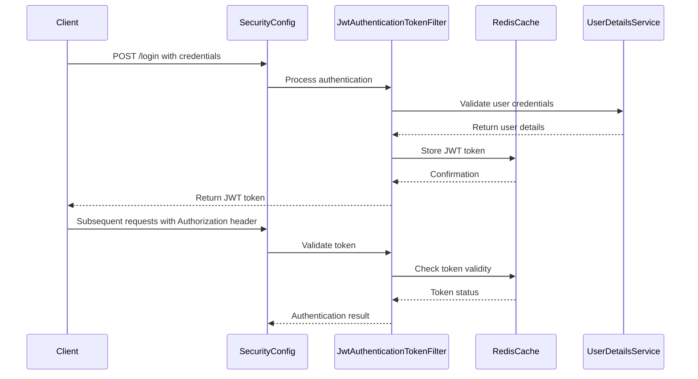
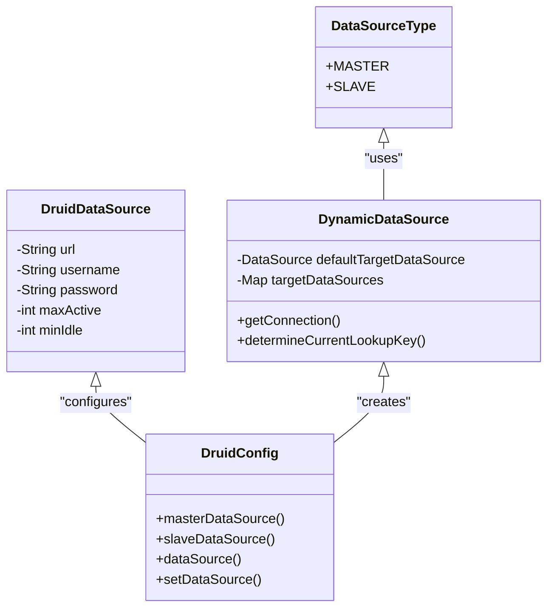
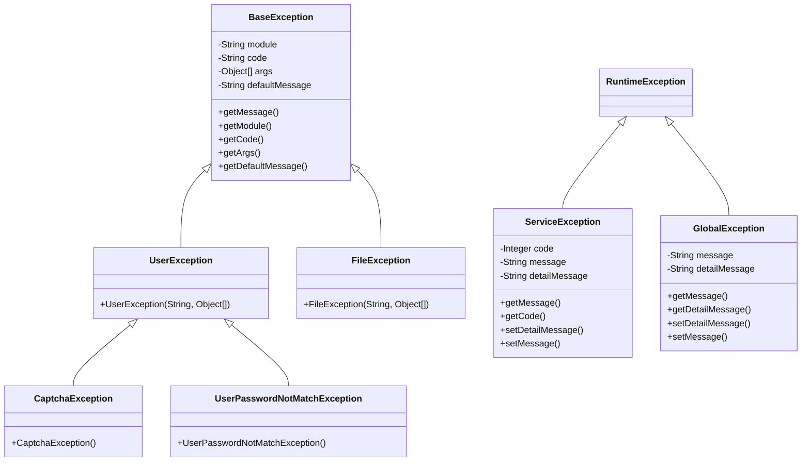
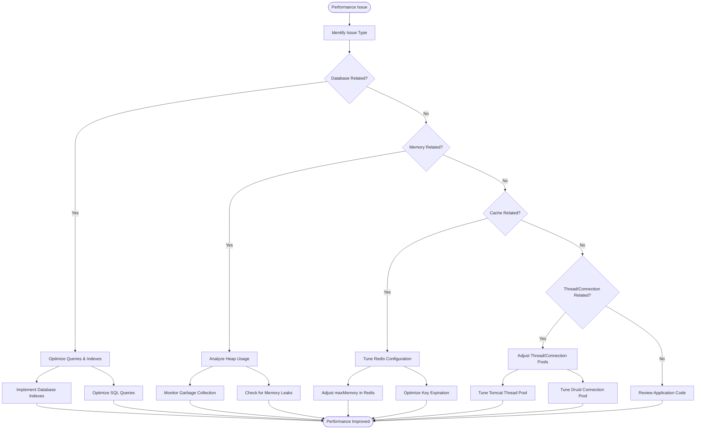
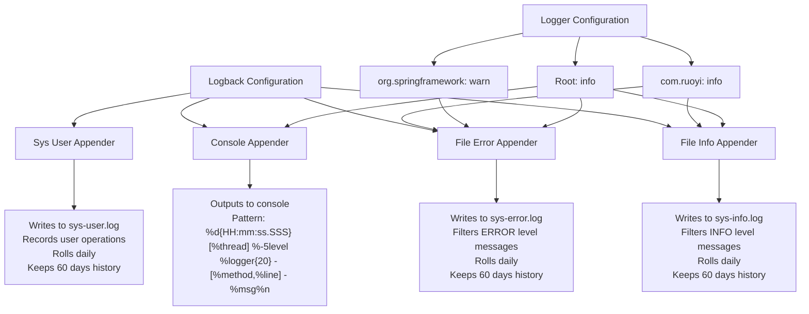

# Troubleshooting

<cite>
**Referenced Files in This Document**   
- [BaseException.java](file://src/main/java/com/ruoyi/common/exception/base/BaseException.java)
- [ServiceException.java](file://src/main/java/com/ruoyi/common/exception/ServiceException.java)
- [UserException.java](file://src/main/java/com/ruoyi/common/exception/user/UserException.java)
- [CaptchaException.java](file://src/main/java/com/ruoyi/common/exception/user/CaptchaException.java)
- [UserPasswordNotMatchException.java](file://src/main/java/com/ruoyi/common/exception/user/UserPasswordNotMatchException.java)
- [FileException.java](file://src/main/java/com/ruoyi/common/exception/file/FileException.java)
- [GlobalExceptionHandler.java](file://src/main/java/com/ruoyi/framework/web/exception/GlobalExceptionHandler.java)
- [application.yml](file://src/main/resources/application.yml)
- [logback.xml](file://src/main/resources/logback.xml)
- [SecurityConfig.java](file://src/main/java/com/ruoyi/framework/config/SecurityConfig.java)
- [DruidConfig.java](file://src/main/java/com/ruoyi/framework/config/DruidConfig.java)
- [RedisConfig.java](file://src/main/java/com/ruoyi/framework/config/RedisConfig.java)
- [ExceptionUtil.java](file://src/main/java/com/ruoyi/common/utils/ExceptionUtil.java)
- [HttpStatus.java](file://src/main/java/com/ruoyi/common/constant/HttpStatus.java)
</cite>

## Table of Contents
1. [Common Installation and Configuration Issues](#common-installation-and-configuration-issues)
2. [Authentication and Authorization Problems](#authentication-and-authorization-problems)
3. [Database Connection Troubleshooting](#database-connection-troubleshooting)
4. [Code Generation Errors](#code-generation-errors)
5. [Exception Hierarchy and Error Codes](#exception-hierarchy-and-error-codes)
6. [Performance Tuning Recommendations](#performance-tuning-recommendations)
7. [Security Best Practices and Vulnerabilities](#security-best-practices-and-vulnerabilities)
8. [Logging Configuration and Debugging](#logging-configuration-and-debugging)
9. [Systematic Problem Diagnosis Approach](#systematic-problem-diagnosis-approach)

## Common Installation and Configuration Issues

Common installation issues in RuoYi-Vue typically stem from incorrect environment setup, missing dependencies, or misconfigured application properties. The most frequent problems include incorrect file path configurations, Redis connection failures, and port conflicts. The `application.yml` file contains critical configuration parameters that must be properly set for the application to function correctly. Issues with file upload paths, Redis connectivity, and server port settings are among the most common configuration problems encountered during installation.

**Section sources**
- [application.yml](file://src/main/resources/application.yml)
- [DruidConfig.java](file://src/main/java/com/ruoyi/framework/config/DruidConfig.java)
- [RedisConfig.java](file://src/main/java/com/ruoyi/framework/config/RedisConfig.java)

## Authentication and Authorization Problems

Authentication issues in RuoYi-Vue commonly involve login failures, token expiration, and captcha validation errors. The system implements JWT-based authentication with Redis storage for session management. Common problems include incorrect username/password combinations, expired or invalid captcha codes, and account lockouts due to excessive failed login attempts. The security configuration in `SecurityConfig.java` defines the authentication flow and access control rules that govern user authentication and authorization processes.

**Diagram sources**
- [SecurityConfig.java](file://src/main/java/com/ruoyi/framework/config/SecurityConfig.java)
- [JwtAuthenticationTokenFilter.java](file://src/main/java/com/ruoyi/framework/security/filter/JwtAuthenticationTokenFilter.java)
- [RedisCache.java](file://src/main/java/com/ruoyi/framework/redis/RedisCache.java)

**Section sources**
- [SecurityConfig.java](file://src/main/java/com/ruoyi/framework/config/SecurityConfig.java)
- [user.password.maxRetryCount](file://src/main/resources/application.yml#L44)
- [token.expireTime](file://src/main/resources/application.yml#L98)

## Database Connection Troubleshooting

Database connection issues in RuoYi-Vue typically involve configuration errors in the Druid connection pool or incorrect database credentials. The application supports master-slave database configurations through the `DynamicDataSource` mechanism. Common problems include incorrect database URLs, invalid credentials, network connectivity issues, and connection pool exhaustion. The Druid monitoring interface (accessible via `/druid`) provides valuable insights into database connection status and performance metrics.

**Diagram sources**
- [DruidConfig.java](file://src/main/java/com/ruoyi/framework/config/DruidConfig.java)
- [DynamicDataSource.java](file://src/main/java/com/ruoyi/framework/datasource/DynamicDataSource.java)
- [DataSourceType.java](file://src/main/java/com/ruoyi/framework/aspectj/lang/enums/DataSourceType.java)

**Section sources**
- [DruidConfig.java](file://src/main/java/com/ruoyi/framework/config/DruidConfig.java)
- [application.yml](file://src/main/resources/application.yml)
- [DynamicDataSource.java](file://src/main/java/com/ruoyi/framework/datasource/DynamicDataSource.java)

## Code Generation Errors

Code generation issues in RuoYi-Vue typically relate to misconfigured generation parameters or template problems. The code generation module uses Apache Velocity templates stored in the `vm` directory to generate controllers, services, mappers, and frontend code. Common problems include incorrect package names, table prefix configuration issues, and file generation path problems. The `GenConfig.java` and associated configuration in `application.yml` control the code generation behavior.

**Section sources**
- [GenController.java](file://src/main/java/com/ruoyi/project/tool/gen/controller/GenController.java)
- [GenUtils.java](file://src/main/java/com/ruoyi/project/tool/gen/util/GenUtils.java)
- [application.yml](file://src/main/resources/application.yml#L139-L149)

## Exception Hierarchy and Error Codes

RuoYi-Vue implements a comprehensive exception handling system with a well-defined hierarchy starting from the `BaseException` class. The system categorizes exceptions by module and provides meaningful error codes and messages. The `GlobalExceptionHandler` class centrally handles all exceptions and returns appropriate HTTP responses. Understanding the exception hierarchy is crucial for diagnosing and resolving issues.

**Diagram sources**
- [BaseException.java](file://src/main/java/com/ruoyi/common/exception/base/BaseException.java)
- [ServiceException.java](file://src/main/java/com/ruoyi/common/exception/ServiceException.java)
- [UserException.java](file://src/main/java/com/ruoyi/common/exception/user/UserException.java)
- [CaptchaException.java](file://src/main/java/com/ruoyi/common/exception/user/CaptchaException.java)
- [UserPasswordNotMatchException.java](file://src/main/java/com/ruoyi/common/exception/user/UserPasswordNotMatchException.java)
- [FileException.java](file://src/main/java/com/ruoyi/common/exception/file/FileException.java)
- [GlobalException.java](file://src/main/java/com/ruoyi/common/exception/GlobalException.java)

The HTTP status codes used in RuoYi-Vue are defined in the `HttpStatus` class, which maps standard HTTP status codes to application-specific constants. These include SUCCESS (200), UNAUTHORIZED (401), FORBIDDEN (403), NOT_FOUND (404), and ERROR (500). The `GlobalExceptionHandler` translates application exceptions into appropriate HTTP responses using these status codes.

**Section sources**
- [BaseException.java](file://src/main/java/com/ruoyi/common/exception/base/BaseException.java)
- [GlobalExceptionHandler.java](file://src/main/java/com/ruoyi/framework/web/exception/GlobalExceptionHandler.java)
- [HttpStatus.java](file://src/main/java/com/ruoyi/common/constant/HttpStatus.java)

## Performance Tuning Recommendations

Performance issues in RuoYi-Vue commonly involve slow database queries, memory leaks, and inefficient caching strategies. Key performance tuning recommendations include optimizing database queries, configuring appropriate connection pool settings, and implementing effective caching strategies. The application uses Redis for caching frequently accessed data, and proper Redis configuration is essential for optimal performance.

For slow queries, enable SQL logging by setting `logging.level.com.ruoyi=debug` in `application.yml` and analyze the generated SQL statements. Consider adding appropriate database indexes on frequently queried columns. For memory issues, monitor the application using the built-in server monitoring tools available in the `/monitor/server` endpoint.

**Diagram sources**
- [application.yml](file://src/main/resources/application.yml)
- [DruidConfig.java](file://src/main/java/com/ruoyi/framework/config/DruidConfig.java)
- [RedisConfig.java](file://src/main/java/com/ruoyi/framework/config/RedisConfig.java)
- [ServerController.java](file://src/main/java/com/ruoyi/project/monitor/controller/ServerController.java)

**Section sources**
- [application.yml](file://src/main/resources/application.yml)
- [DruidConfig.java](file://src/main/java/com/ruoyi/framework/config/DruidConfig.java)
- [RedisConfig.java](file://src/main/java/com/ruoyi/framework/config/RedisConfig.java)

## Security Best Practices and Vulnerabilities

RuoYi-Vue incorporates several security features to protect against common web vulnerabilities. The system implements XSS filtering, CSRF protection (disabled in favor of token-based authentication), and rate limiting to prevent brute force attacks. Security vulnerabilities typically arise from misconfiguration or failure to follow security best practices.

Key security configurations include XSS filtering (enabled by default), Redis password protection, and secure token generation. The application uses BCrypt for password hashing and JWT for stateless authentication. Ensure that the token secret in `application.yml` is changed from the default value in production environments.

**Section sources**
- [SecurityConfig.java](file://src/main/java/com/ruoyi/framework/config/SecurityConfig.java)
- [XssFilter.java](file://src/main/java/com/ruoyi/common/filter/XssFilter.java)
- [application.yml](file://src/main/resources/application.yml#L96)

## Logging Configuration and Debugging

RuoYi-Vue uses Logback for logging with a comprehensive configuration that separates logs by type and severity. The `logback.xml` configuration file defines multiple appenders for different log types, including system info, system error, and user operation logs. Logs are stored in the path specified by the `log.path` property and rotated daily.

The logging configuration includes separate log files for different purposes:
- `sys-info.log`: System information and operational logs
- `sys-error.log`: Error and exception logs
- `sys-user.log`: User operation logs

Enable debug logging for specific packages by modifying the `logging.level` settings in `application.yml`. For troubleshooting database issues, set `logging.level.com.ruoyi=debug` to see SQL statements. For security-related issues, increase the logging level for security packages.

**Diagram sources**
- [logback.xml](file://src/main/resources/logback.xml)
- [application.yml](file://src/main/resources/application.yml#L35-L39)

**Section sources**
- [logback.xml](file://src/main/resources/logback.xml)
- [application.yml](file://src/main/resources/application.yml)

## Systematic Problem Diagnosis Approach

When diagnosing issues in RuoYi-Vue, follow a systematic approach that begins with checking the logs and progresses through configuration validation, exception analysis, and component testing. Start by examining the log files in the configured log path, paying particular attention to error and exception messages.

Use the following diagnostic flow:
1. Check the log files for error messages and stack traces
2. Verify configuration settings in `application.yml`
3. Examine the specific exception type and error code
4. Trace the request flow through the relevant controllers and services
5. Validate database connectivity and query performance
6. Test Redis connectivity and cache operations
7. Reproduce the issue in a development environment

The `ExceptionUtil` class provides utility methods for extracting detailed exception information, which can be invaluable for debugging complex issues. Use the built-in monitoring tools to gather system information and identify potential bottlenecks.

**Section sources**
- [ExceptionUtil.java](file://src/main/java/com/ruoyi/common/utils/ExceptionUtil.java)
- [logback.xml](file://src/main/resources/logback.xml)
- [application.yml](file://src/main/resources/application.yml)
- [GlobalExceptionHandler.java](file://src/main/java/com/ruoyi/framework/web/exception/GlobalExceptionHandler.java)